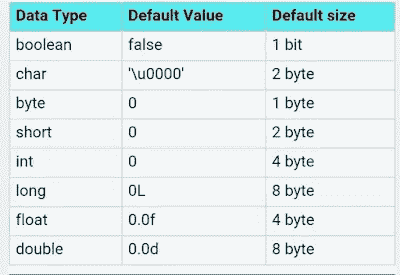

# 如何用 Java 写一个类似 C 的 sizeof()函数？[已解决]

> 原文：<https://levelup.gitconnected.com/how-to-write-a-c-like-sizeof-function-in-java-9352e646d112>

## 一个易于在 Java 中实现的 sizeOf()函数，可以获得不同数据类型的大小。

[](https://javarevisited.blogspot.com/2011/06/top-programming-interview-questions.html)

照片由[卢卡·布拉沃](https://unsplash.com/@lucabravo?utm_source=medium&utm_medium=referral)在 [Unsplash](https://unsplash.com?utm_source=medium&utm_medium=referral) 拍摄

如果你刚开始学习 Java，并且来自 C 背景，那么你可能已经注意到了 [Java](https://medium.com/javarevisited/10-best-places-to-learn-java-online-for-free-ce5e713ab5b2) 和 [C 编程语言](https://medium.com/javarevisited/10-best-c-programming-courses-for-beginners-2c2c1f6bcb12)之间的区别，比如 [String 是 Java](http://javarevisited.blogspot.sg/2013/07/java-string-tutorial-and-examples-beginners-programming.html#axzz4upeaPBNd) 中的一个对象，而不是一个`NULL`终止的字符数组。

同样，Java 中也没有`sizeof()`运算符。所有的原始值都有一个预定义的大小，比如 int 是 4 字节，char 是 2 字节，short 是 2 字节，long 和 float 是 8 字节，等等。

但是，如果您缺少操作符，那么为什么不让我们将它作为一个编码任务呢？如果你没问题，那么你的下一个任务就是*用 Java* 写一个方法，它可以像 C 语言中的`sizeOf()`操作符/函数一样工作，并返回每个数字基本类型的字节大小，即除了布尔之外的所有基本类型。

你们中的许多人会想，为什么我们不包括[布尔](https://www.java67.com/2018/03/java-convert-string-to-boolean.html)不就是需要一位来表示真假值吗？嗯，我在这个练习中没有包括 Boolean，因为 Boolean 的大小在 Java 规范中没有严格定义，并且在不同的 JVM 之间有所不同

另外，就你所知，Java 中原语的*大小是固定的。它不依赖于平台。因此，在 32 位和 64 位机器上，一个 int 原语变量在 Windows 和 Linux 中都需要 4 个字节。*

反正下面是 Java 中不同[原语类型的大小和默认值，供大家参考:](https://click.linksynergy.com/fs-bin/click?id=JVFxdTr9V80&subid=0&offerid=323058.1&type=10&tmpid=14538&RD_PARM1=https%3A%2F%2Fwww.udemy.com%2Fjava-the-complete-java-developer-course%2F)

[](https://click.linksynergy.com/deeplink?id=JVFxdTr9V80&mid=39197&murl=https%3A%2F%2Fwww.udemy.com%2Fcourse%2Fjava-the-complete-java-developer-course%2F)

现在，由你的创造力给出多个答案，但我们至少需要一个答案来解决这个编码问题。如果你们喜欢这个问题，那么我可能会把它列入我的 [75 个破解任何编程工作面试的编码问题列表](http://www.java67.com/2018/05/top-75-programming-interview-questions-answers.html)，如果这个问题有趣且具有挑战性，请留言。

[](https://www.java67.com/2018/06/data-structure-and-algorithm-interview-questions-programmers.html) [## Java 程序员 100 大数据结构和算法面试问题

### 数据结构和算法是任何编程工作面试的核心部分。不管你是不是 C++…

www.java67.com](https://www.java67.com/2018/06/data-structure-and-algorithm-interview-questions-programmers.html) 

# Java sizeof()函数示例

这是我们实现`sizeof`操作符的完整 Java 程序。虽然大小不一样，但用途是一样的。`sizeof`返回一个特定的数据类型占用多少内存，这个方法就是这么做的。

```
/**
 * Java Program to print size of primitive data types e.g. byte, int, short, 
 * double, float
 * char, short etc, in a method like C programming language's sizeof
 *
 * @author Javin Paul
 */
public class SizeOf {
    public static void main(String args[]) {
        System.out.println(" size of byte in Java is (in bytes) :  " +
            sizeof(byte.class));
        System.out.println(" size of short in Java is (in bytes) :" +
            sizeof(short.class));
        System.out.println(" size of char in Java is (in bytes) :" +
            sizeof(char.class));
        System.out.println(" size of int in Java is (in bytes) :" +
            sizeof(int.class));
        System.out.println(" size of long in Java is (in bytes) :" +
            sizeof(long.class));
        System.out.println(" size of float in Java is (in bytes) :" +
            sizeof(float.class));
        System.out.println(" size of double in Java is (in bytes) :" +
            sizeof(double.class));
    }
    /*
     * Java method to return size of primitive data type based on 
     * hard coded values
     * valid but provided by developer
     */
    public static int sizeof(Class dataType) {
        if (dataType == null) {
            throw new NullPointerException();
        }
        if (dataType == byte.class || dataType == Byte.class) {
            return 1;
        }
        if (dataType == short.class || dataType == Short.class) {
            return 2;
        }
        if (dataType == char.class || dataType == Character.class) {
            return 2;
        }
        if (dataType == int.class || dataType == Integer.class) {
            return 4;
        }
        if (dataType == long.class || dataType == Long.class) {
            return 8;
        }
        if (dataType == float.class || dataType == Float.class) {
            return 4;
        }
        if (dataType == double.class || dataType == Double.class) {
            return 8;
        }
        return 4; // default for 32-bit memory pointer
    }

    /*
     * A perfect way of creating confusing method name, sizeof and sizeOf
     * this method take advantage of SIZE constant from wrapper class
     */
    public static int sizeOf(Class dataType) {
        if (dataType == null) {
            throw new NullPointerException();
        }
        if (dataType == byte.class || dataType == Byte.class) {
            return Byte.SIZE;
        }
        if (dataType == short.class || dataType == Short.class) {
            return Short.SIZE;
        }
        if (dataType == char.class || dataType == Character.class) {
            return Character.SIZE;
        }
        if (dataType == int.class || dataType == Integer.class) {
            return Integer.SIZE;
        }
        if (dataType == long.class || dataType == Long.class) {
            return Long.SIZE;
        }
        if (dataType == float.class || dataType == Float.class) {
            return Float.SIZE;
        }
        if (dataType == double.class || dataType == Double.class) {
            return Double.SIZE;
        }
        return 4; // default for 32-bit memory pointer
    }
}
```

```
Output:size of byte in Java is (in bytes) :  1size of short in Java is (in bytes) :2size of char in Java is (in bytes) :2size of int in Java is (in bytes) :4size of long in Java is (in bytes) :8size of float in Java is (in bytes) :4size of double in Java is (in bytes) :8
```

这就是**编写一个** `**sizeof**` **像 Java** 中的一个方法的全部编程练习。这实际上很棘手，因为您没有考虑利用 Java 数据类型的预定义大小，也没有考虑利用包装类中定义的大小常量，如 Integer 或 Double。如果您能找到任何其他方法来找到原始数据类型的大小，请告诉我们。

Java 开发人员的其他**编码面试问题**

*   如何在数组中实现二分搜索法？([解决方案](http://www.java67.com/2016/05/java-program-to-perform-binary-search-without-recursion.html))
*   学习数据结构和算法的前 5 门课程([课程](https://javarevisited.blogspot.com/2018/11/top-5-data-structures-and-algorithm-online-courses.html)
*   如何在 Java 中原地反转数组？([解决方案](http://www.java67.com/2016/01/java-program-to-reverse-array-in-place.html))
*   如何检查数组是否包含特定值？([解](http://java67.com/2014/11/how-to-test-if-array-contains-certain-value-in-java.html))
*   如何找到一个数组中所有和等于 k 的对([解](http://javarevisited.blogspot.com/2014/08/how-to-find-all-pairs-in-array-of-integers-whose-sum-equal-given-number-java.html))
*   如何在不排序的情况下求一个数组中的最大最小数？([解](http://java67.com/2014/02/how-to-find-largest-and-smallest-number-array-in-java.html))
*   如何在排序后的数组中找到一个缺失的数字？([解](http://java67.com/2014/12/how-to-find-missing-number-in-sorted.html)
*   如何在 Java 中从数组中移除一个元素？([解](http://java67.com/2012/12/how-to-remove-element-from-array-in-java-example.html)
*   如何从给定的数组中找到前 2 个数字？([解](http://www.java67.com/2014/03/how-to-find-top-two-maximum-number-from-integer-array-java.html))
*   前 30 个链表编码面试问题([看这里](http://javarevisited.blogspot.sg/2017/07/top-10-linked-list-coding-questions-and.html))
*   来自编码访谈的前 50 个 Java 程序([参见此处](http://javarevisited.blogspot.sg/2017/07/top-50-java-programs-from-coding-Interviews.html))
*   面向程序员的 5 门免费数据结构和算法课程([课程](https://javarevisited.blogspot.com/2018/01/top-5-free-data-structure-and-algorithm-courses-java--c-programmers.html))
*   每个程序员都应该阅读的 10 本算法书([书](http://www.java67.com/2015/09/top-10-algorithm-books-every-programmer-read-learn.html))
*   10 门面向程序员的免费数据结构和算法课程([课程](http://www.java67.com/2019/02/top-10-free-algorithms-and-data.html))
*   来自访谈的 100+数据结构编码问题([问题](http://www.java67.com/2018/06/data-structure-and-algorithm-interview-questions-programmers.html))
*   如何在 Java 中使用冒泡排序对数组进行排序？([解](http://www.java67.com/2012/12/bubble-sort-in-java-program-to-sort-integer-array-example.html))
*   如何在 Java 中从一个未排序的数组中找到重复项？([解](http://java67.com/2015/10/2-ways-to-find-duplicate-elements-in-java-array.html))
*   如何在 Java 中删除数组中的重复项？([解](http://javarevisited.blogspot.com/2014/01/how-to-remove-duplicates-from-array-java-without-collection-API.html))

感谢您阅读本文。如果你喜欢这篇文章，请与你的朋友和同事分享。如果您有任何问题或疑问，请告诉我们，我会尽力为您找到答案。一如既往的建议，评论，创新和更好的答案是最受欢迎的。

**P. S.** —如果你正在寻找一些免费的算法课程来提高你对数据结构和算法的理解，那么你也应该在 Udemy 上查看 Java 免费课程 中的 [**数据结构。这是完全免费的，你需要做的就是创建一个免费的 Udemy 帐户来注册这门课程。

**【p . p . s .】**—如果你想从技术面试中获得更多这样的问题，请参见**](https://www.java67.com/2019/02/top-10-free-algorithms-and-data.html) **[**《破解编码面试》第六版**](https://javarevisited.blogspot.com/2016/06/top-5-books-for-programming-coding-interviews-best.html) ，其中包含来自不同软件公司、创业公司、投资银行和服务型公司的 190 多个编码问题。**

[](https://javarevisited.blogspot.com/2016/06/top-5-books-for-programming-coding-interviews-best.html#axzz5YWji1wWP) [## 编程/编码面试的前 5 本书——最好的

### 如果你正在准备编程工作面试，并寻找一些最好的编程问题的书籍…

javarevisited.blogspot.com](https://javarevisited.blogspot.com/2016/06/top-5-books-for-programming-coding-interviews-best.html#axzz5YWji1wWP)