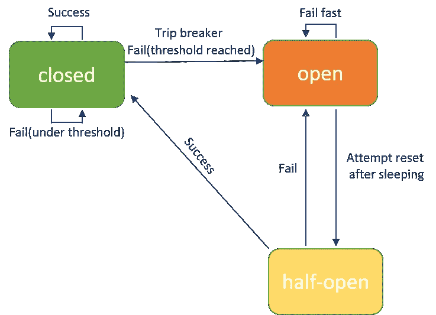

# 如何用 Golang 写一个断路器

> 原文：<https://levelup.gitconnected.com/how-to-write-a-circuit-breaker-in-golang-9ebd5644738c>

在这篇文章中，我想谈谈基于一个流行的开源项目`hystrix`的`circuit breaker`模式(实际上，我会看一下 golang 版本 [hystrix-go](https://github.com/afex/hystrix-go) ，而不是用 Java 编写的[原始版本](https://github.com/Netflix/Hystrix))。

在本文的第一部分，我将对`circuit breaker`做一个大概的介绍，让你知道它是什么，为什么它很重要。此外，让我们回顾一下关于项目`hystrix-go`和`hystrix`的背景，并通过一个小演示示例了解基本用法。

# 断路器

分布式体系结构中的软件通常有许多依赖关系，每个依赖关系(即使是最可靠的服务)在某个点上的失败是不可避免的。

如果我们失败的服务变得没有响应，会发生什么？所有依赖它的服务也有变得无响应的风险。这叫做`catastrophic cascading failure.`

断路器背后的基本思想非常简单。断路器的工作原理是将调用包装到目标服务，并持续监控故障率。一旦故障达到某个阈值，断路器就会跳闸，所有对电路的进一步调用都会返回故障或错误。

断路器模式背后的设计理念是`fail fast`:当一个服务变得无响应时，依赖它的其他服务应该停止等待，并开始处理失败的服务可能不可用的事实。通过防止单个服务的故障通过整个系统级联，断路器模式有助于整个系统的`stability`和`resilience`。

断路器模式可以实现为如下所示的有限状态机:

断路器

有三种状态:`open`、`closed`和`half-open`

*   **关闭**:请求被传递给目标服务。持续监控错误率、请求数量和超时等指标。当这些指标超过特定阈值(由开发人员设定)时，断路器跳闸并转换到`open`状态。
*   **open** :请求不会传递给目标服务，而是会调用`fallback`逻辑(也是由开发人员定义的)来处理失败。断路器将保持`open`状态一段时间，称为`sleeping window`，之后断路器可以从`open`转换到`half-open`。
*   **半开**:在这种状态下，有限数量的请求被传递给目标服务，目的是重置状态。如果目标服务能够成功响应，则中断`reset`回到`closed`状态。否则断路器转换回`open`状态。

这是关于断路器的基本背景，你可以在网上找到更多关于它的信息。

接下来，我们来调查项目`hystrix`。

# 高起鳞癣

`hystrix`是一个非常流行的开源项目。你可以在这个[链接](https://github.com/Netflix/Hystrix/wiki)中找到关于它的一切。

我想引用上面链接的几个要点。Hystrix 设计用于实现以下功能:

*   针对通过第三方客户端库访问(通常通过网络)的依赖性，提供保护并控制延迟和故障。
*   停止复杂分布式系统中的级联故障。
*   快速失败并迅速恢复。
*   尽可能后退并适度降级。
*   实现近乎实时的监控、警报和运营控制。

你可以看到`hystrix`完美地实现了我们在上一节谈到的断路器模式的想法，对吗？

`hystrix`项目是用`Java`开发的。在本文中，我更喜欢使用 golang 版本`hystrix-go`，这是一个简化的版本，但实现了所有关于断路器的主要设计和想法。

对于`hystrix-go`的用法，可以在这个[链接](https://github.com/afex/hystrix-go)中找到，非常直观易懂。你可以很容易地在网上找到许多其他的文章和演示例子来展示更多的使用水平的东西。请去头部阅读。

在我的文章中，我想深入到`hystrix-go`的源代码中，深入研究一下`circuit breaker`是如何实现的。请跟进阅读以下部分。

# 三种服务降级策略

`Hystrix`提供了三种不同的服务降级策略来避免`cascading failure`在整个系统中发生:`timeout`、`maximum concurrent request numbers`和`request error rate`。

*   **超时**:如果服务调用在预定义的时间内没有成功返回响应，那么回退逻辑将运行。这个策略是最简单的。
*   **最大并发请求数**:当并发请求数超过阈值时，回退逻辑将处理下一个请求。
*   **请求错误率** : `hystrix`将记录每个服务呼叫的响应状态，在错误率达到阈值后，断路器将打开，在断路器状态变回闭合之前，回退逻辑将执行。`error rate`策略是最复杂的一种。

这可以从`hystrix`的基本用法看出，如下:

在上面的使用案例中，可以看到`timeout`设置为 10 秒，最大请求数为 100，错误率阈值为 25 个百分比。

在消费者应用程序级别，这几乎是您需要设置的所有配置。`hystrix`会使魔音内部发生。

在本文中，我计划通过查看源代码向您展示`hystrix`的内部。

先说容易的:`max concurrent requests`和`timeout`。然后继续探索复杂的策略`request error rate`。

# 总指挥官

基于上面的例子，你可以看到`Go`函数是通向`hystrix`源代码的大门，所以让我们从它开始如下:

`Go`函数接受三个参数:

*   **名称**:命令名，绑定到 hystrix 内部创建的`circuit`。
*   **运行**:一个函数，包含向依赖服务发送请求的正常逻辑。
*   **回退**:包含回退逻辑的函数。

`Go`函数只是将`run`和`fallback`用`Context`包裹起来，用于控制和取消 goroutine，如果不熟悉可以参考之前的[文章](https://baoqger.github.io/2021/04/26/golang-context-source-code/)。最后它会调用`GoC`函数。

`GoC`功能如下:

我承认这很复杂，但也是整个`hystrix`项目的核心。耐心点，我们一点一点仔细复习。

首先，`GoC`函数的代码结构如下:

总指挥官

1.  构造一个新的`Command`对象，它包含每次调用`GoC`函数的所有信息。
2.  通过调用`GetCircuit(name)`函数按名称获取`circuit breaker`(如果不存在就创建它)。
3.  声明条件变量 **ticketCond** 和 **ticketChecked** with `sync.Cond`，用于 goroutines 之间的通信。
4.  声明函数**返回票**。什么是**票**？ **returnTicket** 是什么意思？以后再详细讨论吧。
5.  声明另一个函数 **reportAllEvent** 。该功能对`error rate`策略至关重要。
6.  声明一个`sync.Once`的实例，这是 golang 提供的另一个有趣的`synchronization primitives`。
7.  启动两个 goroutines，每个 goroutines 也包含许多逻辑。简单来说，第一个包含向目标服务发送请求的逻辑和`max concurrent request number`的策略，第二个包含`timeout`的策略。
8.  返回一个`channel`类型值

让我们逐一回顾一下。

# 命令

`command`结构如下，嵌入**同步。互斥**定义了几个字段:

注意，`command`对象 iteself 不包含命令名信息，它的生命周期就在一个`GoC`调用的范围内。这意味着关于服务请求的统计指标，如`error rate`和`concurrent request number`没有存储在命令对象中。相反，这些度量存储在**电路**字段中，该字段是`CircuitBreaker`类型。

# 断路器

正如我们在`GoC`函数的工作流程中提到的，调用`GetCircuit(name)`来获取或创建`circuit breaker`。它在`circuit.go`文件中实现如下:

逻辑非常简单。所有断路器都存储在一个地图对象**断路器**中，关键字为**命令名**。

`newCircuitBreaker`构造函数和`CircuitBreaker`结构如下:

`CircuitBreaker`的所有字段对于理解断路器如何工作都很重要。

有两个不是简单类型的字段需要更多的分析，包括`executorPool`和`metrics`。

*   **执行池**:用于`max concurrent request number`策略。
*   **指标**:用于`request error rate`策略，好吗？

# 遗嘱执行人

我们可以在`pool.go`文件中找到`executorPool`逻辑:

它利用 golang `channel`来实现`max concurrent request number`策略。请注意，创建了`Tickets`字段，这是一个容量为 **MaxConcurrentRequests** 的缓冲通道。并且在随后的 **for** 循环中，通过向通道发送值直到达到容量，使缓冲通道充满。

如上所示，在`GoC`功能的第一个 goroutine 中，`Tickets`通道的用法如下:

每次调用`GoC`函数都会从**circuit . executor pool . tickets**通道获得一张**票**，直到没有**票**剩余，这意味着并发请求的数量达到了阈值。在这种情况下，将执行`default`案例，并且服务将通过回退逻辑优雅地降级。

另一方面，每次对`GoC`的调用完成后，需要将**票**送回**circuit . executor pool . tickets**，对吗？你还记得上一节提到的`returnTicket`功能吗？是的，它只是用于这个目的。`GoC`功能中定义的`returnTicket`功能如下:

它调用`executorPool.Return`函数:

**票**的设计和实现是`golang channel`在现实应用中的一个很好的例子。

总之，`max concurrent request number`战略可以说明如下:

上节认真复习了`hystrix`中的`max concurrent requests`策略，希望你能从中学习到一些有趣的东西。

现在让我们在下一节一起研究`timeout`策略。

# 超时

与`max concurrent request number`策略相比，`timeout`非常直白易懂。

正如我们在上一节提到的，`hystrix`的核心逻辑在`GoC`函数内部。`GoC`函数内部运行两个 goroutines。您已经看到第一个 goroutine 包含向目标服务发送请求的逻辑和`max concurrent request number`的策略。第二个 goroutine 怎么样？下面我们来回顾一下:

请注意，定时器**是用设置中的超时持续时间值创建的。并且一个`select`语句让这个 goroutine 等待，直到一个`case`条件从通道接收值。**超时**情况只是第三种情况(前两种情况未触发时)，它将运行回退逻辑，并显示 **ErrTimeout** 错误消息。**

到目前为止，您应该清楚这两个 goroutines 的主要结构和功能。但在细节上，有两个 Golang 技巧需要你注意:`sync.Once`和`sync.Cond`。

# 同步。一次

您可能已经注意到下面的代码块，它在`GoC`函数中重复了几次:

**returnOnce** 是`sync.Once`的类型，保证`Do`方法的回调函数在不同的 goroutines 之间只运行一次。

在这种特定情况下，可以保证 **returnTicket()** 和 **reportAllEvent()** 都只执行一次。这确实很有意义，因为如果 **returnTicket()** 为一个`GoC`调用运行多次，那么当前的并发请求数就不会正确，对吗？

我另外写了一篇关于`sync.Once`的详细文章，你可以参考[那篇文章](https://baoqger.github.io/2021/05/11/golang-sync-once/)进行更深入的解释。

# 同步。Cond

**returnTicket** 函数的实现如下:

**ticketCond** 是条件变量，在 Golang 中是`sync.Cond`的类型。

条件变量在不同例程之间的通信中很有用。具体来说，`sync.Cond`的`Wait`方法会挂起当前的 goroutine，`Signal`方法会唤醒阻塞的 goroutine 继续执行。

在`hystrix`情况下，当 **ticketChecked** 为 **false** 时，意味着当前的`GoC`调用还没有结束，并且 **ticket** 应该还没有返回。所以 **ticketCond。Wait()** 被调用来阻塞这个 goroutine，并等待直到`Signal`方法通知的`GoC`调用完成。

注意，上面两行代码总是被一起调用。 **ticketChecked** 设置为 **true** 表示当前`GoC`调用结束，**票**准备返回。此外，悬挂 goroutine 的`Wait`方法放在循环的**内，这也是一种最佳实践技术。**

关于`sync.Cond`的更多解释，我将在以后写另一篇文章来解释，请稍等。

# 撤退

最后，让我们看看当目标服务没有响应时，如何调用 **fallback** 函数。

让我们回忆一下，每个`GoC`调用都会创建一个新的**命令**实例。并且 **fallback** 函数将被分配给同名的字段，以后会用到。

正如我们在上面章节中看到的，当达到`timeout`或`max concurrent request number`阈值时，触发 **errorWithFallback** 方法。

**errorWithFallback** 方法将通过调用 **tryFallback** 运行回退，并报告度量事件，如**回退失败**和**回退成功**。

上面我们谈到了`hystrix`提供的所有策略中最简单的一个`timeout`策略。为了更好地理解复杂的代码逻辑，还回顾了一些详细的 Golang 技术。

# 摘要

在本文中，我们讨论了由`hystrix`提供的`max concurrent requests`策略和`timeout`策略的详细实现。为了更好地理解复杂的代码逻辑，还回顾了一些详细的 Golang 技术。

我把`error rate`策略留给你，请深入代码库，探索更多关于断路的知识。玩得开心！