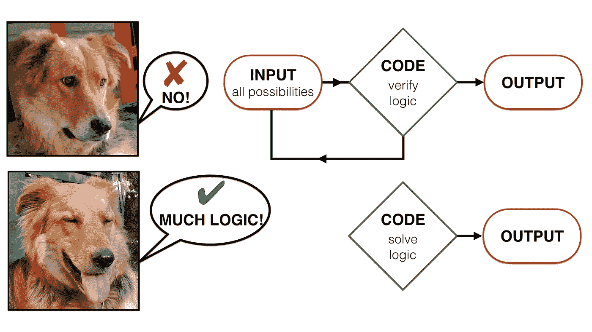

# 如何编写不用循环就能求解逻辑的代码

> 原文：<https://levelup.gitconnected.com/how-to-write-a-code-that-solves-logical-constraints-instead-of-testing-them-57d7575e8070>

## 用整数线性规划求解复杂逻辑



图片作者。

想象一下下面的场景。你有一套逻辑约束。这些约束只能通过输入变量的某种组合来满足。您需要编写返回有效输入的代码，即满足所有逻辑约束的代码。有两种方法可以进行。

## **选项 1:循环测试**

第一个想法是编写代码，根据逻辑测试每个可能的输入组合。从所有可能的输入组合列表开始，将它们传递给包含所有逻辑约束的循环，根据循环中的约束测试每个输入组合，对所有可能的组合重复该过程。最后，返回满足所有约束的组合。我们可以让这样的算法更快、更有效、更干净等等。，但这并没有反驳我们仍然在所有的可能性上运行一个循环来返回正确的输出的事实。

## **选项 2:不测试，不循环**

这里没有任何循环。这意味着代码不需要“测试”任何东西就能得到答案的方法。不是对照逻辑约束逐一检查所有可能性，而是“解决”约束，以得出唯一可能的结果。这篇文章的目的是展示如何编写这样的代码。

## 无测试方法

首先想到的是并行化。人们将并行检查逻辑约束，并得出正确的结果。问题是，即使我们将代码并行化，我们仍然会对照约束检查所有的可能性。这个循环仍然以这样或那样的形式存在。这不符合我们的目的。

如果我们能把逻辑约束写成线性方程会怎么样？这样做会将一堆 if-else 子句简化为一组线性方程。然后剩下的就是解那些线性方程组，找到正确的答案！那么有没有一种方法可以让我们同时解决所有的线性约束*和*从而得到正确的结果呢？是的有。**同时解决一堆约束听起来很像线性规划**(如果所说的约束本质上是线性的)。如果你关注了我的上一篇文章，或者曾经接触过线性编程，你就能猜到它的发展方向。正如我在上一篇文章中提到的

> 线性程序为变量服从许多线性关系的问题找到最优解。

那么，怎样才能写出线性关系形式的逻辑约束，即线性方程呢？答案是通过使用二元变量和一点创造力。让我们考虑 AND 逻辑门的例子。如果两个输入相同，则输出为真。在二进制形式中，我们可以把 0 写成假(或关)，把 1 写成真(或开)。因此，我可以用两个输入 In1 和 In2 来写这个门的等式，其中两个输入都可以是 0 或 1，如下所示

具有两个输入 I1 和 I2 的与门的线性方程。

既然我们已经了解了逻辑门如何转化为线性方程(以二进制变量表示)，我们就准备编写一段代码，实际上可以一次性解决一堆这样的约束条件！

## 挑战

我最近在期刊[La Settimana enigstica](https://www.lasettimanaenigmistica.com/index.html?m=site)上遇到了一个难题，我想通过编写一个代码来解决这个难题，这个代码不会遍历所有的可能性，而是会得出正确的逻辑结果。我把这个问题解释如下。

*一个人去集市上的旋转木马操作员那里。旋转木马操作员告诉他，谁能猜出当他打开所有 5 个开关时会发生什么，谁就可以终身免费乘坐。这 5 个开关执行以下操作:*

*   *开关 1:黄色亮时红色亮*
*   *开关 2:红色和绿色从不一起亮*
*   *开关 3:蓝色和绿色只能一起开和关*
*   *开关 4:蓝色和紫色不能同时关闭*
*   *开关 5:如果紫色亮起，蓝色和黄色必须亮起*

## 方法:整数线性规划

我们将通过编写不真正“测试”任何东西的代码来解决这个问题。它只是求解方程(逻辑约束)并得出答案。

首先，让我们定义彩色灯的变量

*   *Y* :黄色
*   R :红色
*   *G* :绿色
*   *B* :蓝色
*   紫色

这些灯(或变量)中的每一个都可以打开或关闭，我们进一步定义

*   值为 1:开
*   值为 0:关闭

通过应用与与门相同的逻辑，我们将尝试理解每个开关背后的逻辑，并将其写成一个等式。这将要求我们首先写下开关允许(或不允许)什么，以及如何将这些组合表示为每个开关的线性方程。

**开关 1:当** 为黄色时，开关 1 为红色。这允许[Y，R]有以下值:[1，1]，[0，1]，[0，0]。
注意，第一种情况，黄色开，红色开。在第二种和第三种情况下，如果黄色关闭，红色可能会打开或关闭，因为如果黄色关闭，条件不会说明红色的状态。我可以把它写成方程式

**开关 2:红色和绿色从不一起打开** 这允许[R，G]的以下值:[0，0]，[0，1]，[1，0]。
这是因为两者可以一起关闭，但不能一起打开。以方程式的形式

**开关 3:蓝色和绿色只能一起开和关** 可能的[B，G]组合有:[0，0]，[1，1]。作为一个等式

**开关 4:蓝色和紫色不能同时关** 可能的[B，P]组合有:[0，1]，[1，0]，[1，1]。条件并没有说他们在一起，因此最后一个选项。作为一个等式

**开关 5:如果紫色打开，蓝色和黄色必须打开** 该条件最好被视为两个子约束的组合。
如果紫色亮起，蓝色必须亮起，如果紫色亮起，黄色必须亮起。
它看起来很像开关 1，但我们需要应用两次逻辑，即
紫色减去蓝色的最大值为 0，紫色减去黄色的最大值为 0。或者换句话说

一个特别棘手的逻辑约束。

因此，变量的二进制性质允许我们以简单的数学形式重写逻辑约束。我们将上述 4 个不等式(开关 1，2，4，5)和一个等式(开关 3)以矩阵形式用文字表示

问题的矩阵表述。

这现在开始看起来很像一个线性程序，除了所有变量只取 0 或 1 的值(灯可以开也可以关)。所有变量只能取整数值的线性规划(LP)称为整数线性规划或 ILP。我们的是 0–1 ILP 的特例，因为为了模拟布尔逻辑，变量只允许有两个值(注意，ILP 不同于混合整数线性规划或 MILP，因为在 MILP 中，只有一些变量取整数值)。

**成本函数** 到目前为止我还没有涉及到成本函数。在线性程序中，成本函数旨在优化结果，即最小化或最大化我们正在求解的变量的线性组合。在这种特殊情况下，我们试图找到(唯一)可能的答案。那么，有什么需要优化的吗？我会说，在这种情况下，成本函数可能甚至是不必要的，因为**我们只是在检查问题的可行性**(唯一可能的答案)。因此，我将成本函数简单地定义为一个包含五个元素的矩阵，所有元素都等于 0。

成本函数矩阵。

这个问题现在简化为一个熟悉的 LP 结构

当然，第一个条件(最小化成本函数)纯粹是为了完整性而写的。

## 用 Python 编写问题代码

我的 Python 设置如下

*   Python 3.8.2
*   数字版本 1.4.1
*   Cvxopt 1.2.3

我之前的帖子讨论了如何使用 [SciPy](https://docs.scipy.org/doc/scipy/reference/generated/scipy.optimize.linprog.html) 中的优化库和 [CVXOPT](http://cvxopt.org) 中的 [GLPK](https://www.gnu.org/software/glpk/) 解算器在 Python 中实现 LP。我们当前面临的问题是一个 ILP，也就是说，我只允许我的变量使用整数值(0，1 更具体)。Python 中的 SciPy 实现不允许传递这样的约束。然而，这对于其他库来说当然是可能的。

带有 GLPK 求解器的 CVXOPT 库允许您指定哪些变量本质上是二进制的，即假设值为 0 或 1。在我们的例子中，我们所有的 5 个变量本质上都是二进制的，因此二进制指数是 0，1，2，3，4。

```
# define the indices of the variables that are binary in nature
# in our case all 5 variables are binaryBinary_ind = range(5)# …(rest of the code)…# pass these indices to the glpk ilp solver as a set
# of indices under the parameter ‘B’, i.e. binary indicesstatus, solution = glpk.ilp(c, A_ineq, B_ineq, A_eq, B_eq, B=set(Binary_ind))
```

有了我们的矩阵公式和如何告诉求解器哪些变量是二进制的知识，我们现在可以编码这个问题，如下所示。

使用 CVXOPT 和 GLPK 在 Python 中实现 ILP 代码。

这返回

```
solution found 
Yellow is OFF , Red is OFF , Green is ON , Blue is ON , Purple is OFF
```

我们找到了正确的答案！

这篇文章(以及上一篇 LP 文章)的代码存放在我的 [GitHub repo](https://github.com/codiusmaximus/lights) 上。

## 观点

一个简单的逻辑谜题促使人们探索用 Python 来回答它的不同方式。此外，这迫使我提出一个问题‘你能让代码模仿人类的思维过程吗？’。在我看来，在这种情况下，人类的思维过程是我们排除明显不可信的解决方案，并通过剩余的选项进行推理。ILP 方法模拟了这一过程，它限制了解决方案的空间，只浏览了可能性的子集，最终得到了正确的解决方案。这与我们测试所有可能性的 if-else 条件的集合非常不同。因此，通过在这种情况下使用 ILP，可以一次找到一组逻辑约束的似乎合理的结果，而无需实际遍历所有的可能性。