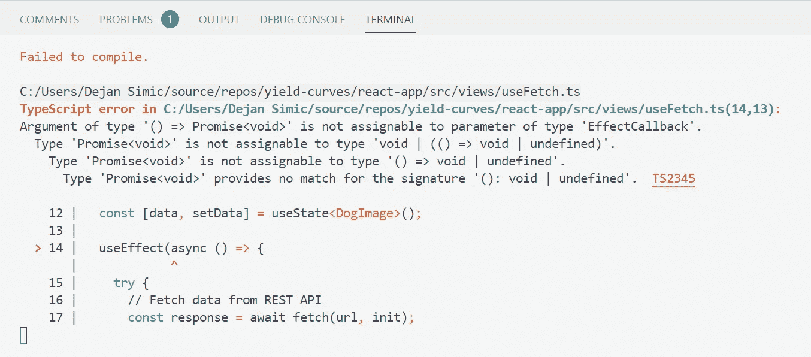
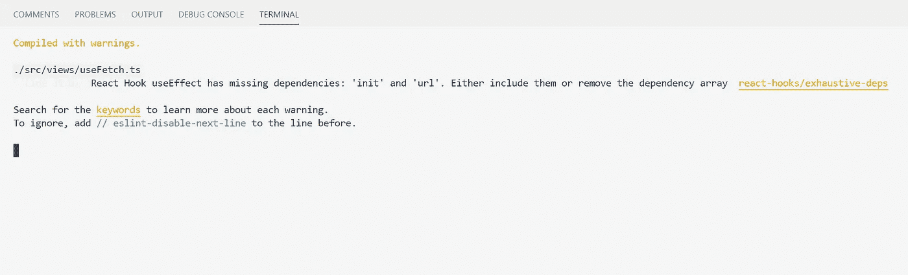
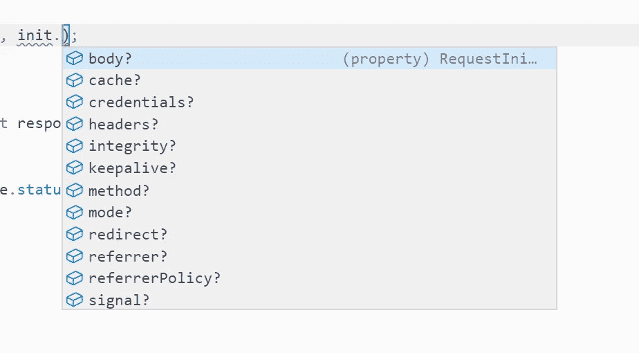
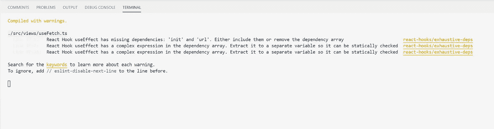

# 如何为 API 调用编写自定义的 useFetch 挂钩

> 原文：<https://levelup.gitconnected.com/how-to-write-a-custom-usefetch-hook-for-api-calls-4f8ea9b5a5e8>

**演示 React 的使用状态、使用效果和使用回调**

在现代 web 应用程序中，经常可以通过 REST APIs 访问数据和功能。听起来很简单，发送请求会很快从一行代码变成几十行代码:

1.  使用 fetch()函数调用 API 端点
2.  检查响应状态代码(例如，200 =成功，404 =未找到，…)
3.  从响应中提取 json 正文
4.  捕捉 try/catch 块中的潜在错误
5.  将所有这些放入一个 useEffect 钩子中(解决 useEffect 只接受同步函数而 fetch 是异步函数的问题……)

正如你可以想象的那样，坚持应用所有这些步骤需要一些努力。有时我会忽略捕捉错误，有时会忘记在提取之前检查响应代码，等等。所以我开始编写一个自定义钩子来执行所有这些步骤。在前进的道路上有几个挑战。寻找解决方案教会了我很多关于钩子的知识。在这篇博文中，我想分享我遇到的问题以及如何解决它们。

照片由 [Jannes Glas](https://unsplash.com/@jannesglas?utm_source=medium&utm_medium=referral) 在 [Unsplash](https://unsplash.com?utm_source=medium&utm_medium=referral) 上拍摄

# 出发点

在我开始将功能提取到钩子之前，类似的代码在几个组件中重复出现:

我将在整篇博文中使用这个例子，并解释各个块的用途(一般来说，应该熟悉状态挂钩、效果挂钩和反应)。由于 API 对任何人开放，您可以跟随并复制每个步骤。该组件将从奇妙的 [Dog API](https://dog.ceo/dog-api/) 返回一个随机图像🐶：

请注意，我使用的是 TypeScript——如果您喜欢 JavaScript，请去掉类型定义(例如，`string`、`interface`块等等)。为了方便起见，最终的钩子存储在 TypeScript 和 JavaScript 中的[。](https://gist.github.com/simicd/02ce79612d0971441b33b7c816930d8e)

# 步骤 1:定义一个自定义挂钩

第一步是创建一个新文件(如`useFetch.ts`)并定义一个接受 URL 和请求参数作为输入的函数。按照惯例，钩子的前缀是*使用:*

这里需要注意一些事情:

*   `RequestProps`界面表示钩子的所有输入。`RequestInfo`和`RequestInit`是由`fetch()`函数定义的类型
*   `DogImageType`是 API 返回的类型(在本例中是一条带有图片 url 和状态消息的消息)
*   自定义挂钩使用状态挂钩—更新状态将重新呈现调用者组件
*   useEffect 挂钩意味着副作用，即与 React 组件之外的功能的交互。例如保存到浏览器本地存储或调用 API。
*   在效果挂钩中，`fetch()`函数提交一个 API 请求。如果成功(状态码 200)，数据被传递给状态设置器；否则，控制台中会显示一个错误。
*   钩子只运行一次，因为第二个参数是一个空数组

如果你运行上面的代码，你会遇到一个错误。useEffect 不接受异步函数！

广为接受的解决方法是:在同步函数中定义异步函数，并立即调用它:

定制钩子现在应该可以工作了&可以在组件中调用了。干净多了！

## 指定依赖关系

第一个问题解决了，但是下一个问题已经在等着我们了。编译器将返回一个警告:`url`和`init`必须被指定为依赖项。

这是为什么呢？效果挂钩中的`fetch()`功能取决于这两个参数。但是，它们不是在钩子的范围内创建的。对于空数组，它将在组件初始化时运行一次，然后不再运行。但是如果`url`或者`init`变了呢？

这可能成为潜在的错误来源。显然，如果这两个参数中的任何一个发生变化，我们都希望钩子能够重新运行。因此，两者都应添加到数组`[url, init]`:

## 作为依赖项的对象

一切都好吗？不完全是…

当我使用下面的例子调用钩子时，钩子被调用了一次，一次，一次…在我注意到之前，我在几分钟内结束了 20，000 次调用。为什么？`url`和`init`都没变？！

经过反复试验，我发现:

*   作为依赖变量的原始类型(字符串、数字、布尔)——没问题
*   依赖数组中的对象—无限循环(即使是空对象`{}`

useEffect 似乎不执行对象的内容检查。相反，它将每个对象视为新的实例，即使它们具有相同的内容。在上例中，是`init: {}`导致了问题。潜在解决方案:

*   明确检查对象的各个键(例如`init.headers`、`init.body`，...).有十几个键，其中一些键本身就是对象。行不通。

*   使用`Object.values(init)`提取一个对象的所有值。这比前一个选项好，因为不需要输入所有的`init`键。但是，并不是所有的`init`值都是原始类型。这仍然会导致无限循环。

解决方法:带有`JSON.stringify(init)`的细长物体。如果对象没有改变，stringify 将产生相同的字符串，并且不会重新运行。

## 没有复杂的评估

下一个问题:linter 抛出一个警告，在依赖列表中不允许复杂的求值。

通过将求值移到 effect hook 之前，并将两个字符串存储为变量，再次弹出一个熟悉的警告:`url`和`init`是依赖项，需要成为依赖数组的一部分。显然棉绒不知道`stringifiedInit`属于`init` …

在这里，我有意识地决定不发出警告，因为我知道有一个适当的依赖检查。为此，在依赖列表上方的行中添加`// eslint-disable-next-line react-hooks/exhaustive-deps`就足以消除警告。

> *❓如果你有解决这个问题的替代方法的建议，我将非常感谢你的投入*

# 步骤 2:处理响应的可选回调函数

通常，API 响应必须经过处理才能显示给用户。因此，我希望有可能传递一个函数(这里称为`processData`)，该函数获取 json 主体并将其重塑为所需的格式。

因为回调函数是可选的，所以它可能是未定义的。在这种情况下，一个简单的 arrow 函数将接受 json 主体并强制转换类型。

`const processJson = processData || ((jsonBody: any) => jsonBody as DogImageType);`

这里是迄今为止的完整代码:

…又是一个无限循环！

原因:现在 arrow 函数的初始化是在每次渲染时创建一个新的实例。useEffect 挂钩认为依赖关系已经改变，应该再次执行。

幸运的是，React 提供了一个很好的方法:使用回调钩子。这个钩子接受一个函数作为输入，并返回相同的函数作为输出。唯一的区别是:返回的函数被缓存。

与效果挂钩类似，回调挂钩有一个依赖数组作为第二个参数。如果提供了一个空数组，那么 React 将只声明该函数一次——这正是我们需要的！

# 步骤 3:泛型类型

最后，钩子没有无限循环，也没有警告！然而，如果钩子应该是广泛适用的，那么返回类型可以是任何形式的数据。现在，钩子将总是返回一个对象`DogImageType`(即带有消息字段和状态字段)。

解决方案:[泛型类型](https://www.typescriptlang.org/docs/handbook/generics.html)。**泛型**是一个存在于许多类型化编程语言中的概念。简而言之，它允许用占位符类型(通常用`T`表示)替换具体类型(例如`DogImageType`)。当函数最终被调用时，占位符被具体类型填充。

如何把挂钩变成通用的？

*   在接口中，在接口名称后追加一个`<T>`→通用接口
*   在函数声明中，在参数括号部分前加上`<T>(...)` →通用函数
*   将函数或界面中的任何`DogImageType`替换为`T`(例如`useState<DogImageType>()` → `useState<T>()`)

*   最后，调用函数时，传递具体类型(如`useFetch<DogImageType>(...)`)。在底层，获取挂钩现在将把`T`替换为`DogImageType`，并将数据返回为`DogImageType`

这样，useFetch 钩子现在也可以接受`fetch(...)`函数会接受的任何参数。它能够通过回调处理数据，最棒的是:调用 API 只需要一行代码！

# 摘要📝

> *📦你可以在这里找到完整的* [*打字码*](https://gist.github.com/simicd/02ce79612d0971441b33b7c816930d8e) *。关于* [*的 JavaScript 版本请参见此处*](https://gist.github.com/simicd/bbf37fe119c7b344634e4d47d2709fea) 的链接

本文中使用的钩子和挑战的总结:

## 重新盖上内置挂钩

*   useState:状态挂钩存储信息，并在调用 setter 函数更新信息时触发重新呈现。
*   useEffect:每当 React 组件与组件之外的功能交互时(所谓的副作用)，都应该使用效果挂钩。示例:调用 API。从磁盘读取文件。
*   useCallback:如果在组件中定义了函数，React 将在每次重新渲染时初始化它们。通常这在性能方面可以忽略不计。如果声明本身代价很高，回调钩子将缓存函数，并在后续的渲染中重用它。

## **问题&解决方案💡**

*   对象作为效果钩子中的依赖参数导致无限循环
    →用`JSON.stringfiy`变成字符串
*   函数在效果挂钩中作为依赖参数导致无限循环
    →使用回调挂钩仅实例化函数一次
*   一般化函数返回类型
    →使用[泛型](https://www.typescriptlang.org/docs/handbook/generics.html)用占位符类型替换具体类型

# 后续步骤🚀

如果 API 请求发生在初始化时，钩子将成功运行。但是，如果您想在按钮点击(或任何其他事件)时发送请求呢？这个话题会在下一篇博文中涉及！

# 在 Twitter 上关注我🌠

我定期分享关于 Python、React 和 Azure Cloud 的技巧——如果你感兴趣，我很乐意在推特[✨与你见面](https://twitter.com/simicdds)