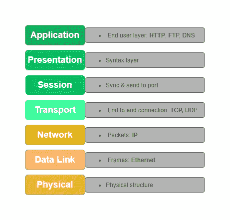
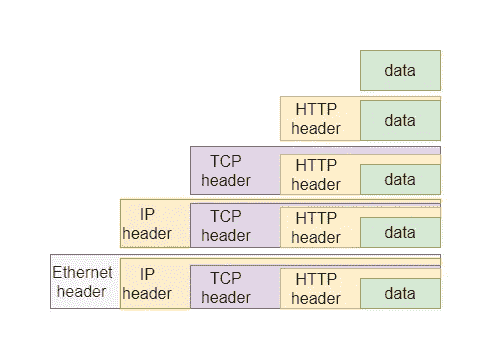
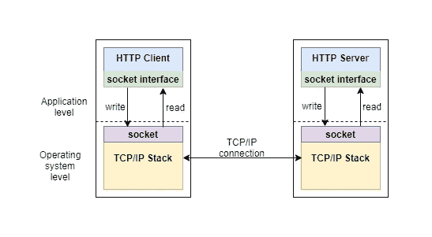
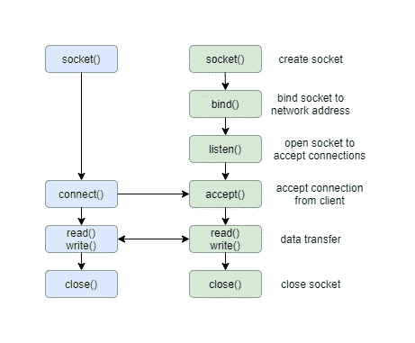
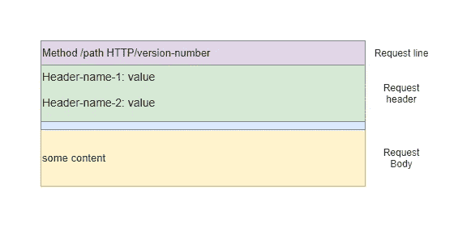
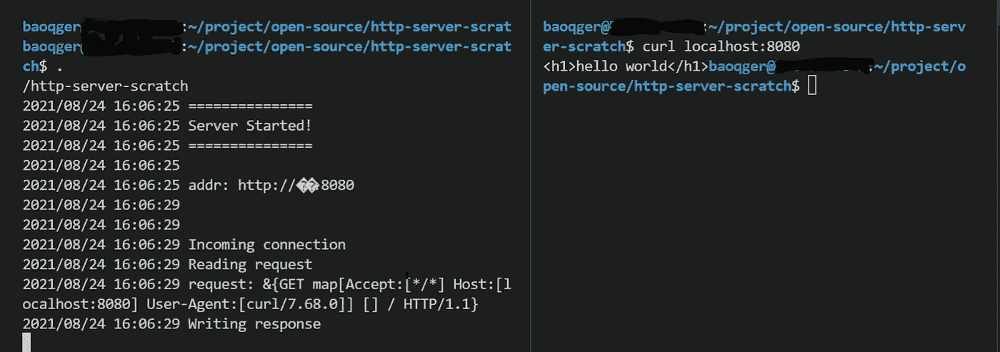

# 如何用 Linux 系统调用编写 Golang HTTP 服务器

> 原文：<https://levelup.gitconnected.com/how-to-write-a-golang-http-server-with-linux-system-calls-444a3a296812>

# 背景

`HTTP`无处不在。作为一名软件工程师，你每天都在使用`HTTP`协议。如果你使用任何现代语言或框架，启动一个`HTTP`服务器将是一件容易的事情。例如，在 Golang 中，您可以通过下面几行代码来实现:

因为`net/http`包完全实现了`HTTP`协议，所以您可以轻松地完成这项工作。没有`net/http`包你怎么做？这就是本文的目标。

**注**:这篇文章的灵感来源于[乔·斯查费的帖子](https://joe.schafer.dev/go-server-with-syscalls/)。我的实现有些不同，它完全消除了对 Golang 的`net`包的依赖，但是在 Golang 中使用`system call`来建立 TCP/IP 连接的想法是相同的。非常感谢乔·斯查费有趣的帖子。

我需要提到的另一件事是，这篇文章将涵盖许多概念，但很难详细讨论它们。要顺利理解这篇文章，需要一些`OSI model`、`TCP/IP stack`、`socket programming`、`HTTP protocol`、`system call`等必备知识。我将添加一些关于这些主题的解释，以帮助您理解本文，并提供一些参考和链接，让您继续探索更高级的内容。

**注意**这篇文章最初发表在我的[博客](https://organicprogrammer.com/2021/07/31/how-to-implement-simple-http-server-golang/)上，你可以在那里找到更多信息。谢了。

# OSI 网络模型

`[OSI model](https://en.wikipedia.org/wiki/OSI_model)`将通信系统中的数据流划分为**七个抽象层**。这些层形成了一个协议栈，每一层都与上一层和下一层进行通信，如下所示:



OSI 模型

例如，`HTTP`在**层 7** 中，`TCP`在**层 4** 中，`IP`在**层 3** 中。

OSI 是一种通用模型，在 20 世纪 80 年代初首次被指定。**但是传统的和现代的网络协议都不适合这种模式**。例如，`TCP/IP` stack 没有定义三个上层:会话层、表示层和应用层。事实上，它没有定义传输层之上的任何东西。从`TCP/IP`的角度来看，传输层之上的一切都是
应用的一部分。所以更符合 Linux 的分层网络模型(TCP/IP 栈是在 Linux 内核中实现的)如下:

*   应用层(远程登录、ftp、http)
*   主机到主机传输层(TCP、UDP)
*   互联网层(IP 和路由)
*   网络接入层(以太网、wi-fi)

再次强调，**重要的是要指出上层——第 5 层、第 6 层和第 7 层——不是 TCP/IP 协议栈的一部分**。

另一个需要理解的关键点是`data encapsulation`。在应用程序中，数据流从最底层的物理层流向最高层的数据表示。

每一层都有它必须保存的关于自己层的管理信息。当数据包向下传递时，它会将报头信息添加到从上一层接收的数据包中。每个报头包含关于消息内容的信息。例如，一台`HTTP`服务器从一台主机向另一台主机发送数据。它在`IP`协议之上使用`TCP`协议，该协议可以通过`Ethernet`发送。这看起来像:



数据封装

通过以太网传输的数据包位于底部。在接收端，当数据包向上移动时，这些报头会被删除。

接下来让我们看看`TCP/IP`栈如何封装`HTTP`消息，并通过`socket`在网络上发送它。这个想法可以用下图来说明:



我将通过从头编写一个 HTTP 服务器来解释它是如何工作的，你可以参考这个 [Github repo](https://github.com/baoqger/http-server-scratch) 来获取所有代码。

# 传输控制协议

`TCP/IP`栈源于`[ARPANET](https://en.wikipedia.org/wiki/ARPANET)`项目，作为`TCP/IP`协议的第一个实现集成到 Unix BSD OS 中。

如今，`TCP/IP`依然在操作系统层面实现。对于 Linux 系统，可以在内核内部找到源代码。详细的实现超出了本文的范围。你可以在这个 Github [链接](https://github.com/torvalds/linux/tree/master/net/ipv4)里研究一下。

# (电源)插座

正如我在上面几节中提到的，HTTP 服务器运行在应用程序级别。它如何与内核中的`TCP/IP`堆栈一起工作？答案是`socket`。

`socket`接口最初是作为 BSD 操作系统的一部分开发的。套接字提供了应用层程序和 TCP/IP 协议栈之间的接口。Linux(或其他操作系统)提供了一个 API 和套接字，应用程序使用这个 API 来访问内核中的网络设施。

套接字接口实际上是 TCP/IP 通向世界的窗口。在大多数包含 TCP/IP 的现代系统中，套接字接口是应用程序利用 TCP/IP 协议集的唯一方式。

Unix 或 Linux 系统中套接字的一个主要优点是套接字被视为一个`file descriptor`，所有标准的 I/O 函数都像处理本地文件一样处理套接字。文件描述符只是一个与打开的文件相关联的整数。

你可能听说过 Unix 中的所有东西都是一个文件。该文件可以是网络连接、管道、磁盘中的真实文件、设备或任何其他东西。所以当你想通过因特网向另一个程序发送数据时，你可以通过文件描述符来完成。

在我们的 HTTP 服务器案例中，**它将通过从套接字读取数据来获取请求，并通过将数据写入套接字**来发送响应。

接下来，让我们回顾一下源代码，看看 HTTP 服务器是如何实现的。

首先，我们需要通过 socket 建立 TCP 连接，这个过程可以在下图中描述:



TCP 套接字进程

在 Golang 中，`net`包提供了所有与套接字相关的功能。因为本文的目的是从头开始编写一个 HTTP 服务器，所以我创建了一个名为 **simplenet** 的包来提供非常基本的实现:

**创建 netSocket** 数据模型来表示 Socket，它只包含一个字段 **fd** 表示文件描述符。所有与 socket 相关的 API:**读**，**写**，**接受**和**关闭**，都被定义了。socket API 的用法不在本文的讨论范围之内，您可以很容易地在网上找到许多关于它的优秀文档。

**netSocket** 的逻辑并不复杂，因为它通过`system call`将作业委托给内核。系统调用是程序向内核请求服务的一种编程方式，详细你可以参考这篇[文章](https://opensource.com/article/19/10/strace)。在 Golang 中，所有的系统调用都封装在`syscall`标准包中。

需要提到的一点是不同的平台有不同的`syscall`用法，所以本文展示的演示代码只能在 Linux 系统上编译和构建。

现在我们设置 TCP 服务器并等待来自客户端的连接请求。接下来，让我们看看如何通过 socket 来读取或写入 HTTP 请求和响应。

# 超文本传送协议

主要工作流程如下:

如您所见，HTTP 请求解析逻辑是在 **simplenet** 包中的 **ParseRequest** 方法中定义的:

HTTP 请求消息可以分为以下三个部分`request line`、`request headers`和`request body`:



HTTP 消息

**ParseRequest** 内部的逻辑逐步处理这 3 个部分。可以参考演示代码中的注释。

需要强调的一点是 **ParseRequest** 方法不依赖于`net`包。因为我想展示 HTTP 服务器在底层是如何工作的，所以我将请求解析逻辑从`net`包复制到我的`simplenet`包中。对请求头部分的解析有点复杂，但这不会影响您对 HTTP server 主要概念的理解。想了解详情可以参考`simplenet/simpleTextProto`套餐。需要理解的重要一点是，HTTP 服务器使用 **netSocket** 的 **Read** 方法读取请求消息。 **Read** 方法通过 socket read 系统调用从 TCP 栈获取网络数据:

```
**syscall.Read(ns.fd, p)**
```

另一方面，通过调用`simplenet`包的`WriteString`方法发回 HTTP 响应:

`WriteString`简单调用 **netsocket** 的 **Write** 方法，使得 socket write 系统调用通过 TCP 栈发送数据:

```
**syscall.Write(ns.fd, p)**
```

代码部分到此为止。接下来，让我们尝试运行这个我们从头构建的简单 HTTP 服务器。

# 演示

使用默认选项设置构建(需要 Linux 平台)并运行这个 HTTP 服务器，并使用`curl`向它发送请求。结果如下所示:



基于 Linux 系统调用的 Golang HTTP 服务器演示

服务器按预期工作。