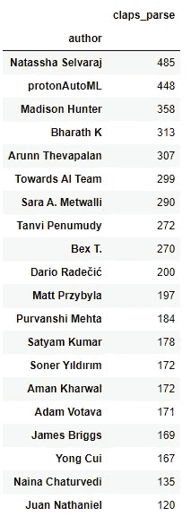
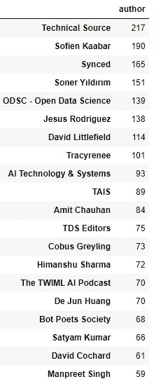
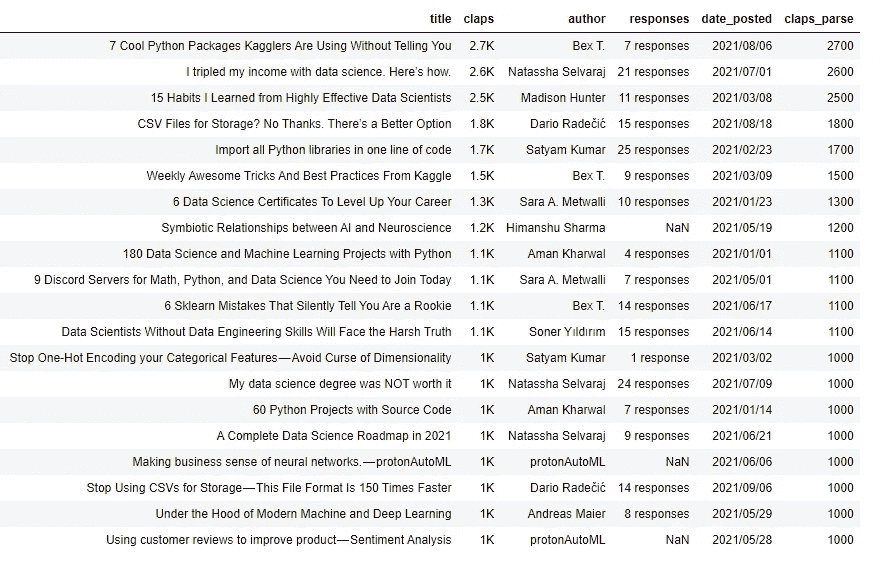
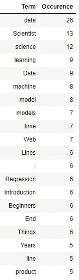
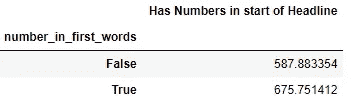
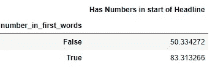

# 如何在 Medium 上写好机器学习标题

> 原文：<https://levelup.gitconnected.com/how-to-write-a-good-machine-learning-headline-on-medium-c1b9d0805634>

经过科学验证的见解。算是吧。

照片由 [Unsplash](https://unsplash.com?utm_source=medium&utm_medium=referral) 上的 [h heyerlein](https://unsplash.com/@heyerlein?utm_source=medium&utm_medium=referral) 拍摄

我是机器学习的爱好者，多年来，Medium 一直是我重要内容的来源。去年，我自己也成为了一名作家，自然，我想知道如何做得更好。像往常一样，我采用了数据驱动的方法。

为了这个任务，我试图探索相关[机器学习](https://medium.com/tag/machine-learning)标签的标题。我想知道谁是最受欢迎的作家，他们提出了什么话题。最后，我发现标题中有独特的模式，它们可能会影响邮报的成功。

**免责声明:**我在 2021 年期间在 Medium 的 ML 标签中使用了帖子的标题(+一些元数据)。所有媒体订户都可以公开获得它们。

我用掌声来代表邮报的成功。虽然中支付基于视图的方法，鼓掌仍然是相关的，并代表了对材料的认可。至少，我自己的作品是这样的。

# 最受欢迎的作家

让我们从一些认知开始。如果你是 ML 帖子的忠实读者，你可能会注意到一些熟悉的名字。

每位作者的平均鼓掌次数

…第一名是 Natassha Selvaraj，她平均每篇文章获得 485 次掌声。不过，第二个位置引发了一些问题。虽然对于大多数作者来说，掌声的数量与回复的数量和关注者的数量相关，但我无法观察到这位作者的相同模式。我想指出的是，无论在这里还是在其他地方，我都不会对我的博客们推销他们的内容的方式表示批评。我的目标是分享简单的统计事实。让我们从这些开始。

> **经验教训:**质量和数量之间似乎存在依赖关系。发表超过 20 篇帖子的作者比那些发表较少帖子的作者平均多 20 次鼓掌(71 次鼓掌对 51 次鼓掌)。如果你想写一个好标题，就去尝试吧！

**注意:**我在本节中只使用了去年在 ML 标签中发表了 20 篇或更多帖子的作者。我们的目标是跳过那些在一两篇文章中获得较高掌声的异常值。我确信一个好的作者总是发布高质量的内容，我的分析就是基于这些想法进行的。

# **最常见作者**

虽然我认为高质量的内容需要时间，因此很难在一年内提供大量的内容，但我想对那些能够发布大量材料的人给予认可。此外，上面透露的大多数博客不是个人网页，而是一个出版物。例如，技术来源，同步，ODSC，TDS 编辑和其他。

> **经验教训:**合作有助于提高发布内容的频率。寻找志同道合的人，和你一起走上作家之路。

# 最受欢迎的帖子

年度最受欢迎帖子

请注意，Medium 对超过 1000 的拍击数使用了单位，因此你在表格中看到了如此“完美”的拍击数。尽管如此，它让我们有能力决定 2021 年机器学习学科的最佳帖子。

现在远远地看一下这个列表。你看到什么特别的模式了吗？首先，它们显然很吸引人。大多数作者要么使用“如何”风格，要么在标题的第一部分使用数字来强调对未来读者的价值。

> **经验教训:**一些基本的标题写作规则仍然存在于游戏中，并且可能会存在一段时间，因为它们与人类的心理有着密切的联系。

# 最受欢迎帖子的主题

标题中最常出现的名词及其出现次数

这张截图表明大多数作者在标题中使用了相关关键词。你可以围绕它建立一个很好的假设，那就是他们的目标是为了流量而利用 SEO 的力量。搜索引擎更看重标题中的文字，而不是文章主体中的文字，所以这是很合理的。如你所见，我不仅学到了这一课，而且实际上也做到了:)

# 标题中的模式

1000 篇最热门帖子分析

标题开头有数字实际上与邮报的更多掌声同时出现。起初，我认为这可以用拥有大量掌声的作者的普遍素质来解释，但这种趋势甚至在那些不太成功的作者中也存在

整个数据集统计

> **经验教训:**不要回避使用“以下是 X 点”或“如何做”的标题风格。虽然乍看之下它们可能看起来很俗气，但它们有一定的功能，对没有经验的作者来说很有用。随着时间的推移，你会形成自己的风格，但基础是有原因的。

# 摘要

机器学习标题遵守许多常见的规则，如 SEO 设备、如何构建、“引人注目”。为了取得成功，你需要遵守它们，但也要加入你自己风格的点滴。大多数杰出的作者要么代表他们工作的大公司，要么在 ML 的世界里有一些独特的经历。即使你不是他们中的一员，也不要害羞。你独特的学习经历或一个不错的宠物项目可能是你正在寻找的东西！