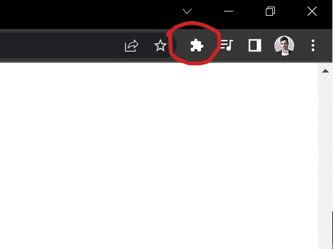
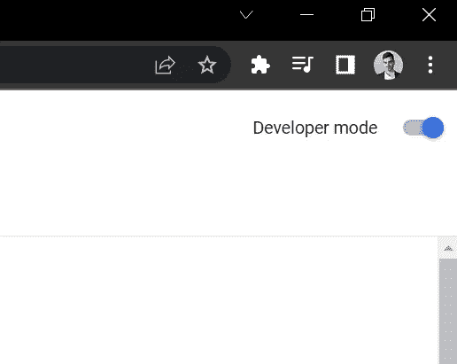
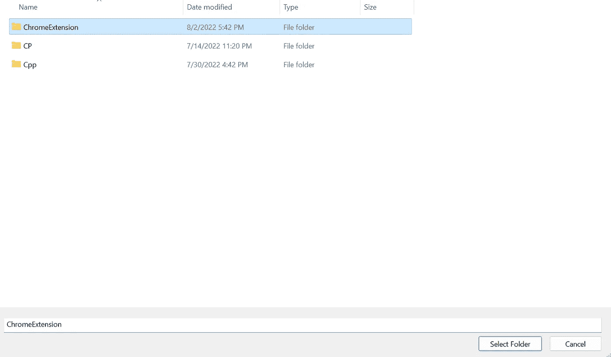
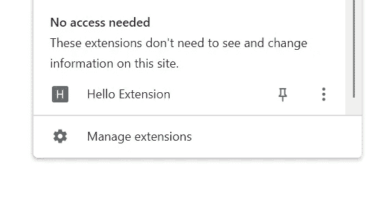
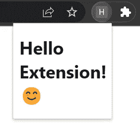

# 如何编写 Google Chrome 扩展

> 原文：<https://levelup.gitconnected.com/how-to-write-a-google-chrome-extension-c9dc2ec8ff85>

## 两分钟内创建一个谷歌浏览器扩展

亚瑟·奥西皮扬在 [Unsplash](https://unsplash.com?utm_source=medium&utm_medium=referral) 上的照片

你有没有想过浏览器中的扩展是如何创建的？在这个简单的教程中，您将了解编写扩展的起点。

## 第一步:创建一个 HTML 文件

首先创建一个`index.html`文件

index.html 文件

文件`index.html`将是你的扩展的核心。

## 第二步:创建一个 JSON 清单文件

用下面的代码创建一个名为`manifest.json`的文件:

manifest.json 文件

注意两件事:

*   名称:它将是您的扩展名
*   default_popup:它将使用您的`index.html`文件作为您扩展的起点

## 第三步:加载您的扩展

打开你的谷歌浏览器，点击右上角的“扩展”按钮。

谷歌浏览器扩展按钮

然后点击“管理扩展”并打开“开发者模式”

谷歌浏览器开发者模式已激活

点击“Load unpacked”按钮并选择你的项目的文件夹，在我的例子中是一个名为“ChromeExtension”的文件夹，选择这个文件夹并点击“Select Folder”。

ChromeExtension 文件夹

您已经添加了新的扩展名。点击浏览器中的“扩展”图标，你会发现你的新扩展！

你好分机

点击你的新扩展，你会看到你努力工作的结果😎

Hello Extension 正在运行！

请记住，这是起点，您可以添加 JavaScript 并创建一个复杂的扩展。

恭喜你，你刚刚写了你的第一个扩展
🎉🎉🎉

感谢您花时间阅读我的文章，再见！🙏