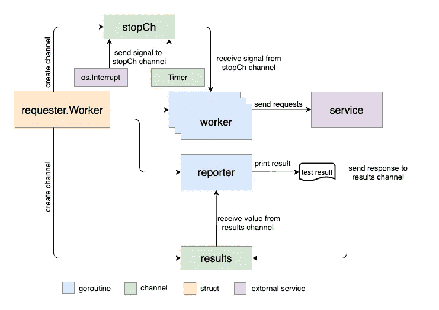

# 如何使用 Golang 编写负载性能测试 CLI 工具

> 原文：<https://levelup.gitconnected.com/how-to-write-a-load-performance-test-cli-tool-with-golang-95e332d58ebb>

# 背景

当您想对 HTTP 后端服务进行负载性能测试时，一个方便而强大的工具可以让您的工作变得容易得多。比如`ApacheBench`(简称 [ab](https://en.wikipedia.org/wiki/ApacheBench) )在这个领域的应用非常广泛。但不是今天的话题。相反，我想介绍用`Golang`编写的 [Hey](https://github.com/rakyll/hey) ，并支持与`ab`相同的功能。

`Hey`用法如下:

我没有列出所有的选项，只是显示了与本文内容相关的几个选项。从上面的列表中可以看出，`Hey`可以支持不同的实用特性，比如**多个工作器**以**并发**方式运行，以及**速率限制**通过**查询每秒(QPS)** 。它还可以支持**按持续时间运行**和**按请求号运行**两种模式。

在本文中，我们可以回顾一下`Hey`的设计和实现，看看如何制作一个负载性能测试工具。

# 建筑设计

`Hey`的设计并不复杂，架构可以分为以下三个部分:

*   控制逻辑:主要工作流，如如何设置多个并发工人，如何控制 QPS 速率限制器，以及如何在达到持续时间时退出流程；
*   HTTP 请求配置:发送请求所需的头或参数；
*   测试报告:负载测试完成后打印或保存结果。

架构图如下所示，阅读本文后，您将理解该图中的每个元素:

本文将关注第一项(因为这是真正有趣的部分),展示如何使用`Golang`的并发编程技术来实现这些特性。

# 退出流程

在`hey.go`文件中，可以找到**主**函数的入口点。让我们隐藏样板代码，回顾一下**主**函数中的核心逻辑，如下所示:

**申请人。Work** struct 包含所有的选项设置，包括请求号、并发工作者和 QPS(它还包含测试结果报告)。

创建了**请求者的实例后。工作**，然后调用 **Init()** 方法。

**Init()** 方法将初始化两个`channel` : **结果**和 **stopCh** 。**结果**通道用于请求响应通信。 **stopCh** 通道用于发出停止并行工作人员的信号。

请注意，有两种方法可以退出程序。第一种是用户手动停止程序，例如按下 **ctrl + c** 。在这种情况下，std 库中的`signal.Notify()`方法可以捕捉信号来终止进程。第二个是按时间**持续时间**选项。两个进程退出逻辑都在一个`Goroutine`中运行。

要停止工作进程，将调用 **Stop()** 方法:

它的作用是向 **stopCh** 通道发送几个值。请注意，它向通道发送 **b.C** 值，该值与并发工作者的数量相同。

你可以想象每个工人应该等待来自 **stopCh** 通道的值。当 worker 收到一个值时，它应该停止发送请求。对吗？那么这样的话，我就可以把所有的并发工都停了。让我们在接下来的部分检查我们的猜测。

# 兼职工人

在上面的**主**函数中，可以看到 **Run()** 被调用:

有几点值得讨论。在本节中，我们来回顾一下 **runWorkers()** 。并且 **runReporter()** 和 **Finish()** 都与测试结果报告相关，我们将在本文后面重新讨论它们。

**runWorkers()** 如下所示:

这是一个非常典型的通过`sync.WaitGroup`发射多个`goroutine`的模式。每个 worker 都是通过在 goroutine 中调用 **b.runWorker** 来创建的。这样，多个并发工作者可以一起运行。

注意，在所有工人完成他们的任务之前， **wg。Wait()** 将阻止 **Finish()** 运行，它用于报告测试结果。我们将在接下来的章节中讨论它。

下一步，逻辑进入 **runWorker** 方法，让我们回顾一下 **QPS** 速率限制是如何工作的？

# QPS

**runWorker** 核心代码如下:

方法 **runWorker** 的第一个参数是用于发送请求的 **client** 。我们需要对第二个参数 **n** 进行更多的分析，这个参数表示这个工作者需要发出的请求的数量。当 **runWorker** 被调用时， **b.N/b.C** 传递给它。 **b.N** 是需要发出的请求总数， **b.C** 是并发工人数。 **b.N** 除以 **b.C** 就是每个工人的请求数。对吗？

但是如果用户设置了**持续时间**选项，那么请求的数量是多少呢？您可以在**主**输入功能中找到以下逻辑:

当用户设置**持续时间**选项时，请求编号将为`math.MaxInt32`。在这种方法中，**嘿**可以将**按持续时间运行**和**按请求号运行**两种模式结合在一起。

正如我们在简介部分提到的，`Hey`可以支持 **QPS** 速率限制，这个策略写在 **runWorker** 方法里面。注意一个`receive-only channel` **节流**是用`time.Tick`创建的，它在每个时间段发出一个值。并且时间段由下式定义

例如， **QPS = 1000** ，那么时间段是 100ms，每 100ms **油门**通道就会接收一个值。

**throttle** 放在 **makeRequest()** 调用之前，通过这种方式，我们可以实现速率限制的效果。

# 停止工人

在 **runWorker** 方法中，还可以看到`select and case`的用法。

正如我们在上面一节提到的， **stopCh** 通道是用来停止工作的。对吗？现在你可以看到它是如何实现的。它映射到我们上面讨论的**停止**方法，如下所示:

`b.C`数量的值被发送到 **stopCh** 通道，同时还有`b.C`数量的并发工人。每个工作者可以从通道接收一个值并停止运行。

# 结果报告

让我们快速回顾一下结果报告是如何工作的。首先在 **makeRequest** 方法中，每个请求的结果被发送到**结果**通道，如下所示:

在`runReporter`方法中，您可以看到这样的逻辑:

在这种情况下，使用一个`for`从通道接收所有值。注意**循环将继续，直到通道关闭**。这是`Golang`中另一个非常典型的并发编程模式。我们可以通过使用`select case`模式来实现相同的功能，只要我们可以多添加一个通道来发送退出信号。但是在语法层面上，`for`的循环模式要干净得多。

所以必须有一个地方关闭通道，否则会出现`deadlock`问题。详细的可以参考我之前的[文章](https://baoqger.github.io/2020/10/26/golang-concurrent-twoways/)进行更高级的解释。

通道在**结束**方法中关闭，如下所示:

还请注意**完成**通道是如何工作的。**先完成**方法`close`**结果**通道，然后循环的**将断开`r.done <- true`才有机会运行。最后 **b.report.finalize()** 可以打印结果，因为 **< -b.report.done** 没有被阻塞。t**

# 摘要

在本文中，我将通过回顾 **Hey** 作为一个例子，向您展示如何编写一个负载性能测试 CLI 工具。在代码层面，我们讨论了 Golang 提供的几种并发编程模式。并发(或并行)编程是困难的，Golang 正是为此而构建的。坚持练习。

# 分级编码

感谢您成为我们社区的一员！在你离开之前:

*   👏为故事鼓掌，跟着作者走👉
*   📰查看[升级编码出版物](https://levelup.gitconnected.com/?utm_source=pub&utm_medium=post)中的更多内容
*   🔔关注我们:[Twitter](https://twitter.com/gitconnected)|[LinkedIn](https://www.linkedin.com/company/gitconnected)|[时事通讯](https://newsletter.levelup.dev)

🚀👉 [**加入升级人才集体，找到一份惊艳的工作**](https://jobs.levelup.dev/talent/welcome?referral=true)