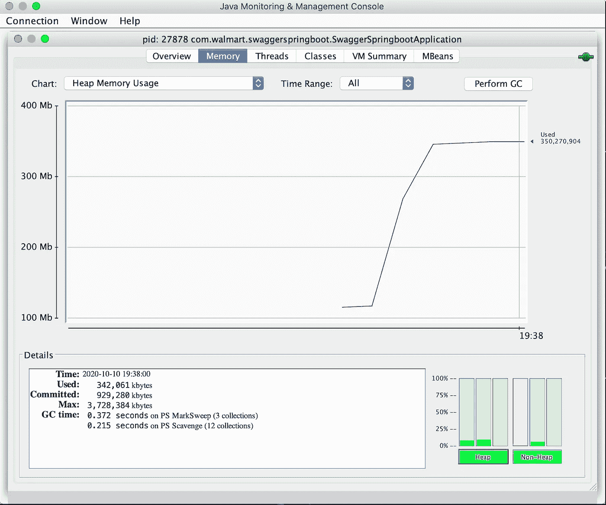

# 如何高效地在 Excel 文件中写入一百万行

> 原文：<https://levelup.gitconnected.com/how-to-write-a-million-rows-in-an-excel-file-efficiently-5f7ce6c69314>

我们已经有了 Apache 提供的 [POI 实用程序](https://poi.apache.org/apidocs/dev/org/apache/poi/xssf/usermodel/XSSFWorkbook.html)来用 Java 写/读 excel 文件。如果文件中要插入的行数少于 50K，可以使用任何 excel 工具。但是，当我们有一个在 excel 文件中插入一百万行的用例时，我们需要查看实用程序，以找到最适合我们用例的实用程序。

让我们举个例子来更好地理解它。假设我们的 Java 应用程序为用户从 Elasticsearch 查询的文档生成一个报告。给定的查询有 100 万个文档要返回，所以查询应该分批进行，以避免 Elasticsearch 如此大的响应(100 万个文档)。定义批量大小(假设 **5000** )。现在，有两种方法可以从 Elasticsearch 获得响应并将它们插入到一个文件中。

## 方法 A

1.  创建一个 excel 文件。
2.  开始循环的总文件数/5000 次。
3.  对于每一次迭代，从 Elasticsearch(或任何数据源)获取文档(最多 5000 个)。
4.  将文档附加到 excel 文件中。每当我们向该文件追加文档时，它就会在内存中打开。

方法 A 的堆内存占用，总行数:10 万，批处理大小:5000

## 方法 B(使用 [excel 流 API](https://poi.apache.org/apidocs/dev/org/apache/poi/xssf/streaming/SXSSFWorkbook.html)

1.  开始循环的总文件数/5000 次。
2.  对于每次迭代，从 Elasticsearch(可以是任何数据源)获取文档(最多 5000 个),并将它们存储在 HashMap 中。
3.  一旦 HashMap 准备好了所有的文档，就使用 excel stream 实用程序将所有的文档(或行)插入到文件中。

方法 B 的堆内存占用，总行数:10 万，全部在一个批处理中

方法 B 的堆内存占用，总行数:1 百万，全部在一个批处理中

## 观察结果:

1.  方法 B ( **350 MB** )显示了更好的内存占用。(方法 A 需要 **3 GB** 左右)。
2.  方法 B 花费 **5 秒**，方法 A 花费 **1 分 56 秒**插入所有文件。
3.  在上面的例子中，方法 A 将整个文件保存在内存中，而方法 B 只将第 **1 行**保存在内存中。
    **sxssf workbook workbook = new sxssf workbook(1)**
4.  无法在追加模式下打开 SXSSFWorkbook。
5.  即使使用 **16 GB** 堆内存，使用方法 A 也无法增加 100 万行。

感谢阅读！