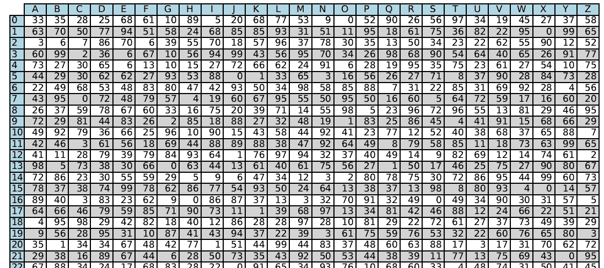
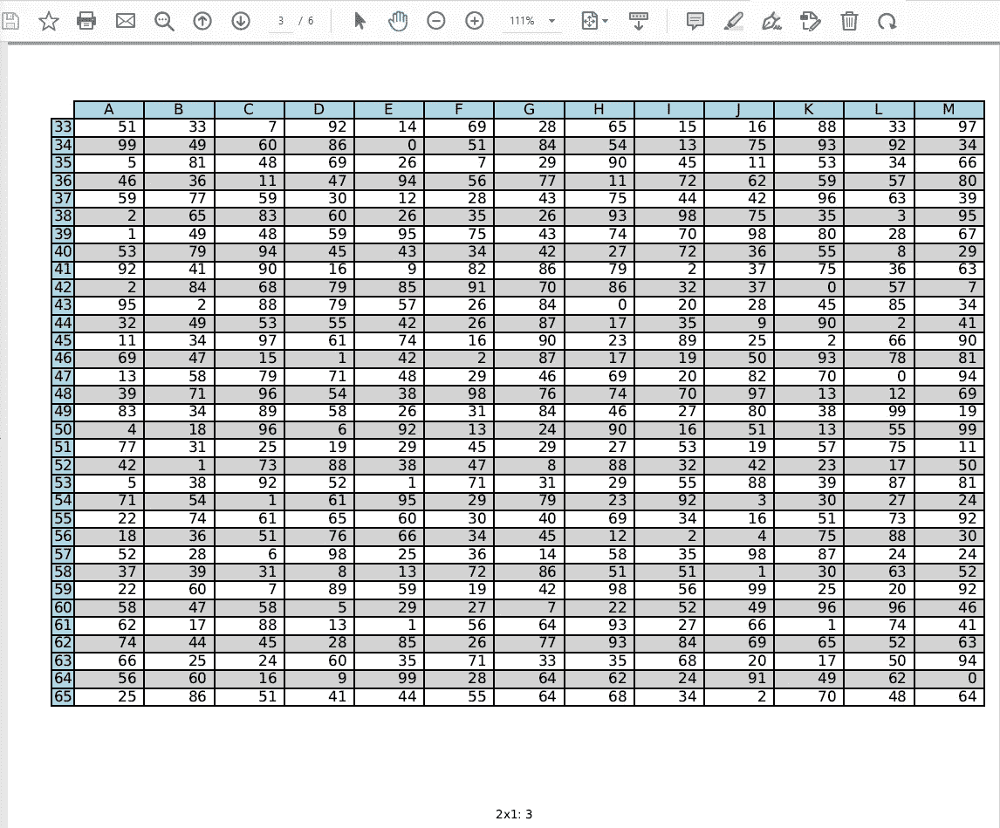

# 如何把熊猫数据框写成 PDF 格式

> 原文：<https://levelup.gitconnected.com/how-to-write-a-pandas-dataframe-as-a-pdf-5cdf7d525488>

## 使用 matplotlib 将熊猫数据框绘制成一个大 PDF 或多页 PDF

这是我最近面临的一个问题——我有一个经过仔细计算的熊猫数据框架，需要将它们“打印”成 PDF 格式。虽然 Pandas 中有 to_markdown()和 to_html()，但是没有简单的方法来创建 PDF 文件。

## 目标

我想要的是两种格式的数据:

1.  一个是包含整个表格的大 PDF，适合电子查看



一个包含数据的大 PDF

2.一种多页 PDF，适用于将表格分解为多页的打印。



熊猫数据框架分布在多个页面上。这是第三页。

如您所见，该表还需要为行提供交替的颜色，并为行名和列名提供特殊的颜色。

## Matplotlib 拯救世界

我们可以使用 Matplotlib 绘制一个表，其中行标签是 Pandas 数据帧索引，列标签是列的名称:

```
the_table = ax.table(cellText=df.values,
                        rowLabels=df.index,
                        colLabels=df.columns)
```

Matplotlib 允许您单独设置每个单元格的颜色。我们希望每行在白色和灰色之间交替，所以我们做到了:

```
alternating_colors = ([['white'] * len(df.columns), ['lightgray'] * len(df.columns)] * len(df)[:len(df)]the_table = ax.table(cellText=df.values,
                        rowLabels=df.index,
                        colLabels=df.columns,
                        **rowColours=['lightblue']*len(df),
                        colColours=['lightblue']*len(df.columns),
                        cellColours=alternating_colors**,
                        loc='center')
```

接下来，我们想把它写成 PDF。为此，请使用 Matplotlib 中的 PDFPages 后端:

```
with PdfPages(filename) as pdf:
     fig = _draw_as_table(page, pagesize)
     pdf.savefig(fig, bbox_inches='tight')   
     plt.close()
```

为了分页，我们只需每页调用一次 savefig()，注意使用 iloc()适当地分解 Pandas 数据帧。还要注意，我们使用文本注释在生成的 PDF 中写入页码:

```
with PdfPages(filename) as pdf:
    nh, nv = numpages
    rows_per_page = len(df) // nh
    cols_per_page = len(df.columns) // nv
    for i in range(0, nh):
        for j in range(0, nv):
            page = **df.iloc**[
             (i*rows_per_page):min((i+1)*rows_per_page, len(df)),

             (j*cols_per_page):min((j+1)*cols_per_page, len(df.columns))]
            fig = _draw_as_table(page, pagesize)
            if nh > 1 or nv > 1:
                # Add a part/page number at bottom-center of page
                **fig.text**(0.5, 0.5/pagesize[0],
                         "Part-{}x{}: Page-{}".format(i+1, j+1, i*nv + j + 1),
                         ha='center', fontsize=8)
            pdf.savefig(fig, bbox_inches='tight')

            plt.close()
```

## 完整代码

下面是完整的代码:

## 使用

在生成的数据帧上使用它的示例:

```
import string
nrows = 100
df = pd.DataFrame(np.random.randint(0,100,size=(nrows, 26)), 
         columns=list(string.ascii_uppercase), index=range(nrows))**dataframe_to_pdf(df, 'test_1.pdf')
dataframe_to_pdf(df, 'test_6.pdf', numpages=(3, 2))**
```

[完整示例笔记本](https://github.com/lakshmanok/lakblogs/blob/main/dataframe_to_pdf.ipynb)在 GitHub 上。

尽情享受吧！

# 分级编码

```
Thanks for being a part of our community! More content in the [Level Up Coding publication](https://levelup.gitconnected.com/).Follow: [Twitter](https://twitter.com/gitconnected), [LinkedIn](https://www.linkedin.com/company/gitconnected), [Newsletter](https://newsletter.levelup.dev/)Level Up is transforming tech recruiting 👉 [**Join our talent collective**](https://jobs.levelup.dev/talent/welcome?referral=true)
```