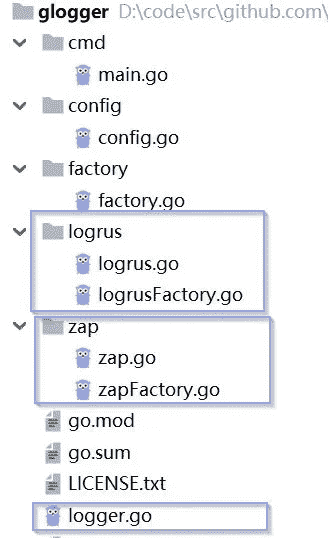

# 如何在 Go 中编写可插拔的第三方组件

> 原文：<https://levelup.gitconnected.com/how-to-write-a-pluggable-third-party-component-in-go-a70357577fb4>

在[《Go 中一个自我进化的微服务框架》](https://medium.com/@jfeng45/a-self-evolved-microservice-framework-in-go-d9bf87c10ab0)中，我描述了一个可以自我进化的框架。它有两块，一块是轻量级框架，另一块是可插拔的第三方组件。你可以把这个架构称为“小框架，大库”。在本文中，我将讨论如何创建可插拔的第三方组件。以下是你需要考虑的。

*   第三方库的外部接口
*   第三方库的内部结构
*   如何处理配置参数
*   如何扩展第三方库

我们使用日志作为例子来展示如何创建第三方库，我将其命名为[“glogger”](https://github.com/jfeng45/glogger)。Go 语言有很多第三方日志库，每个都有优缺点。在[“用干净的架构去微服务:应用日志”中](https://medium.com/@jfeng45/go-microservice-with-clean-architecture-application-logging-b43dc5839bce)我谈到“ZAP”是迄今为止最好的日志库，但它并不完美，我仍在等待更好的。如果以后有更好的，希望换成新的只需要很小的代码改动，已经有我上面说的框架支持了。是因为所有的日志调用都是通过一个通用接口(而不是第三方库的专有接口)进行的，所以只有日志库的创建是库特定的(这是需要修改的代码部分)，而日志函数的调用不需要更改。

## 第三方库的外部接口

## 调用接口

以上是日志库的界面。它最重要的原则是通用性，不能与任何特定的第三方日志库绑定。这个接口非常重要，它的稳定性是决定它能否被广泛使用的关键。作为一名程序员，一个梦想是能够像乐高积木一样编程。这个想法已经存在了几十年，但进展甚微。主要原因是没有统一的服务接口。这个接口需要是跨语言的，所有的服务必须有一个标准的接口。这样，应用程序可以是可插拔的。这个理想已经在少数领域实现了，比如 Java 中的“JDBC”，但是它的局限性还是很明显的。例如，它只适用于 SQL 数据库，而不适用于 NoSQL 数据库；而且只适用于 Java，不适用于其他语言。

对于日志，Java 中有一个“SLF4J”，它是为了实现 Java 中日志库的可插拔性而创建的。但是 Go 里没有类似的东西，所以我自己写了一个通用的日志接口。是简单的，自用够好，但不是标准的，很难造。

## 创建实例的接口

除了调用接口之外，在创建日志库的实例时，还需要调用一个接口。下面是代码。您只需要调用“Build()”函数并传入所需的配置参数。

下面的代码不在日志库中，而是在[“支付服务”](https://github.com/jfeng45/payment)中，使用了日志库。

以下是日志库中“Build()”函数的代码:

设计中的一个难题是是否将实例创建部分放在界面中。很明显，日志接口必须被标准化，并被定义为通用接口。但是创建实例的函数呢？一方面要放入标准接口，这样整个过程就完整了。但这样做扩大了接口的范围，实例创建(包括配置参数)本身一般也不规范，将其并入接口增加了接口的不稳定性。我最终决定暂时包含它，看看它是否会引起任何问题。

## 配置参数定义

一旦您在界面中包含了实例创建，那么包含配置参数的定义也是合乎逻辑的。

以下是“glogger”库中配置参数的定义

## 第三方图书馆的内部结构

你有没有想过为什么那么多 Go 第三方库把所有文件都放在根目录？它显得杂乱无章，难以管理。为什么我不能创建子目录？当我开始自己编写库时，原因变得很明显。

在解释之前，我先说说什么是第三方库的理想目录结构。其结构如下所示(仍以日志为例):

“logger.go”是最重要的文件，它包含了所有的外部接口。文件放在根目录下，这样其他程序调用时只需要导入根目录。第二，它需要支持多个日志实现库，所以每个库都会有一个单独的子目录。例如，“Logrus”和“Zap”是两个支持通用日志接口的实现，每个实现都有自己的子目录来存放包装器代码。

最难的是循环依赖的问题。由于外部接口是在根目录下定义的，而库中的其他代码依赖于该接口，所以依赖方向是从内到外(从子目录到根目录)。“工厂”目录中的代码用于创建实例。

“factory.go”中有一个“Build()”函数，应用程序也会调用它来创建实现库的实例。理想情况是将“Build()”函数放在“logger.go”中，这样外部应用程序只需要导入库的根包。但是函数“Build()”需要调用日志库的工厂函数，这将使得它依赖于子目录中的函数。于是依赖目录从外到内(从根目录到子目录)，形成了一个循环依赖。我尝试了不同的方法来解决这个问题，但没有一个是理想的，唯一的工作方法是把所有文件放在根目录。现在我终于发现了神秘。它最大的优点是一个应用只需要导入库的根包。

但问题是，图书馆内部没有结构。当只有几个文件时，这是可以接受的。一旦文件数量增加，就会很快变得难以管理。所以，我放弃了这个选项，创建了两个子目录，“工厂”和“配置”。缺点是现在你需要三个“import”语句来使用接口，同时也暴露了第三方库的内部结构。

“config.go”和“factory.go”最好放在同一个目录下，但这样也会造成循环依赖，所以我要把它们分开。

## 如何处理配置参数:

如何协调日志库的配置参数和调用应用程序的配置参数是另一个难点。一方面，第三方库的配置参数定义和处理逻辑要在库中，保证日志库的逻辑完整集中在一个地方。另一方面，应用程序的所有参数都应该存储在一个地方。它可以存储在文件或代码中。框架支持将配置参数存储在一个文件中，这似乎是一种更好的方式。现在，我们进退两难。

解决方案是把配置参数的处理分成两部分，一部分是配置参数的定义和逻辑，这部分由第三方库完成。另一部分是参数存储，放在应用中，保证应用参数的集中管理。当调用库时，应用程序可以将参数传递给第三方库，第三方库将决定如何处理参数。

下面是在[“支付服务”](https://github.com/jfeng45/payment)中初始化“glogger”库的代码。它是整个应用程序容器初始化的一部分，这个容器在“app.go”中。

下面的代码初始化应用程序容器。它首先读取配置参数，然后逐步初始化容器。

下面是从文件中读取配置参数(应用程序的所有参数，包括日志配置参数)的代码。代码在“appConfig.go”里。

下面的代码初始化日志库，它将从上面代码中的一个文件读取的参数传递给日志库，并调用“Build()”函数来获取日志接口的具体实现。

## 如何添加新的实现

当前接口包括两个支持通用日志接口的实现库，[【zap】](https://github.com/uber-go/zap)[Logrus](https://github.com/sirupsen/logrus)。如果你需要添加一个新的实现库，比如[“glog”](https://github.com/golang/glog)，执行以下步骤。

首先，需要修改“logFactory.go”来添加新的实现库选项。以下是当前代码:

下面是修改后的代码:

第二，你需要在根目录下创建一个“glog”子目录，里面包含两个文件。“GlogFactory.go”和“glog.go”。“glogFactory.go”是工厂文件，与“logrusFactory.go”相同。“Glog.go”主要是对日志库进行参数配置和初始化。

下面是“logrus”文件“logrus.go”。你可以用它作为例子来写“Glog.go”。“RegisterLogrusLog()”函数是“logrus”的通用配置，“customizeLogrusLogFromConfig()”是根据应用程序传入的参数定制的配置。

## 结论:

本文描述了在 Go 中创建可插入的第三方组件需要做些什么。它以日志服务为例。主要工作是创建一个公共日志接口，并添加包装器代码来调用支持公共接口的日志实现库。我还创建了其他通用接口，如用于交易管理的[“g transaction”](https://github.com/jfeng45/gtransaction)和用于消息传递的[“g messaging”](https://github.com/jfeng45/gmessaging)。每个组件的结构都非常相似。主要包含两部分代码，一部分是通用接口，另一部分是支持各个实现库的包装器代码。您可以在将来添加新的实现库。

## 源代码:

完整的代码在 [glogger](https://github.com/jfeng45/glogger) 中

## 索引:

1[“Go 中自进化的微服务框架”](https://medium.com/@jfeng45/a-self-evolved-microservice-framework-in-go-d9bf87c10ab0)

2 [使用干净的架构实现微服务:应用程序日志](https://medium.com/@jfeng45/go-microservice-with-clean-architecture-application-logging-b43dc5839bce)

3 [“支付服务”](https://github.com/jfeng45/payment)

4[“zap”](https://github.com/uber-go/zap)

5[“Logrus”](https://github.com/sirupsen/logrus)

6[“glog”](https://github.com/golang/glog)

7[“g transaction”](https://github.com/jfeng45/gtransaction)

8