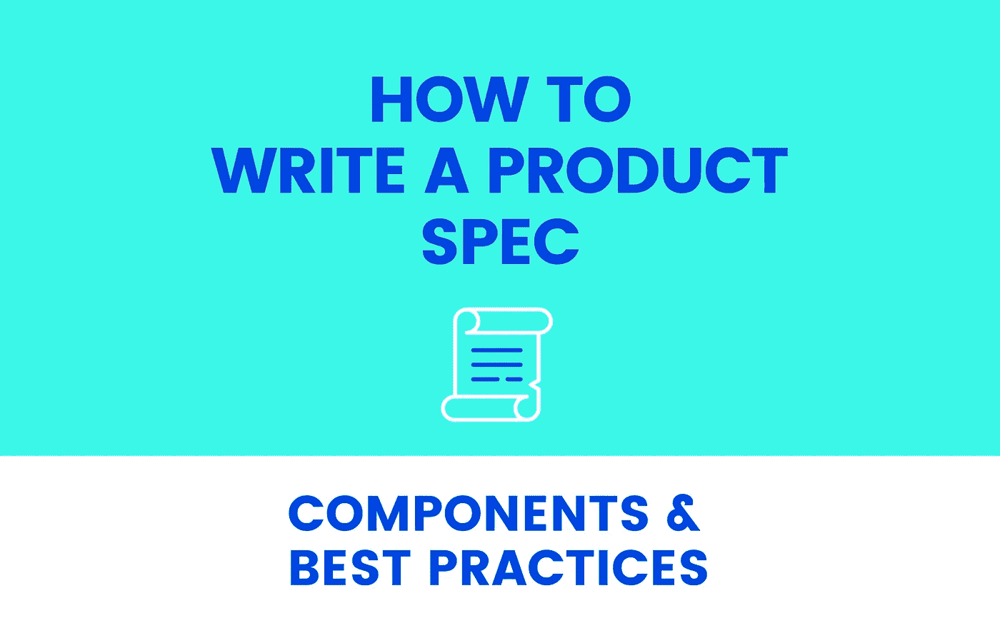

# 如何撰写产品说明书

> 原文：<https://levelup.gitconnected.com/how-to-write-a-product-spec-3db22d7b69ad>

## 组件和最佳实践

当理解了目标是什么和为什么时，就可以获得更好和更有针对性的结果。这个练习也适用于编写产品规格。因此，让我们深入了解它的用途和重要性。

# 什么是产品规格？

在产品管理中，产品规格(也称为产品规格或规格)是一个包含要设计和制造的新产品的关键方面的文档:是什么，看起来是什么，以及它的主要功能是什么

换句话说，它描述了产品将会是什么，并且应该给出产品预期完成什么(结果)、它将如何完成(解决方案)以及如何衡量成功(调整)的答案。为了帮助可视化解决方案，它可以伴随着设计线框。

使用产品规格将允许产品开发团队了解他们必须设计和构建什么，并且还帮助产品和设计团队发现可行的解决方案。通常需要在产品、设计和开发之间进行几次审查，直到产品规格最终确定。

根据组织和公司的不同角色，编写产品规格的人可以不同，但通常是产品经理编写产品规格表。

# 为什么良好的产品规格很重要

开发新产品时，拥有一份包含塑造产品的最重要需求和功能的文档是关键。这份文件应该提到具体的目标，概述合适的产品，并给出关于预期结果的见解。

好的产品规格应该简洁，用团队中的任何人(无论是设计、产品还是开发部门的成员)都能理解的清晰易读的语言编写。

产品经理参与编写规格表并与团队合作创建是有价值的。这将有助于团队更好地理解确切的目标，并对共同决定的事情负责。包含精确的信息将有助于避免所有相关团队之间的混淆和误解，也有助于加速产品开发过程。

# 产品规格表中包括什么

产品规格文档应该包含许多元素。当然，产品规格的内容可能在很大程度上取决于要实现的结果和目标，甚至取决于团队或组织的需求。尽管如此，让我们深入了解所有产品规格都应具备的关键部分:

## 产品目录

这是产品的一般描述。这一部分包括产品理念的概述，以及您为什么要开发该产品(您试图解决的问题)，开发该产品的目标是什么，定义该产品的关键特性，该产品的外观以及开发该产品的预期时间。

## 商业案例

商业案例总结了产品将为公司带来的好处，以及与构建产品所需的预算和资源相关的信息。它应该为产品的投资回报提供有效性，并允许涉众理解它可能是什么样子。

## 用户故事

用户故事是非技术性的，对功能的简短描述，它解释了最终用户希望通过使用产品实现什么和获得什么价值。考虑到用户故事的模糊性，为每个用户故事编写验收标准也有助于开发人员理解用户故事何时得到满足。

## 用户角色

用户角色展示了终端用户的行为，代表了更大的用户群的需求。在产品规范中，用户角色描述了产品是为谁而创建的。他们的需求、目标和他们想要达到的目标都被收集在这个文档中，因此参与项目的团队成员对谁是最终用户有一个清晰的了解。

## 产品设计

这是产品外观的可视化表示。在本节中，预计会包括一张带有技术细节的图纸。它不需要展示最终版本，并且可以在产品开发过程中进行修改，但至少它将作为团队的参考和起点。

## 功能规格

这最后一部分涵盖了产品的外观和功能，以及用户如何与之交互的清晰工作流程。这被认为是产品开发团队的参考。

作为一个要记住的总结，当任何一个浏览过文档的人能够回答我们在构建什么，为什么以及产品应该实现什么时，产品规格就完成了它的工作。

# 开发优秀产品规格的最佳实践

## 定义问题

我们为什么要开发这个产品？我们试图解决什么问题？在开发新产品时，我们需要确保满足客户和业务需求。

## 客户反馈

了解客户的意见，倾听客户对产品如何给他们带来好处的看法，将有助于了解客户喜欢和不喜欢产品的地方，如何满足他们的需求，以及需要改进什么和如何改进。

## 让不同的团队参与讨论

让团队参与到新产品开发的讨论中也是非常有益的。来自多学科受众的不同观点将扩展我们对商业、法律、营销和销售团队需求的理解，提供支持客户反馈的宝贵反馈。

## 用户测试

一旦需求被定义并达成一致，下一步将是创建一个原型，记住已识别的问题、结果和用户角色。了解我们的产品是否有效的最好方法是允许用户使用产品，测试他们每天可能面临的所有可能的场景，并根据他们的测试提供反馈。

# 最后的想法

总之，制定产品规格是开发新产品的关键。根据特定的需求和产品的性质，您的产品规格可以采用不同的形状和形式。如果你花了足够的时间来定义问题，正确地涉及利益相关者，并从每个人那里获得输入，你应该能够编写一个可靠的产品规范文档，它将是指导方针和结构，将使你的产品具有生命力。

—

# 作者:

Angela Alonso 是 Zartis 的高级产品负责人，拥有超过六年的产品管理经验。她在伦敦开始她的职业生涯时是一名 QA，主要做手工测试，然后她转向了产品管理，因为她喜欢工程的技术挑战，但希望成为战略决策的一部分。她曾与不同行业和不同组织的跨职能团队合作过，从初创企业到大公司。