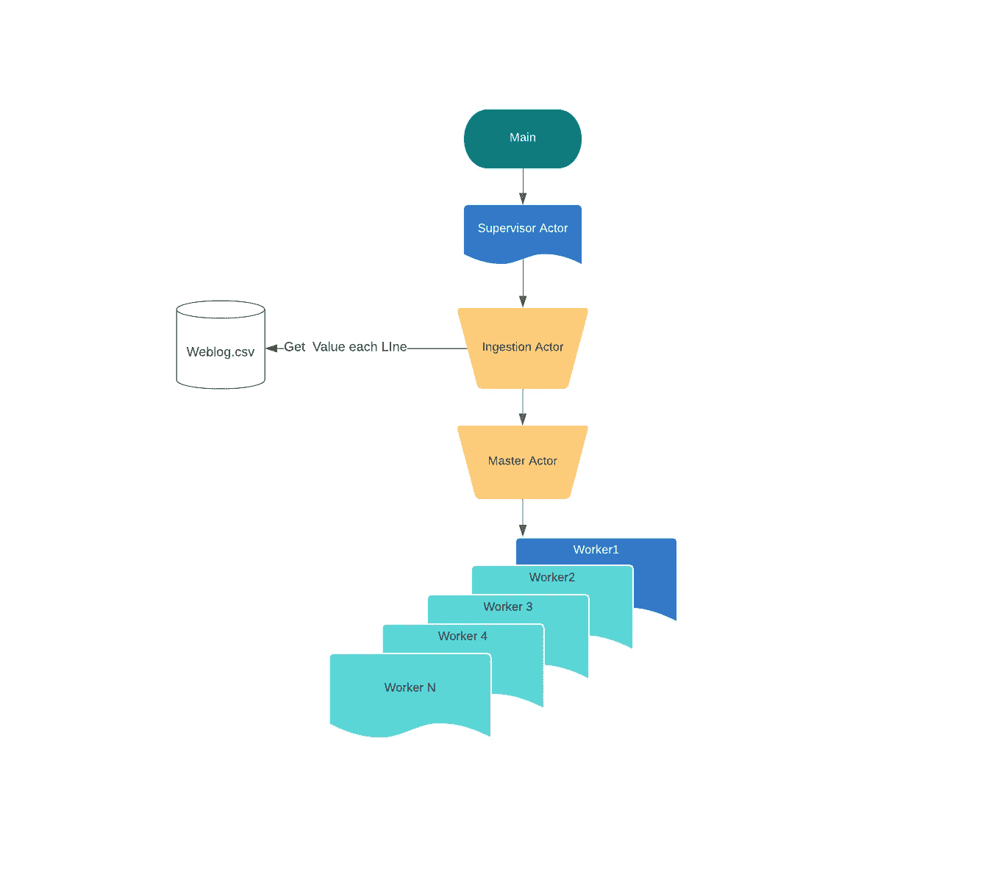

# 如何用 Akka Actors 编写一个简单的数据处理应用程序

> 原文：<https://levelup.gitconnected.com/how-to-write-a-simple-data-processing-application-with-akka-actors-7373371096ea>


【https://edward-huang.com】最初发表于[](https://edward-huang.com/akka/scala/programming/functional-programming/reactive/2020/05/30/how-to-write-a-simple-data-processing-application-with-akka-actors/)**。**

*当我们谈到数据处理或进行大数据 ETL 时，首先想到的是使用 Hadoop(或 Spark)。今天，我将展示使用 Actor 系统创建数据处理的另一种方式。我将使用经典的 Akka 演员。*

*注:本文就不说一个演员系统了，介绍一下 Akka 中的一个演员系统。不过我会再写一篇文章解释一下 Akka 演员的介绍，或者你也可以看一下 Akka 这边的[文档](https://doc.akka.io/docs/akka/current/actors.html)。*

# *为什么要用演员制？*

*需求苛刻的现代分布式系统遇到了传统面向对象编程(OOP)模型无法解决的挑战。*

*OOP 在创建分布式系统中的一个后备例子包括封装的挑战。如果你用 Java 写一个常规的线程模型，封装不会在你的应用程序中封装多个线程。封装仅在单线程模型中有效。为了封装的线程安全，您需要做`synchronized`。其他回落可以在 Akka [侧](https://doc.akka.io/docs/akka/current/typed/guide/actors-motivation.html)看到。*

# *目标*

*我将创建一个从 log `CSV`文件中获取数据的应用程序，并使用主从模式处理每条消息。*

*目标是聚合和统计日志文件中所有出现的 Http 状态代码，并将其写入`out.txt`文件。*

# *参与者层次结构*

*由于从源文件获取数据、分割工作和聚合数据涉及到多个组件，所以让我们来研究一下这个应用程序中不同参与者的角色。*

**

*演员有四种:监督演员、摄取演员、师傅演员、工人演员。*

*监督演员监督，产卵，并停止摄取演员。监督执行元将处理摄取执行元中的任何类型的事件失败。*

*摄取执行元从源读取日志文件，初始化主执行元。它将日志文件分成每一行，并将每一行发送给主参与者。最后，它将从主参与者接收聚合值，并将该值写入`out.txt`文件。*

*主执行元在创建工作执行元和将任务委派给工作执行元时发挥作用。它还聚合结果并将它们发送回摄取参与者。*

*工人演员将在过程中制造所有的重物。*

*我们将读取的数据是一个日志文件，它将包含 IP、时间、URL、状态:*

```
*10.128.2.1,[29/Nov/2017:06:58:55,GET /login.php HTTP/1.1,200*
```

*然而，数据并不总是按正确的顺序排列，我们需要做一个过滤器来处理数据。*

*在本文中，我将介绍主管角色和摄取角色的代码流程。主演员和工人演员将在第二部分。*

*让我们勇往直前去征服。*

# *主要的*

*在浏览应用程序中的所有代码之前，这里是调用数据处理应用程序的主要函数:*

```
*object Main extends App {
  val system = ActorSystem("DataProcessingAkka")
  val supervisorActor = system.actorOf(Supervisor.props(100), "supervisor")

  supervisorActor ! Supervisor.Start

}*
```

*它创建了一个 actor 系统，并创建了一个具有 100 个工人参数的监督 actor 来处理数据。然后，它向主管演员发送`Supervisor.start`消息。*

# *主管演员*

*Akka 提供了容错机制来处理参与者内部的错误，或者监视那些参与者，如果遇到任何失败，就执行某种行为。*

*当一个 actor 失败时，它会挂起其子 actor，并向其父 actor 发送一条特殊消息。然后，父母可以启动或停止他们的孩子。*

*然而，在本文中，我不会使用主管角色和 Akka 中存在的各种路由策略。*

*这将是一个简单的主管演员，将开始和停止应用程序一旦完成。*

*让我们看看主管演员的代码:*

```
*class Supervisor(nWorker: Int) extends Actor with ActorLogging {
  override def receive: Receive = {
    case Start =>
      val ingestion = context.actorOf(Props[Ingestion], "ingestion")
      ingestion ! Ingestion.StartIngestion(nWorker)
    case Stop =>
      log.info("[Supervisor] All things are done, stopping the system")
      context.system.terminate()
  }
}*
```

*主管伙伴对象:*

```
*object Supervisor {
  case object Start
  case object Stop

  *// good way pass create an actor*
  def props(parallelism: Int) = Props(new Supervisor(parallelism))
}*
```

*这里需要注意的一点是——创建演员的思维过程很像思考演员在收到消息时应该如何*反应*。*

*如果 Supervisor Actor 接收到一个`Start`消息，它将做一些工作。如果 Supervisor Actor 收到一个 Stop 消息，它将关闭 Actor 系统来释放它所分配的线程。*

# *摄入因素*

*摄取角色将初始化主角色，获取主角色的所有文件，收集结果并将其写入`out.txt`。*

*让我们来看看摄取执行元的代码:*

```
*class Ingestion extends Actor with ActorLogging with IngestionHandler {
  import Ingestion._
  val inputStream = openInputStream
  var masterNode: ActorRef = context.actorOf(Master.props(context.self), "masterNode")
  override def receive: Receive = {
    case StartIngestion(nWorker) =>
      log.info("[Ingestion] Initializing Worker ...")
      masterNode ! Master.InitializeWorker(nWorker)
    case Master.WorkerInitialized =>
      log.info("[Ingestion] worker is initialized. Getting lines from source and send to masterNode ...")
      Source.fromInputStream(inputStream).getLines().toList.filter(isValidIp).foreach(masterNode ! Data(_))
      inputStream.close()
    case Aggregate(result) =>
      log.info(s"[Ingestion] total status Code: ${result.keys.map(k => s"$k -> ${result(k).length}").toString()}")
      val lines = result.keys.map { key =>
        s"Status : ${key} has a total of ${result(key).length} amount}"
      }

      writeToOutputFile(lines)
      context.parent ! Supervisor.Stop
  }

}*
```

*摄取伴随对象:*

```
*object Ingestion {
  case class StartIngestion(nWorker: Int)
  case class Data(logString: String)
}*
```

*一旦主管执行元创建了摄取执行元，它将自动获取源值作为输入流，并创建一个主执行元。*

*当摄取执行元收到 StartIngestion 消息时，它会向主执行元发送一条消息，告诉主执行元初始化它的所有子执行元。*

*一旦主执行元被初始化，接收将假定主执行元将发送一条确认消息，让接收开始将每个文本行发送给主执行元进行处理。摄取角色将从文件中获取每一行，过滤掉没有有效 IP 的行，并将有效的行发送给主角色。*

*最后，`Aggregate(result)`是主角色将结果发送回摄取角色的时候。摄取执行元将对结果做一些处理，并将结果写入输出文件。一旦将结果写入输出文件，它将向监督执行元发送一条消息来关闭应用程序。*

*当在 Actors 内部处理大量数据时，一个最佳实践是将逻辑分离到一个处理程序特征中。一旦将逻辑从处理程序特征中分离出来，就可以快速测试处理程序特征的特定功能。*

*让我们看一下摄取处理程序特征，它包含摄取执行元的所有数据处理功能:*

```
*trait IngestionHandler {

  def isValidIp(line: String): Boolean = {
    val ipRegex: Regex = """.*?(\d{1,3})\.(\d{1,3})\.(\d{1,3})\.(\d{1,3}).*""".r
    ipRegex.pattern.matcher(line.split(",")(0)).matches()
  }

  def openInputStream: InputStream = getClass.getResourceAsStream("/weblog.csv")

  def writeToOutputFile(lines: Iterable[String]) = {
    val path = getClass.getResource("/out.txt").getPath
    File(path).createIfNotExists().clear().appendLines(lines.mkString(","))
  }
}*
```

*处理程序特征包括读取文件、写入文件和检查有效地址的功能。*

# *主工人演员的流程*

*在我们进入主参与者和工人参与者之前，有两种不同的方法来设计系统的流程:*

*第一种方法——参与者向其工作人员发送执行消息。然后，主参与者将再次向其工作人员发送确认消息。汇总所有结果并发送回摄取执行元。*

*第二种方法是将状态保存在主 actor 中，因为无论如何主 actor 都需要聚集所有的 resultMap。因此，一旦完成当前流程任务，Worker actor 将把结果发送回 Master actor，并从邮箱中获取下一个作业。*

*您不需要在 Worker actor 中保存任何状态，Master 也不需要再次向 Worker 发送通知消息——询问结果。*

*我们将在本文中实现方法 2。*

# *主要演员*

*主参与者是这个应用程序中最难的部分，因为它是一个编排角色。*

*概括地说，主参与者将初始化所有工作参与者，将任务委托给它的工作参与者，并聚合来自每个工作参与者的结果。*

*为了便于说明，我们将使用简单的循环技术来分配任务。但是，如果你想变得花哨和高效，你可以使用支持各种路由逻辑的 Akka 路由。*

*让我们来看看《为主演员》的代码:*

```
*class Master(parent: ActorRef) extends Actor with ActorLogging {

  override def receive: Receive = preInitialize

  def preInitialize: Receive = {
    case InitializeWorker(nWorker) =>
      log.info(s"[Master] Initializing $nWorker worker(s)...")
      val workers = (0 to nWorker).toVector.map(id => context.actorOf(Props[Worker], s"${id}-worker"))
      sender() ! WorkerInitialized
      context.become(
        workerInitialized(
          currentWorkerId = 0,
          currentTaskId = 0,
          workers = workers,
          Set.empty[Int],
          resultMap = Map.empty[String, List[Log]]
        )
      )
  }

  def workerInitialized(
    currentWorkerId: Int,
    currentTaskId: Int,
    workers: Vector[ActorRef],
    taskIdSet: Set[Int],
    resultMap: Map[String, List[Log]]
  ): Receive = {
    case Data(logString) =>
      log.info(s"[Master] received $logString assigning taskId $currentTaskId to worker $currentWorkerId")
      val currentWorker = workers(currentWorkerId)
      val newTaskIdSet = taskIdSet + currentTaskId

      currentWorker ! Execute(currentTaskId, logString, context.self)

      val newTaskId = currentTaskId + 1
      val newWorkerId = (currentWorkerId + 1) % workers.length

      context.become(workerInitialized(newWorkerId, newTaskId, workers, newTaskIdSet, resultMap))

    case Worker.Result(id, result) =>
      log.info(s"[Master] Received result $result from taskId $id")
      val newTaskIdSet = taskIdSet - id

      val newResultMap = result match {
        case log @ Log(_, _, _, status) =>
          val logList = resultMap.getOrElse(status, List.empty[Log])
          resultMap + (status -> (log :: logList))
      }

      if (newTaskIdSet.isEmpty) {
        log.info(s"[Master] All task is done, sending result back to ${parent.path}")
        parent ! Aggregate(newResultMap)
      } else {
        log.info(s"[Master] Task is not yet all done, waiting for other workers to send back results")
        context.become(workerInitialized(currentWorkerId, currentTaskId, workers, newTaskIdSet, newResultMap))
      }
  }
}*
```

*主伴随对象:*

```
*object Master {
  case class InitializeWorker(nWorker: Int)
  case object WorkerInitialized *// send back to the ingestion*
  case class Aggregate(numberOfStatus: Map[String, List[Log]]) *// get all the aggregated result from worker (status code -> number)*

  def props(parent: ActorRef): Props = Props(new Master(parent))
}*
```

*首先，主参与者收到一个`InitializeWorker(nWorker)`,其中包含要初始化的工作线程数量。*

*一旦 Worker 被初始化，主 actor 将把`WorkerInitialized`消息发送回摄取 actor，并将其状态切换到`workerInitialized`。*

*在`workerInitialized`状态下，主参与者从摄取参与者接收日志字符串`Data(logString)`，并以循环逻辑将任务委托给其工作器。*

*我给每个任务分配了一个`taskId`，并在集合中跟踪这个`taskId`。每次主机将作业发送给工人时，它都会将新的`taskId`添加到`taskId`集合中。每次当工作者完成运行`taskId`并将结果发送回主演员时，主演员将从`taskId`集合中移除`taskId`。*

*主演员何时知道将结果发送回摄取演员？*

*当所有的`taskId`设定为空时，所有的工人都加工完了所有的`task`。主演员将结果发送回摄取。*

*如果您愿意，可以重构 actor 中的每个预定义状态，并将其转换为有限状态机 [FSM](https://doc.akka.io/docs/akka/current/fsm.html) 。*

*拥有不同的状态也有助于理解参与者在应用程序流程的每个状态下采取什么操作。*

# *工人演员*

*我们来看看工人演员:*

```
*class Worker extends Actor with WorkerHandler {
  override def receive: Receive = {
    case Execute(id, task, sender) =>
      sender ! Result(id, convertToLog(task))
  }
}*
```

*让我们来看看 Worker Companion 对象:*

```
*object Worker {
  case class Log(ip: String, time: Date, url: String, status: String)
  case class Date(year: Int, month: String, date: Int, time: String)
  case class Execute(taskId: Int, task: String, replyTo: ActorRef) *// received Execute Task*
  case class Result(workerId: Int, result: Log) *// Send Result*
}*
```

*让我们来看看工作处理程序:*

```
*trait WorkerHandler {

  def convertToLog(line: String): Log = line.split(",").toList match {
    case ip :: time :: url :: status :: _ =>
      Log(ip, convertToDate(time), url, status)
  }

  def convertToDate(time: String): Date = time.substring(1).split("/").toList match {
    case date :: month :: yearAndTime :: _ =>
      yearAndTime.split(":").toList match {
        case year :: rest => Date(year.toInt, month, date.toInt, rest.mkString(":"))
      }
  }

}*
```

*一旦 Worker 收到了`Execute(line)`消息，它会将字符串转换成一个`Log` case 类。然后，它会将结果发送回主演员。*

# *摘要*

*在本系列中，我介绍了一个带有 Actor 系统的简单数据处理应用程序。我还解释了为什么在创建分布式系统时使用 Actor 系统。*

*最后，我解释了我设计角色层次的思维过程，并深入探讨了在应用程序中创建角色时反应性思维的思维过程。*

*我希望您对如何实现和设计 Actor 系统有所了解。*

*所有来源都是[这里](https://github.com/edwardGunawan/Data-Processing/tree/master/dataprocessingakka/src/main/scala/com/notetoself)。*

*这篇文章的灵感来自亚历山大。是我在学 Akka 演员的时候看到的一个帖子。*

***感谢阅读！如果你喜欢这篇文章，请随意订阅我的时事通讯中的**[](https://edward-huang.com/subscribe/)****以获得关于科技职业的文章、有趣的链接和内容的通知！*****

***你可以关注我，也可以在[媒体](https://medium.com/@edwardgunawan880)上关注我，以获得更多类似的帖子。***