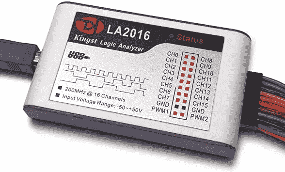

# 如何编写 LCD 驱动程序

> 原文：<https://levelup.gitconnected.com/how-to-write-an-lcd-driver-ccee1c89106c>

## 为 DFR0555 1602 LCD 显示器设置 C 库。

作为一名嵌入式程序员，您通常必须处理各种各样的物理设备，尽管有时您可能会找到可用的库来使用软件驱动它们，但大多数情况下并非如此。根据我的经验，我通常从开源的 Arduino 库开始，但是很快意识到我需要对底层机器有更多的控制，所以我拥抱我的键盘，创建一个。文件，并开始创建我自己的驱动程序。

## *今天我很高兴和你分享一个方法
来为 I2C 设备快速开发极简驱动程序！*

为了使解释更容易理解，我们将利用以下案例研究:让 DFR0555 LCD 显示器与恩智浦的 [FRDM-KL25Z](https://www.nxp.com/design/development-boards/freedom-development-boards/mcu-boards/freedom-development-platform-for-kinetis-kl14-kl15-kl24-kl25-mcus:FRDM-KL25Z) 开发板交互，该开发板基于 ARM Cortex-M0+微控制器，并与许多 Arduino shields 兼容。

## *但是，请注意，这里的讨论非常笼统，可以使用任何潜在的微控制器。*

## 好吧，我们继续吧！

# 第一步:文件和代码

首先，让我们对我们正在处理的设备类型有一个概念。

DFR0555 是一款 16x2 LCD 显示器，集成了背光控制器。
从 DFRobot 网站，我们可以很容易地下载[数据表](https://dfimg.dfrobot.com/nobody/wiki/ee1c5bd150fc6b78f8cb8e8306898ab9.pdf)并发现显示器是基于 [AIP31068L](https://www.newhavendisplay.com/resources_dataFiles/datasheets/LCDs/AiP31068.pdf) 控制器。

也许更有趣的是，DFRobot 还提供了一个 Arduino 库，用于快速连接他们卖给我们的设备。
有人可能会合理地认为 FRDM 板与 Arduino 软件 API 不兼容。但是这里有一个窍门:使用任何与你正在处理的那块有点类似的 Arduino 兼容板，并在那里运行示例代码。

在我的例子中，我使用了 STMicroelectronics 的可爱的 [STM32F401RE](https://www.st.com/en/microcontrollers-microprocessors/stm32f401re.html) 作为开发板来运行 [Blink 示例](https://github.com/DFRobotdl/DFRobot_LCD/blob/master/examples/Blink/Blink.ino)。显然，如果示例代码可以为您的目标编译和运行，您就不需要替代板。

此时，我们可以利用板载调试器来单步调试库代码:通过这种方式，我们可以了解哪些字节通过 I2C 从微控制器发送到 LCD 显示器。
例如，函数*df robot _ rgblcd 1602::init()*启动通信，向地址为0x3e 的从机发送字节 0x80 0x28。

查看数据手册，我们发现以下情况:

1.  0x3e 是 LCD 显示地址
2.  0x28 是代表“功能集:以 2 行模式显示”的命令
3.  在向显示器发送任何命令之前，我们必须发出 0x80 控制字节

AiP31068 数据表，表 3 —指令表

**部分摘要** :
从逻辑上讲，你会在拥有代码之前寻找文档，但通常反过来做更容易。相反，运行示例代码并使用调试器逐句通过库指令。然后利用数据表进行双重检查，看看操作是否一致。

下一步，我们将通过分析数字信号，找出整个通信过程的确切工作原理。

# 第二步:逻辑级分析

使用调试器来分析整个 I2C 通信是乏味的。相反，你最好把大约 10 美元放入逻辑电平分析仪，这样可以节省几个小时的时间:这是一种硬件，能够沿着一根或多根导线对 0 和 1 进行采样。

您可以将该工具连接到 I2C 外设的 SCL 和 SDA 线，并使用 [Pulseview](https://sigrok.org/wiki/PulseView) 检查发生了什么。

逻辑电平分析器

这是我通过运行之前的草图得到的一部分。从时序图中，我可以推断出以下情况:

1.  I2C 大师(即。STM32)开始向从机 0x3e(即 DFR0555)
2.  主机在总线上写入几个字节
3.  从机应答每个字节
4.  通信结束时，主机发出停止条件

Pulseview 的外观— SDA 和 SCL 线连接到 CH0、CH1 (1)，软件解码消息(2)

现在我们有了关于如何从零开始构建 I2C 交易的精确信息。
但是在编写任何库代码之前，让我们手动复制通信
。

# 第三步:I2C 控制台

找到一个现有的，或者实现你自己的最低限度的，用于 I2C 通过 UART 通信的固件:它基本上允许你在串行监视器上键入一串字节，微控制器将通过 I2C 数据总线中继它们。为了简单起见，我把它叫做 *I2C 控制台*。

利用使用逻辑分析器捕获的会话，让我们提取发送到 LCD 模块的所有字节。这里有一个小的回顾。

DFR0555 初始化和字符显示命令

现在，使用 I2C 控制台尝试命令序列。作为一个例子，下面是当我键入命令来显示几个字符时，模块的行为。

使用 I2C 控制台显示“你好！”在液晶屏上

好了，无聊的部分结束了🤓是时候用一些嵌入式编码来弄脏我们的手了！

**边注:** [如果你想获得灵感，这是我为 FRDM 板设计的 I2C 控制台](https://github.com/tontonialberto/arm-programming/tree/main/FRDM-KL25Z/i2c-console)版本。

# 第四步:自动化！

如果您在前面的步骤中使用了所谓的替代电路板，那么现在是时候回到您的实际目标微控制器了。
我不会在这里讨论实现的细节，因为我的架构可能与你的不同。

尽管如此，你可以看看 GitHub 上的[我的代码，这是一个现成的应用程序，它使用 FRDM-KL25Z 板在显示器上写字符。请随意将它作为您项目的灵感！](https://github.com/tontonialberto/arm-programming/tree/main/FRDM-KL25Z/i2c-master-dfr0555)

我用的是普通的 C 语言，代码是用 Keil uv ision 5[开发、编译并上传到主板上的。](https://www2.keil.com/mdk5/uvision/)

# 结论

今天到此为止！我希望你喜欢这次讨论。对于任何反馈，或者如果你有任何不清楚的地方，请随时与我联系。我很乐意澄清😊

非常感谢您的关注。下次见！