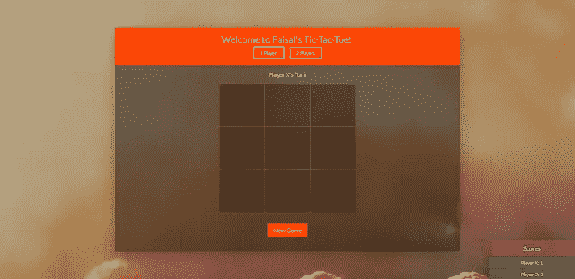
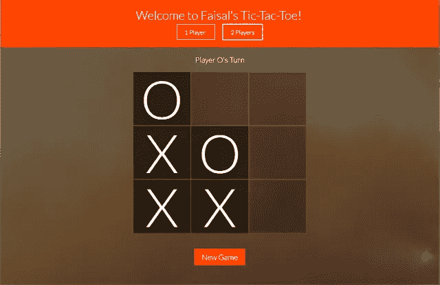
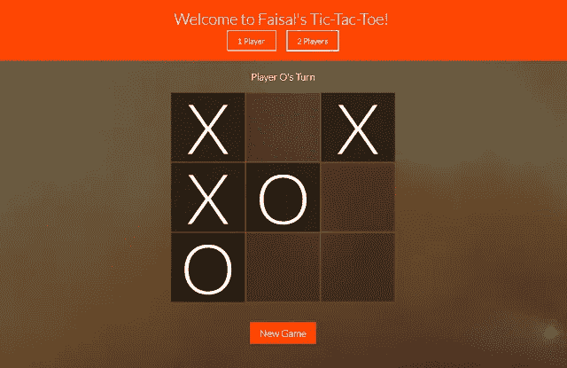
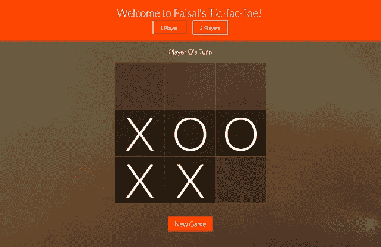
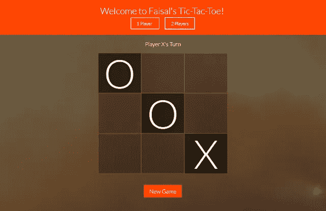
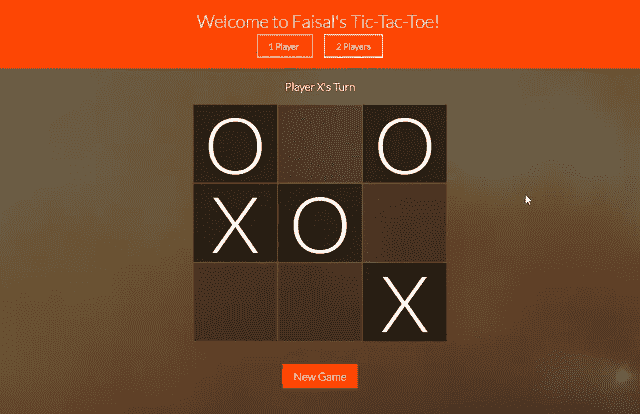

# 如何用 JavaScript 写出无与伦比的井字游戏

> 原文：<https://levelup.gitconnected.com/how-to-write-an-unbeatable-tic-tac-toe-in-javascript-77b9e3176d4a>

*原载于*[*https://faisalrashid . tech/blogs/How-to-Write-a-un make-Tic-Tac-Toe-in-JavaScript*](https://faisalrashid.tech/blogs/How-to-Write-an-Unbeatable-Tic-Tac-Toe-in-JavaScript)

编写小型益智游戏是提高编程技能的好方法，因为这些游戏往往会给你带来一个又一个挑战，迫使你在编写代码时投入大量精力。

经典的井字游戏**就是这样一种游戏。**

在这个关于编写无与伦比的井字游戏的小演练(阅读时间长且描述性的)中，我将使用普通的 JavaScript 实现逻辑，使用 HTML/CSS 实现 UI。我不会太关注它的 UI 部分，因为，咄！

另一个小小的免责声明——我们将主要关注逻辑，代码将排在第二位。同样，如果你想跳过“走一遍”，直接跳到代码，我在 https://github.com/FaisalST32/tic-tac-toe 的 GitHub 上有一个公共库。我在 http://games.faisalrashid.tech/tictactoe/也有游戏的现场版本

所以，让我们开始吧。

首先，你需要创建用户界面。只需使用简单的 HTML 创建 9 个输入框，甚至 div 来保存你的 X 和 O。这些输入框的 id 很重要，因为它们将是我们对 X 和 O 的引用。为了与我们的框的位置保持一致，我给了输入框从“0–0”到“2–2”的 id。可视化:

0–0 0–1 0–2
1–0 1–1 1–2
2–0 2–1 2–2

这将给我们一个易于使用的 3×3 矩阵。你可以随心所欲地设计你的 UI。它应该简单地使用这种形式的可查询 HTML 元素。

下面是我的 UI 截图。简单的盒子加上一点 CSS 的光泽。



现在，逻辑！首先，每当一个用户，或者在这种情况下的一个参与者，点击或者轻击一个空的盒子，这个盒子的值应该改变为 X 或者 O，这取决于轮到谁了。

实现起来很简单。我使用一个全局变量来保存“ **currentPlayer** ”。这个变量的值不是 X 就是 o。然后我简单地写了一个方法来切换当前的玩家，只要一个盒子被点击。我调用方法 **changePlayer** 。

这一切都是从轻点一个盒子开始的。所以，我们需要一个函数来开始。我们编写一个函数，用 X 或 O 标记盒子，并改变播放器。我们在复选框上调用函数**。到目前为止，函数**检查一个盒子**，然后**改变玩家。****

现在，当盒子被点击时，我们需要跟踪选中的盒子。使用数组应该有助于我们完成这项工作。简单地持有所有盒子的 id 是有用的，但是还不够。我们肯定需要持有 id(在这种情况下是坐标)以及勾选方块的玩家。因此，我们的**checked box**数组将是以下形式的对象数组:

```
[{box: '0-1', player: 'X'}, {box: '2-1', player: 'O'}, ...]
```

我们现在有两个全局变量——一个用来保存**当前播放器**，另一个用来保存**选中的盒子**。

我喜欢记录的另一件事是**转数**。我可以从**checked boxes**数组中得到它，但是如果我在操作 **checkedBoxes** 数组，这种方式会更简单，也非常有用。

由于我们将只编写播放器 vs CPU 模式(github repo 包含 1p 和 2p 模式)，这些都是我们将需要的全局变量—**checked box**、 **currentPlayer** 和 **turnCount** 。

注意:将全局变量保持在最低限度，以避免函数中的依赖性和意外行为，这始终是一个好的做法。

我相信我们的 **onCheckBox** 方法现在已经准备好了。这是它看起来的样子

```
*function* onCheckBox(*element*) {
   checkedBoxes.push({ box: element.id, player: currentPlayer });
   checkElement(element);
   turnCount++;
 *var* gameStatus =checkWinner();//Will come to this method in a bit
    switchPlayer();
}*function* checkElement(*element*){
     element.value = currentPlayer;     
     element.disabled ="disabled";
}*function* switchPlayer() {
    currentPlayer = currentPlayer =="X"?"O":"X";
    document.querySelector('.current-player').textContent = currentPlayer;
}
```

我们将被点击的 Html 元素作为参数之一传递给该方法，以访问它的 id 坐标。每次我们检查一个盒子时，我们需要检查是否有一个赢家或者游戏是否平局。

这给我们带来了 **checkWinner** 方法。这种方法只是检查 X 或 O 是否在一条线上(井字游戏的规则)，以确定是否有赢家。建立这样的逻辑并不困难。我们查询**checked box**数组并找到玩家 x 的所有坐标。如果坐标遵循(a-0，a-1，a-2)或(0-a，1-a，2-a)的模式，其中 a = 0 或 1 或 2，那么我们检查一条水平线或垂直线。嗯，对角线有点棘手。对于从右到左的对角线，我们使用(a-a，b-b，c-c ),对于从左到右的对角线，我们使用(0–2，1–1，2–0)。如果我们在 **checkedBox** 矩阵中找到这些图案中的任何一个，那么拥有该图案的“玩家”就是赢家。如果这些模式都不匹配，那么我们只需检查两个玩家中是否有一个勾选了 5 个方格，以确定这是一个平局。

```
*function* checkWinner(*isCheckOnly*=false) {
if (currentPlayer =="X") {
//Get all the boxes marked by Player X
 *var*  xs = checkedBoxes.filter(*item=>* item.player =="X").map(*value=>* {
     return { x: *Number*(value.box.split("-")[0]), y: *Number*(value.box.split("-")[1]) }
});
returncalculateScore(xs);
}
else if (currentPlayer =="O") {
//Get all the boxes marked by Player O
 *var*  os = checkedBoxes.filter(*item=>* item.player =="O").map(*value=>* {
     return { x: *Number*(value.box.split("-")[0]), y: *Number*(value.box.split("-")[1]) }
});
returncalculateScore(os);
}
}*function* calculateScore(*positions*) {
//Check right diagonalif (positions.filter(*i=>* { return i.x == i.y }).length ==3) {
              return'game over';
}//Check Left diagonal
if (positions.filter(*i=>* { return (i.x ==0&& i.y ==2) 
                                    || (i.x ==1&& i.y ==1)
                                    || (i.x ==2&& i.y ==0) }).length ==3) {
                return'game over';
}
//check horizontal match
for (*var* i =0; i <3; i++) {
 *var*  consecutiveHorizontal = positions.filter(*p=>* p.x == i);
  if (consecutiveHorizontal.length ==3) {
       return'game over';
}
//check vertical match
 *var*  consecutiveVertical = positions.filter(*p=>* p.y == i);
  if (consecutiveVertical.length ==3) {
        return'game over';
}
}
//check draw
if (positions.length ==5) {
  return'game drawn';
}
//if none of the conditions match 'game on'
return'game on';
}
```

在这里，我将查找结果的责任委托给 **calculateScore** 方法。这两种方法本质上是将我们上面所说的内容翻译成 JavaScript 代码。这里没什么特别的。

让我们现在尝试一些东西。我们走吧。我相信我们的游戏现在已经准备好处理所有井字游戏的逻辑了。剩下的就是让它不可战胜。为了让游戏无与伦比，我想设置一些基本规则，以避免这篇帖子太长(你在开玩笑，对吧)。CPU 将总是第二个出场，并且主要关注不让对手获胜。因此，我们的 **onCheckBox** 方法将会看到方法 **computerPlays** 为 CPU 的轮次增加。

```
*function* onCheckBox(*element*) {
checkedBoxes.push({ box: element.id, player:
    currentPlayer });
  checkElement(element);
turnCount++;
 *var*
     gameStatus =checkWinner();
  switchPlayer();
  if (turnCount %2==1&&
    gameStatus =='game on'){
    computerPlays();
}
}
```

如你所见， **computerPlays** 方法只有在回合数为奇数时才会被调用，即第 2、第 4、第 6 或第 8 回合，并且如果 **checkWinner** 方法返回的 **gameStatus** 为“游戏进行中”,因为如果游戏已经结束，则没有必要继续游戏。为了理解如何对抗人类的移动，我想出了 5 个例子。这五个案例按其优先顺序排列如下:

1.  先走
2.  让 CPU 赢得游戏的最后一步棋。
3.  允许 CPU 保存游戏的保存动作。
4.  预测会困住 CPU 的移动并避免它。
5.  如果这些都不符合，那就随机行动。

这里是我们的电脑游戏方法的预览。

```
*function* computerPlays() {
 *var* nextBoxCoords;
  if(turnCount ==1){
nextBoxCoords =computeFirstMove();
}
  if (!nextBoxCoords){
nextBoxCoords =computeFinishingMove();
}if (!nextBoxCoords) {
nextBoxCoords =computeSavingMove();
}
  if (!nextBoxCoords)
nextBoxCoords =predictTrappingMove();
  if (!nextBoxCoords) {
nextBoxCoords =computeRandomMove();
}
 *var*  nextBox = document.querySelector(`[id='${nextBoxCoords}']`);
  onCheckBox(nextBox);
}
```

# 1.先走

计算第一步是出于经验，虽然，我可以为它写一个算法。但是为了避免复杂，我只是根据过去的经验。如果是 CPU 的第一步棋，我们需要找到对手下的棋。如果是**中心框**，我们返回一个**角框**。类似地，如果他打了一个**角框**，我们返回一个与其相邻的**边缘框**，最后如果他打了一个**边缘框**，我们返回**中心框**。顺便说一下，1–1 是中心框，0–1，1–0，1–2，2–1 是边缘框，你猜对了，0–0，0–2，2–0，2–2 是角框。

在这里，

```
*function* computeFirstMove(){
 *var*  playedMove = checkedBoxes.map(*b=>* b.box)[0];
 *var* edgeMoves = ['0-1', '1-0', '1-2', '2-1'];
 *var* cornerMoves = ['0-0', '0-2', '2-0', '2-2'];
 *var* centerMove = ['1-1'];
  if(edgeMoves.find(*m=>* m == playedMove))
    returnedgeMoveResponse(playedMove);
  else if(cornerMoves.find(*m=>* m == playedMove))
    return'1-1';
  else if(centerMove.find(*m=>* m == playedMove))
    return cornerMoves[Math.floor(Math.random()*cornerMoves.length)];
}*function* edgeMoveResponse(*playedMove*){
  if(playedMove =='1-2') 
    return'0-2';
  else if (playedMove =="0-1") 
    return"0-0";
  else if (playedMove =="1-0") 
   return"2-0";
  else if(playedMove =='2-1') 
    return'2-0';
}
```

为了避免塞满 **computeFirstMove** 方法，我移出了 **edgeMoveResponse** 方法。现在，我们已经完成了第一步，让我们进入下一步——**computeFinishingMove**。

# 2.让 CPU 赢得游戏的最后一步棋。

如果对手在那里等着我们，我们会优先考虑拿下他。假设我们有以下情况:



因为，轮到 CPU)了，我们肯定要检查右下角的框。这就是我们的 **computeFinishingMove** 方法的用武之地。它简单地遍历所有剩余的框，并逐个检查它们。然后在每次迭代中调用 **checkWinner** 方法，如果有赢家，就将该迭代的盒子作为“ **nextBoxCoords** ”返回给 **computerPlays** 方法。代码如下:

```
*function* computeFinishingMove() {
 *var* remainingMoves =getRemainingMoves();
 *var* finishingMoveCoords;
  for (*var* move of remainingMoves) {
    checkedBoxes.push({ box: move, player: currentPlayer });
 *var*  nextBox = document.querySelector(`[id='${move}']`)
    if (checkWinner() =='game over') {
finishingMoveCoords = move;
      onUncheckBox(nextBox, true);
      break;
}
    onUncheckBox(nextBox, true);
}
  if(finishingMoveCoords){
 *console*.log('Playing Finishing Move')
    return finishingMoveCoords;
}
  else{
    return'';
}
}*function* getRemainingMoves() {
 *var*  allMoves = ['0-0', '0-1', '0-2',
                  '1-0', '1-1', '1-2',
                  '2-0', '2-1', '2-2',]
 *var*  playedMoves = checkedBoxes.map(*b=>* b.box);
  return allMoves.filter(*m=>*!playedMoves.find(*move=>* move == m));
}
*function* onUncheckBox(*element*, *isImplicit*=false) {
checkedBoxes = checkedBoxes.filter(*b=>* b.box != element.id);
  if (!isImplicit) {
element.value ='';
element.removeAttribute("disabled");
turnCount--;
     switchPlayer();
}
}
```

当选中一个框来检查获胜者时，我们必须确保在迭代完成后取消选中该框，以避免 checkedBoxes 数组中的坏数据。就此而言，我们采用上面的 **onUncheckBox** 方法。如果没有“结束移动”可用，我们检查下一个条件— computeSavingMove。

# 3.允许 CPU 保存游戏的保存动作。

考虑以下场景:



这里轮到 CPU)上场了。很明显，在除了中框顶部以外的地方玩会导致游戏在下一回合结束。因此，我们必须明确选中该框。为此，我们编写了一个类似于前面方法的方法，这次我们迭代所有剩余的盒子，在每次迭代中用对手的标记填充它们，然后调用 **checkWinner** 方法。如果它在任何迭代中返回‘游戏结束’,那么这就是我们想要的盒子。这在 JavaScript 中解释为。

```
*function* computeSavingMove() {
 *var* remainingMoves =getRemainingMoves();
  switchPlayer();
 *var* savingMoveCoords;
  for (*var*  move of remainingMoves) {
          checkedBoxes.push({ box: move, player: currentPlayer });
     *    var* nextBox = document.querySelector(`[id='${move}']`)
         if (checkWinner() =='game over') {
                         savingMoveCoords = move;
                         onUncheckBox(nextBox, true);
                         break;
}
    onUncheckBox(nextBox, true);
}
    switchPlayer();
   if(savingMoveCoords){
 *console*.log('Playing Saving Move')
      return savingMoveCoords;
}
}
```

你可能会说这明显违反了 DRY(不要重复自己)原则。但是，有时，为了保持代码的可读性并避免复杂性，您可能希望以后再看。为了确保我在迭代对手的移动并注意 CPU 的，我在迭代 **remainingMoves** 之前调用了 **switchPlayer** 方法。如果剩下的棋都不是拯救棋，那么我们将注意力转向最棘手的情况— **预测陷阱棋**。

# 4.预测会困住 CPU 的移动并避免它。

我喜欢称之为“陷阱移动”，当对手检查一个盒子，让你有两个完成盒子要填，最终导致你输掉游戏。这里有一个截图可以准确地说明这一点:



在图像中，轮到玩家 O，他处于双输局面。如果他过牌 0–0，玩家 X 会过牌 2–2 以赢得游戏，反之亦然。所以，摆脱这种情况的唯一方法就是避免它。这就是我们下一个方法 **predictTrappingMove** 的用武之地。

就执行而言，这种方法并不复杂，但计划需要准确无误。所以，我们要做的是，每当对手下一步棋时，我们就检查下一次他下一步棋的可能性。要做到这一点，我们将不得不一个接一个地检查每一个箱子与我们的举动。在每一个回合，我们都必须检查对手移动的剩余方格。然后，我们检查是否因此产生了不止一个获胜的棋步。我知道，我知道，管他呢，对吧？好的，让我们来分析一下。假设我们处于这种情况:



对手在为 O 而战。例如，如果我下 1–0，对手可以很容易地下 0–2，然后像这样困住我。



因为，没有完成或保存移动可用，我不能检测到这一点。为了检测这个，我必须检查每一个箱子，直到我找到一个安全的。我可以通过首先选中复选框来完成。然后我会在剩下的每一个盒子上玩对手回合。

这样，我就可以判断他的任何一步棋是否会导致陷阱。我的任何一个回合，如果我在任何地方都找不到陷阱移动，将是我的下一个移动。在某些回合中，对手不可能打出所有可用的牌盒，例如，在一个回合中，他必须进行一次豁免。在这种情况下，我不会重复他所有可能的走法，而只是那些挽救的走法。我会假设如果我出一招迫使对手自救，他会尝试自救。好了，这就是如何翻译成 JavaScript 的。

```
*function* predictTrappingMove() {
 *var* checkedBoxesBackup = checkedBoxes.slice();
 *var* remainingMoves =getRemainingMoves();
 *var*  nextMove;
 *var*  moveFound;
  for(*var* move of remainingMoves){
checkedBoxes.push({box: move, player: currentPlayer})
    switchPlayer();
//Check if the opponent needs to play a saving move
 *var* savingMove =  computeSavingMove();
    if(savingMove){
checkedBoxes.push({box: savingMove, player: currentPlayer});
      if(checkTrap() =='no trap'){
checkedBoxes.pop();
        switchPlayer();
nextMove = move;
        break;
}
checkedBoxes.pop();
      switchPlayer();
     continue;
}
//If no saving move is required, check each position  
 else{
     switchPlayer();
     for(*var* opponentMove ofgetRemainingMoves()){
       switchPlayer();
       moveFound =true;
       checkedBoxes.push({box: opponentMove, player: currentPlayer});
       if(checkTrap() =='trapped'){
         moveFound =false;
         checkedBoxes.pop();
         switchPlayer();
         break;
       }
         checkedBoxes.pop();
         switchPlayer();
}
}
checkedBoxes.pop();
    if(moveFound){
nextMove = move;
      break;
}
}checkedBoxes = checkedBoxesBackup;
  return nextMove;
}
*function* checkTrap(){
 *var*  boxes =getRemainingMoves();
 *var* winningMoveCount =0;
  for(*var * freeMove of boxes){
checkedBoxes.push({box: freeMove, player: currentPlayer});
 *var* result = checkWinner(true);
    if(result =='game over')
winningMoveCount++
checkedBoxes.pop();
}
  if(winningMoveCount >1){
    return 'trapped';
}
  else{
    return 'no trap';
}
}
```

这里， **predictTrappingMove** 首先代表我选中一个框。然后，它会检查对手是否需要进行一次豁免来反击。如果是，它将调用 **checkTrap** 方法来查看对手移动时是否创建了多个豁免条件。

如果不是，那就是将被返回并使用的移动。然而，如果不是这样，对手的豁免移动给我们制造了一个陷阱，我们需要向前移动并为自己检查剩余的盒子，然后每次代表对手检查剩余的盒子并每次调用 **checkTrap** 方法。如果任何一个盒子产生了一个“陷阱移动”，我们就避免这个移动，并继续迭代剩余的移动，直到我们找到一个安全的移动。

这可能还是有点令人困惑，但是如果你仔细阅读几遍代码，就会明白了。

# 5.随机移动

我在游戏的第一个版本中编写了**computer and move**来计算如果所有的检查都没有返回一个走法时的走法。然而，现在这并不相关，因为 **checkTrappingMove** 将总是返回一个移动，而不管一切。如果你需要的话，这里还有代码。

```
*function* computeRandomMove() {
 *var*  remainingMoves =getRemainingMoves();
  return remainingMoves[Math.floor(Math.random()*remainingMoves.length)]
}
```

它只是利用 JavaScript 的 **Math.random()** 方法，并基于来自 **remainingMoves** 的方法返回一个盒子。所以，就这样了。你已经准备好创造无与伦比的井字游戏了。你可以继续用同样的原则写你自己的，或者甚至改进这些原则。

你甚至可以试着写一个方法，让**强迫对手移动**，让你的玩家变得更有侵略性。如果你走到这一步，感谢你的耐心。下次见！

*TL；DR 编写代码来创建无与伦比的井字游戏很简单，但重要的是提出逻辑。*

[](https://skilled.dev) [## 编写面试问题

### 掌握编码面试的过程

技术开发](https://skilled.dev)