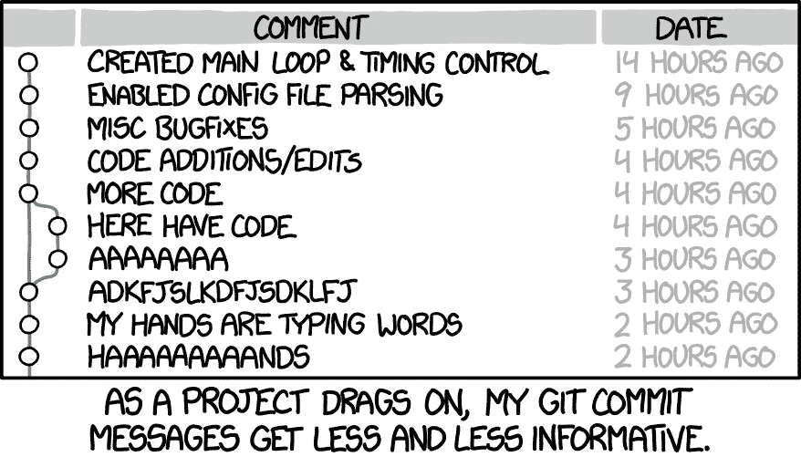

# 如何编写糟糕的提交消息

> 原文：<https://levelup.gitconnected.com/how-to-write-awful-commit-messages-3271bfb750aa>

## 以及如何写出好的文章


由[钱德勒·科勒登](https://unsplash.com/@chanphoto?utm_source=medium&utm_medium=referral)在 [Unsplash](https://unsplash.com?utm_source=medium&utm_medium=referral) 拍摄的照片

你最后一次查看回购的 git 历史是什么时候？现在就用`git log`开始吧。你看到了什么？有意义的提交消息？还是一堆乱七八糟的无益声明？

代码被读取的频率比它被编写的频率更高，提交消息也是如此。从事遗留代码工作的工程师将依赖于来自以前开发人员的提交消息，以获得关于代码为什么以这种方式编写的非常需要的上下文。

因此，让您的提交消息更好。

在本文中，我们将通过研究完全相反的情况——真正糟糕的提交消息，来学习如何编写好的提交消息。

# 含糊的提交消息

```
fixing some stuff
```

酷毙了。那么…你在修什么东西？你为什么要修理它？你想解决什么问题？你最终采取了什么方法，为什么？

我不知道。

# 代码评审反馈提交消息

```
changes based on code review feedback
```

好的。所以我知道这些是一些被请求的变更，它们一定与这个合并请求的早期变更相关。但是，就像我们上一个无用的提交消息一样，你到底做了什么改变？

# 探索性提交消息

```
testing something out
```

干净利落。但是你到底想做什么？是什么促使了这种实验性的变化？你想解决什么问题？你是怎么解决的？您考虑过哪些其他方法，然后决定不采用？

# 良好提交消息的原则

正如你所看到的，这三个例子都有相同的核心问题:它们太模糊了。稍后阅读提交消息的人缺少可能有助于提供关于为什么进行提交的更大上下文的信息。



Git 提交漫画(来源: [xkcd](https://xkcd.com/1296/) )

对于编写标准化的提交消息，有大量的指导方针。我个人喜欢根据[常规提交](https://www.conventionalcommits.org/en/v1.0.0/)规范编写提交，但是你应该找到适合你和你的团队的东西。无论您选择哪种标准，以下原则都是相同的:

*   标准化您的提交消息，以便每个人都以相同的方式格式化他们的提交消息。
*   在提交消息中特别提到您正在处理的文件、包或特性。
*   使用提交消息的正文来添加额外的上下文或原因，说明您为什么要这样做。
*   参考吉拉的问题或任务，或者你的团队正在使用的任何任务管理系统。

在使用传统提交准则的同时应用这些原则，您可以编写如下所示的提交消息:

```
fix: corrects the url on user avatar link in nav barBefore, clicking on the user avatar would take you to the home page rather than the user's profile page. Now it properly takes you to the user's profile page.Closes !123456
```

现在，以后有人看到你的提交，他们就有了理解你的变化所需的所有背景。他们知道你对代码做了什么更改，为什么要这样做，他们可以在吉拉找到问题，查看原始票据上的任何其他对话或注释。

好多了！