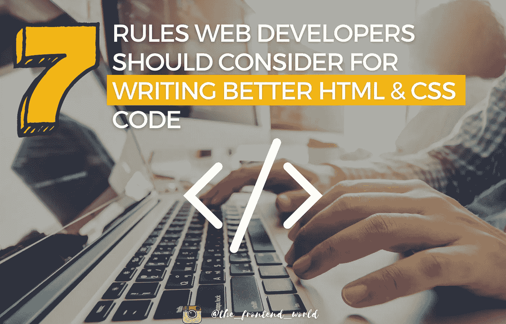
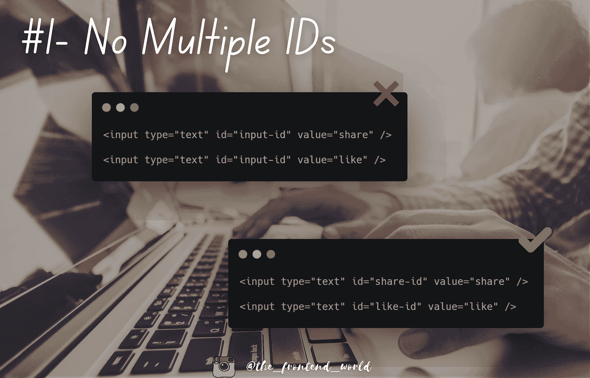
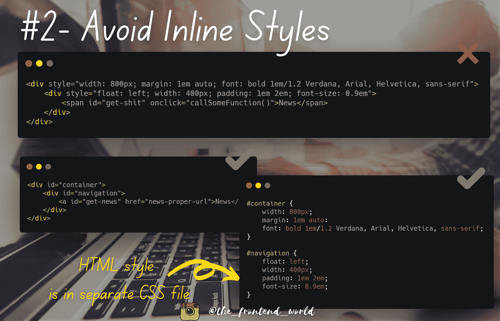
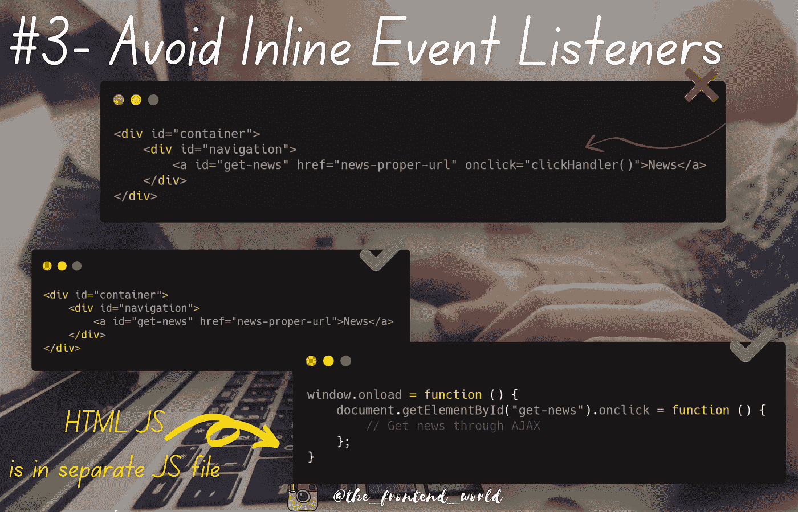
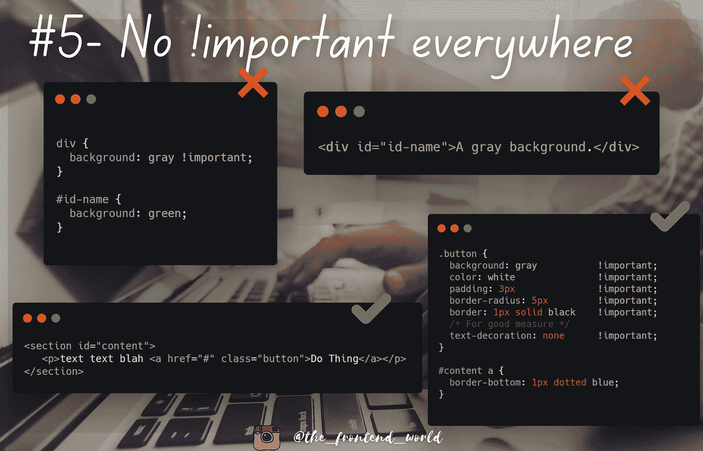

# 如何写出更好的 HTML 和 CSS 代码

> 原文：<https://levelup.gitconnected.com/how-to-write-better-html-and-css-code-479b012daa73>

## 更好的 HTML 和 CSS code⁣的 7 条规则



作者:FAM

我根据我的代码评审经验建立了这个列表，我想与你分享！这篇文章是为初学 web 开发的人写的。尊重这些要点将使你的 HTML 和 CSS 代码干净，专业，并会使你避免一些返回你的合并请求！

准备好了吗？我们进攻吧😈

# #1-没有多重 IDs⁣

> ID 选择器具有更高的特异性，并且必须是网页的唯一 ID。

ID 用于标识 DOM 中的一个且仅一个元素。这意味着您不应该为另一个元素使用相同的 ID。如果是这样的话，这意味着您需要一个 CSS 类来为这两个元素执行您想要的行为。一个类可以被多次使用和重用。



# #2-避免内嵌 Styles⁣

您可以在 HTML 代码中使用内联样式，但这不是一个好的做法，因为内容应该与设计分开，这样当呈现阶段出现问题时，您可以检查内容或设计，这样便于调试。这是维护您的应用程序的最佳方式。



# #3-避免内嵌事件监听器⁣

这又是一个不好的做法。就标记维护的可读性而言，这是一个真正令人头痛的问题，尤其是在较大规模的情况下。一切都很容易变得混乱，让开发人员效率低下，不是因为他们的技能，而是因为他们面临的混乱。

这条规则的另一个重要原因是内联 JavaScript 永远不会像外部 JavaScript 代码文件那样被缓存。所以调试的另一个令人头疼的问题是。这对开发人员的神经和生产力都没有好处。

*   不利于可访问性
*   不利于维护
*   不利于调试
*   对 HTML 文件大小不利

这并不总是适用的，尤其是对于用 Angular、React 和 Vue 等高级前端框架构建的应用。如果您已经在使用这些技术，那么您已经熟悉 JS、HTML 和 CSS，不会有可读性问题，也不会有性能问题。



# #4-不反对 Tags⁣

在 HTML5 之后，有一些标签我们不应该在你的标记中使用。一些例子是:

```
***<acronym>*** : Defines an acronym
***<applet> :*** Defines an applet
***<dir>*** : Defines a directory list
***<big>*** : Defines big text
***<center>*** : Defines centered text
```

下面的页面通过 ***W3 向你展示 HTML4 和 HTML5 的区别。***

 [## HTML5 与 HTML4 的区别

### “HTML5 与 HTML4 的区别”描述了 HTML5 规范与 HTML4 规范的区别。本节…

www.w3.org](http://www.w3.org/TR/html5-diff/#absent-attributes) 

# #5-不！important⁣无处不在

`!important`用于覆盖一个元素的标准样式的特定属性。 ***的大问题！重要的*** 是许多开发人员以懒惰的方式解决问题，通过覆盖给定的风格来解决特定的问题，但是影响整个系统。

如果你有兴趣知道为什么我们的大脑往往倾向于选择懒惰的方式，这里有一篇文章解释了这一点:

[](https://famzil.medium.com/the-way-we-think-define-our-decisions-and-errors-67af892f81b4) [## 我们思考的方式…定义了我们的决定和错误

### 人生是一条漫长的学习之路

famzil.medium.com](https://famzil.medium.com/the-way-we-think-define-our-decisions-and-errors-67af892f81b4) 

让我们看一个具体的例子:

```
// CSS
div { background: gray !important; } #id-name{ background: green; }//HTML
<div id=”id-name”>A gray background.</div>
```

好吧，你解决了你的问题。div 现在有了您想要的灰色背景，尽管 ID 具有更高的特异性，但是`!important`强制您想要的样式，并且它不关心 ID `#id-name`定义的样式。

但是你考虑过整个应用程序吗？你的客户要求整个应用程序都这样吗？如果应用程序变大了，不再需要这种风格了怎么办？当应用程序变得更大时，你可能不会在那里，所以其他开发人员可能会再次陷入同样的困境:

> WTF，为什么我的 DIV 的背景总是灰色的！！！
> 
> 我试试`*!important*`
> 
> 哦，有用。酷，搞定了。

这完全是一个完美的计划来制作一个混乱的应用程序，因为恶性循环开始了，很少结束，因为它需要深刻的改变，而且通常初学者开发者没有足够的勇气说:

> “好吧，背景很容易改变，但有一个深层次的问题来自这种风格从一开始就实施的方式，而不是估计这样做大约 0 点，因为它很容易，估计大约 2 点，以改变整个相关代码，这还不是全部，因为 QA 团队将不得不测试整个应用程序并运行非回归测试”。

**我们该怎么办？根本不用** `**!important**` **？**

当然不是。如果一直存在，说明背后是有原因的。这里有一个`!important`的潜在用例。

假设您有一个 HTML `a`标签，您想将其呈现为一个按钮。首先，你需要一个 CSS 类，比如说`.button`。

```
// CSS
.button {
   background: gray; 
   color: white;
   padding: 3px;
   border-radius: 5px;
   border: 1px solid black;
}// HTML
<a class="button" href="#">Do Thing</a>
```

好了，我们的按钮以正确的方式呈现。后来出现了另一个用例。以下示例显示了另一个选择器，即一个具有更高特异性的 ID。

```
//HTML
<section id="content">
   <p>text text blah <a href="#" class="button">Do Thing</a></p>
</section>//CSS
#content a {
  border-bottom: 1px dotted blue;
}
```

于是 CSS 问题出现了！( [JsFiddle](https://jsfiddle.net/chriscoyier/bPXea/1/) )

在这个用例中使用`!important`是可以理解的，这将使你的`.button` CSS 风格更加健壮。以下是方法:

```
.button {    
background: gray           !important;    
color: white               !important;    
padding: 3px               !important;    
border-radius: 5px         !important;    
border: 1px solid black    !important;     
*/* For good measure */*         
text-decoration: none      !important; 
}
```

另一个用例是将引导类或 UI 框架类覆盖为定制的应用程序样式。

> 在重写一个类的时候要记住一件好事，你应该测试整个应用程序，看看是否一切正常，并确保你没有破坏另一个开发人员的代码。



# #6-尊重 CSS 命名 Convention⁣

我见过带有以下内容的 CSS 代码:

```
bigHeader {
...
}small-header {
...
}
```

这里的良好做法是避免驼峰。这很难读懂，如果你使用的是像 Bootstrap 这样的 CSS 框架，那么类就是 Kebab-case(例如`**form-group**`)。您可以查看本文中 bootstrap 的备忘单，以获得更多灵感和最重要的同构代码。

[](https://javascript.plainenglish.io/8-amazing-cheatsheet-resources-for-web-developers-74a50fde89ba) [## Web 开发人员的 8 大备忘单

### 发现它们，利用它们让你的产量翻倍

javascript.plainenglish.io](https://javascript.plainenglish.io/8-amazing-cheatsheet-resources-for-web-developers-74a50fde89ba) 

> 一个同质的代码证明了一个坚实的和高质量的团队工作。

根据项目规则，您可能有自己的命名约定。你应该跟着他们。重要的规则是，所有开发人员都应该使用应用程序定义的语言、风格和规则。

# #7-使用格式化工具

格式化工具很重要。他们提高了团队开发人员的生产力，避免了浪费时间在 GitLab 中审查与主代码格式不同的代码。

有很多有效的工具可以完成这项任务。你应该设置你将在应用中使用的工具和规则，以便每个开发者都尊重它。StyleLint 可以完成这项工作。

顺便说一下，同样的规则也适用于 JavaScript 代码。例如，你可以使用 [ESLint](https://eslint.org/) 来完成这个任务。

# 尽情享受吧！

亲爱的读者，我希望这是明确和有用的。我希望你和你的家人无论在哪里都安全！坚持住。明天会更好！

**让我们在** [**上联系一下**](https://medium.com/@famzil/)**[**Linkedin**](https://www.linkedin.com/in/fatima-amzil-9031ba95/)**[**脸书**](https://www.facebook.com/The-Front-End-World)**[**insta gram**](https://www.instagram.com/the_frontend_world/)**[**Youtube**](https://www.youtube.com/channel/UCaxr-f9r6P1u7Y7SKFHi12g)**或**********

****[www.fam-front.com](http://www.fam-front.com/)****