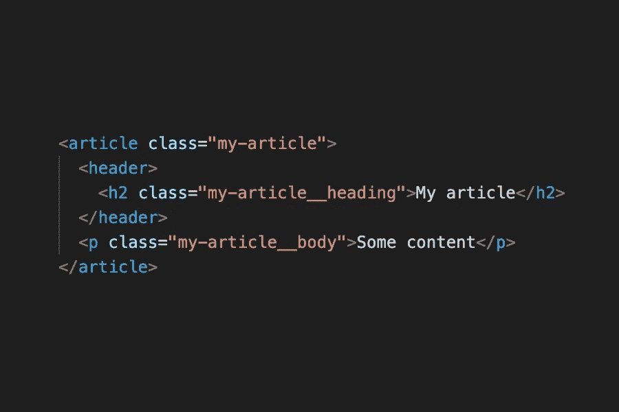

# 如何用 BEM 快速编写防弹 HTML & CSS

> 原文：<https://levelup.gitconnected.com/how-to-write-bullet-proof-html-css-quickly-d03daa12e9bb>

## 使用 BEM 来停止让你的前端标记变成一团乱麻

我写了很多关于 web 开发的东西，但是我并不经常触及这份工作的一些更有限的方面。我忽略的一个领域是 CSS。

CSS 经常作为一个话题被边缘化:后端开发人员不重视它，客户从来没有“看到”它，许多前端开发人员依赖网格系统和 UI 工具包来为他们做许多繁重的工作。

但是在风暴的眼中隐藏着可怕的东西。

很少有什么事情像打开一个新文档，编写 HTML 和样式化它一样让我满意。叫我怪胎，我会举起手来。但是让这部分工作*如此*有价值的是使用一种叫做 BEM 的 CSS 方法…



由作者创建

# 阻止。元素。修饰语。

这就是 BEM 所代表的。它让你能够写出真正伟大的、可重用的、易于理解和维护的 HTML 和 CSS。

事实上，我已经用 BEM 开发了 8 年了。它已经成为第二天性。每次我写一段 HTML，我都是用 BEM 的方式写的。

## 在你的 HTML/CSS 中使用 BEM(不要回头看)

对我来说，BEM 直击良好实践的核心。当建立网站或应用程序时，事情很容易变得混乱。BEM 让你避免这种情况。这里有一个例子:

```
<article class="my-article">
  <header>
    <h2 class="my-article__heading">My article</h2>
  </header>
  <p class="my-article__body">Some content</p>
</article>
```

这里我们有三个类:

*   我的文章
*   我的文章 _ _ 标题
*   我的文章 _ 正文

在 BEM 的世界里，这些意味着:

*   我的——文章是**座**
*   我的文章标题、我的文章正文是**元素**

**块**被称为“my-article ”,包含双下划线的元素是其子元素**。作为一名开发人员，这意味着什么？**

*   您可以快速了解 HTML 块的作用以及元素之间的关系。BEM 是*自文档化的*这样，它不需要描述。
*   您可以很容易地识别相似的 UI 模式并使用相同的类名
*   如果您使用 SASS 或其他预处理程序，在创建样式时，这个块可以整齐地放在它自己的部分中。

使用边界元法是一种将你的工作模块化的方法。其实是一种心态。

## 还有“*修饰词”？*

到目前为止，BEM 对于创建可重用的 HTML/CSS 组件是有用的，但是在现实中，你会想要*修改*那些组件以用于不同的用途。

让我们想象一下，在上面的例子中,“我的文章”是这样设计的:

```
.my-article{
  background-color: red;
  font-size: 24px;
  border: 2px solid orange;
}
```

太好了，这个组件的所有实例现在都是红色的。

但是在建设网站的现实世界中，你可能会有一个与这个非常相似的蓝色组件。回车，修饰符:

```
.my-article--blue{
  background-color: blue;
}
```

我们新的蓝色组件在 HTML 中的标记如下:

```
<article class="my-article **my-article--blue**">
  <header>
    <h2 class="my-article__heading">My article</h2>
  </header>
  <p class="my-article__body">Some content</p>
</article>
```

注意，我们保持块名不变，并且*添加了*修饰符。有*两个*街区班。这样它就可以继承核心样式(字体大小和边框)并被修改器(蓝色背景)覆盖*。*

# 为什么 BEM 很棒

在这篇非常短的文章中，我概述了如何使用 BEM 并宣传了它的好处。这就是我如此喜欢 BEM 的原因:它使用起来非常简单，但功能却非常强大。

想象一个随着时间的推移而增长的大型网站项目。现在，您可以将您的前端代码划分为小的、自我记录的文件，这些文件可以被修改和重用。以这种方式工作鼓励你以模块的方式思考，将视觉设计和构建过程分解成更小的部分。这肯定不仅会加速你的 web 开发过程，而且同时会做更干净、更易管理的工作。快乐的困惑！

[**注册我的简讯获取更多好东西**](https://thebusinessofwebdesign.com/newsletter/)