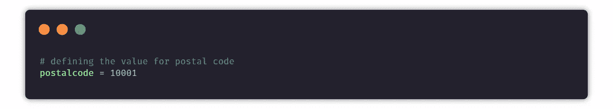
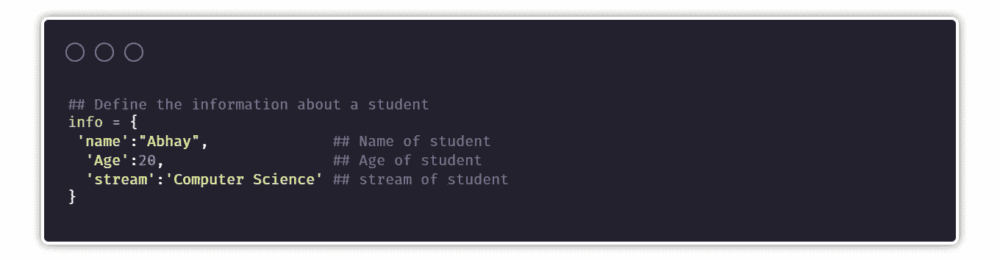
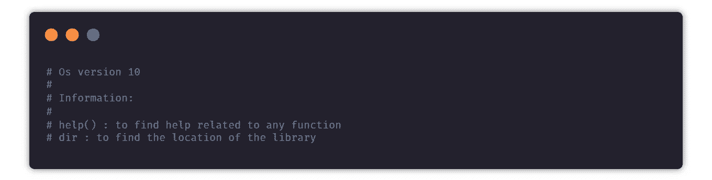
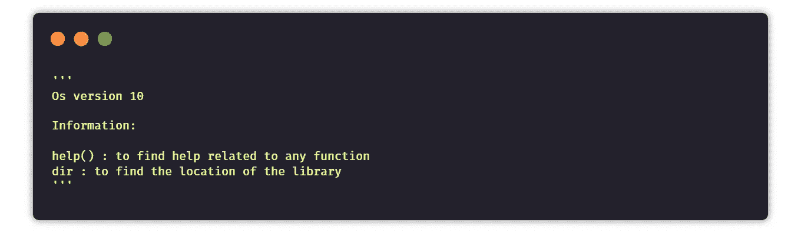
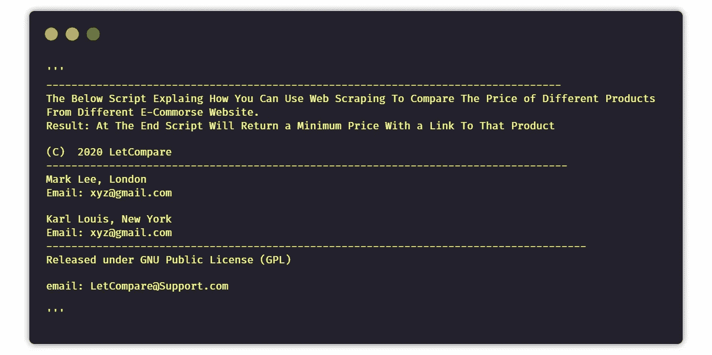
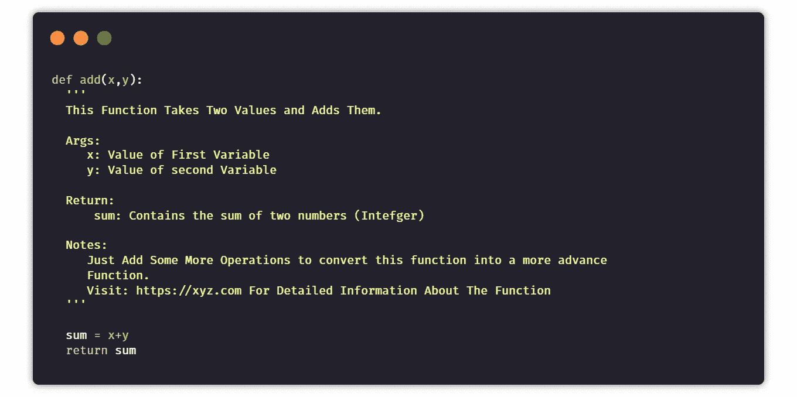

# 如何以正确的方式写评论✔

> 原文：<https://levelup.gitconnected.com/how-to-write-comments-the-right-way-8d13b24804bd>

## 遵循和提高编码水平的最佳实践


编程反映了思维方式，以描述使用计算机解决问题的步骤。评论你的代码有助于再次解释你的思维过程。这有助于他人更好地理解您的代码。注释允许你更容易地调试你的代码。它还提供了在其他程序中重用代码的能力。

# 好的和不好的评论

注释对代码很重要。有时，我们会无意中写下不好的评论或没有用处的评论。示例:

```
num = 10  *##Assigning num a value of 10*
```

现在，让我们来看一个更好的例子，其中包含更有帮助的见解和评论:

```
taxoil = 1.10       *## Defining a 10% tax on oil*
taxcoal = 1.30      *## defining a 30% tax on coal*
```

编写更好注释的最佳实践是**只为那些目的不明显的代码行添加注释**。

# 评论的类型

一个基本的 python 注释以一个`#`开始。解释器不会将`#`后面的字符串视为代码。准确地说，注释可以用三种方式编写——完全在自己的行上，紧挨着代码语句，以及作为多行注释块。

# 单行注释

使用`#`可以完成单行注释，后面是包含该行描述的文本。



你也可以在一些陈述旁边写一个注释。



# 多行注释

多行注释可以通过两种方式完成，一种是使用多个`#`或者使用`""" """`文档字符串。

下面是使用`#`的多个注释的例子



现在让我们看一个使用`""" """`docstring 的多行注释的例子。



# 写评论——如何开始

在程序中以注释开始总是更好的做法。首先包括您正在编写的代码的工作，然后在下一行，写下代码的预期结果。然后写几行关于代码的开发者。写下他们的个人信息和地址或者一些社交链接来联系。然后在下一行，写下你所拥有的任何许可信息，在最后只需添加帮助邮件或联系信息，以便就任何类型的错误联系开发人员。



# 撰写注释—功能

函数是写在主代码之外的一组指令，可以在任何需要的时候使用。函数使用起来非常方便，大多数 python 开发人员更喜欢函数而不是类。在函数里写注释有点不一样。

在第一行中，你需要写一个简短的函数描述。然后在接下来的几行中，提到函数的所有参数。接下来，你应该指定一些关于函数返回类型的信息，在最后，你要为你的读者或未来的你添加一些注释。



> ***感谢阅读😀，关注我获取更多*** [***此处***](https://parasharabhay13.medium.com/)

[](/10-python-tips-for-better-code-1bbffde3b44d) [## 提高代码质量的 10 个 Python 技巧

### 你应该开始养成这种习惯

levelup.gitconnected.com](/10-python-tips-for-better-code-1bbffde3b44d) [](https://medium.com/python-in-plain-english/5-python-features-you-didnt-know-3bcbcfacfea5) [## 你不知道的 5 个 Python 特性

### Python 是编程世界中使用最多的语言之一。它在全球拥有超过 10，000 名开发人员…

medium.com](https://medium.com/python-in-plain-english/5-python-features-you-didnt-know-3bcbcfacfea5) [](/25-useful-python-one-liners-that-you-should-ec613df18260) [## 您应该知道的 25 个有用的 Python 命令行程序

### 这使得 python 不朽

levelup.gitconnected.com](/25-useful-python-one-liners-that-you-should-ec613df18260) [](/20-python-packages-that-you-must-try-a81862c913f6) [## 你必须尝试的 20 个 Python 包

### 这让你的生活更轻松

levelup.gitconnected.com](/20-python-packages-that-you-must-try-a81862c913f6)