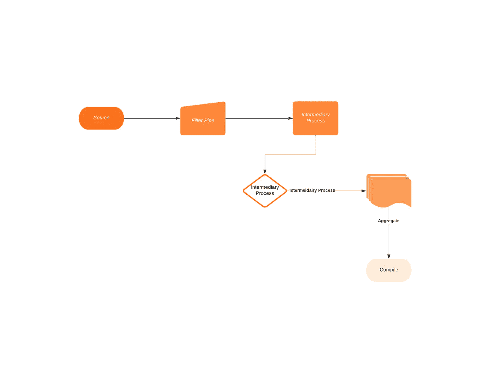

# 如何用 FS2 编写数据处理应用程序

> 原文：<https://levelup.gitconnected.com/how-to-write-data-processing-application-in-fs2-2b6f84e3939c>


在我之前的[文章](https://edward-huang.com/akka/scala/programming/functional-programming/reactive/2020/05/30/how-to-write-a-simple-data-processing-application-with-akka-actors/)中，我讨论了如何用经典的 Akka actors 编写数据处理应用程序。

在本文中，我想换一种方式，使用函数式编程流库 FS2 来处理 CSV 文件中的 HTTP 日志，以获得日志文件中 HTTP 状态的数量。

我发现学习 FS2，总的来说，有点难，尤其是从一个你从未听说过流的背景开始。因此，在我们开始深入代码库之前，我想先定义一个流，以及 FS2 中一些必要的流处理。

注意:我将在下面的代码中对效果类型 cats.effect IO 使用 FS2。如果你有兴趣了解更多关于 cats.effect `IO`的信息，请查看他们的[文档](https://typelevel.org/cats-effect/datatypes/io.html)。

# 什么是溪流？

在维基百科中，Stream 的意思是某种东西的连续流动，从单一来源变成液体、空气或气体。在计算中，它说它在互联网上传输或接收(数据)是一个稳定、连续的流。

我能想到的简单术语是迭代器，但它是类固醇。这意味着您将需要迭代无限数量的容器。在 OOP 中，你可以把它想象成一个迭代器，它将迭代有限或无限数量的数组。当你遍历所有这些元素时，你可以做任何疯狂的事情，并与外界互动。

stream 有很多 List 没有的有用特性。

首先，流中的每一个元素都是延迟求值的，这意味着在编写代码时，它不会被*急切地*调用，直到您命令执行它们。这个特性很重要，因为它支持加载、转换和写入大数据集，而不会破坏堆。

第二，流不会像 List 那样改变数据。如果你想将一个元素`A`映射到一个元素`B`，它不会改变`A`的初始值。如果您在并发环境中操作大数据集和文件，这会很有帮助。

最后，你可以在数据流中做很多操作，比如在中间处理器中把它和另一个数据流结合起来做 IO。

# 基本流操作

FS2 有一个类型:`Stream[F[_], O]`。这意味着你得到了一个发出`O`类型的价值流。`F[_]`是效果型的。效果类型意味着，如果你与外界有某种交互，写数据库或做 IO。通常，这是一个`IO`型。如果你没有任何影响，一个只影响你 CPU 的基本计算往往是`Pure`型。

您可以像编写`List`一样编写一个流:

```
Stream(1,2,3)
```

当您创建上面的`Stream`时，它只创建了一个流的`Pure`类型构造函数。它还没有运行程序；您正在描述您的应用程序。这意味着你需要显式地执行它，要么通过做`Stream(1,2,3).toList`把它转换成一个列表。

# 创建一个有效的流

您可以创建一个包含效果的流并执行它:

```
Stream(1,2,3).covary[IO].compile.toList.unsafeRunSync()
```

上面的代码描述了你将这个流提升到一个`IO`效果类型。然后，您想通过调用`compile`将流执行成一个效果类型。然后，我们通过运行`toList`将效果转换为`List`。到那时，流的性质就是`IO(List(1,2,3))`。我们仍然需要通过运行`unsafeRunSync`来提升 IO，以获得`List(1,2,3)`。

# 资源安全

FS2 提供了`brackets`或`resources`与文件交互。这些类似于 [cats effect](https://typelevel.org/cats-effect/datatypes/resource.html) `IO`，可以分配资源，然后释放资源，而不管分配过程中发生了什么问题。

```
Stream.brackets {
  IO {
    new BufferedReader(new FileReader(new File("yourfile.txt")))
  }
}(f => IO(f.close()))
```

上面的代码描述了如何获取资源并随后释放它们的操作。

# 处理无限流

创造无限量的恒定流`constant`。为了限制`chunks`的数量或价值，我们要从源头上拉起，`take`:

```
Stream.constant(42).take(5).toList
 *// res0: List(42,42,42,42,42)*
```

它将从一个无限纯净的流中获取五种元素，该流发出 42。

# 并行处理

要创建多个并发处理，我们可以使用`parEvalMap(nWorker:Int)(f:A => F[A1])`。对于熟悉 Akka stream `mapAsync`的人也有相同的语法。

它创建`nWorker`线程并处理流。`parEvalMap`将按顺序返回下游。在底层，它使用`fs2.concurrent.Queue`并发执行和维护对下游的请求。

在 FS2 中，您可以使用更多的操作。如果你有兴趣，可以看看这个[指南](https://fs2.io/documentation.html)。

现在，我们可以使用 FS2 处理数据了。

# 思维过程

我们想从`weblog.csv`获取数据。我们对传入的数据进行了净化，过滤掉了所有无效的 IP。然后，我们想把它发送给工人并处理数据，把它转换成一个`Log`实例。最后，我们统计日志中的 HTTP 状态，并将其写入`out.txt`文件。



# 执行

让我们从上到下开始。下面是主要功能:

```
object Main extends IOApp with Processor {

  def run(args: List[String]): IO[ExitCode] = {

    processData("/weblog.csv", "/out.txt", 100).compile.drain.map(_ => ExitCode.Success)
  }
}
```

`processData`将提供一个`source`文件，`/weblog.csv`，而`sink`文件，`/out.txt`带有它将生成的 parallelisms 的数目。然后，在描述了函数`processData`之后，我们将需要通过调用`compile.drain`来执行它。

`drain`从流中删除所有值并执行它。一旦所有的数量都从流中发出，我们将在结果中得到一个单独的`Unit`，因为我们将把它写到`processData`函数中的`out.txt`中。

我们将使用`Stream.resource`来获取和释放资源:

```
Stream.resource(Blocker[IO]).flatMap {  blocker =>
  val inResource = getClass.getResource(in)
  val outResource = getClass.getResource(out)
  io.file
    .readAll[IO](Paths.get(inResource.toURI), blocker, 4096)
    .through(text.utf8Decode)
    .through(text.lines)
    ..... *// our processing logic here*
    .through(text.utf8Encode)
    .through(io.file.writeAll(Paths.get(outResource.toURI), blocker))

}
```

上面的代码创建了一个`inResource and` outResource `to read and write data to the file. It reads the data from the file line by line, by first decoding the bytes to UTF8, and then encoding it again to UTF8 and writes incrementally to` out.txt`。

这是一行日志的样子:

```
10.128.2.1,[29/Nov/2017:06:58:55,GET /login.php HTTP/1.1,200
```

有一个`...`,我们将在思考过程中填写所有的操作。

在此之前，这是每个工人将转换成的`Log`和`Date`模型:

```
case class Log(ip: String, time: Date, url: String, status: String)
  case class Date(year: Int, month: String, date: Int, time: String)
```

# 处理逻辑

## 过滤无效 IP

一旦我们从文件中得到每一行，我们将过滤掉无效的 IP 地址:

```
filter(isValidIp) *// filter out valid IP*
```

`isValidIp`该函数如下所示:

```
def isValidIp(line: String): Boolean = {
    val ipRegex: Regex = """.*?(\d{1,3})\.(\d{1,3})\.(\d{1,3})\.(\d{1,3}).*""".r
    ipRegex.pattern.matcher(line.split(",")(0)).matches()
  }
```

## 向员工发送行

我们将过滤后的每一行发送给工人，这样他们就可以将它们转换成`Log`模型。

```
.parEvalMapUnordered(parallelism)(convertToLog)
```

`convertToLog`该函数如下所示:

```
def convertToLog(line: String): IO[Log] = line.split(",").toList match {
    case ip :: time :: url :: status :: _ =>
      IO(Log(ip, convertToDate(time), url, status))
  }
```

## 计数 HTTP 状态代码

一旦工人完成转换成日志，它将通过折叠阶段。在折叠阶段，我们用`status -> number of status`将 HTTP 状态的数量分组到一个映射中。

```
flatMap { m =>
          Stream.fromIterator[IO](m.keys.map { key =>
            s"Status : ${key} has a total of ${m(key)} amount "
          }.iterator)
        }
```

## 一起

总而言之，如果我们把所有的逻辑放在一起，就会变成这样的东西:

```
io.file
        .readAll[IO](Paths.get(inResource.toURI), blocker, 4096)
        .through(text.utf8Decode)
        .through(text.lines)
        .filter(isValidIp)
        .parEvalMapUnordered(parallelism)(convertToLog)
        .fold(Map.empty[String, Int]) { (map, currLog) =>
          val updatedStatus = map.getOrElse(currLog.status, 0) + 1
          map + (currLog.status -> updatedStatus)
        }
        .flatMap { m =>
          Stream.fromIterator[IO](m.keys.map { key =>
            s"Status : ${key} has a total of ${m(key)} amount "
          }.iterator)
        }
        .through(text.utf8Encode)
        .through(io.file.writeAll(Paths.get(outResource.toURI), blocker))
```

我们也可以在流的外部进行折叠，然后写入`out.txt`文件。从这个意义上说，我们需要为 writeAll 操作获取和释放资源。

# 摘要

在这些文章中，我们会涉及到复杂的流处理库 FS2。

我们讨论什么是流，以及它与列表有何不同。我们还讨论了流的基本操作。然后，我们深入探讨如何用 FS2 创建数据处理应用程序。

这里是完整的源代码[代码](https://github.com/edwardGunawan/Data-Processing/blob/master/dataprocessingfs2/src/main/scala/com/notetoself/example/Processor.scala)。

如果您有兴趣了解有关 FS2 的更多信息，请查看以下资源:

*原载于*[*https://edward-huang.com*](https://edward-huang.com/functional-programming/etl/scala/2020/06/02/how-to-write-data-processing-application-in-fs2/)*。*