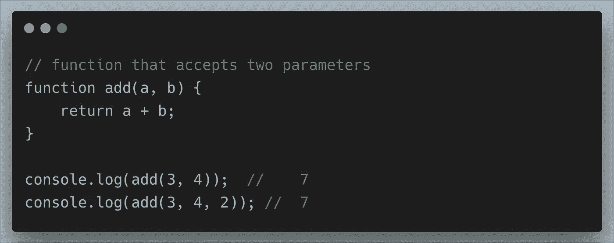
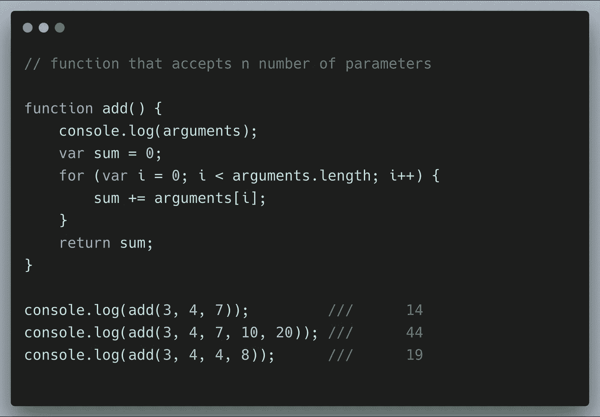
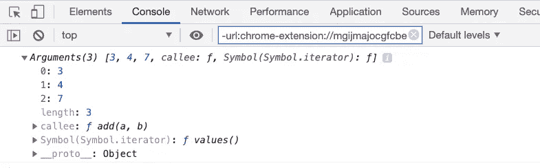
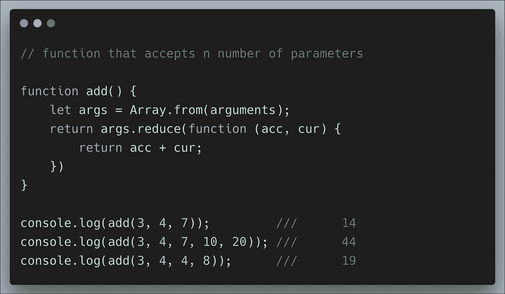
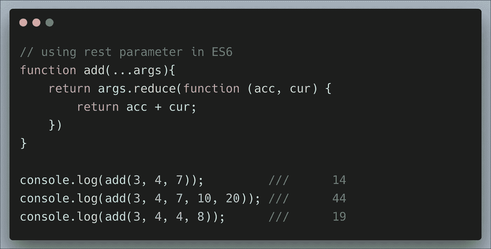

# 如何用 JavaScript 编写一个接受任意数量参数的函数

> 原文：<https://levelup.gitconnected.com/how-to-write-function-with-n-number-of-parameters-in-javascript-a916de1be7a2>

由[拍摄](https://unsplash.com/@headwayio?utm_source=medium&utm_medium=referral)在[上前进](https://unsplash.com?utm_source=medium&utm_medium=referral)

在 JavaScript 中，函数是执行特定任务的代码块。它是一组消除重复的可重用代码。

在 JavaScript 中调用函数时，可以传入任意数量的参数，而不管函数声明指定了什么。没有函数参数限制。

让我们创建一个接受两个参数的函数

在上面的函数中，如果我们传递任意数量的参数，结果总是相同的，因为它只接受前两个参数。

因此，我们需要编写一个函数来接受任意数量的参数。我们可以用两种方式处理它

1.  arguments 对象( **ES5**
2.  其余参数( **ES6** )

## 参数对象(ES5)

在 JavaScript 中，`arguments`是一个本地 Javascript 对象变量，在所有非箭头函数中都可用。`arguments`是一个类似数组的对象，可以在包含传递给函数的参数值的函数内部访问。

让我们创建一个函数，它接受 ES5 中的 **n** 个参数:

上面的截图代表了控制台中的 **arguments** 对象。

由于**参数**对象不是一个数组，在使用`reduce`方法之前，我们首先必须使用`Array.from` 方法将其转换成一个数组。

箭头函数中没有**参数**对象。

## 休息参数(ES6)

**rest 参数**提供了一种更简单、更干净的方式来处理数量不定的参数。让我们用一个 **rest 参数重写上面的例子。**

使用与**扩展操作符**语法相同的 **rest 参数**，我们可以向函数传递数量不定的参数。

**其余参数**和**自变量**对象的主要区别在于:

所有像**映射**、**排序**和**过滤**这样的数组方法都可以直接应用于 rest 参数数组，但不能应用于`arguments`对象。要在`arguments`对象上使用`Array`方法，必须先将其转换成一个实数组。

rest 参数是一种更具声明性的语法，在如何使用函数方面更加简单明了。

**arguments** 对象具有特定于自身的附加功能(如`callee`属性)。

箭头函数中没有**参数**对象。

此处添加了[源代码](https://github.com/jayanthbabu123/function-that-accepts-any-number-of-arguments-javascript)

这就是你需要做的！感谢您的阅读:)

# 分级编码

感谢您成为我们社区的一员！升级正在改变技术招聘。 [**在最好的公司**找到你的完美工作](https://jobs.levelup.dev/talent) **。**

 [## 提升——改变招聘流程

### 🔥让软件工程师找到他们热爱的完美角色🧠寻找人才是最痛苦的部分…

作业. levelup.dev](https://jobs.levelup.dev/talent)