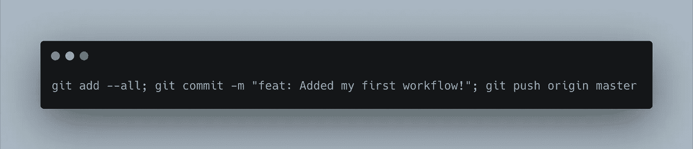
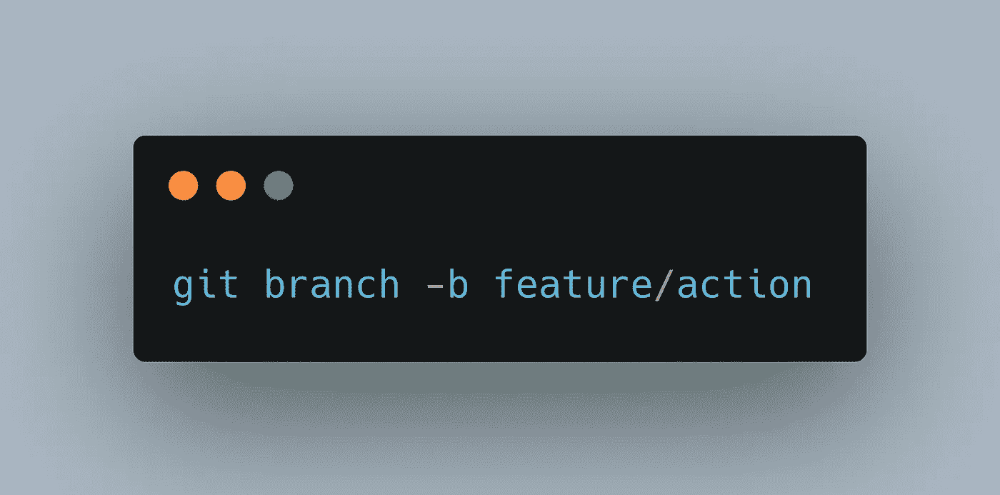

# 如何编写 GitHub 动作

> 原文：<https://levelup.gitconnected.com/how-to-write-github-actions-30b54ddf6f52>

## 用 Python 在 Docker 中编写自定义 GitHub 动作。

你听说过 GitHub 的行动吗？如果不是，那么另一个问题；在提交代码以遵循项目策略之前，您曾经不得不做五个步骤吗？比如运行 linter，运行测试，创建一个包含变更分解的 CHANGELOG，等等。光是列出它们听起来就有很多工作要做。任何开发人员都想做更多的工作，但是，不管怎样，它们都是重要的步骤。它们不是无缘无故放在那里的，它们有助于整个项目管理。

回到主题——GitHub Actions——这是 GitHub 对编程领域日益发展的 DevOps 运动的回应。

去年 11 月，在前 COVID 时代，GitHub 宣布了 GitHub 行动；他们对市场上不断增长的持续集成/持续部署(CI/CD)应用程序和服务的响应。我认为这是一个很好的机会，可以继续留在 GitHub 社区，而不必再次学习一个单独的工具(虽然我尝试过 Travis-CI 和 Circle-CI，但不是最大的粉丝)。

[摘自 GitHub 的动作专题网站:](https://github.com/features/actions)

> GitHub Actions 现在拥有世界一流的 CI/CD，可以轻松实现所有软件工作流程的自动化。直接从 GitHub 构建、测试和部署您的代码。按照您想要的方式进行代码审查、分支管理和问题分类。

GitHub 操作的可能性是无限的:在合并到主分支之前运行 linter 对每个拉取请求运行完整的测试套件；将您发布的版本部署到像 Netlify 这样的提供商；你思考它，你编码它，你拥有它。

目前， [GitHub Marketplace](https://github.com/marketplace?type=actions) 上有 4206 个动作——我记得在 11 月份我被加入测试版时还不到 40 个🤯——而且这个列表还在不断增长(很明显)！我鼓励你尽可能地发挥创造力，拥有你想出的东西！

简要概述一下我们将在这篇文章中讨论的内容:

1.  工作流和操作概念
2.  来自 [GitHub 动作文档](https://help.github.com/en/actions/)的一个简单动作
3.  您自己的自定义操作

[活动创建者](https://unsplash.com/@campaign_creators?utm_source=medium&utm_medium=referral)在 [Unsplash](https://unsplash.com?utm_source=medium&utm_medium=referral) 上拍摄的照片

# 工作流和操作概念

那么，到底什么是行动呢？我们从 GitHub 的片段中讨论了它们是什么，但是坐在电脑前——作为一名程序员，我知道——你必须*看到它。*

在我们谈论行动之前，还有一些其他的核心概念要谈。

## 工作流程

工作流是您编写的描述作业和您想要采取的步骤(操作)的文件。这些文件以`. yml '或`. yaml '格式编写；如果你以前从未使用过，它只是一种简单的人类可读的数据序列化语言。这些工作流文件存储在项目根目录下的`. github `文件夹中。

在您的本地计算机上`/path/to/your/project/。确切地说是 github/workflows。

那么工作流到底是什么样子的呢？

取自文档。

为了更清楚起见，让我们慢慢地浏览一下这个文件。

`name`是要运行的工作流的名称。

`on`是触发时工作流将运行的事件类型。它们可以是 push、pull 和 pull 请求，但是[也可以是更多的](https://help.github.com/en/actions/reference/events-that-trigger-workflows)。

`jobs`是工作流程的最后一块肉。这定义了要运行的作业以及每个作业中要采取的步骤。正如你所看到的，在再次缩进之前，在 jobs 下面有以下标签:`name`、`runs-on`和`steps`。

`runs-on`定义运行作业的操作系统。关于跑步有几个选择，但我认为最重要的是 T7。

`steps`是您希望作业运行的实际 **GitHub 动作**。请记住，这些步骤是连续的(1、2、3……)，但可以有先前的依赖关系。工作流的步骤是我们将要添加自定义操作的地方。

## 行动

动作在工作流文件中被调用，但是实现本身存储在一个单独的 repo 中，或者作为项目中的一个文件夹。动作有各种形状和形式，当您创建自己的动作时，您会看到如何将存储在同一个存储库中的动作用作项目的动作。

由 [David van Dijk](https://unsplash.com/@dvandijk?utm_source=medium&utm_medium=referral) 在 [Unsplash](https://unsplash.com?utm_source=medium&utm_medium=referral) 上拍摄的照片

# 文档中的一个简单动作

让我们继续并开始教程部分。现在我们已经知道了一些关键概念，我们可以更好地理解如何创建一个动作。

## 创建新的回购协议

首先，打开浏览器，进入 [repo.new](https://repo.new) 。我不久前了解到的一个简洁的小链接。

> 也适用于谷歌文档( [docs.new](https://docs.new) ， [sheets.new，](https://sheets.new) [slides.new](https://slides.new) )。

根据您的喜好设置项目。如果您希望以后发布它，它必须是具有唯一名称的公共文件。创建项目后，将其克隆到本地机器上。

在您的计算机上，运行以下命令在根文件夹中设置初始项目文件夹结构:

您知道吗，您可以使用“；”字符串运行单独的命令？

在`greetings.yml`文件中复制并粘贴代码:

文档中的“问候每个人”动作。

添加文件，提交(类似于“feat:添加了我的第一个工作流”)并推送。

使劲推。

这个可以直接上主([还是还“主”](https://www.cnet.com/news/microsofts-github-is-removing-coding-terms-like-master-and-slave/)？)分支，因为它对*所有*推事件都起作用。触发工作流的事件有[多种，您可以查看所有事件的文档。](https://help.github.com/en/actions/reference/events-that-trigger-workflows)

## 查看结果

一旦你创建了一个新的空白回购，添加-提交-推工作流文件；您现在应该能够看到工作流已经运行了！

> *为将来的票据；取决于什么* [*事件*](https://help.github.com/en/actions/reference/events-that-trigger-workflows) *工作流被写入运行，工作流在被推送时可能不会立即运行。*

要检查运行的结果，只需进入你在 GitHub 上做的回购，在顶部栏点击“操作”

调试动作有时可能很糟糕，但是一旦它准备好了并开始工作，它们会节省很多时间！我喜欢在投入生产之前在单独的回购中进行测试。

> 瞧啊。如果一切按计划进行，您已经运行了您的第一个 GitHub 操作，干得好！你可以在这里找到我的问候动作[的源代码](https://github.com/srepollock/github-actions-temporary/commit/d3e08771bd7e0d10c35aaf66af87823cdb392b94)。忽略混乱的历史，因为我把它变成了后续教程的测试运行程序。

Artur Kornakov 在 [Unsplash](https://unsplash.com?utm_source=medium&utm_medium=referral) 上拍摄的照片

# 您的第一个自定义操作

我希望你仍然渴望知识。那是一次很棒的味觉测试，但是现在是时候吃主菜了。让我们继续进行自定义操作。

在我们编码之前，让我们定义保持专注于我们想要创建的东西的需求。该行动应:

*   基于项目的提交历史生成一个`CHANGELOG.md`文件
*   仅在接收请求时运行
*   在拉请求合并到主文件之前添加文件

## 制作 GitHub 动作的方法

根据文档，目前(截至 2020 年 6 月)有两种方法来创建行动[:](https://help.github.com/en/actions/creating-actions)

*   JavaScript (Windows、Linux、MacOS)
*   或者 Docker (Linux)。

我们将着重于创建一个 Docker 动作，因为我相信这是一个创建动作的更好的方法，并且能够用不同的语言创建大量的动作！当我们调用`Dockerfile`中的`ENTRYPOINT`时，你会看到这一点。

让我们继续创建另一个回购。第一个仍然可以工作，([正如你看到的我混乱的历史](https://github.com/srepollock/github-actions-temporary))，但是你可能想把它放到 GitHub 市场上，所以我说，“让我们重新开始”。

## 设置

像以前一样，我们将需要一个工作流文件来运行项目。在与我们之前相同的目录中创建一个(但是对于新项目):

我以前在什么地方见过这个…

如前所述，我们希望它只在对主机的拉请求上运行。这很简单，但这将是一个多任务工作流，该工作流看起来像:

我们的多重工作流程。

这个文件有点难以分解，但是它是如何使用动作 get 和提交文件的。正如您所见，我不会一一介绍，它的结构与`greet-everyone.yaml`工作流相似。然而，主要的区别是这个工作流程有两个任务:`generate`和`upload`。

要了解如何运行该操作，请查看中间的两行:

这将调用根项目中定义的操作。

这是我们的自定义操作的运行方式。`./`表示我们想要使用当前文件夹。无论您的`action.yaml`文件位于何处，它都是您在这里传递的相对文件夹路径。稍后我会详细介绍这个文件，但是要知道，我们正在创建的这个操作的所有文件都应该在根项目文件夹中。

现在我们知道了操作运行的位置，要开始执行这个操作，我们需要创建一些必需的文件。让我们制作`README.md`、`Dockerfile`、`changelog-generator.py`和`action.yml`文件。现在只是一些空白文件，我们稍后会填充它们。

你可以这样做得很快:

赢得胜利的俏皮话。

## Dockerfile 文件

让我们先处理一下`Dockerfile`,因为它将在服务器上运行来运行我们的脚本或动作。

如果你以前从未使用过 Docker，不要担心！我不会涉及所有的细节——这真的应该是它自己的帖子——但我会给你最起码的启动和运行这个行动。

有时候 Docker 真的就是这么简单。

多克到此为止。对于这个自定义操作，我们不需要任何参数，所以就运行文件而言，它非常简单明了。

很快，我们所说的就是设置一个`python3`环境，复制我们将要编写的脚本，然后运行命令`python /changelog_generator.py`。

如果你想知道更多，查看一下 [Docker 文档](https://docs.docker.com/engine/reference/builder/)，因为它非常全面。

## 生成器脚本

现在，我们将继续填写 Python 脚本。这是提交将被收集、解析并写入`CHANGELOG.md`文件的地方。

> 这就是我们一直在等待的发电机。

这个脚本将在几个关键点上发挥作用:

*   从回购中的所有提交中获取信息
*   仅使用带有以下前缀的提交:`feat`、`fix`、`refactor`、`test`、`cli`。同样，从[角度文档](https://github.com/angular/angular.js/blob/master/DEVELOPERS.md#type)
*   给你一张显示关键项目变更的幻灯片`CHANGELOG.md`。

考虑到这几点，代码应该是这样的:

创建重要生产文件的 spicey 脚本。

我们到了。这就是我们所需要的，真的。要对该文件进行逻辑分解，请执行以下操作:

首先，我们调用文件底部的`main()`。这调用了函数`main()`，该函数将`get_commit_log()`的输出收集到`commits`变量中。从那里，`commits`在作为参数传递到`strip_commits()`之前被排序(使用排序函数),然后将过滤后的提交传递回同一个`commits`变量。从那里，提交被传递给`overwrite_changelog()`函数，并以一种良好的格式写入到创建的`CHANGELOG.md`文件中。

## 行动 YAML 描述

现在我们已经有了`Dockerfile`和 Python 脚本设置，我们可以继续定义动作是什么和做什么。动作是在一个`action.yaml`文件中定义的——很容易记住——大概是这样的:

继续根据您的需要更改名称和作者。

实际使用动作的关键在于`outputs`和`runs`。

`outputs`是动作完成并通过后给用户的东西。它可以是多个输出，但是我们只有`changelog`并且它甚至没有被回传；它直接提交给工作流中的项目。

`runs`定义如何运行操作。我们使用 Docker，所以我们只需要这样说，并告诉它`Dockerfile`的位置——这个动作的根。

`action.yaml`文件到此为止。现在我们已经做好了一切准备，可以开始运行项目了。

## 运转

回到需求，我们说过这个动作应该只在对 master 的 pull 请求上运行。既然是这样，让我们来看看一个新的分支:

创建要提交的新分支。然后，我们将从该分支向 GitHub 上的 master 发出一个 pull 请求。

在我们运行动作本身之前，我们必须将它添加到 git 并推送文件以创建一个 pull 请求。那时我们将看到行动开始。继续运行提交。类似“专长:初始动作”的东西

直截了当的承诺。

提交消息语法对项目非常重要。我们正在使用[角度提交消息语法](https://github.com/angular/angular.js/blob/master/DEVELOPERS.md#type)，这就是我们稍后将如何生成我们的变更日志。

既然已经提交了变更，那么就推送变更(`git push origin feature/action`)。您可能会在终端中看到类似这样的内容:

您可以点击项目的链接，或者通过 GitHub web 界面创建一个新的 pull 请求。

提交拉取请求并稍等片刻。既然请求已经发送，您应该在“合并拉取请求”之前看到一个黄色的运行圆圈。这是您在回购上运行的自定义操作！一切就绪后，您会看到一个绿色圆圈出现，“合并拉取请求”按钮也会变成绿色:

抱歉，我在运行测试时忘记了获取屏幕截图！

一旦您合并了项目，您将会看到，每当您在项目上创建一个新的 Pull 请求时，您的定制操作就会运行并收集所有对`CHANGELOG.md`的需求。您还可以从回购中的“Actions”选项卡检查正在运行的操作。

> 恭喜你！

# 结论

在这篇文章中，我们讨论了 GitHub 的动作和一些用例。我们简要地讨论了理解动作和创建动作所必需的一些概念和关键主题。

我们运行了文档中的例子，`greet-everyone`,这给了我们运行动作的体验，然后我们在另一个项目中创建和实现了我们自己的定制动作。

我希望你仍然渴望更多。我希望你继续学习 GitHub 动作，使用市场上的一些动作，或者更好的是，创建你自己的动作并在市场上分享它们！这只是一瞥，但我希望它让你站起来，离开地面。

看完这篇关于行动的帖子后，你现在有什么想法？也许你有一个想法已经有一段时间了，但不知道如何实施。为什么不在这里开始讨论呢？我很乐意帮助你创造更多，我相信其他参与讨论的人也会很乐意帮忙。

感谢你花时间阅读这篇文章，让我对自己有了更多的了解。期待前方的路。

祝一切顺利，保持安全——斯潘塞