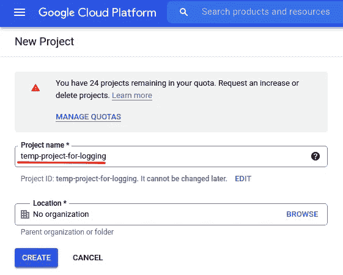
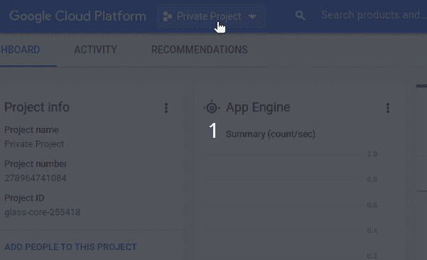
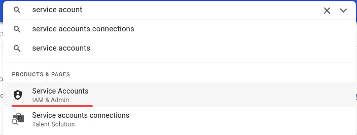
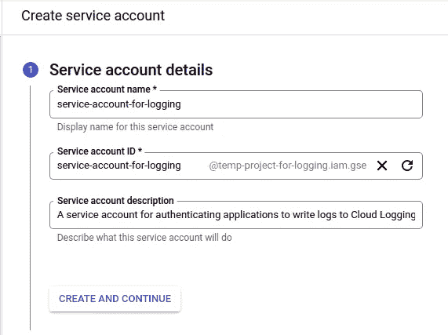
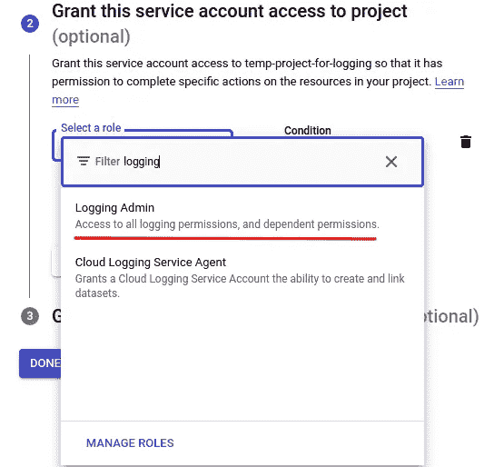
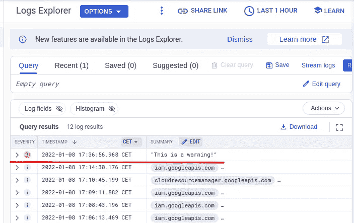
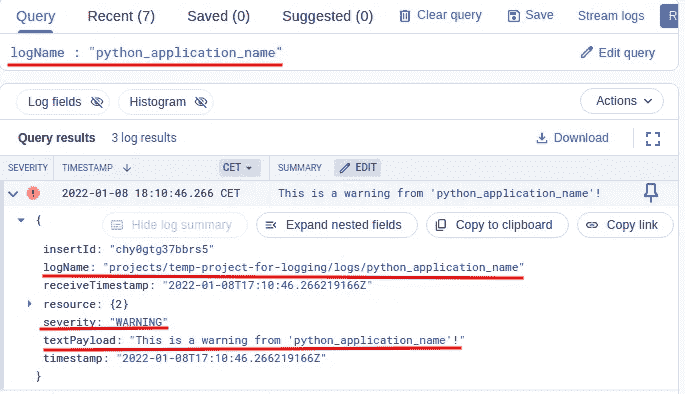
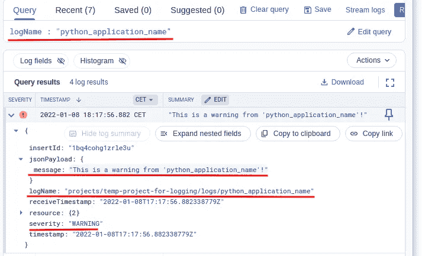
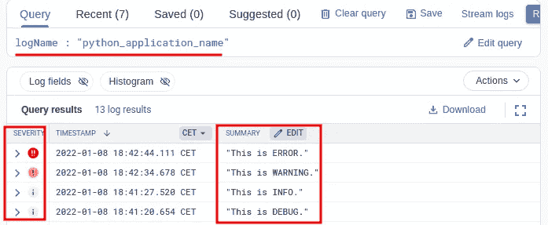
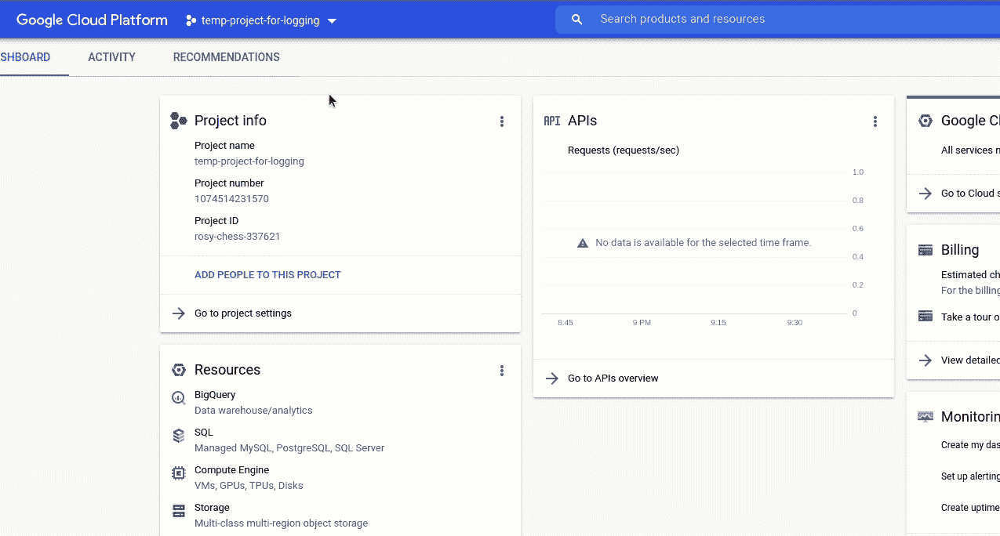

# 如何用 Python 写日志到 Google 云日志

> 原文：<https://levelup.gitconnected.com/how-to-write-logs-to-google-cloud-logging-in-python-46e7b514c60b>

## 将您的 Python 日志集中在云中

您可以从 Python 应用程序中向 Google Cloud Logging 写入日志。如果使用 Python 作为 API 和数据处理的后端语言，将系统相关的日志发送到 Google Cloud Logging 是非常方便的。通过这种方式，您可以集中控制日志，并基于日志创建强大的监控指标，然后可以在可视化应用程序中使用，如 [Grafana](https://grafana.com/) 。在本文中，我们将介绍如何将日志写入 Google Cloud Logging，以及如何在 Logs Explorer 中查看日志。


图片来自 [Pixabay](https://pixabay.com/vectors/logging-log-truck-hauling-logs-36093/) 。

如果您的 Python 应用程序运行在谷歌云平台(GCP)的虚拟机或容器中，通常您不需要进行任何特殊设置，就可以直接将日志写入云日志。这是因为每个虚拟机(或计算引擎)都有一个附加的服务帐户，默认情况下，该帐户可以将日志写入云日志。但是，如果由于某种原因，您的应用程序没有在 GCP 上运行，但仍然需要将日志写入 Google Cloud Logging，您需要在应用程序可以将日志写入 Cloud Logging 之前对其进行身份验证。

在本文中，我们可以创建一个 VM 实例，然后在那里写日志。然而，为了使它更普遍适用，我们将从 GCP 以外的地方，在我们自己的计算机上写日志。我们将创建一个服务帐户，并使用它来认证我们的 Python 应用程序，这只是本文中的一些 Python 代码片段。

为了不产生不必要的费用，出于学习目的，建议每次新建一个项目，完成教程后删除。删除项目时，项目中创建的所有服务都将被删除，因此您不再需要付费。



当创建新项目时，不要忘记选择它并使它成为活动项目。否则，您仍将在原始项目上工作。



然后在搜索栏中搜索“服务帐户”，并在结果列表中选择“服务帐户”。



您现在应该没有服务帐户，请单击“创建服务帐户”来创建一个。您需要给它一个惟一的描述性名称，最好提供一个描述。



单击“创建并继续”。在下一步中，为服务帐户指定适当的角色。因为我们将使用它来验证我们的 Python 应用程序以将日志写入云日志，所以在过滤器中输入“Logging ”,并在结果列表中选择“Logging Admin ”:



点击“完成”,您的服务帐户就准备好了。

现在，我们需要为我们的服务帐户创建一个密钥，以便 Python 应用程序可以使用它。点按服务帐户的名称以打开设置。然后点击“KEYS”= >“ADD KEY”= >“Create new KEY”= >“JSON”创建一个密钥。然后私钥被创建并保存到您的计算机上。请注意，私钥可以在 GCP 上创建服务并产生费用。因此，请妥善保管，切勿与他人分享。实际上，您会看到一个关于服务帐户密钥的警告，警告您不要使用它们。由于我们稍后将删除该项目，因此它对我们来说是安全的。如果您的应用程序在 GCP 上运行，您就不需要创建服务帐户密钥。但是，如果在您的实际情况中确实需要，请确保只为服务帐户提供有限的角色，保证密钥的安全，并且永远不要在公共 Git repo 中公开它们。

既然已经下载了服务帐户密钥，我们就可以用它来认证我们的 Python 应用程序了。有两种方法可以做到。第一个是设置环境变量，另一个是直接在 Python 代码中指定路径。

在我们可以将日志写到 Google Cloud Logging 之前，我们需要为它安装客户端库。建议[创建一个虚拟环境](https://medium.com/codex/how-to-create-virtual-environments-with-venv-and-conda-in-python-31814c0a8ec2)并在那里安装库，这样就不会搞乱系统库。为简单起见，我们将使用[T5【康达】T6](https://medium.com/codex/how-to-create-virtual-environments-with-venv-and-conda-in-python-31814c0a8ec2)来创建虚拟环境。为了更容易地以交互方式运行 Python 代码，我们还将安装 iPython:

```
(base) $ **conda create --name gcp_logging python=3.10**
(base) $ **conda activate gcp_logging**
(gcp_logging) $ **pip install -U google-cloud-logging**
(gcp_logging) $ **pip install ipython**
```

现在让我们为服务帐户密钥设置一个环境变量。这是推荐的方法，因为它使用授予服务帐户的角色来验证所有 gcloud 服务。

环境变量的名称必须是**GOOGLE _ APPLICATION _ CREDENTIALS**，否则它将不起作用。Google SDK 使用这个环境变量进行身份验证。现在让我们尝试将一些内容记录到云日志中。最简单的方法是使用`setup_logging`方法，我们可以使用内置的`logging`库将日志写入云日志:

现在让我们去“日志浏览器”在 GCP，并检查那里的日志。在搜索栏中，输入“logging ”,然后在结果列表中选择“Logging ”,导航到日志浏览器。由于这是一个新项目，并且还没有服务运行，所以不会有太多日志，您刚刚发送的日志将是第一个日志:



但是，如果您没有像本教程中那样创建一个新项目，而是使用一个包含许多服务的现有项目，您可能不会在结果列表中看到该日志。在这种情况下，您可以使用查询表达式来查找它。在“查询”框中，输入以下查询:

```
jsonPayload.message = "This is a warning!"
```

查询表达式的语法很简单。最常用的语法是:

*   日志条目，即“日志浏览器”中显示的日志，是一个 JSON 对象(Python 中的字典)。您可以展开日志条目来查看键和值。嵌套键可以通过一个点获得，如`jsonPayload.message`所示。
*   等号(`=`)用于完全匹配，冒号(`:`)用于部分匹配。
*   默认情况下，没有等号或冒号的查询表达式将根据`message`进行搜索。
*   默认情况下，不同查询表达式的默认逻辑运算符是**和**。如果你想把表达式写得更明确，可以加上**和**。但是，使用**或**操作符时要小心，如果有两个以上的查询表达式，可能需要用括号将查询表达式分组。最后， **NOT** 运算符用于对表达式求反。

在本例中，以下查询表达式都将找到我们的日志:

```
# No equal sign or colon:
"This is a warning!"# With equal sign:
jsonPayload.message = "This is a warning!"# With colon:
jsonPayload.message : "This is"# A more explict one with logical operators:
jsonPayload.message = "This is a warning!"
logName: "python"
```

如您所见，查询表达式非常灵活，您可以通过不同的组合找到您的日志。

正如您已经注意到的，我们编写的日志在日志浏览器中没有明确的日志名称，只有通用名称“python”。这是因为我们使用的是`logging`模块，没有创建日志程序。默认情况下，将使用根日志记录器，这就是为什么我们将 python 视为日志名称。

现在让我们创建一个记录器，并给它一个描述性的名称。如果您想基于日志创建一些指标，这是很重要的。这个话题会有专门的文章。

显然，对于您的实际应用程序，您需要将`python_application_name`改为您实际的 Python 应用程序名称。另外，请注意，这里的记录器不是内置`logging`模块的记录器，而是从 Google 日志客户端创建的。因此，这里的语法是不同的。Google logger 没有`warning`方法，我们需要为不同级别的日志指定*严重性*。对于警告，严重性是字符串`WARNING`。如果不想用神奇的字符串，可以用`google.logging.type`提供的`log_severity_pb2`库来分配严重性。

如果您检查`log_severity_pb2`模块，您会发现严重性级别的一些全局变量:

```
DEFAULT = 0
DEBUG = 100
INFO = 200
NOTICE = 300
WARNING = 400
ERROR = 500
CRITICAL = 600
ALERT = 700
EMERGENCY = 800
```

因此，您也可以使用整数来表示严重性。然而，这不如使用常量名称更具可读性。

让我们使用以下查询表达式检查“日志资源管理器”中的日志:

```
logName : "python_application_name"
```

这里我们需要使用冒号而不是等号，因为真实的日志名还有其他元数据。



另外，请注意，使用`log_text`方法，如上所示，会创建一个`textPayload`。如果我们想创建一个像第一个例子中所示的内置`logging`模块一样的`jsonPayload`，我们可以使用`log_struct`方法:



`log_struct`方法对于记录结构化数据非常有用，结构化数据通常是一个字典。以这种方式记录的`jsonPayload`可以方便地用来创建用于监控目的的指标。

您可能已经注意到，当我们将消息记录到 Google Cloud Logging 时，这些消息不会显示在控制台中。当我们想在本地查看日志时，有时也需要记录到控制台。为了解决这个问题，我们需要为 Google Cloud 日志和本地控制台日志添加日志处理程序。我们需要使用内置的`logging`模块，并将处理程序添加到从它创建的记录器中:

如果我们现在尝试记录一些消息，我们将在控制台和 Google 日志中看到它们:



有趣的是，所有的消息都被发送到 Google Logging，但是只有一部分被打印在控制台中。原因是我们为将消息记录到控制台的流处理程序指定了不同的级别。仅打印高于指定级别的日志。这很有帮助，因为我们不想被控制台中的调试和信息淹没。然而，将它们放在 Google 日志中进行监控是很有帮助的。

如果需要，您可以添加一个文件处理程序来将日志写入文件。您可以并且通常应该为处理程序添加一个格式化程序，以便为日志添加更多的元数据，比如模块名、函数名等。有关`logging`模块基本配置的更多信息，请参考[本文](https://lynn-kwong.medium.com/stop-using-print-in-your-python-code-for-logging-use-the-logging-module-like-a-pro-66fb0427d636)。

完成本教程后，不要忘记删除临时项目，这样您就不会被进一步收费。



相关文章:

*   [停止在 Python 代码中使用 print 进行日志记录，像专家一样使用日志记录模块。](https://lynn-kwong.medium.com/stop-using-print-in-your-python-code-for-logging-use-the-logging-module-like-a-pro-66fb0427d636?source=your_stories_page----------------------------------------)