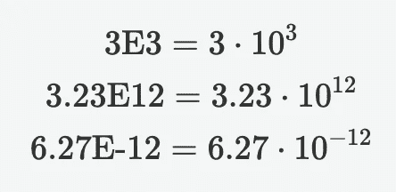

# 用 Python 写数字的 3 种方法

> 原文：<https://levelup.gitconnected.com/how-to-write-numbers-more-clearly-in-python-a3f92b5f8d11>

## 一分钟 Python

由[雅各布·费罗斯](https://medium.com/@dreamferus)使用 Midjourney 生成。

用 Python 写数字有几种不同的方法，在不同的情况下会很有用。

## 标准方式

只需输入号码的所有数字:

## 使用下划线

任何超过一位数的数字都可以在数字之间包含下划线(但不在小数点分隔符旁边)。这有助于提高可读性，例如，这是 1 亿还是 10 亿？前面的数字可以写成:

更清楚了，不是吗？

## 科学符号

对于非常大的数字，科学记数法有助于显示包含了多少位数字，而无需将它们打出来。零多的时候尤其如此。为此，可以在一个数的末尾使用一个后跟整数的`e`或`E`,将该数乘以 10 的 e/E 后的整数次幂。例如:

在 Python 中:

如果您有兴趣阅读更多关于 Python 的文章，请查看我下面的阅读列表:

[雅各布·费罗斯](https://medium.com/@dreamferus?source=post_page-----a3f92b5f8d11--------------------------------)

## 计算机编程语言

[View list](https://medium.com/@dreamferus/list/python-c8e4719d93da?source=post_page-----a3f92b5f8d11--------------------------------)32 stories

如果你想成为中级会员，你可以使用我的推荐链接。祝你有愉快的一天。