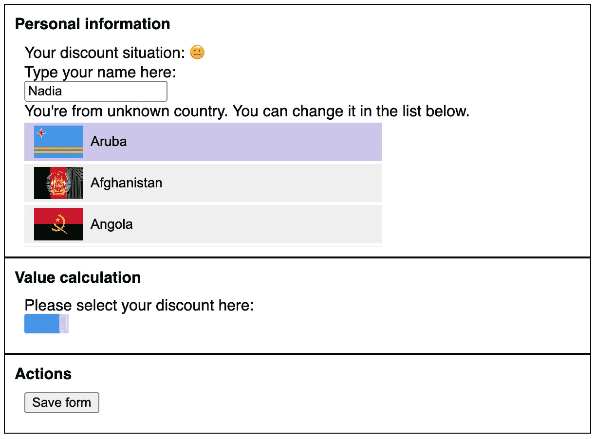
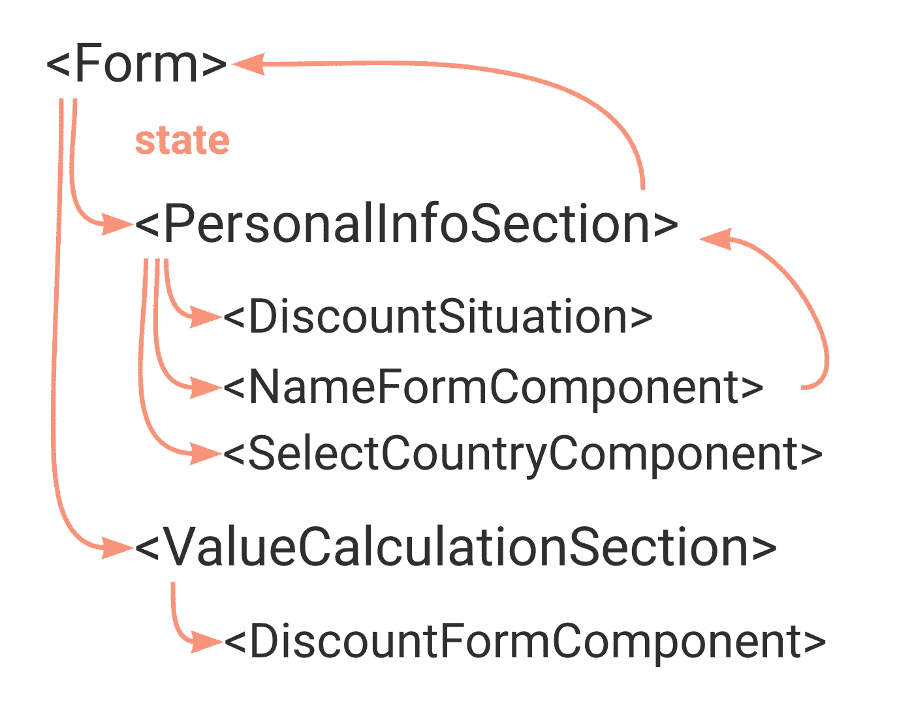
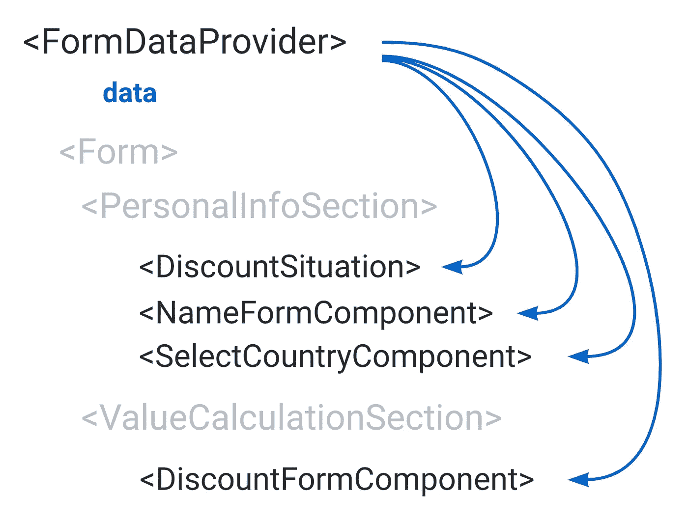
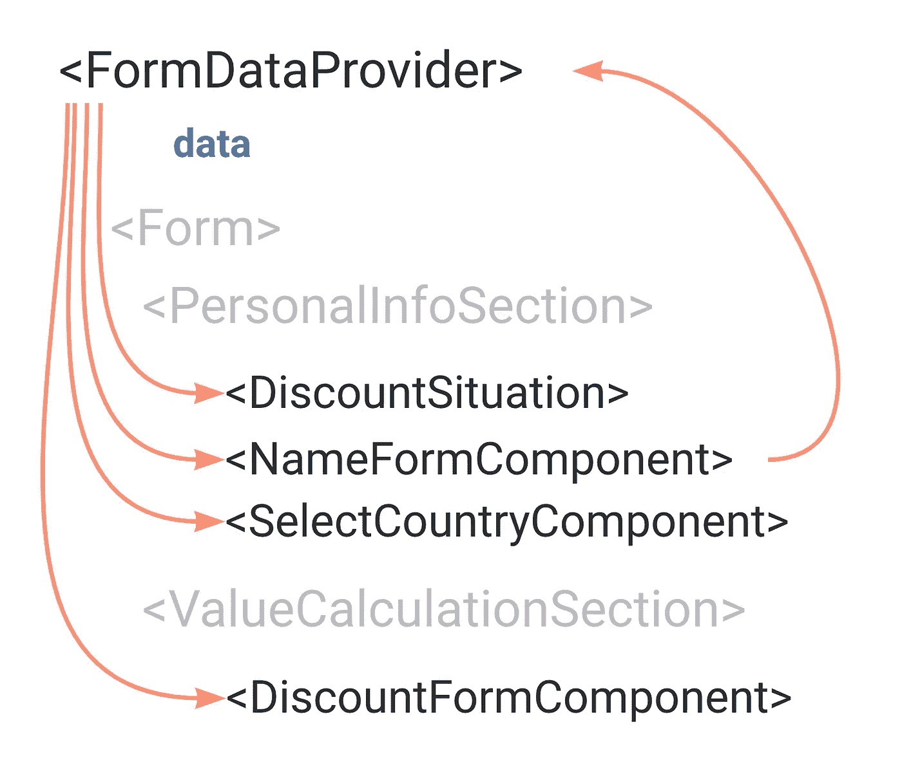

# 如何使用上下文编写高性能的反应应用程序

> 原文：<https://levelup.gitconnected.com/how-to-write-performant-react-apps-with-context-83b27756c6a0>


没有一两篇关于上下文的文章，就不可能有关于[如何编写 performant React 代码](https://www.developerway.com/posts/how-to-write-performant-react-code)的对话。而且是这么有争议的话题！有很多偏见和谣言围绕着它。上下文是邪恶的！使用上下文时，React 会毫无理由地重新渲染所有内容！有时候我觉得开发者把上下文当成了一个神奇的小精灵，随机地、自发地重新渲染整个应用程序来娱乐自己。

在这篇文章中，我不打算说服任何人我们应该抛弃我们钟爱的国家管理库而支持上下文。他们的存在是有原因的。这里的主要目标是消除上下文的神秘感，并提供一些有趣的编码模式，这可以帮助最小化与上下文相关的重新渲染，并提高 React 应用程序的性能。还有一个好处是，代码看起来更干净，更容易理解。

让我们通过实现一些现实生活中的应用程序来开始调查，看看这会把我们带到哪里。

# 让我们在 React 中实现一个表单

我们的形式将会非常复杂，首先，它将包括:

*   “个人信息”部分，人们可以设置一些个人信息，如姓名，电子邮件等
*   一个“价值计算”部分，人们可以设置他们的货币偏好，他们喜欢的折扣，添加一些优惠券等
*   选择的折扣应该以表情符号的形式在个人部分突出显示(不要问，设计师有一种奇怪的幽默感)
*   带有操作按钮的“操作”部分(即“保存”、“重置”等)

“设计”看起来是这样的:



为了让事情变得更有趣，我们还将假装“选择国家”和“拖动栏”组件是我们作为一个包安装的“外部”库。所以我们只能通过 API 来使用它们，而对里面的东西没有任何影响。我们将使用“慢速”版本的国家选择，这是我们在[之前的绩效调查](https://www.developerway.com/posts/how-to-write-performant-react-code)中实施的。

现在是时候写一些代码了。先说 app 的组件结构。我知道这个表单很快会变得非常复杂，所以我想马上把它分成更小、更包容的组件。

在根处，我将拥有我的主`Form`组件，它将呈现三个必需的部分:

```
*const Form = () => {
  return (
    <>
      <PersonalInfoSection />
      <ValueCalculationsSection />
      <ActionsSection />
    </>
  );
};*
```

“个人信息”部分将呈现三个组件:折扣表情符号、姓名输入和国家选择

```
*const PersonalInfoSection = () => {
  return (
    <Section title="Personal information">
      <DiscountSituation />
      <NameFormComponent />
      <SelectCountryFormComponent />
    </Section>
  );
};*
```

它们三个都将包含那些组件的实际逻辑(它们的代码将在下面)，而`Section`只是封装了一些样式。

“价值计算”部分只有一个组件(目前)，折扣栏:

```
*const ValueCalculationSection = () => {
  return (
    <Section title="Value calculation">
      <DiscountFormComponent />
    </Section>
  );
};*
```

“Actions”部分现在也只有一个按钮:带有 onSave 回调的 save 按钮。

```
*const ActionsSection = ({ onSave }: { onSave: () => void }) => {
  return (
    <Section title="Actions">
      <button onClick={onClick}>Save form</button>
    </Section>
  );
};*
```

现在有趣的部分是:我们需要使这个表单具有交互性。考虑到整个表单只有一个“保存”按钮，而且不同的部分需要来自其他部分的数据，状态管理的自然位置是在根，在`Form`组件中。我们将有 3 个数据:姓名、国家和折扣，一个设置这三个数据的方法，以及一个“保存”它的方法:

```
*type State = {
  name: string;
  country: Country;
  discount: number;
};

const Form = () => {
  const [state, setState] = useState<State>(defaultState as State);

  const onSave = () => {
    // send the request to the backend here
  };

  const onDiscountChange = (discount: number) => {
    setState({ ...state, discount });
  };

  const onNameChange = (name: string) => {
    setState({ ...state, name });
  };

  const onCountryChange = (country: Country) => {
    setState({ ...state, country });
  };

  // the rest as before
};*
```

现在我们需要将相关数据和回调传递给需要它的组件。在我们的`PersonalInfoSection`:

*   `DiscountSituation`组件应该能够显示基于`discount`值的表情符号。
*   `NameFormComponent`应该可以控制`name`的值
*   `SelectCountryFormComponent`应能设置所选的`country`

考虑到这些组件没有直接在`Form`中呈现，而是`PersonalInfoSection`的子组件，是时候做一些道具练习了😊

`DiscountSituation`会接受`discount`作为道具:

```
*export const DiscountSituation = ({ discount }: { discount: number }) => {
  // some code to calculate the situation based on discount
  const discountSituation = ...;
  return <div>Your discount situation: {discountSituation}</div>;
};*
```

`NameFormComponent`将接受`name`和`onChange`的回调:

```
*export const NameFormComponent = ({ onChange, name }: { onChange: (val: string) => void; name: string }) => {
  return (
    <div>
      Type your name here: <br />
      <input onChange={() => onChange(e.target.value)} value={name} />
    </div>
  );
};*
```

`SelectCountryFormComponent`将接受`onChange`的回调:

```
*export const SelectCountryFormComponent = ({ onChange }: { onChange: (country: Country) => void }) => {
  return <SelectCountry onChange={onChange} />;
};*
```

我们的`PersonalInfoSection`必须将它们从其父`Form`组件传递给其子组件:

```
*export const PersonalInfoSection = ({
  onNameChange,
  onCountryChange,
  discount,
  name,
}: {
  onNameChange: (name: string) => void;
  onCountryChange: (name: Country) => void;
  discount: number;
  name: string;
}) => {
  return (
    <Section title="Personal information">
      <DiscountSituation discount={discount} />
      <NameFormComponent onChange={onNameChange} name={name} />
      <SelectCountryFormComponent onChange={onCountryChange} />
    </Section>
  );
};*
```

与`ValueCalculationSection`的情况相同；它需要将`onDiscountChange`和`discount`的值从`Form`组件传递给其子组件；

```
*export const ValueCalculationsSection = ({ onDiscountChange }: { onDiscountChange: (val: number) => void }) => {
  console.info('ValueCalculationsSection render');
  return (
    <Section title="Value calculation">
      <DiscountFormComponent onDiscountChange={onDiscountChange} />
    </Section>
  );
};*
```

而`DiscountFormComponent`只是使用“外部”库`DraggingBar`来呈现工具条，并通过它给出的回调来捕捉变化:

```
*export const DiscountFormComponent = ({ onDiscountChange }: { onDiscountChange: (value: number) => void }) => {
  console.info('DiscountFormComponent render');
  return (
    <div>
      Please select your discount here: <br />
      <DraggingBar onChange={(value: number) => onDiscountChange(value)} />
    </div>
  );
};*
```

并且，我们的`Form`组件的渲染看起来像这样:

```
*const Form = () => {
  return (
    <div>
      <PersonalInfoSection onNameChange={onNameChange} onCountryChange={onCountryChange} discount={state.discount} name={state.name} />
      <ValueCalculationsSection onDiscountChange={onDiscountChange} />
      <ActionsSection onSave={onSave} />
    </div>
  );
};*
```

相当多的代码，但最终完成了😅想看看结果吗？[参见 codesandbox。](https://codesandbox.io/s/form-initial-implementation-uxw8v?file=/src/App.tsx)

不幸的是，由几个组件和一个简单的状态组成的结果比您预期的要糟糕得多😕试着在输入中输入你的名字，或者拖动蓝色条——这两种方式即使在快速的笔记本电脑上也会滞后。由于 CPU 节流，它们基本上是不可用的。发生了什么事？

# 前绩效调查

首先，我们来看看那里的控制台输出。如果我在`Name`输入中键入一个键，我会看到:

```
*Form render
PersonalInfoSection render
Section render
Discount situation render
NameFormComponent render
SelectCountryFormComponent render
ValueCalculationsSection render
Section render
DiscountFormComponent render
ActionsSection render
Section render*
```

我们表单中的每一个组件都会在每次击键时重新呈现！拖动也是同样的情况——每移动一次鼠标，整个表单及其所有组件都会重新呈现。我们已经知道，我们的`SelectCountryFormComponent`非常慢，我们对它的性能无能为力。所以我们唯一能做的就是确保它不会在每次按键或鼠标移动时重新呈现。

我们知道，组件会在以下情况下重新呈现:

*   组件的状态已更改
*   父组件重新渲染

这正是这里发生的事情:当输入中的值改变时，我们通过回调链将该值向上传播到根`Form`组件，在那里我们改变根状态，这触发了`Form`组件的重新呈现，然后向下级联到该组件的每个子组件和子组件的子组件(即所有子组件)。



为了解决这个问题，我们当然可以在战略位置撒一些`useMemo`和`useCallback`，然后就到此为止。但这只是掩盖了问题，并没有真正解决问题。当将来我们引入另一个慢组件时，这个故事将会重演。更不用说这会使代码变得更加复杂和难以维护。在理想情况下，当我在`Name`组件中键入一些内容时，我只希望`NameFormComponent`和实际使用`name`值的组件重新呈现，其余的应该只是闲置在那里，等待轮到它们进行交互。

React 实际上给了我们一个完美的工具来做到这一点——`Context`！

# 向表单添加上下文

根据 [React docs](https://reactjs.org/docs/context.html) ，上下文提供了一种通过组件树传递数据的方式，而不必在每一层手动向下传递属性。举例来说，如果我们将表单状态提取到上下文中，我们可以去掉所有我们通过中间部分(如`PersonalInfoSection`)传递的道具，直接在`NameFormComponent`和`DiscountFormComponent`中使用状态。数据流看起来会像这样:



为了实现这一点，首先，我们正在创建`Context`本身，它将拥有我们的状态和管理该状态的 API(即我们的回调):

```
*type State = {
  name: string;
  country: Country;
  discount: number;
};

type Context = {
  state: State;
  onNameChange: (name: string) => void;
  onCountryChange: (name: Country) => void;
  onDiscountChange: (price: number) => void;
  onSave: () => void;
};

const FormContext = createContext<Context>({} as Context);*
```

然后我们应该移动所有的状态逻辑，在`Form`中，在`FormDataProvider`组件中，并将状态和回调附加到新创建的`Context`:

```
*export const FormDataProvider = ({ children }: { children: ReactNode }) => {
  const [state, setState] = useState<State>({} as State);

  const value = useMemo(() => {
    const onSave = () => {
      // send the request to the backend here
    };

    const onDiscountChange = (discount: number) => {
      setState({ ...state, discount });
    };

    const onNameChange = (name: string) => {
      setState({ ...state, name });
    };

    const onCountryChange = (country: Country) => {
      setState({ ...state, country });
    };

    return {
      state,
      onSave,
      onDiscountChange,
      onNameChange,
      onCountryChange,
    };
  }, [state]);

  return <FormContext.Provider value={value}>{children}</FormContext.Provider>;
};*
```

然后公开挂钩，让其他组件使用该上下文，而无需直接访问它:

```
*export const useFormState = () => useContext(FormContext);*
```

并将我们的`Form`组件包装到`FormDataProvider`中:

```
*export default function App() {
  return (
    <FormDataProvider>
      <Form />
    </FormDataProvider>
  );
}*
```

之后，我们可以在整个 app 中去掉**所有的道具**，通过`useFormState` hook 直接在组件中需要的地方使用所需的数据和回调。

例如，我们的根`Form`组件将变成这样:

```
*const Form = () => {
  // no more props anywhere!
  return (
    <div className="App">
      <PersonalInfoSection />
      <ValueCalculationsSection />
      <ActionsSection />
    </div>
  );
};*
```

并且`NameFormComponent`将能够像这样访问所有数据:

```
*export const NameFormComponent = () => {
  // accessing the data directly right where it's needed!
  const { onNameChange, state } = useFormState();

  const onValueChange = (e: ChangeEvent<HTMLInputElement>) => {
    onNameChange(e.target.value);
  };

  return (
    <div>
      Type your name here: <br />
      <input onChange={onValueChange} value={state.name} />
    </div>
  );
};*
```

看看[这个代码沙箱](https://codesandbox.io/s/form-implementation-with-context-2-3wd2i?file=/src/App.tsx)里的完整代码。不要忘了欣赏现在没有到处乱七八糟的道具时看起来有多干净！

# 新形式的表现如何？

从性能的角度来看，我们还没有做到这一点:键入名称和拖动滚动条仍然滞后。但是如果我开始输入`NameFormComponent`，在控制台中我会看到:

```
*Discount situation render
NameFormComponent render
SelectCountryFormComponent render
DiscountFormComponent render
ActionsSection render
Section render*
```

一半的组件现在不重新渲染，包括我们的父组件`Form`。发生这种情况是因为上下文是如何工作的:当一个上下文值改变时，**这个上下文的每个消费者将重新呈现**，不管他们是否使用改变的值。而且，那些被上下文绕过的组件根本不会被重新呈现。我们的重新渲染流现在看起来像这样:



现在，如果我们仔细观察我们的组件实现，特别是`SelectCountryComponent`，它是慢速“外部”组件的包装器，我们会发现它实际上并没有使用`state`本身。它所需要的只是`onCountryChange`的回调:

```
*export const SelectCountryFormComponent = () => {
  const { onCountryChange } = useFormState();
  console.info('SelectCountryFormComponent render');

  return <SelectCountry onChange={onCountryChange} />;
};*
```

这给了我们一个机会来尝试一个非常酷的技巧:我们可以将`state`部分和`API`部分拆分到`FormDataProvider`部分。

# 拆分状态和 API

基本上，我们想要做的是将我们的“整体”状态分解成两个“微观”状态😅。

我们需要两个上下文，一个用于数据，一个用于 API，而不是一个包含所有内容的上下文:

```
*type State = {
  name: string;
  country: Country;
  discount: number;
};

type API = {
  onNameChange: (name: string) => void;
  onCountryChange: (name: Country) => void;
  onDiscountChange: (price: number) => void;
  onSave: () => void;
};

const FormDataContext = createContext<State>({} as State);
const FormAPIContext = createContext<API>({} as API);*
```

在我们的`FormDataProvider`组件中没有一个上下文提供者，而是有两个，在这里我们将状态直接传递给`FormDataContext.Provider`:

```
*const FormDataProvider = () => {
  // state logic

  return (
    <FormAPIContext.Provider value={api}>
      <FormDataContext.Provider value={state}>{children}</FormDataContext.Provider>
    </FormAPIContext.Provider>
  );
};*
```

现在最有趣的部分是`api`值。

如果我们只是让它像以前一样，整个“分解”的想法是行不通的，因为我们仍然必须依赖`state`作为`useMemo`钩子中的一个依赖项:

```
*const api = useMemo(() => {
  const onDiscountChange = (discount: number) => {
    // this is why we still need state here - in order to update it
    setState({ ...state, discount });
  };

  // all other callbacks

  return { onSave, onDiscountChange, onNameChange, onCountryChange };
  // still have state as a dependency
}, [state]);*
```

这将导致`api`值随着每次状态更新而改变，这将导致`FormAPIContext`在每次状态更新时触发重新渲染，这将使我们的分割无效。我们希望我们的`api`保持不变，不管`state`如何，这样这个提供者的消费者就不会重新呈现。

幸运的是，这里我们可以应用另一个巧妙的技巧:我们可以将我们的状态提取到一个 reducer 中，而不是在回调中调用`setState`,我们只是触发一个 reducer 动作。

首先，创建动作和减速器本身:

```
*type Actions =
  | { type: 'updateName'; name: string }
  | { type: 'updateCountry'; country: Country }
  | { type: 'updateDiscount'; discount: number };

const reducer = (state: State, action: Actions): State => {
  switch (action.type) {
    case 'updateName':
      return { ...state, name: action.name };
    case 'updateDiscount':
      return { ...state, discount: action.discount };
    case 'updateCountry':
      return { ...state, country: action.country };
  }
};*
```

用减速器代替`useState`:

```
*export const FormProvider = ({ children }: { children: ReactNode }) => {
  const [state, dispatch] = useReducer(reducer, {} as State);
  // ...
};*
```

并将我们的`api`从`setState`迁移到`dispatch`:

```
*const api = useMemo(() => {
  const onSave = () => {
    // send the request to the backend here
  };

  const onDiscountChange = (discount: number) => {
    dispatch({ type: 'updateDiscount', discount });
  };

  const onNameChange = (name: string) => {
    dispatch({ type: 'updateName', name });
  };

  const onCountryChange = (country: Country) => {
    dispatch({ type: 'updateCountry', country });
  };

  return { onSave, onDiscountChange, onNameChange, onCountryChange };
  // no more dependency on state! The api value will stay the same
}, []);*
```

最后一步:不要忘记将所有使用过`useFormState`的组件迁移到`useFormData`和`useFormAPI`。比如我们的`SelectCountryFormComponent`会从`useFormAPI`钩子使用`onCountryChange`，永远不会在状态改变时重新渲染。

```
*export const SelectCountryFormComponent = () => {
  const { onCountryChange } = useFormAPI();

  return <SelectCountry onChange={onCountryChange} />;
};*
```

看看这个代码沙箱中的完整实现。现在，键入和拖动栏的速度非常快，当我们键入内容时，我们看到的唯一控制台输出是这样的:

```
*Discount situation render
NameFormComponent render*
```

只有两个组件，因为只有这两个组件使用实际的状态数据。🎉

# 进一步分裂状态

现在，有好的设计眼光的人或者只是细心的读者可能会注意到我有一点作弊。我们没有将选择的国家传递给我们的" external" `SelectCountry`组件，它停留在列表的第一项上。实际上，选中的“淡紫色”应该移动到你点击的国家。组件实际上允许我们通过`activeCountry`传递它。从技术上讲，我可以做得很简单:

```
*export const SelectCountryFormComponent = () => {
  const { onCountryChange } = useFormAPI();
  const { country } = useFormData();

  return <SelectCountry onChange={onCountryChange} activeCountry={country} />;
};*
```

但是它有一个问题——只要我在一个组件中使用`useFormData`钩子，它就会随着状态的改变开始重新渲染，就像`NameFormComponent`一样。对我们来说，这意味着我们将回到打字和拖动的落后体验。

但是现在，既然我们已经知道了如何在不同的提供者之间分割数据，那么没有什么可以阻止我们将这一点提升到下一个层次，并且同样分割状态的其余部分。摩尔供应商！😅

对于`State`，我们现在有三个统一的上下文:

```
*const FormNameContext = createContext<State['name']>({} as State['name']);
const FormCountryContext = createContext<State['country']>({} as State['country']);
const FormDiscountContext = createContext<State['discount']>({} as State['discount']);*
```

三个国家供应商:

```
*<FormAPIContext.Provider value={api}>
  <FormNameContext.Provider value={state.name}>
    <FormCountryContext.Provider value={state.country}>
      <FormDiscountContext.Provider value={state.discount}>{children}</FormDiscountContext.Provider>
    </FormCountryContext.Provider>
  </FormNameContext.Provider>
</FormAPIContext.Provider>*
```

和三个钩子来使用状态:

```
*export const useFormName = () => useContext(FormNameContext);
export const useFormCountry = () => useContext(FormCountryContext);
export const useFormDiscount = () => useContext(FormDiscountContext);*
```

现在在我们的`SelectCountryFormComponent`中，我们可以使用`useFormCountry`钩子，除了国家本身之外，它不会在任何变化上重新呈现:

```
*export const SelectCountryFormComponent = () => {
  const { onCountryChange } = useFormAPI();
  const country = useFormCountry();

  return <SelectCountry onChange={onCountryChange} activeCountry={country} />;
};*
```

在 codesandbox 中检查这个[:它仍然很快，并且可以选择国家。当我们在名称输入中键入一些内容时，我们在控制台输出中看到的唯一内容是:](https://codesandbox.io/s/form-implementation-split-api-and-state-0tvq0?file=/src/App.tsx)

```
*NameFormComponent render*
```

# 奖励:外部状态管理

现在，这个表单的状态是否应该马上用一些状态管理库来实现的问题可能会出现在你的脑海中。也许你是对的。毕竟，如果我们仔细观察代码，我们只是重新发明了轮子并实现了一个基本的状态管理库，具有类似选择器的状态功能和改变状态的独立操作。

但是现在你有了一个选择。上下文不再是一个谜，有了这些技术，如果有需要，你可以很容易地编写纯上下文的高性能应用程序，如果你想过渡到任何其他框架，你可以通过对代码进行最小的更改来完成。当你设计你的应用时，状态管理框架**并不重要**。

我们还不如现在就把它移到旧的好的 Redux 上。我们需要做的唯一事情是:去掉上下文和提供者，将 React reducer 转换为 Redux store，并将我们的钩子转换为使用 Redux 选择器和 dispatch。

```
*const store = createStore((state = {}, action) => {
  switch (action.type) {
    case 'updateName':
      return { ...state, name: action.payload };
    case 'updateCountry':
      return { ...state, country: action.payload };
    case 'updateDiscount':
      return { ...state, discount: action.payload };
    default:
      return state;
  }
});

export const FormDataProvider = ({ children }: { children: ReactNode }) => {
  return <Provider store={store}>{children}</Provider>;
};

export const useFormDiscount = () => useSelector((state) => state.discount);
export const useFormCountry = () => useSelector((state) => state.country);
export const useFormName = () => useSelector((state) => state.name);

export const useFormAPI = () => {
  const dispatch = useDispatch();

  return {
    onCountryChange: (value) => {
      dispatch({ type: 'updateCountry', payload: value });
    },
    onDiscountChange: (value) => dispatch({ type: 'updateDiscount', payload: value }),
    onNameChange: (value) => dispatch({ type: 'updateName', payload: value }),
    onSave: () => {},
  };
};*
```

其他一切保持不变，完全按照我们的设计工作。[参见 CodeSandbox。](https://codesandbox.io/s/form-implementation-redux-2-t5w30?file=/src/form-api.tsx)

今天到此为止，希望 now `Context`不是你的应用程序中神秘的自发再现的来源，而是你编写高性能 React 代码✌的坚实工具🏼

*最初发表于*[](https://www.developerway.com/posts/how-to-write-performant-react-apps-with-context)**。网站上有更多这样的文章*😉*

*[*订阅简讯*](https://www.developerway.com/) ，[*在 LinkedIn*](https://www.linkedin.com/in/adevnadia/) *或* [*上关注 Twitter*](https://twitter.com/adevnadia) *以便在下一篇文章出来时立即获得通知。**