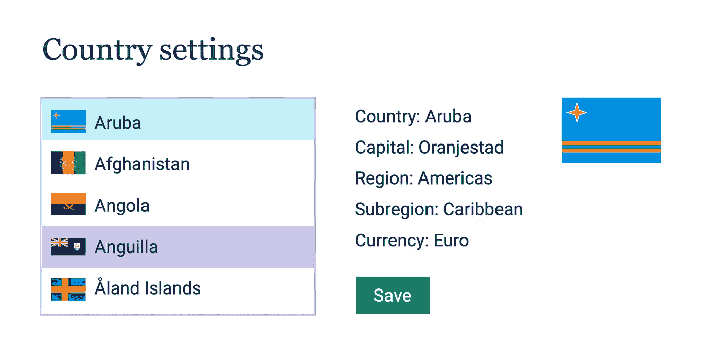
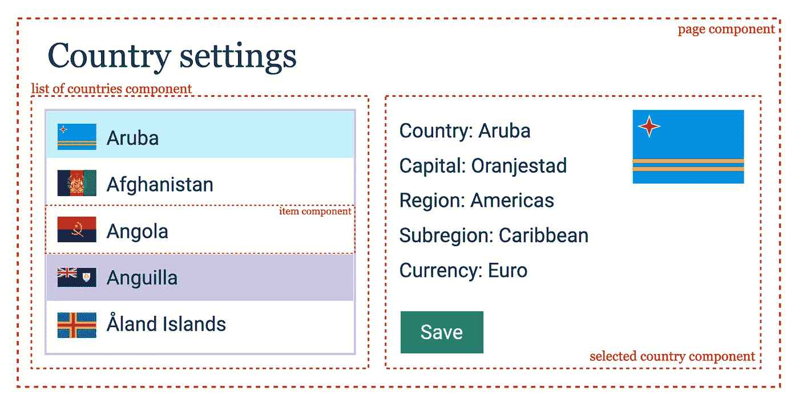
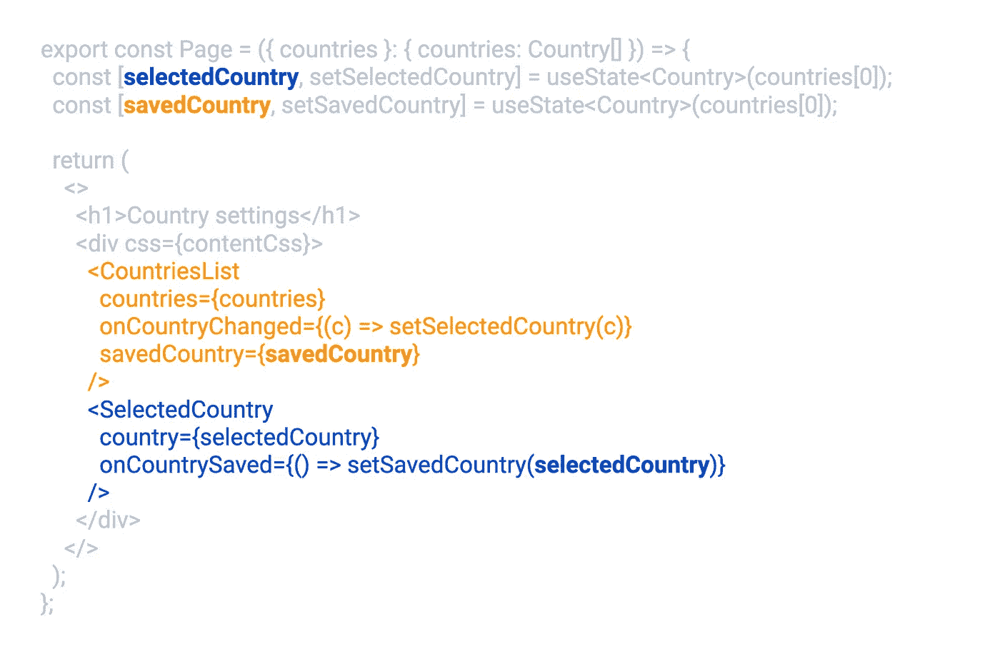

# 如何编写 performant React 代码:规则、模式、该做什么和不该做什么

> 原文：<https://levelup.gitconnected.com/how-to-write-performant-react-code-rules-patterns-dos-and-don-ts-89056af11ede>


性能和反应！如此有趣的话题，却有如此多有争议的观点和如此多的最佳实践，却在短短 6 个月内变成了反面。有没有可能在这里说些明确的话，或者提些笼统的建议？

通常，性能专家是“过早优化是万恶之源”和“度量优先”规则的支持者。大致翻译过来就是“不要修理没有坏的东西”，这一点很难反驳。但是我还是要去😉

我喜欢 React 的一点是，它让实现复杂的 UI 交互变得异常简单。我不喜欢 React 的一点是，它也让我们非常容易犯错误，而这些错误会带来无法立即看到的巨大后果。好消息是，防止这些错误并立即编写大多数情况下都是高性能的代码也非常容易，从而大大减少了调查性能问题所需的时间和精力，因为这样的问题会少得多。基本上，当涉及到反应和性能时，“过早优化”实际上是一件好事，是每个人都应该做的事情😉。你只需要知道一些要注意的模式，就能有意义地做到这一点。

所以这正是我想在这篇文章中证明的😊。我将通过一步一步地实现一个“现实生活”的应用程序来做到这一点，首先以一种“正常”的方式，使用你几乎在任何地方都能看到的模式，并且你自己肯定会多次使用这些模式。然后在考虑性能的情况下重构每一步，从每一步中提炼出一个可以在大多数时候适用于大多数 app 的通用规则。然后最后比较结果。

我们开始吧！

我们将为一个在线商店编写一个“设置”页面(我们在以前的“React 开发人员的高级类型脚本”文章中介绍过)。在该页面上，用户可以从列表中选择一个国家，查看该国家的所有可用信息(如货币、交付方式等)，然后将该国家保存为他们选择的国家。该页面看起来会像这样:



在左侧，我们将有一个国家的列表，有“保存”和“选择”状态，当列表中的一个项目被单击时，在右侧的列中显示详细信息。当按下“保存”按钮时,“选定”的国家/地区变为“已保存”,带有不同的项目颜色。

哦，我们当然希望那里是黑暗模式，毕竟现在是 2022 年！

此外，考虑到 React 中 90%的性能问题可以总结为“太多的重新渲染”，我们将主要关注减少文章中的这些问题。(另外 10%是:“渲染太重”和“需要进一步调查的非常奇怪的东西”。)

# 让我们首先构建我们的应用程序

首先，让我们看看设计，画出想象中的边界，并起草我们未来应用程序的结构，以及我们需要在那里实现哪些组件:

*   一个根“页面”组件，我们在其中处理“提交”逻辑和国家选择逻辑
*   一个“国家列表”组件，将所有国家呈现在一个列表中，并在未来处理像过滤和排序的事情
*   “Item”组件，它将国家呈现在“国家列表”中
*   一个“选择的国家”组件，提供关于选择的国家的详细信息，并有“保存”按钮



当然，这不是实现这个页面的唯一可能的方式，这就是 React 的优点和缺点:任何事情都可以用一百万种方式实现，任何事情都没有正确或错误的答案。但从长远来看，在快速增长或已经很大的应用程序中，有一些模式绝对可以被称为**“永远不要这样做”**或**“这是必须的”**。

让我们看看我们是否能一起解决它们🙂

# 实现页面组件

现在，终于到了动手做一些编码的时候了。让我们从“根”开始，实现页面组件。

首先:我们需要一个具有一些风格的包装器，呈现页面标题，“国家列表”和“选定的国家”组件。

第二:我们的页面应该从某个地方接收国家列表，然后将它传递给`CountriesList`组件，以便它可以呈现这些列表。

第三:我们的页面应该有一个“选定”国家的概念，它将从`CountriesList`组件接收并传递给`SelectedCountry`组件。

最后:我们的页面应该有一个“保存”国家的概念，它将从`SelectedCountry`组件接收并传递给`CountriesList`组件(并在将来发送到后端)。

```
*export const Page = ({ countries }: { countries: Country[] }) => {
  const [selectedCountry, setSelectedCountry] = useState<Country>(countries[0]);
  const [savedCountry, setSavedCountry] = useState<Country>(countries[0]);

  return (
    <>
      <h1>Country settings</h1>
      <div css={contentCss}>
        <CountriesList
          countries={countries}
          onCountryChanged={(c) => setSelectedCountry(c)}
          savedCountry={savedCountry}
        />
        <SelectedCountry
          country={selectedCountry}
          onCountrySaved={() => setSavedCountry(selectedCountry)}
        />
      </div>
    </>
  );
};*
```

这是“页面”组件的完整实现，它是随处可见的最基本的反应，在这个实现中绝对没有任何犯罪行为。除了一件事。好奇，能看到吗？

# 重构页面组件—考虑性能

我想现在大家都知道，当状态或道具改变时，react 会重新渲染组件。在我们的页面组件中，当调用`setSelectedCountry`或`setSavedCountry`时，它会重新呈现。如果我们的页面组件中的国家数组(props)发生变化，它将重新呈现。同样的道理也适用于`CountriesList`和`SelectedCountry`组件——当它们的任何道具改变时，它们会重新渲染。

此外，任何使用过 React 的人都知道 javascript [相等比较](https://developer.mozilla.org/en-US/docs/Web/JavaScript/Equality_comparisons_and_sameness)，React 对 props 进行严格的相等比较，内联函数每次都创造新的值。这导致了一个非常普遍的(而且绝对错误的)想法，为了减少`CountriesList`和`SelectedCountry`组件的重新渲染，我们需要通过在`useCallback`中包装内联函数来避免在每次渲染时重新创建内联函数。甚至 [React docs](https://reactjs.org/docs/hooks-reference.html#usecallback) 在同一句话中提到`useCallback`与“防止不必要的渲染”！看看这个模式是否眼熟:

```
*export const Page = ({ countries }: { countries: Country[] }) => {
  // ... same as before

  const onCountryChanged = useCallback((c) => setSelectedCountry(c), []);
  const onCountrySaved = useCallback(() => setSavedCountry(selectedCountry), []);

  return (
    <>
      ...
        <CountriesList
          onCountryChanged={onCountryChange}
        />
        <SelectedCountry
          onCountrySaved={onCountrySaved}
        />
      ...
    </>
  );
};*
```

你知道最有趣的是什么吗？它实际上**不起作用**。因为它没有考虑 React 组件被重渲染的第三个原因:**父组件被重渲染的时候**。不管是什么道具，`CountriesList`都会在页面重新渲染的时候重新渲染，即使它根本没有任何道具。

我们可以将页面示例简化为:

```
*const CountriesList = () => {
  console.log("Re-render!!!!!");
  return <div>countries list, always re-renders</div>;
};

export const Page = ({ countries }: { countries: Country[] }) => {
  const [counter, setCounter] = useState<number>(1);

  return (
    <>
      <h1>Country settings</h1>
      <button onClick={() => setCounter(counter + 1)}>
        Click here to re-render Countries list (open the console) {counter}
      </button>
      <CountriesList />
    </>
  );
};*
```

而我们每次点击按钮，都会看到`CountriesList`被重新渲染，**即使它根本没有任何道具**。 [Codesandbox 代码在这里](https://codesandbox.io/s/re-renders-simplified-bad-1giei?file=/src/country-settings/page.tsx)。

最后，这让我们巩固了本文的第一条规则:

> **规则 1。如果你想将 props 中的内联函数提取到 useCallback 中的唯一原因是为了避免子组件的重新呈现:不要。它不起作用。**

现在，有几种方法来处理上述情况，我将在这个特殊的场合使用最简单的方法。它所做的是本质上“缓存”你传递给它的任何函数的结果，并且只在`useMemo`的*依赖*改变时刷新它们。如果我只是将渲染后的`CountriesList`提取到一个变量`const list = <ComponentList />;`中，然后对其应用`useMemo`，那么只有当 useMemo 依赖关系改变时，`ComponentList`组件才会被重新渲染**。**

```
*export const Page = ({ countries }: { countries: Country[] }) => {
  const [counter, setCounter] = useState<number>(1);

  const list = useMemo(() => {
    return <CountriesList />;
  }, []);

  return (
    <>
      <h1>Country settings</h1>
      <button onClick={() => setCounter(counter + 1)}>
        Click here to re-render Countries list (open the console) {counter}
      </button>
      {list}
    </>
  );
};*
```

在本例中是 never，因为它没有任何依赖关系。这种模式基本上允许我打破这种“父元素重新渲染—重新渲染所有子元素”的循环，并控制它。查看 codesandbox 中的[完整示例。](https://codesandbox.io/s/re-renders-simplified-memo-xcv5f?file=/src/country-settings/page.tsx)

需要注意的最重要的事情是`useMemo`的依赖列表。如果它依赖于导致父组件重新渲染的完全相同的东西，那么它将在每次重新渲染时刷新其缓存，并且基本上变得无用。例如，在这个简化的例子中，如果我将`counter`值作为依赖项传递给`list`变量(注意:甚至不是 memoised 组件的属性！)，这将导致`useMemo`在每次状态改变时刷新自己，并将使`CountriesList`再次重新渲染。

```
*const list = useMemo(() => {
  return (
    <>
      {counter}
      <CountriesList />
    </>
  );
}, [counter]);*
```

[参见 codesandbox 示例。](https://codesandbox.io/s/re-renders-simplified-memo-with-dep-9h433?file=/src/country-settings/page.tsx:363-491)

好的，所有这些都很棒，但是如何才能将它应用到我们的非简化页面组件中呢？如果我们再次仔细观察它的实现

```
*export const Page = ({ countries }: { countries: Country[] }) => {
  const [selectedCountry, setSelectedCountry] = useState<Country>(countries[0]);
  const [savedCountry, setSavedCountry] = useState<Country>(countries[0]);

  return (
    <>
      <h1>Country settings</h1>
      <div css={contentCss}>
        <CountriesList
          countries={countries}
          onCountryChanged={(c) => setSelectedCountry(c)}
          savedCountry={savedCountry}
        />
        <SelectedCountry
          country={selectedCountry}
          onCountrySaved={() => setSavedCountry(selectedCountry)}
        />
      </div>
    </>
  );
};*
```

我们会看到:

*   `selectedCountry`状态从不用于`CountriesList`组件
*   `savedCountry`状态从不用于`SelectedCountry`组件



也就是说当`selectedCountry`状态改变时，`CountriesList`组件根本不需要重新渲染！而同样的故事还有着`savedCountry`的状态和`SelectedCountry`的成分。我可以将它们都提取到变量中，并对它们进行优化，以防止不必要的重新渲染:

```
*export const Page = ({ countries }: { countries: Country[] }) => {
  const [selectedCountry, setSelectedCountry] = useState<Country>(countries[0]);
  const [savedCountry, setSavedCountry] = useState<Country>(countries[0]);

  const list = useMemo(() => {
    return (
      <CountriesList
        countries={countries}
        onCountryChanged={(c) => setSelectedCountry(c)}
        savedCountry={savedCountry}
      />
    );
  }, [savedCountry, countries]);

  const selected = useMemo(() => {
    return (
      <SelectedCountry
        country={selectedCountry}
        onCountrySaved={() => setSavedCountry(selectedCountry)}
      />
    );
  }, [selectedCountry]);

  return (
    <>
      <h1>Country settings</h1>
      <div css={contentCss}>
        {list}
        {selected}
      </div>
    </>
  );
};*
```

最后，让我们正式确定本文的第二条规则:

> **规则#2** 。如果您的组件管理状态，请找到渲染树中不依赖于已更改状态的部分，并对它们进行优化，以最小化它们的重新渲染。

# 实施国家清单

现在，我们的页面组件已经准备就绪，是时候充实它的子组件了。首先，让我们实现复杂的组件:`CountriesList`。我们已经知道，这个组件应该接受国家列表，当在列表中选择一个国家时应该触发`onCountryChanged`回调，并且应该根据设计将`savedCountry`突出显示为不同的颜色。所以让我们从最简单的方法开始:

```
*type CountriesListProps = {
  countries: Country[];
  onCountryChanged: (country: Country) => void;
  savedCountry: Country;
};

export const CountriesList = ({
  countries,
  onCountryChanged,
  savedCountry
}: CountriesListProps) => {
  const Item = ({ country }: { country: Country }) => {
    // different className based on whether this item is "saved" or not
    const className = savedCountry.id === country.id ? "country-item saved" : "country-item";

    // when the item is clicked - trigger the callback from props with the correct country in the arguments
    const onItemClick = () => onCountryChanged(country);
    return (
      <button className={className} onClick={onItemClick}>
        
        <span>{country.name}</span>
      </button>
    );
  };

  return (
    <div>
      {countries.map((country) => (
        <Item country={country} key={country.id} />
      ))}
    </div>
  );
};*
```

再说一遍，最简单的组件，实际上只发生了两件事:

*   我们根据收到的道具生成`Item`(这取决于`onCountryChanged`和`savedCountry`)
*   我们在一个循环中为所有国家渲染这个`Item`

再说一次，这种*本身并没有什么犯罪的成分，我已经看到这种模式在很多地方被使用。*

# 重构国家列表组件—考虑性能

又到了更新 React 如何渲染事物的知识的时候了，这次——如果一个组件，比如上面的`Item`组件，在另一个组件渲染期间被创建*，会发生什么？简而言之，没什么好的，真的。从 React 的角度来看，这个`Item`只是一个在每次渲染时都是新的函数，它在每次渲染时都返回一个新的结果。因此，它将在**每次渲染**时从头开始重新创建该函数的结果，也就是说，它只会将之前的组件状态与当前状态进行比较，就像正常重新渲染时发生的一样。它将删除以前生成的组件，包括它的 DOM 树，将它从页面中删除，并生成和安装一个全新的组件，每次重新呈现父组件时都有一个全新的 DOM 树。*

如果我们简化国家的例子来说明这种影响，结果将是这样的:

```
*const CountriesList = ({ countries }: { countries: Country[] }) => {
  const Item = ({ country }: { country: Country }) => {
    useEffect(() => {
      console.log("Mounted!");
    }, []);
    console.log("Render");
    return <div>{country.name}</div>;
  };

  return (
    <>
      {countries.map((country) => (
        <Item country={country} />
      ))}
    </>
  );
};*
```

这是他们所有反应中最重的一次行动。从性能角度来看，10 次“正常”重新渲染与完全重新安装一个新创建的组件相比根本不算什么。在正常情况下，一个空的依赖数组只会被触发一次——在组件完成安装和第一次渲染之后。之后，React 中的轻量级重新渲染过程开始，组件不是从头开始创建的，而是只在需要时更新(这就是 React 如此快速的原因)。但在这种情况下不会——看看[这个代码沙箱](https://codesandbox.io/s/creating-components-in-render-bad-8otem?file=/src/country-settings/page.tsx),在打开的控制台上点击“重新渲染”按钮，享受每次点击都会发生的 250 次渲染和安装。

解决这个问题的方法显而易见:我们只需要将`Item`组件移出渲染函数。

```
*const Item = ({ country }: { country: Country }) => {
  useEffect(() => {
    console.log("Mounted!");
  }, []);
  console.log("Render");
  return <div>{country.name}</div>;
};

const CountriesList = ({ countries }: { countries: Country[] }) => {
  return (
    <>
      {countries.map((country) => (
        <Item country={country} />
      ))}
    </>
  );
};*
```

现在，在我们的[简化的 codesandbox](https://codesandbox.io/s/creating-components-in-render-fixed-cs7pe?file=/src/country-settings/page.tsx) 中，不会在每次重新渲染父组件时进行挂载。

另外，像这样的重构有助于保持不同组件之间的健康界限，并保持代码更干净、更简洁。当我们将这种改进应用到我们的“真正的”应用程序时，这将变得尤其明显。之前:

```
*export const CountriesList = ({
  countries,
  onCountryChanged,
  savedCountry
}: CountriesListProps) => {

  // only "country" in props
  const Item = ({ country }: { country: Country }) => {
    // ... same code
  };

  return (
    <div>
      {countries.map((country) => (
        <Item country={country} key={country.id} />
      ))}
    </div>
  );
};*
```

之后:

```
*type ItemProps = {
  country: Country;
  savedCountry: Country;
  onItemClick: () => void;
};

// turned out savedCountry and onItemClick were also used
// but it was not obvious at all in the previous implementation
const Item = ({ country, savedCountry, onItemClick }: ItemProps) => {
  // ... same code
};

export const CountriesList = ({
  countries,
  onCountryChanged,
  savedCountry
}: CountriesListProps) => {
  return (
    <div>
      {countries.map((country) => (
        <Item
          country={country}
          key={country.id}
          savedCountry={savedCountry}
          onItemClick={() => onCountryChanged(country)}
        />
      ))}
    </div>
  );
};*
```

现在，我们摆脱了每次重新呈现父组件时重新装载`Item`组件的问题，我们可以提取文章的第三条规则:

> **规则三**。不要在另一个组件的渲染函数中创建新的组件。

# 实施选定的国家

下一步:组件“选定的国家”,这将是文章中最短也是最无聊的部分，因为这里没有什么可展示的:它只是一个接受属性和回调并呈现几个字符串的组件:

```
*const SelectedCountry = ({ country, onSaveCountry }: { country: Country; onSaveCountry: () => void }) => {
  return (
    <>
      <ul>
        <li>Country: {country.name}</li>
        ... // whatever country's information we're going to render
      </ul>
      <button onClick={onSaveCountry} type="button">Save</button>
    </>
  );
};*
```

🤷🏽‍♀️就是这样！这只是为了让演示代码更加有趣🙂

# 最后润色:主题化

现在是最后一步:黑暗模式！谁不喜欢这些呢？考虑到当前主题应该在大多数组件中可用，在任何地方通过道具传递它将是一场噩梦，因此 React Context 是这里的自然解决方案。

首先创建主题上下文:

```
*type Mode = 'light' | 'dark';
type Theme = { mode: Mode };
const ThemeContext = React.createContext<Theme>({ mode: 'light' });

const useTheme = () => {
  return useContext(ThemeContext);
};*
```

添加上下文提供程序和按钮以将其切换到页面组件:

```
*export const Page = ({ countries }: { countries: Country[] }) => {
  // same as before
  const [mode, setMode] = useState<Mode>("light");

  return (
    <ThemeContext.Provider value={{ mode }}>
      <button onClick={() => setMode(mode === 'light' ? 'dark' : 'light')}>Toggle theme</button>
      // the rest is the same as before
    </ThemeContext.Provider>
  )
}*
```

然后使用上下文挂钩将我们的按钮涂成适当的主题:

```
*const Item = ({ country }: { country: Country }) => {
    const { mode } = useTheme();
    const className = `country-item ${mode === "dark" ? "dark" : ""}`;
    // the rest is the same
}*
```

同样，在这个实现中没有犯罪，一个非常常见的模式，特别是主题化。

# 重构主题——考虑性能。

在我们能够发现上面的实现有什么问题之前，是时候看看 React 组件可以被重新呈现的第四个原因了，这一点经常被遗忘:**如果一个组件使用上下文消费者，那么每当上下文提供者的值改变时，它都会被重新呈现。**

还记得我们简化的例子吗？在这个例子中，我们对渲染结果进行了记忆，以避免它们被重新渲染。

```
*const Item = ({ country }: { country: Country }) => {
  console.log("render");
  return <div>{country.name}</div>;
};

const CountriesList = ({ countries }: { countries: Country[] }) => {
  return (
    <>
      {countries.map((country) => (
        <Item country={country} />
      ))}
    </>
  );
};

export const Page = ({ countries }: { countries: Country[] }) => {
  const [counter, setCounter] = useState<number>(1);

  const list = useMemo(() => <CountriesList countries={countries} />, [
    countries
  ]);

  return (
    <>
      <h1>Country settings</h1>
      <button onClick={() => setCounter(counter + 1)}>
        Click here to re-render Countries list (open the console) {counter}
      </button>
      {list}
    </>
  );
};*
```

组件会在我们每次点击按钮时重新渲染，因为它会在每次点击时更新状态。但是`CountriesList`是内存化的，并且独立于那个状态，所以它不会被重新渲染，因此`Item`组件也不会被重新渲染。参见 [codesandbox 这里](https://codesandbox.io/s/context-before-good-duhgf?file=/src/country-settings/page.tsx)。

现在，如果我在这里添加主题上下文会发生什么？`Page`组件中的提供者:

```
*export const Page = ({ countries }: { countries: Country[] }) => {
  // everything else stays the same

  // memoised list is still memoised
  const list = useMemo(() => <CountriesList countries={countries} />, [
    countries
  ]);

  return (
    <ThemeContext.Provider value={{ mode }}>
      // same
    </ThemeContext.Provider>
  );
};*
```

和项目组件中的上下文:

```
*const Item = ({ country }: { country: Country }) => {
  const theme = useTheme();
  console.log("render");
  return <div>{country.name}</div>;
};*
```

如果它们只是普通的组件和钩子，什么都不会发生——`Item`不是`Page`组件的子组件，`CountriesList`不会因为内存化而重新渲染，所以`Item`也不会。不同的是，在这种情况下，它是一个提供者-消费者的组合，所以每次提供者的值改变时，**所有的**消费者都会重新呈现。由于我们一直在传递新的对象给值，`*Items*` *将会不必要的在每个计数器*上重新呈现。上下文基本上绕过了我们所做的记忆，使它变得几乎毫无用处。[参见 codesandbox。](https://codesandbox.io/s/context-bad-4zou7?file=/src/country-settings/page.tsx)

正如您可能已经猜到的那样，对它的修复只是为了确保提供程序中的`value`不会做不必要的更改。在我们的例子中，我们只需要记住它:

```
*export const Page = ({ countries }: { countries: Country[] }) => {
  // everything else stays the same

  // memoising the object!
  const theme = useMemo(() => ({ mode }), [mode]);

  return (
    <ThemeContext.Provider value={theme}>
      // same
    </ThemeContext.Provider>
  );
};*
```

现在计数器将工作，而不会导致所有的项目重新渲染！

我们可以将完全相同的解决方案应用到非简化的`Page`组件上，以防止不必要的重新渲染:

```
*export const Page = ({ countries }: { countries: Country[] }) => {
  // same as before
  const [mode, setMode] = useState<Mode>("light");

  // memoising the object!
  const theme = useMemo(() => ({ mode }), [mode]);

  return (
    <ThemeContext.Provider value={theme}>
      <button onClick={() => setMode(mode === 'light' ? 'dark' : 'light')}>Toggle theme</button>
      // the rest is the same as before
    </ThemeContext.Provider>
  )
}*
```

并将新知识提炼到本文的最后一条规则中:

> **规则#4** :当使用上下文时，如果 value 属性不是数字、字符串或布尔值，要确保它总是被记忆。

# 将这一切结合在一起

最后，我们的应用程序完成了！整个实现在这个代码沙箱中[可用。如果你用的是最新的 MacBook，那就降低你的 CPU，像普通用户一样体验世界，并尝试在列表中的不同国家之间进行选择。即使减少了 6 倍的 CPU，它仍然非常快！🎉](https://codesandbox.io/s/re-renders-final-good-luz8s?file=/src/country-settings/page.tsx)

现在，我想很多人都想问一个大问题:“但是 Nadia，无论如何，React 本身是非常快的。你所做的那些“优化”肯定不会对一个只有 250 个条目的简单列表产生太大的影响吧？你不是夸大了这里的重要性吗？”。

是啊，刚开始写这篇文章的时候，我也是这么想的。但后来我用“非性能”的方式实现了那个应用。[在 codesandbox](https://codesandbox.io/s/re-renders-final-bad-4znwe?file=/src/country-settings/page.tsx) 中查看。我甚至不需要降低 CPU 来查看选择项目之间的延迟😱。缩小 6 倍，它可能是这个星球上最慢的简单列表，甚至无法正常工作(它有一个“performant”应用程序没有的焦点 bug)。我甚至没有做任何令人发指和明显的邪恶！😅

所以让我们在 React 组件重新渲染时刷新**:**

*   当道具或状态改变时
*   当父组件重新呈现时
*   当组件使用上下文并且其提供者的值改变时

我们提取的规则是:

如果你想将 props 中的内联函数提取到`useCallback`中的唯一原因是为了避免子组件的重新渲染:不要。它不起作用。

**规则#2** :如果你的组件管理状态，找到渲染树中不依赖于改变后的状态的部分，并对它们进行优化以最小化它们的重新渲染。

**规则#3** 。*永远不要在另一个组件的渲染函数内创建新的组件。*

**规则#4** 。当使用上下文时，确保`value`属性是*总是* memoised，如果它不是数字、字符串或布尔值。

就是这样！我希望这些规则将有助于从一开始就编写更高性能的应用程序，并让那些再也不用体验缓慢产品的用户更加满意。

# 额外收获:T2 难题

我觉得在结束这篇文章之前，我需要解决一个谜:为什么`useCallback`对减少重新呈现毫无用处，为什么 React 文档字面上说“[useCallback]在传递回调到依赖引用相等来防止不必要呈现的优化子组件时是有用的”？🤯

答案就在这句话里:*“依赖引用相等的优化子组件”*。

这里有两种情况。

**第一个**:接收回调的组件被包装在`React.memo`中，并把回调作为依赖项。基本上是这样:

```
*const MemoisedItem = React.memo(Item);

const List = () => {
  // this HAS TO be memoised, otherwise `React.memo` for the Item is useless
  const onClick = () => {console.log('click!')};

  return <MemoisedItem onClick={onClick} country="Austria" />
}*
```

或者这个:

```
*const MemoisedItem = React.memo(Item, (prev, next) => prev.onClick !== next.onClick);

const List = () => {
  // this HAS TO be memoised, otherwise `React.memo` for the Item is useless
  const onClick = () => {console.log('click!')};

  return <MemoisedItem onClick={onClick} country="Austria" />
}*
```

**第二个**:如果收到回调的组件在`useMemo`、`useCallback`或`useEffect`等钩子中将该回调作为依赖。

```
*const Item = ({ onClick }) => {
  useEffect(() => {
    // some heavy calculation here
    const data = ...
    onClick(data);

  // if onClick is not memoised, this will be triggered on every single render
  }, [onClick])
  return <div>something</div>
}
const List = () => {
  // this HAS TO be memoised, otherwise `useEffect` in Item above
  // will be triggered on every single re-render
  const onClick = () => {console.log('click!')};

  return <Item onClick={onClick} country="Austria" />
}*
```

所有这些都不能概括为简单的“做”或“不做”，它只能用于解决确切组件的确切性能问题，而不是以前。

现在文章终于完成了，谢谢你阅读到目前为止，希望你觉得有用！再见，下次见，✌🏼

*原载于*[*https://www.developerway.com*](https://www.developerway.com/posts/how-to-write-performant-react-code)*。网站上有更多这样的文章*😉

[*订阅快讯*](https://www.developerway.com/) 、[*在 LinkedIn 上连接*](https://www.linkedin.com/in/adevnadia/) *或* [*在 Twitter 上关注*](https://twitter.com/adevnadia) *以便在下一篇文章出来时立即获得通知。*