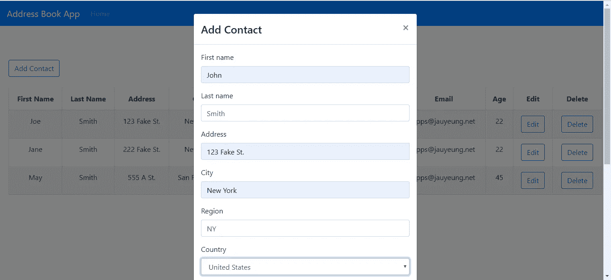
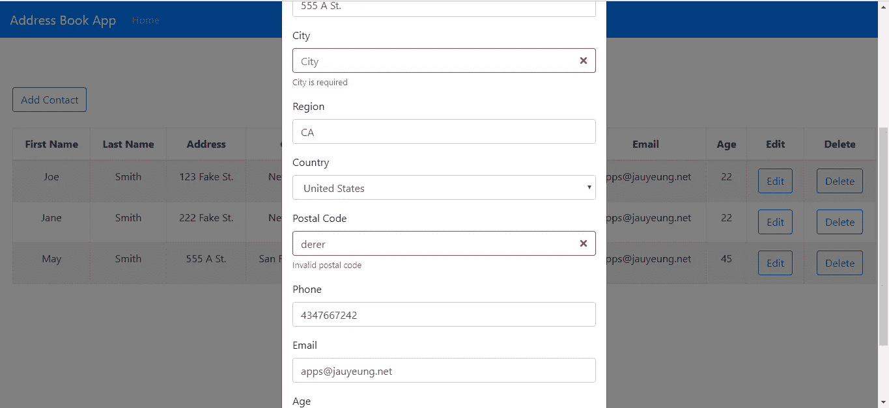

# 如何用 TypeScript 构建 React 应用程序并给出一个实例

> 原文：<https://levelup.gitconnected.com/how-to-write-react-apps-with-typescript-697f9e90cfd4>


## 概观

TypeScript 是 JavaScript 的超集，创建它是为了解决许多常见的问题，最大的问题是 JavaScript 变量和对象都具有动态类型。这意味着如果不将对象记录到调试器中，就无法知道它有什么属性。

这造成了很多挫折，因为您必须亲自检查每个单独的对象，减慢了开发速度。没有静态类型，你也不能在你的编辑器中自动完成，因为没有办法 100%确定地知道那些对象中有什么。

此外，您可以在 JavaScript 函数中放入任何参数，所以传入的内容没有强制性。当您传递错误的参数类型或者没有传递足够的参数时，就会产生问题，使这些参数`undefined`。也没有什么可以阻止你传入太多的参数。

通过能够在编译时检测到所有这些问题，TypeScript 使代码更容易理解和遵循，同时减少了发送到产品中的错误数量。当你改变代码的时候，你不必担心破坏东西，因为编译器会告诉你，你得到了那些基本的错误。

创建 React 应用程序项目可以使用 TypeScript 的`--typscript`选项启动。但是，我们需要自己为一些库安装类型定义。

在本文中，我们将使用 React 和 TypeScript 构建一个地址簿应用程序。

## 入门指南

首先，我们需要运行 Create React App 来搭建应用程序。我们运行`npx create-react-app address-book --typscript`来创建包含初始文件的应用程序项目文件夹。该应用程序将有一个主页来显示联系人，并让我们打开一个模式来添加联系人。将会有一个显示所有联系人的表格，每行都有编辑和删除按钮。

这些联系人将被存储在一个中央 MobX 存储中，以便于访问。React 路由器将用于路由。联系人将通过使用 [JSON 服务器](https://github.com/typicode/json-server)保存在后端。我们还将使用 [Formik](https://github.com/jaredpalmer/formik) 和 [Yup](https://github.com/jquense/yup) 进行表单管理和验证。

为了安装我们上面提到的库，我们运行`npm i axios bootstrap formik react-bootstrap mobx mobx-react react-router-dom yup`。Axios 是我们用来向后端发出 HTTP 请求的 HTTP 客户端。`react-router-dom`是 React 路由器最新版本的包名。

我们还需要通过运行以下命令为我们的库安装类型定义:

```
npm i --save-dev @types/react @types/react-router-dom @types/react-bootstrap @types/react-dom @types/yup
```

在`tsconfig.json`中，我们将现有代码替换为:

```
{
  "compilerOptions": {
    "target": "es5",
    "lib": [
      "dom",
      "dom.iterable",
      "esnext"
    ],
    "allowJs": true,
    "skipLibCheck": true,
    "esModuleInterop": true,
    "allowSyntheticDefaultImports": true,
    "strict": true,
    "forceConsistentCasingInFileNames": true,
    "module": "esnext",
    "moduleResolution": "node",
    "resolveJsonModule": true,
    "isolatedModules": true,
    "noEmit": true,
    "jsx": "react",
    "noImplicitThis": false,
    "experimentalDecorators": true
  },
  "include": [
    "src"
  ]
}
```

这禁用了`noImplicitThis`,因此我们可以在组件中使用`bind(this)`,并添加`experimentalDecorators`来使用 MobX 所需的装饰器。

## 构建 React 应用程序

我们为将要编写的代码创建一些自定义类型。在`src`文件夹中创建一个`interfaces.ts`文件，并添加:

```
import { ContactsStore } from './store';export interface Contact {
    firstName: string;
    lastName: string;
    address: string;
    city: string;
    region: string;
    postalCode: string;
    phone: string;
    email: string;
    age: string;
    id: number;
    country: string;
}export interface HomePageProps {
    contactsStore: ContactsStore
}export interface ContactFormProps {
    edit?: boolean,
    onSave?: any,
    contact?: Contact,
    onCancelAdd?: any,
    onCancelEdit?: any,
    contactsStore: ContactsStore
}
```

这将是我们的数据和道具的类型。

现在我们已经安装了所有的库，我们可以开始构建应用程序了。除非另有说明，否则所有文件都在`src`文件夹中。首先我们在 MobX 商店上工作。我们在`src`文件夹中创建一个名为`store.tsx`的文件，并添加以下内容:

```
import { observable } from "mobx";
import { Contact } from "./interfaces";class ContactsStore {
    [@observable](http://twitter.com/observable) contacts: Contact[] = []; setContacts(contacts: Contact[]) {
        this.contacts = contacts;
    }
}export { ContactsStore };
```

这是一个保存联系人的简单商店。`contacts`数组是我们存储整个应用程序的联系人的地方。`setContacts`函数允许我们设置来自任何组件的联系人，我们将这个 store 对象传递给该组件。

此区块:

```
ContactsStore = decorate(ContactsStore, {
  contacts: observable,
  setContacts: action,
});
```

将`ContactsStore`中的`contacts`数组指定为可由组件观察变化的实体。`setContacts`是可用于设置存储中的`contacts`数组的函数。

在`App.tsx`中，我们用以下代码替换现有代码:

```
import React from "react";
import { Router, Route } from "react-router-dom";
import HomePage from "./HomePage";
import { createBrowserHistory as createHistory } from "history";
import Navbar from "react-bootstrap/Navbar";
import Nav from "react-bootstrap/Nav";
import "./App.css";
const history = createHistory();function App({ contactsStore }: any) {
  return (
    <div className="App">
      <Router history={history}>
        <Navbar bg="primary" expand="lg" variant="dark">
          <Navbar.Brand href="#home">Address Book App</Navbar.Brand>
          <Navbar.Toggle aria-controls="basic-navbar-nav" />
          <Navbar.Collapse id="basic-navbar-nav">
            <Nav className="mr-auto">
              <Nav.Link href="/">Home</Nav.Link>
            </Nav>
          </Navbar.Collapse>
        </Navbar>
        <Route
          path="/"
          exact
          component={(props: any) => (
            <HomePage {...props} contactsStore={contactsStore} />
          )}
        />
      </Router>
    </div>
  );
}export default App;
```

我们将存储传递给任何需要它的组件，比如`HomePage`。然后，它会将组件传递给`ContactForm`。

这是我们添加导航栏并显示 React Router 处理的路由的地方。在`App.css`中，我们将现有代码替换为:

```
.App {
  text-align: center;
}
```

接下来，我们建立我们的联系形式。这是我们的应用程序中逻辑最强的部分。

在这个`ContactForm.tsx`中，我们为`ContactForm`组件添加了`React.SFC<ContactFormProps>`注释，因此我们对组件进行了类型检查。`ContactFormProps`让我们检查道具的数据类型。

创建一个名为`ContactForm.tsx`的文件，并添加:

```
import React from "react";
import { Formik } from "formik";
import Form from "react-bootstrap/Form";
import Col from "react-bootstrap/Col";
import InputGroup from "react-bootstrap/InputGroup";
import Button from "react-bootstrap/Button";
import * as yup from "yup";
import { COUNTRIES } from "./exports";
import { addContact, editContact, getContacts } from "./requests";
import { FormControl } from "react-bootstrap";
import { Contact, ContactFormProps } from "./interfaces";const schema = yup.object({
  firstName: yup.string().required("First name is required"),
  lastName: yup.string().required("Last name is required"),
  address: yup.string().required("Address is required"),
  city: yup.string().required("City is required"),
  region: yup.string().required("Region is required"),
  country: yup
    .string()
    .required("Country is required")
    .default("Afghanistan"),
  postalCode: yup
    .string()
    .when("country", {
      is: "United States",
      then: yup
        .string()
        .matches(/^[0-9]{5}(?:-[0-9]{4})?$/, "Invalid postal code")
    })
    .when("country", {
      is: "Canada",
      then: yup
        .string()
        .matches(/^[A-Za-z]\d[A-Za-z][ -]?\d[A-Za-z]\d$/, "Invalid postal code")
    })
    .required(),
  phone: yup
    .string()
    .when("country", {
      is: country => ["United States", "Canada"].includes(country),
      then: yup
        .string()
        .matches(/^[2-9]\d{2}[2-9]\d{2}\d{4}$/, "Invalid phone nunber")
    })
    .required(),
  email: yup
    .string()
    .email("Invalid email")
    .required("Email is required"),
  age: yup
    .number()
    .required("Age is required")
    .min(0, "Minimum age is 0")
    .max(200, "Maximum age is 200")
});const ContactForm: React.SFC<ContactFormProps> = ({
  edit,
  onSave,
  contact,
  onCancelAdd,
  onCancelEdit,
  contactsStore
}: ContactFormProps) => {
  const handleSubmit = async (evt: Contact) => {
    const isValid = await schema.validate(evt);
    if (!isValid) {
      return;
    }
    if (!edit) {
      await addContact(evt);
    } else {
      await editContact(evt);
    }
    const response = await getContacts();
    contactsStore.setContacts(response.data);
    onSave();
  }; return (
    <>
      <Formik
        validationSchema={schema}
        onSubmit={handleSubmit}
        initialValues={(contact || {}) as any}
      >
        {({
          handleSubmit,
          handleChange,
          handleBlur,
          values,
          touched,
          isInvalid,
          errors
        }: any) => (
          <Form noValidate onSubmit={handleSubmit}>
            <Form.Row>
              <Form.Group as={Col} md="12" controlId="firstName">
                <Form.Label>First name</Form.Label>
                <Form.Control
                  type="text"
                  name="firstName"
                  placeholder="First Name"
                  value={values.firstName || ""}
                  onChange={handleChange}
                  isInvalid={touched.firstName && errors.firstName}
                />
                <Form.Control.Feedback type="invalid">
                  {errors.firstName}
                </Form.Control.Feedback>
              </Form.Group>
              <Form.Group as={Col} md="12" controlId="lastName">
                <Form.Label>Last name</Form.Label>
                <Form.Control
                  type="text"
                  name="lastName"
                  placeholder="Last Name"
                  value={values.lastName || ""}
                  onChange={handleChange}
                  isInvalid={touched.firstName && errors.lastName}
                /> <Form.Control.Feedback type="invalid">
                  {errors.lastName}
                </Form.Control.Feedback>
              </Form.Group>
              <Form.Group as={Col} md="12" controlId="address">
                <Form.Label>Address</Form.Label>
                <InputGroup>
                  <Form.Control
                    type="text"
                    placeholder="Address"
                    aria-describedby="inputGroupPrepend"
                    name="address"
                    value={values.address || ""}
                    onChange={handleChange}
                    isInvalid={touched.address && errors.address}
                  />
                  <Form.Control.Feedback type="invalid">
                    {errors.address}
                  </Form.Control.Feedback>
                </InputGroup>
              </Form.Group>
            </Form.Row>
            <Form.Row>
              <Form.Group as={Col} md="12" controlId="city">
                <Form.Label>City</Form.Label>
                <Form.Control
                  type="text"
                  placeholder="City"
                  name="city"
                  value={values.city || ""}
                  onChange={handleChange}
                  isInvalid={touched.city && errors.city}
                /> <Form.Control.Feedback type="invalid">
                  {errors.city}
                </Form.Control.Feedback>
              </Form.Group>
              <Form.Group as={Col} md="12" controlId="region">
                <Form.Label>Region</Form.Label>
                <Form.Control
                  type="text"
                  placeholder="Region"
                  name="region"
                  value={values.region || ""}
                  onChange={handleChange}
                  isInvalid={touched.region && errors.region}
                />
                <Form.Control.Feedback type="invalid">
                  {errors.region}
                </Form.Control.Feedback>
              </Form.Group> <Form.Group as={Col} md="12" controlId="country">
                <Form.Label>Country</Form.Label>
                <FormControl
                  as="select"
                  placeholder="Country"
                  name="country"
                  onChange={handleChange}
                  value={values.country || ""}
                  isInvalid={touched.region && errors.country}
                >
                  {COUNTRIES.map(c => (
                    <option key={c} value={c}>
                      {c}
                    </option>
                  ))}
                </FormControl>
                <Form.Control.Feedback type="invalid">
                  {errors.country}
                </Form.Control.Feedback>
              </Form.Group> <Form.Group as={Col} md="12" controlId="postalCode">
                <Form.Label>Postal Code</Form.Label>
                <Form.Control
                  type="text"
                  placeholder="Postal Code"
                  name="postalCode"
                  value={values.postalCode || ""}
                  onChange={handleChange}
                  isInvalid={touched.postalCode && errors.postalCode}
                /> <Form.Control.Feedback type="invalid">
                  {errors.postalCode}
                </Form.Control.Feedback>
              </Form.Group> <Form.Group as={Col} md="12" controlId="phone">
                <Form.Label>Phone</Form.Label>
                <Form.Control
                  type="text"
                  placeholder="Phone"
                  name="phone"
                  value={values.phone || ""}
                  onChange={handleChange}
                  isInvalid={touched.phone && errors.phone}
                /> <Form.Control.Feedback type="invalid">
                  {errors.phone}
                </Form.Control.Feedback>
              </Form.Group> <Form.Group as={Col} md="12" controlId="email">
                <Form.Label>Email</Form.Label>
                <Form.Control
                  type="text"
                  placeholder="Email"
                  name="email"
                  value={values.email || ""}
                  onChange={handleChange}
                  isInvalid={touched.email && errors.email}
                /> <Form.Control.Feedback type="invalid">
                  {errors.email}
                </Form.Control.Feedback>
              </Form.Group> <Form.Group as={Col} md="12" controlId="age">
                <Form.Label>Age</Form.Label>
                <Form.Control
                  type="text"
                  placeholder="Age"
                  name="age"
                  value={values.age || ""}
                  onChange={handleChange}
                  isInvalid={touched.age && errors.age}
                /> <Form.Control.Feedback type="invalid">
                  {errors.age}
                </Form.Control.Feedback>
              </Form.Group>
            </Form.Row>
            <Button type="submit" style={{ marginRight: "10px" }}>
              Save
            </Button>
            {edit ? (
              <Button type="button" onClick={onCancelEdit}>
                Cancel
              </Button>
            ) : (
              <Button type="button" onClick={onCancelAdd}>
                Cancel
              </Button>
            )}
          </Form>
        )}
      </Formik>
    </>
  );
};export default ContactForm;
```

我们从`HomePage`组件传入`contactsStore`，允许我们使用`contactsStore`中的数据和函数。

对于表单验证，我们使用 Formik 来帮助构建我们的联系表单，我们的 Boostrap `Form`组件嵌套在`Formik`组件中，这样我们就可以使用 Formik 的`handleChange`、`handleSubmit`、`values`、`touched`和`errors`参数。

`handleChange`是一个函数，让我们不用自己写代码就可以从输入中更新表单域数据。`handleSubmit`是我们传递给`Formik`组件的`onSubmit`处理程序的函数。函数中的参数是我们输入的数据，字段名作为键，由每个字段的`name`属性定义，每个字段的值作为那些键的值。注意，在每个`value`属性中，我们有`||''`，所以我们没有得到`undefined`值，并防止触发不受控制的表单警告。

为了显示表单验证消息，我们必须将`isInvalid`属性传递给每个`Form.Control`组件。`schema`对象是`Formik`将检查表单验证的对象。`required`函数中的参数是验证错误消息。`matches`、`min`和`max`函数的第二个参数也是验证消息。

`ContactForm`函数的参数是道具，我们将从稍后构建的`HomePage`组件传入。`handleSubmit`功能检查数据是否有效，如果有效，则根据是添加还是编辑联系人进行保存。然后，当保存成功时，我们在存储中设置联系人并调用`onSave` prop，这是一个关闭表单所在模态的函数。模式将在主页中定义。

接下来我们创建一个名为`exports.ts`的文件，并放入:

```
export const COUNTRIES = [
  "Afghanistan",
  "Albania",
  "Algeria",
  "Andorra",
  "Angola",
  "Anguilla",
  "Antigua &amp; Barbuda",
  "Argentina",
  "Armenia",
  "Aruba",
  "Australia",
  "Austria",
  "Azerbaijan",
  "Bahamas",
  "Bahrain",
  "Bangladesh",
  "Barbados",
  "Belarus",
  "Belgium",
  "Belize",
  "Benin",
  "Bermuda",
  "Bhutan",
  "Bolivia",
  "Bosnia &amp; Herzegovina",
  "Botswana",
  "Brazil",
  "British Virgin Islands",
  "Brunei",
  "Bulgaria",
  "Burkina Faso",
  "Burundi",
  "Cambodia",
  "Cameroon",
  "Canada",
  "Cape Verde",
  "Cayman Islands",
  "Chad",
  "Chile",
  "China",
  "Colombia",
  "Congo",
  "Cook Islands",
  "Costa Rica",
  "Cote D Ivoire",
  "Croatia",
  "Cruise Ship",
  "Cuba",
  "Cyprus",
  "Czech Republic",
  "Denmark",
  "Djibouti",
  "Dominica",
  "Dominican Republic",
  "Ecuador",
  "Egypt",
  "El Salvador",
  "Equatorial Guinea",
  "Estonia",
  "Ethiopia",
  "Falkland Islands",
  "Faroe Islands",
  "Fiji",
  "Finland",
  "France",
  "French Polynesia",
  "French West Indies",
  "Gabon",
  "Gambia",
  "Georgia",
  "Germany",
  "Ghana",
  "Gibraltar",
  "Greece",
  "Greenland",
  "Grenada",
  "Guam",
  "Guatemala",
  "Guernsey",
  "Guinea",
  "Guinea Bissau",
  "Guyana",
  "Haiti",
  "Honduras",
  "Hong Kong",
  "Hungary",
  "Iceland",
  "India",
  "Indonesia",
  "Iran",
  "Iraq",
  "Ireland",
  "Isle of Man",
  "Israel",
  "Italy",
  "Jamaica",
  "Japan",
  "Jersey",
  "Jordan",
  "Kazakhstan",
  "Kenya",
  "Kuwait",
  "Kyrgyz Republic",
  "Laos",
  "Latvia",
  "Lebanon",
  "Lesotho",
  "Liberia",
  "Libya",
  "Liechtenstein",
  "Lithuania",
  "Luxembourg",
  "Macau",
  "Macedonia",
  "Madagascar",
  "Malawi",
  "Malaysia",
  "Maldives",
  "Mali",
  "Malta",
  "Mauritania",
  "Mauritius",
  "Mexico",
  "Moldova",
  "Monaco",
  "Mongolia",
  "Montenegro",
  "Montserrat",
  "Morocco",
  "Mozambique",
  "Namibia",
  "Nepal",
  "Netherlands",
  "Netherlands Antilles",
  "New Caledonia",
  "New Zealand",
  "Nicaragua",
  "Niger",
  "Nigeria",
  "Norway",
  "Oman",
  "Pakistan",
  "Palestine",
  "Panama",
  "Papua New Guinea",
  "Paraguay",
  "Peru",
  "Philippines",
  "Poland",
  "Portugal",
  "Puerto Rico",
  "Qatar",
  "Reunion",
  "Romania",
  "Russia",
  "Rwanda",
  "Saint Pierre &amp; Miquelon",
  "Samoa",
  "San Marino",
  "Satellite",
  "Saudi Arabia",
  "Senegal",
  "Serbia",
  "Seychelles",
  "Sierra Leone",
  "Singapore",
  "Slovakia",
  "Slovenia",
  "South Africa",
  "South Korea",
  "Spain",
  "Sri Lanka",
  "St Kitts &amp; Nevis",
  "St Lucia",
  "St Vincent",
  "St. Lucia",
  "Sudan",
  "Suriname",
  "Swaziland",
  "Sweden",
  "Switzerland",
  "Syria",
  "Taiwan",
  "Tajikistan",
  "Tanzania",
  "Thailand",
  "Timor L'Este",
  "Togo",
  "Tonga",
  "Trinidad &amp; Tobago",
  "Tunisia",
  "Turkey",
  "Turkmenistan",
  "Turks &amp; Caicos",
  "Uganda",
  "Ukraine",
  "United Arab Emirates",
  "United Kingdom",
  "United States",
  "United States Minor Outlying Islands",
  "Uruguay",
  "Uzbekistan",
  "Venezuela",
  "Vietnam",
  "Virgin Islands (US)",
  "Yemen",
  "Zambia",
  "Zimbabwe",
];
```

这些是表单中国家字段的国家。

在`index.tsx`中，将现有代码替换为:

```
import React from "react";
import ReactDOM from "react-dom";
import "./index.css";
import App from "./App";
import * as serviceWorker from "./serviceWorker";
import { ContactsStore } from "./store";
const contactsStore = new ContactsStore();ReactDOM.render(
  <App contactsStore={contactsStore} />,
  document.getElementById("root")
);// If you want your app to work offline and load faster, you can change
// unregister() to register() below. Note this comes with some pitfalls.
// Learn more about service workers: [https://bit.ly/CRA-PWA](https://bit.ly/CRA-PWA)
serviceWorker.unregister();
```

这将我们的 MobX 存储传递到我们的`App`组件中。

在`HomePage.tsx`中，我们把:

```
import React from "react";
import { useState, useEffect } from "react";
import Table from "react-bootstrap/Table";
import ButtonToolbar from "react-bootstrap/ButtonToolbar";
import Button from "react-bootstrap/Button";
import Modal from "react-bootstrap/Modal";
import ContactForm from "./ContactForm";
import "./HomePage.css";
import { getContacts, deleteContact } from "./requests";
import { observer } from "mobx-react";
import { Contact, HomePageProps } from "./interfaces";const HomePage: React.SFC<HomePageProps> = ({
  contactsStore
}: HomePageProps) => {
  const [openAddModal, setOpenAddModal] = useState(false);
  const [openEditModal, setOpenEditModal] = useState(false);
  const [initialized, setInitialized] = useState(false);
  const [selectedContact, setSelectedContact] = useState({}); const openModal = () => {
    setOpenAddModal(true);
  }; const closeModal = () => {
    setOpenAddModal(false);
    setOpenEditModal(false);
    getData();
  }; const cancelAddModal = () => {
    setOpenAddModal(false);
  }; const editContact = (contact: Contact) => {
    setSelectedContact(contact);
    setOpenEditModal(true);
  }; const cancelEditModal = () => {
    setOpenEditModal(false);
  }; const getData = async () => {
    const response = await getContacts();
    contactsStore.setContacts(response.data);
    setInitialized(true);
  }; const deleteSelectedContact = async (id: number) => {
    await deleteContact(id);
    getData();
  }; useEffect(() => {
    if (!initialized) {
      getData();
    }
  }); return (
    <div className="home-page">
      <h1>Contacts</h1>
      <Modal show={openAddModal} onHide={closeModal}>
        <Modal.Header closeButton>
          <Modal.Title>Add Contact</Modal.Title>
        </Modal.Header>
        <Modal.Body>
          <ContactForm
            edit={false}
            onSave={closeModal.bind(this) as any}
            onCancelAdd={cancelAddModal as any}
            contactsStore={contactsStore}
          />
        </Modal.Body>
      </Modal> <Modal show={openEditModal} onHide={closeModal}>
        <Modal.Header closeButton>
          <Modal.Title>Edit Contact</Modal.Title>
        </Modal.Header>
        <Modal.Body>
          <ContactForm
            edit={true}
            onSave={closeModal.bind(this)}
            contact={selectedContact as Contact}
            onCancelEdit={cancelEditModal}
            contactsStore={contactsStore}
          />
        </Modal.Body>
      </Modal>
      <ButtonToolbar onClick={openModal}>
        <Button variant="outline-primary">Add Contact</Button>
      </ButtonToolbar>
      <br />
      <Table striped bordered hover>
        <thead>
          <tr>
            <th>First Name</th>
            <th>Last Name</th>
            <th>Address</th>
            <th>City</th>
            <th>Country</th>
            <th>Postal Code</th>
            <th>Phone</th>
            <th>Email</th>
            <th>Age</th>
            <th>Edit</th>
            <th>Delete</th>
          </tr>
        </thead>
        <tbody>
          {contactsStore.contacts.map((c: any) => (
            <tr key={c.id}>
              <td>{c.firstName}</td>
              <td>{c.lastName}</td>
              <td>{c.address}</td>
              <td>{c.city}</td>
              <td>{c.country}</td>
              <td>{c.postalCode}</td>
              <td>{c.phone}</td>
              <td>{c.email}</td>
              <td>{c.age}</td>
              <td>
                <Button
                  variant="outline-primary"
                  onClick={editContact.bind(this, c)}
                >
                  Edit
                </Button>
              </td>
              <td>
                <Button
                  variant="outline-primary"
                  onClick={deleteSelectedContact.bind(this, c.id)}
                >
                  Delete
                </Button>
              </td>
            </tr>
          ))}
        </tbody>
      </Table>
    </div>
  );
};
export default observer(HomePage);
```

请注意，我们使用了`export default observer(HomePage);`而不是`export default HomePage;`。我们需要用`observer`函数调用包装`HomePage`,这样来自商店的最新数据将被传播到这个组件中。

我们为`HomePage`组件添加了`React.SFC<HomePageProps>`注释，因此我们对组件进行了类型检查。`HomePageProps`让我们检查道具的数据类型。

它有显示联系人的表格和添加、编辑和删除联系人的按钮。它在第一次加载时获取数据，在`useEffect`的回调函数中调用`getData`函数。每次渲染都会调用`useEffect`的回调，所以我们想要设置一个`initialized`标志，并检查它是否只在`true`时才加载。

注意，我们将这个组件的所有道具传递给了`ContactForm`组件。要为`onClick`处理函数传递一个参数，我们必须调用函数上的`bind`，并将函数的参数作为第二个参数传递给`bind`。例如，在这个文件中，我们有`editContact.bind(this, c)`，其中`c`是联系对象。`editContact`功能定义如下:

```
const editContact = (contact) => {
    setSelectedContact(contact);
    setOpenEditModal(true);
  }
```

`c`是我们传入的`contact`参数。

接下来，我们创建一个名为`HomePage.css`的文件，并放入:

```
.home-page {
  padding: 20px;
}
```

在`index.tsx`中，我们将现有代码替换为:

```
import React from "react";
import ReactDOM from "react-dom";
import "./index.css";
import App from "./App";
import * as serviceWorker from "./serviceWorker";
import { ContactsStore } from "./store";
const contactsStore = new ContactsStore();ReactDOM.render(
  <App contactsStore={contactsStore} />,
  document.getElementById("root")
);// If you want your app to work offline and load faster, you can change
// unregister() to register() below. Note this comes with some pitfalls.
// Learn more about service workers: [https://bit.ly/CRA-PWA](https://bit.ly/CRA-PWA)
serviceWorker.unregister();
```

然后我们创建一个名为`requests.tsx`的文件，并添加:

```
import { Contact } from "./interfaces";const APIURL = '[http://localhost:3000'](http://localhost:3000');
const axios = require('axios');export const getContacts = () => axios.get(`${APIURL}/contacts`);export const addContact = (data: Contact) => axios.post(`${APIURL}/contacts`, data);export const editContact = (data: Contact) => axios.put(`${APIURL}/contacts/${data.id}`, data);export const deleteContact = (id: number) => axios.delete(`${APIURL}/contacts/${id}`);
```

这些函数向后端发出 HTTP 请求，以保存和删除联系人。

最后，在`public/index.html`中，我们将现有代码替换为:

```
<!DOCTYPE html>
<html lang="en"><head>
  <meta charset="utf-8" />
  <link rel="shortcut icon" href="%PUBLIC_URL%/favicon.ico" />
  <meta name="viewport" content="width=device-width, initial-scale=1" />
  <meta name="theme-color" content="#000000" />
  <meta name="description" content="Web site created using create-react-app" />
  <link rel="apple-touch-icon" href="logo192.png" />
  <link rel="manifest" crossorigin="use-credentials" href="%PUBLIC_URL%/manifest.json" /><!--
      manifest.json provides metadata used when your web app is installed on a
      user's mobile device or desktop. See [https://developers.google.com/web/fundamentals/web-app-manifest/](https://developers.google.com/web/fundamentals/web-app-manifest/)
    -->
  <!--
      Notice the use of %PUBLIC_URL% in the tags above.
      It will be replaced with the URL of the `public` folder during the build.
      Only files inside the `public` folder can be referenced from the HTML.Unlike "/favicon.ico" or "favicon.ico", "%PUBLIC_URL%/favicon.ico" will
      work correctly both with client-side routing and a non-root public URL.
      Learn how to configure a non-root public URL by running `npm run build`.
    -->
  <title>React Address Book App</title>
  <link rel="stylesheet" href="[https://maxcdn.bootstrapcdn.com/bootstrap/4.3.1/css/bootstrap.min.css](https://maxcdn.bootstrapcdn.com/bootstrap/4.3.1/css/bootstrap.min.css)"
    integrity="sha384-ggOyR0iXCbMQv3Xipma34MD+dH/1fQ784/j6cY/iJTQUOhcWr7x9JvoRxT2MZw1T" crossorigin="anonymous" />
</head><body>
  <noscript>You need to enable JavaScript to run this app.</noscript>
  <div id="root"></div>
  <!--
      This HTML file is a template.
      If you open it directly in the browser, you will see an empty page.You can add webfonts, meta tags, or analytics to this file.
      The build step will place the bundled scripts into the <body> tag.To begin the development, run `npm start` or `yarn start`.
      To create a production bundle, use `npm run build` or `yarn build`.
    -->
</body></html>
```

这将更改标题并添加引导样式表。

现在，我们可以通过在 Windows 上运行`set PORT=3001 && react-scripts start`或在 Linux 上运行`PORT=3006 react-scripts start`来运行应用程序。

要启动后端，我们首先通过运行`npm i json-server`来安装`json-server`包。然后转到我们的项目文件夹并运行:

```
json-server --watch db.json
```

在`db.json`中，将文本改为:

```
{
  "contacts": [
  ]
}
```

现在我们有了在`requests.js`中定义的`contacts`端点。

最终，我们得到了以下结果:

