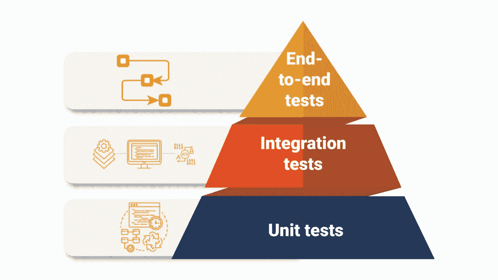

# 如何为节点快速路由编写测试

> 原文：<https://levelup.gitconnected.com/how-to-write-tests-for-node-express-routes-with-auth-example-dd0b7e817b76>

## 使用 Jest plus Typescript 编写综合单元测试的指南，并附有验证示例



来自[大头针](https://www.headspin.io/blog/the-testing-pyramid-simplified-for-one-and-all)的图像

单元测试是测试期的底部是有充分理由的。这是保证应用程序大部分功能的基本测试形式。其背后的概念是，如果我们能够确保每个功能/路线/组件都按照预期运行，那么系统作为一个整体应该能够正常工作。

当然，这不是故事的全部，这就是为什么我们有集成和端到端测试。然而，为每个功能的每个流程创建端到端的测试场景是不现实的。

在本文中，我将讨论单元测试的重要性，并提供为快速路由处理程序编写单元测试的最佳实践。

# 单元测试的原因

*   **开发速度**:单元测试非常容易编写，因此开发人员可以在添加测试的同时快速开发新的功能。
*   **测试速度**:单元测试运行起来比端到端测试快得多，因此编写大量的单元测试是可行的，因为它们可以在每一次拉请求变更时运行，而不会显著增加迭代时间。
*   **容易保证高覆盖率**:单元测试是单独测试每个功能，因此可以测试每个功能的每个可能的流程。通过将每个功能作为一个独立的单元来完成，获得高覆盖率就变成了一个简单的过程。
*   **提高代码的可重用性:**单元测试的功能是可信的，因此可以很容易地重用，而不用担心引入错误。
*   **可以作为文档**:单元测试在很多方面作为文档:它们显示输入和输出的例子，并为不同的流程设置期望。在阅读了一个函数的单元测试之后，你应该能够更好地理解它。

# 安装依赖项

首先，您需要安装以下开发依赖项:

*   超级测试
*   玩笑
*   ts-jest
*   @types/supertest(如果使用 typescript)
*   @types/jest(如果您使用的是 typescript)

这样做的命令是:

*npm 安装—保存-开发 super test jest ts-jest @ types/jest @ types/super test*

# 设置 Package.json

在安装了前面提到的依赖项之后，是时候配置 jest 并编写脚本来运行测试了。您的 package.json 应该如下所示:

```
{
...
  "scripts": {
    "start": "ts-node-dev src/index.ts",
    "test": "jest --watchAll --no-cache"
  },
  "jest": {
    "preset": "ts-jest",
    "testEnvironment": "node",
    "setupFilesAfterEnv": [
      "./src/test/setup.ts"
    ]
  },
...
  },
  "devDependencies": {
    "@types/jest": "^29.2.3",
    "@types/supertest": "^2.0.12",
    "jest": "^29.3.1",
    "supertest": "^6.3.1",
    "ts-jest": "^29.0.3"
  }
}
```

让我们打开这个。测试脚本实际上运行 jest，并带有监视文件更改的选项，以便在更改后重新运行测试(这就是— watchAll 标志的作用)。我们还标记了 no-cache 选项，以确保 jest 不使用缓存，缓存是错误测试的常见来源。

jest 配置实质上是将 jest 配置为使用 ts-jest，将测试环境指定为节点环境，最后指定安装测试文件的位置。

下面是我们随相应版本一起安装的开发依赖项。完全有可能你有和我不同的依赖版本，但是除非在即将到来的版本中有重大改变，否则本教程仍然适用。

# 测试设置文件

您应该在 package.json 中为 setupFilesAfterEnv 指定的路径下创建一个名为 setup.ts 的文件。这个文件将包含我们想要在所有测试文件中运行的任何逻辑。

## **使用数据库进行测试**

例如，在我正在做的一个项目中，我们使用 MongoDB 作为我们的数据库，我们需要使用一个内存中的 MongoDB 来进行使用 mongo-memory-server 的测试。在开始任何测试之前，需要建立到 mongo 内存服务器的连接，因此我们将该逻辑合并到一个 *beforeAll* 块中:

```
let mongo: any;
beforeAll(async () => {
  mongo = await MongoMemoryServer.create();
  const mongoUri = mongo.getUri();
  await mongoose.connect(mongoUri, {});
});
```

然后，在每次测试之后，我们希望清除 mongo 内存服务器中任何可能由测试存储的内容。我们在每个模块之前的*中执行此操作:*

```
beforeEach(async () => {
  const collections = await mongoose.connection.db.collections();
  for (let collection of collections) {
    await collection.deleteMany({});
  }
});
```

最后，我们在一个 *afterAll* 块中完成所有测试后，停止与 mongo 内存服务器的连接:

```
afterAll(async () => {
  if (mongo) {
    await mongo.stop();
  }
  await mongoose.connection.close();
});
```

## **为测试定义环境变量**

安装文件是存放测试期间可能需要访问的任何环境变量的好地方。例如，如果您使用 JWT 测试授权，您可能需要在安装文件的 *beforeAll* 块中模仿 JWT 密钥:

```
beforeAll(async () => {
  process.env.jwt = "mock-jwt-key";
});
```

## **创建全局测试功能**

如果您知道在大多数测试中会用到某些函数，那么您有几个选择。您可以定义一个全局函数，这样您就可以在测试中使用它，而不需要导入它，这非常方便。或者您可以将其导出，然后导入到您需要使用的文件中。出于本教程的目的，我将向您展示如何声明一个全局函数:

```
declare global {
  var functionIUseAlot: () => string;
}

global.functionIUseAlot = () => {
  // whatever reusable logic you need to apply
  return "done";
};
```

# 测试路线

所有的设置完成后，我们可以开始测试我们的路线。为此，我建议您在 routes 文件夹下创建一个名为 __tests__ 的文件夹，它将存放您的路由的所有单元测试。文件夹名 __tests__ 是 jest 用来标识测试位置的关键字。在该文件夹中，您将为想要测试的每条路由创建一个文件，格式为 routeName.test.ts。

所有测试中的一个共同点是，除了 supertest 的请求函数之外，我们还将导入 express 应用程序，该函数将位于每个测试文件的顶部，如下所示:

```
import request from "supertest";
import { app } from "../../app";
```

## 发送测试请求

我们向应用程序发送测试请求的方式是使用从 supertest 导入的请求函数。它看起来会像这样:

```
it("test that just sends a post request", async () => {
  await request(app)
    .post("/route/we/want/to/test")
    .send({item: "some content"});
});

it("test that just sends a get request", async () => {
  await request(app)
    .get("/route/we/want/to/test")
    .send();
});
```

上面的代码块显示了如何发送 post 和 get 请求。它们不是功能测试，因为它们不期待任何东西。

## 期望状态代码

我们可以测试路由的最基本的东西是它返回的状态代码。在上一节的基础上，让我们实现一些期望:

```
it("fails when not providing user age", async () => {
  await request(app)
    .post("/auth/signup")
    .send({name: "Ben Campbell", 
           email: "bencampbell@hotmail.com",
           password: "super-secure-password"})
    .expect(400); // bad request
});

it("succeeds when provided valid information", async () => {
  await request(app)
    .post("/auth/signup")
    .send({name: "Ben Campbell", 
           email: "bencampbell@hotmail.com",
           password: "super-secure-password",
           age: 42})
    .expect(201); // success - user created
});
```

在上面的例子中，我们测试了两种情况:用户尝试注册失败和成功。这是一个非常简单的例子，但是想象一下，在同样的场景中，我们也希望在用户注册后设置一个 cookie。这是我们需要测试的一个非常常见的场景。

## 测试 Cookies

解决方案实际上非常简单，我们需要做的就是确保定义了响应集 Cookie 头。我们实际上并不关心它里面有什么，对于 auth 的大部分，我们将使用 JWT 和 cookie 管理器，所以这不是我们要测试的功能。

```
it("successful signup leads to cookie being set in response", async () => {
  const response = await request(app)
    .post("/auth/signup")
    .send({name: "Ben Campbell", 
           email: "bencampbell@hotmail.com",
           password: "super-secure-password",
           age: 42})
    .expect(201); // success - user created

  expect(response.get("Set-Cookie")).toBeDefined();
});
```

在上面的代码中，我们将 post 请求的结果分配给 response。然后我们检查 Set-Cookie 头是否在响应中定义，这意味着我们的代码运行正确，并且将向用户返回一个 Cookie。

对于我们需要一个 cookie 来传递请求的情况呢？例如，在检查用户信息时，我们需要一个带有 JWT 令牌的 cookie。下面的代码块处理这种情况:

```
it("returns the current users age", async () => {
  const signUpResponse = await request(app)
    .post("/auth/signup")
    .send({name: "Ben Campbell", 
           email: "bencampbell@hotmail.com",
           password: "super-secure-password",
           age: 42})
    .expect(201);

  const cookie = signUpResponse.get('Set-Cookie');

  const response = await request(app)
    .get("/auth/userage")
    .set("Cookie", cookie)
    .send()
    .expect(200);

  expect(response.body.user.age).toEqual(42);
});
```

在上面的代码块中，我们再次注册用户，以便检索我们需要提供给后续请求的 cookie，从而测试获取用户年龄的功能。然后，我们检查响应的正文，看它是否包含正确的年龄。

在这篇文章中，我为你提供了一些用 jest 对你的路线进行单元测试的基本测试策略。我希望您发现这很有用，如果您考虑跟随我！我经常写这样的技术内容。