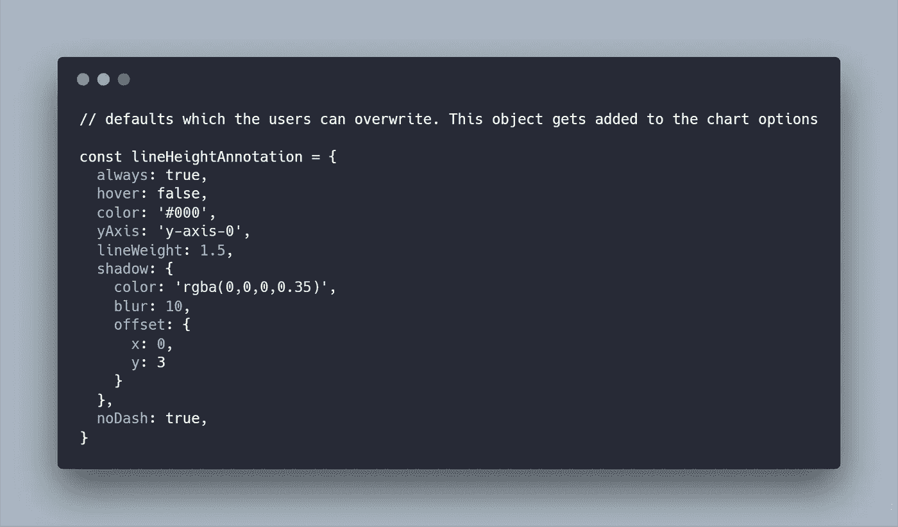

# 如何编写自己的 ChartJS 插件

> 原文：<https://levelup.gitconnected.com/how-to-write-your-own-chartjs-plugin-e46199ae5734>

对于 Javascript 开发人员来说，Chart.js 是最受欢迎和可扩展的图表库之一。所有的图表都写在 HTML5 画布上，这为前端开发人员提供了制作非常定制的图表所需的所有上下文和功能。

我最近发布了我自己的插件，你可以在 NPM 上查看。它被称为[chart js-plugin-line height-annotation](https://www.npmjs.com/package/chartjs-plugin-lineheight-annotation)，它对于在折线图上最高数据点的顶部绘制线条非常有用。我正在做一个需要类似东西的 React 项目，所以这是写一个插件的最佳时机！


ChartJS 有很棒的[文档](https://www.chartjs.org/docs/latest/)和他们的[插件 API](https://www.chartjs.org/docs/latest/developers/plugins.html#plugin-core-api) 中的挂钩列表。基本上，Chart.js 的插件只是一个对象，他们在插件 API 中寻找挂钩的键。这是容易的部分。更具挑战性的部分是找到您需要的数据点，并在画布上绘制这些数据点。

由于画布的可配置性很强，所以您需要提前想好要改变什么。例如，我知道我需要在折线图上的每个数据点的顶部绘图，所以我想弄清楚我支持哪些现成的样式。



从那里，我继续在插件 API 中挂接`afterDatasetDraw`方法。我应该强调一些 chart JS 方法和属性，这样您可以在使用自己的方法之前充分利用 chart.js。

```
const plugin = {
  id: "lineHeightAnnotation",
  afterDatasetDraw: chart => { 
    /**
    * get the dataset meta data at a defined index
    * the dataset meta will give you the x and y of all
    * the data point, but you'll need to work some magic if you're
    * autoskipping gridlines on either the X or Y axis.
    */
    let meta = chart.getDatasetMeta(i); // exposes the _model prop

    // get the options defined by the user, but it could 
    // be undefined
    let opts = chart.options.lineHeightAnnotation && chart.options.lineHeightAnnotation; /**
     * for line charts especially, the yAxis and xAxis are important
     * for getting data about the scales and ticks, so we'll need 
     * them. Chart JS has some defaults, so take them into account.
     */
     const xAxis = chart.scales[opts.xAxis ? opts.xAxis : "x-axis-0"];
     const yAxis = chart.scales[opts.yAxis ? opts.yAxis : "y-axis-0"]; // ....
  }
```

请记住，边框偏移、图表填充、从零开始的刻度和图表高度是决定您需要将线条绘制到多高的重要因素。


计算最高的 Y 数据点

ChartJS 的一些魔力发生在`proto`对象中。例如，在 xAxis 中，有一个`getPixelForTick`方法，它可以帮助计算你需要在哪里画线。然而，如果你需要一些更具体的东西，你可以试着写一个函数，从一个刻度得到一个数据点坐标，它只是一个比率。

当你计算完你想要画的 x 和 y 坐标后，就该在画布上画画了。如果你有更多关于在上下文中绘图的具体问题，在 [MDN](https://developer.mozilla.org/en-US/docs/Web/API/Canvas_API) 上的 canvas API 上有一些很棒的文档。

```
function shadow() {
  let options = this.options;
  if (options.shadow) {
    let ctx = this.ctx;
    let { shadow } = options;
    const _stroke = ctx.stroke; ctx.stroke = function() {
      ctx.save();
      ctx.shadowColor = shadow.color ? shadow.color : "rgba(0,0,0,0.35)";
      ctx.shadowBlur = shadow.blur ? shadow.blur : 10;
      ctx.shadowOffsetX = shadow.offset ? shadow.offset.x : 0;
      ctx.shadowOffsetY = shadow.offset ? shadow.offset.y : 3;

      _stroke.apply(this, arguments);
      ctx.restore();
    };
  }
}
```

最后你需要导出你的插件。chart.js 插件可以在几种环境中运行，比如 vanilla JS、React、Vue 或 Angular。最后，你要尽可能确保你的插件是可访问的，所以要注意正确地导出它。

```
*// if the environment is neither amd nor commonjs, register the plugin globally for the samples and tests*export default plugin;if (!(typeof define === "function" && define.amd) &&!(typeof module === "object" && module.exports)) { Chart.pluginService.register(plugin);}
```

这就是它的要点。如果你试用了我的插件并发现了问题，请在 [Github](https://github.com/spkellydev/chartjs-plugin-lineheight-annotation) 上告诉我，或者在 [Twitter](https://twitter.com/spkellydev) 上联系我；

黑客快乐！