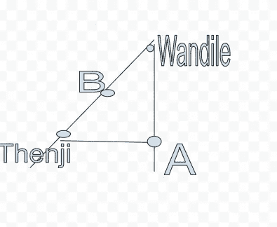
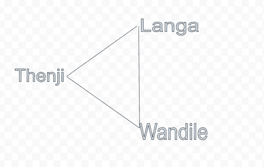
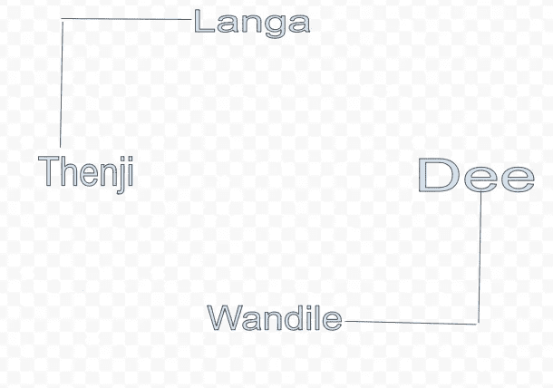
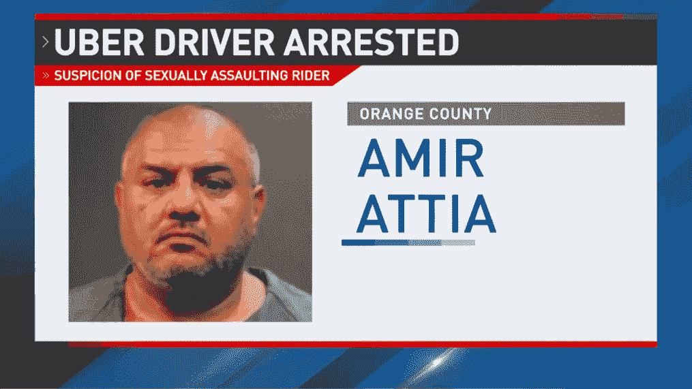

# 优步的工程是如何运作的

> 原文：<https://levelup.gitconnected.com/how-ubers-engineering-works-645bc5ed7a6>

来源:维克多·阿夫杰耶夫经由[Unsplash.com](https://unsplash.com/photos/Gk3apXDUZiI)

当你想到优步时，你会想到什么？革新出租车行业的科技巨头？一家受詹姆斯·邦德电影或便利设施启发的公司！

是的，你没听错，优步受到了詹姆斯·邦德电影《皇家赌场》的启发。

优步·加勒特·坎普的创始人之一对出租车服务非常不满，有一天在看《皇家赌场》时，他注意到詹姆斯·邦德用手机追踪一辆汽车的位置。他心想，如果我能按下手机上的一个按钮，看着我的出租车到达，那该有多酷。

我们今天在这里！我们有随叫随到的出租车服务，只需按一下按钮。在这篇文章中，我们将探索优步背后的特殊功能的工程。

# 计算预计到达时间

来源:Unsplash.com

那个神奇的功能，当你拿出手机的时候；打开优步应用程序并请求搭车，然后那些聪明的小算法会告诉你你的司机多久会到达。

估计的到达时间在大多数情况下是相当准确的。那么，优步是如何做到正确的呢？

万迪尔是约翰内斯堡南部的一名优步司机。我也住在约翰内斯堡南部。当我请求出租车时，我的设备和 Wandile 的设备上会显示一张地图，上面有我们的位置。

背景中的数学如下:

城市是边，是节点；

节点代表十字路口，边代表街道。在计算机科学中，我们称之为图形问题。

上图代表我的位置和我的司机 Wandile 的位置。点是节点(交叉点)，线是边(街道)。我们在计算机科学中称这些图为。从万迪勒到我的位置哪条路线更快？

如果我们要使用 Dijkstra 的算法，那么我们需要计算所有的选项，同时集成速度。如果万迪勒和 A 之间的速度限制是 80 公里/小时，万迪勒和 B 之间的速度限制是 20 公里/小时，那么 B 和 B 之间的速度限制是 10 公里/小时。

80 公里/小时的优势将优于 30 公里/小时的组合优势。这是根据迪杰斯特拉的算法。但是速度不是我们唯一的问题，我们还要考虑交通。不要忘记是否，如极端降雨或降雪。

这种方法对于向客户提供准确的实时 ETA 是不可行的。这被计算机科学家称为 NP 完全问题。

一个更好的方法是使用历史数据进行 ETA 计算。这些方法使用以前旅行的数据集，并以概率为基础。这是一次和我相似的旅行，在我的地区使用相同的路线。

只有当优步在一个新城市介绍他们的服务时，才会需要图形和它们的算法。在一个新城市运营，我们没有足够的数据来训练算法识别历史模式。

在这种特殊情况下，我们将城市分割成更小的部分，创建更小的图形。这将减少我们的算法运行时间，并给出更准确的预计到达时间。

一旦映射和路由问题得到解决，就应该继续寻找和匹配客户和司机。

# 寻找并匹配客户和驱动因素

我们愿意认为，一旦我提出请求，最近的驾驶将是正确的。不对！

Langa 是离我最近的司机，但 Wandile 被系统侦测到了。这就是所谓的批量匹配。这是为了减少总等待时间。

起初，该系统并不真正智能，它匹配最近的司机，这是我的语言。Langa 离我和 Wandile 10 分钟路程。系统会 ping Langa，他会接受请求，然后把我带走。

这个小三角形并不是真实世界的反映，请求是同时发生的。

这里有一个更准确的反映:

Langa 离我 5 分钟路程，接受请求，被派遣。我们也有我亲爱的朋友迪从城市的另一边要求搭车。万迪乐离迪伊有 10 分钟的路程。

两个请求的总等待时间为 15 分钟。这就是我们所说的计算机科学中的最坏情况。让我们重新计算一下！

Langa 距离 Dee 只有 3 分钟的路程，Wandile 距离 Thenji 有 7 分钟的路程。这使我们的总等待时间为 10 分钟，比其他等待时间要长。

批处理算法的作用是尽可能减少等待时间。如果 Langa 与 Dee 匹配，然后 ji 与 Wandile 匹配，总重量时间将减少 5 分钟。

# 记录

日志层用于商业和法律目的。

## 商业目的

想想大数据分析，用它来看看司机如何移动和路线。这是以改善客户体验的名义进行的。

## 法律目的

来源:KMPH

上图揭示了女性成为性侵者受害者的悲伤但真实的故事。优步最近发布了 2017 年和 2018 年的统计数据。

在那段时间里，有近 6000 人报告在优步骑行期间或之后遭到性侵犯。

细分下来，这些范围从强奸到性骚扰。强奸被举报 464 次。

这个问题不仅影响到优步，也影响到每一家乘车服务公司。即使在将科技融入出租车行业之前，这肯定也是一个问题。现在，日志记录如何帮助我们解决这个问题呢？

日志记录发生在端点，即驱动程序设备和客户端设备。

然后 ji 要求一个优步，性掠夺者 Fannie 被指派给我！我一边往车里望。我不知道我和一个有着残忍意图的性侵犯者在一起！当时我和他在出租车上，我的设备和他的设备显示我们在同一时间同一地点。

行程的预计时间已经计算好了，如果需要更长的时间，我们绕道，或者在某个指定的地点停留一段时间，然后我指控强奸，测井层收集的数据可以用作强奸案的证据。

是否可以改进测井层和其他特征，以帮助女性的安全？

总有改进的空间，本质上这就是日志记录层的目的。

# 处理大数据

## 储存；储备

让我们从存储开始处理这些大数据，我们需要尽可能高效地存储我们的旅行数据。

行程存储在至少两个数据中心，主数据中心尽可能靠近行程。如果旅行发生在约翰内斯堡，数据中心将在约翰内斯堡或开普敦。

备份数据中心将位于欧洲或亚洲。当我出差时，我的设备和司机设备中的行程信息将存储在位于南非的主数据中心。

现在由于某种原因，南非的数据中心离线，那么旅行信息/数据将被发送到欧洲的备份数据中心。一旦我们的南非数据中心恢复在线，信息就会同步回南非数据中心。

最坏的情况是，如果两个数据中心都离线，那么您就会看到离线的消息。

混合使用 SQL 和无 SQL，Apache Cassandra 代表无 SQL，优步派生的 MySQL 是无模式的。

对于大数据分析，hardoop 用作数据仓库。数据仓库与主系统分离。如果它是离线的，那么它不应该影响优步的日常业务。

## 贮藏

这可用于向客户端交付静态数据，并使它们离客户端更近。我们可以为客户使用这些，但不能用于潜水员和司机职位。你可以想象这些经常变化。

我认为这涵盖了工程的基础，仅次于优步。也许下次我们可以深入探讨一下其他革命性的功能。

# 附加阅读

 [## 优步工程博客

### 推动世界发展的软件工程和技术

eng.uber.com](https://eng.uber.com/)