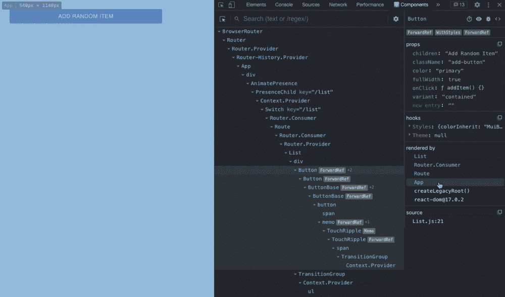
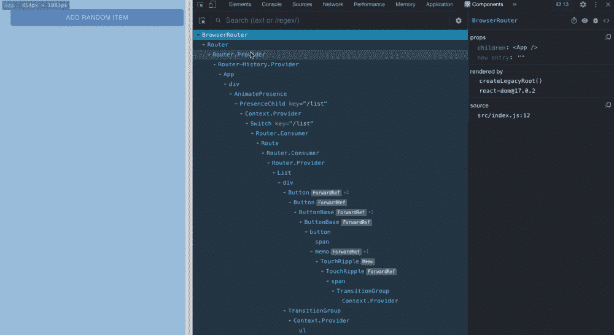
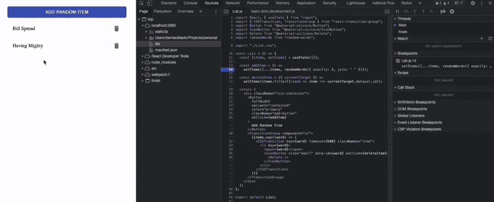
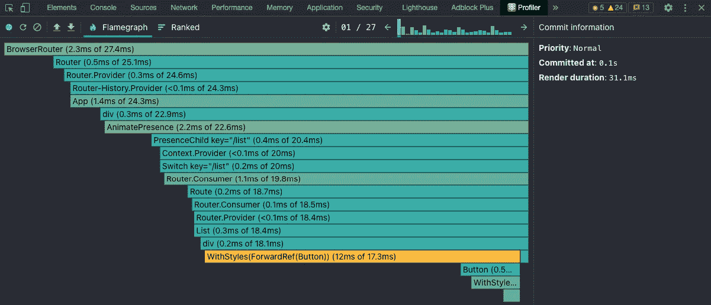
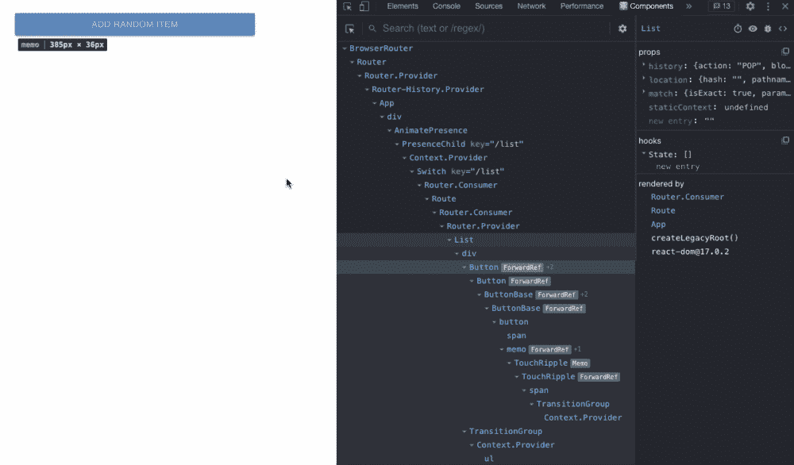
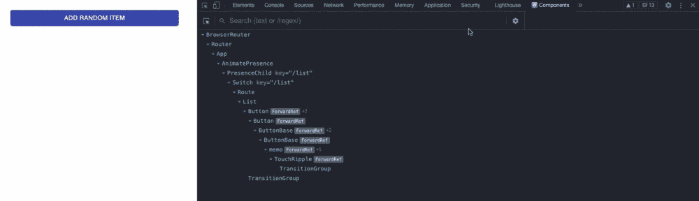
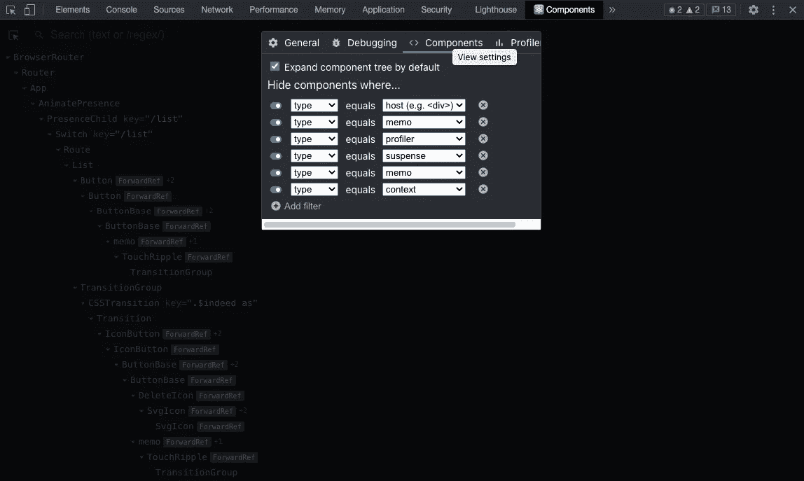

# 使用 React 开发工具如何让我成为更好的开发人员

> 原文：<https://levelup.gitconnected.com/how-using-react-dev-tools-made-me-better-developer-5e1f61e4e6d6>

## 你怎样才能变得更好呢！

由[奥斯汀·迪斯特尔](https://unsplash.com/@austindistel?utm_source=unsplash&utm_medium=referral&utm_content=creditCopyText)在 [Unsplash](https://unsplash.com/s/photos/expert?utm_source=unsplash&utm_medium=referral&utm_content=creditCopyText) 上拍摄的照片

> 就开发而言，调试是至关重要的部分之一。掌握这项技能将会提高你的工作效率。并加快您的开发工作流程。

为了掌握调试，我们需要利用可用的工具和技术。谈到 React 开发，一个突出的工具是 [React 开发工具](https://reactjs.org/blog/2015/09/02/new-react-developer-tools.html)

在本文中，我将分享我的经验、有用的技巧和我在使用这个工具时学到的技巧。最后，我将告诉你它如何使我成为一名更好的开发人员。💪

# 我简化了我的工作流程

编码的时候有一点让我很恼火。注意开关…

当我编写代码，或者在代码中发现问题时，我会看着编辑器。当我修复样式问题，或者查看组件的渲染方式时。我在用浏览器。

当我需要两者兼而有之时。我的`Tab`关键是日子不好过。🔨

直到我发现我可以直接在浏览器中做很多很酷的事情。React Dev 工具显示了许多关于组件的信息。但是它也让我们将这些信息记录到`Console`中。

这样，我们可以将组件状态的某些部分存储到变量中。或者更好的是，直接从`Console`访问组件函数或事件处理程序。

由作者捕获

我们需要做的就是突出显示组件，并按🐞图标。切换到`Console`后，我们可以看到我们组件的所有信息。

最终，我们可以在`React`选项卡中突出显示该组件。切换到`Console`并在终端键入`$r`。

这些特性减少了我在浏览器和代码编辑器之间切换的次数。现在，我感觉更专注，也更有效率。

# 我改进了我的调试

当谈到前端环境中的调试时。我们首先想到的是`console.log`。不要误解我，我仍然相信这是发现我们代码中问题的最快方法。

但是这很费时间。尤其是我们没有马上发现问题的时候。这是在那种情况下发生的事情。

我们需要在浏览器和代码编辑器之间来回切换。几乎无处不在。此时，只有天知道什么`console.log`属于什么线。

这都可以通过使用 React Dev 工具来简化。

首先，我们需要看到我们制造麻烦的组件的源代码。这可以通过按下`<>`图标轻松完成。

由作者捕获

> 当使用 [CRA](https://create-react-app.dev/) 、 [Next.js](https://nextjs.org/) 或[盖茨比](https://www.gatsbyjs.com/)时，该功能默认有效。对于定制的 Webpack 配置，使用[babel-plugin-transform-react-jsx-source](https://github.com/babel/babel/tree/master/packages/babel-plugin-transform-react-jsx-source)。

现在，我们可以给想要检查的代码行分配断点。并监视状态如何变化。

由作者捕获

在上面的例子中。我在`addItem`函数上有一个断点，它向`items`添加了一个新项目。当函数被调用时，应用程序暂停，我可以看到我的组件状态是什么样子。

这个简单的技巧让我的调试速度快了很多。现在，我在调试任何 React 应用程序时都非常自信。

但是 React Dev 工具不仅仅是用来调试的。我也在使用这个工具来提高性能。请继续阅读，了解如何做到这一点！

# 我发现是什么让我慢了下来

在 React v16.5 中有一个名为`Profiler`的新插件。

> 这个插件收集每个渲染组件的时间信息。帮助我们识别 React 应用程序中的性能瓶颈。

我们需要做的就是开始记录，然后与我们的应用程序进行交互。`Profiler`将记录交互。当记录停止时。它将为我们提供有价值的信息，如:

*   总共有多少次重新渲染
*   是什么导致了组件的重新渲染
*   渲染花费了多少时间

它还使用颜色来帮助我们识别需要长时间渲染的组件。红色是最慢的。绿色最快。

由作者捕获

使用这个插件，我能够识别一些组件是否降低了我的应用程序的速度。或者任何不必要的重新渲染。消灭了他们。让我的应用程序快得惊人！

# 我学到了有用的技巧

我们已经介绍了 React Dev 工具的基本特性，这些特性使我的生活更加轻松。现在，我将分享我在使用这个工具时学到的一些技巧和诀窍。🔥

## 直接操纵状态

可以在 React Dev 工具中直接修改状态。这也很简单。看看下面的例子就知道了。

由作者捕获

## 突出显示的渲染

React `Profiler`很好地展示了组件是如何重新渲染的。但是我发现更有用的是高光渲染。

当组件呈现或重新呈现时。该功能直接在视图中突出显示它。它看起来像这样…

由作者捕获

## 过滤组件树

组件树往往会变得非常大。尤其是在处理大规模应用时。这使得很难找到正确的组件。

幸运的是，我们可以过滤组件树。我个人喜欢设置我的过滤器，如下例所示。但是您可以根据您想要查看的组件类型进行调整。🕵️

由作者捕获

# **结论**

React 开发工具使得 React 应用程序的调试更加容易。需要一些时间来掌握。但是当正确使用时，它胜过使用旧的`console.log`。

如果您想了解更多关于安装和使用它的信息。请[按照这个指引](https://www.upbeatcode.com/how-to-use-react-developer-tools/)！