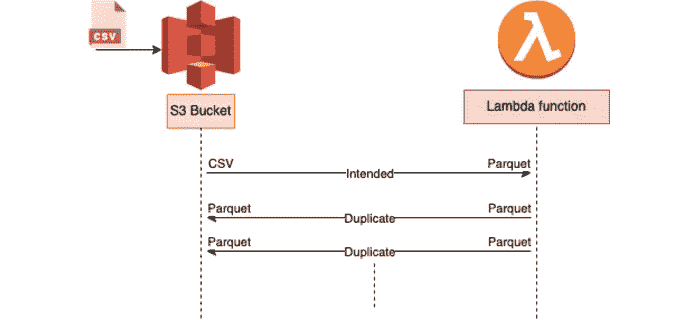

# 我们如何通过调用递归模式意外地烧掉了 40，000 美元

> 原文：<https://levelup.gitconnected.com/how-we-accidentally-burned-40-000-by-calling-recursive-patterns-571fe5ede90>

# 背景

几年前，我是一家航空公司物联网公司的顾问，负责构建分析架构，包括完整的数据工程管道和分析仪表板。

3000 多台物联网设备每天向 ETL 管道发送 200 GB 数据。这些数据临时存储在一个 SQL 数据库中，每四个小时就会以 CSV 文件的形式转储到 S3。根据他们工程主管的意见，我决定采取以下行动计划。

**设定上下文(已编辑)**:这件事发生在 2019 年，我不是 AWS 管理员。但是，作为我们政策的一部分:

*   我们通知他们的 AWS 管理员在项目开始前配置 cloudwatch 警报，但他们没有这样做
*   我管理着一个由四名工程师组成的团队，其中一名工程师编写函数
*   这是一个临时函数，应该只能工作两周，这就是为什么它写在 Lambda 上的原因
*   无服务器服务将按需扩展，配置保留并发或供应并发是 2019 年的新概念
*   等式中有太多我无法控制的因素，本文的目的是让开发人员了解递归模式，以便他们谨慎行事。

作为一名顾问，我建议对现有架构进行以下四项重大更改:

1.  整个历史数据将被转换为小时级*日期分区的爽快压缩拼花格式(****DPSCP****)*
2.  现有管道继续以 CSV 格式将数据转储到 S3，但是我们使用我们屡试不爽的脚本在两周的迁移期间将每个文件转换为 DPSCP—**问题出现在这里**
3.  开发一个新的管道，将即将到来的数据转储到 **DPSCP**
4.  使用 Athena 查询创建最终的 BI 仪表板(**注意:**实时仪表板是一个不同的用例)

**成功标准:**按工作顺序提供一切。我们必须能够以最低的现收现付查询成本查询所有可访问的数据，并且只需为 S3 上的数据存储付费。

# 问题和原因

在迁移过程中(第 2 步)，我们创建了一个为期 2 周的临时 Lambda 来监听 S3 桶事件，将它们转换成拼花，并发布到 S3。由于源和目的地的桶和前缀都被分配给同一个桶，它被触发了数百万次。

> 理想情况下，Lambda 应该在两周内每天将 24 个 CSV 文件转换为 Parquet。但是由于我们没有在处理后删除 CSV 文件(用于验证),而是基于 S3 事件进行触发，所以每当处理后转储新的 parquet 文件时，S3 事件会再次触发 Lambda，Lambda 会重复这个过程。

递归模式

无限循环导致 Lambda 扩展到使用所有可用的并发，而 S3 继续为 Lambda 编写对象和创建新事件。

# 成本分析

到 2 天结束时，这个循环已经运行了大约 40 个小时，花费了大约 40，000 美元，主要是因为 Lambda 并发和 S3 put 请求。

AWS 成本细分

# 预防方法

*   使用肯定触发器:例如，一个 S3 对象触发器可能使用一个命名约定或元标签，它只在第一次被调用时起作用。这将阻止 Lambda 函数编写的对象再次调用同一个函数。
*   **使用保留并发**:当一个函数的保留并发被设置为一个下限时，这个函数的并发不能超过这个限制。**它不会停止递归**，但作为一种安全措施，它会限制使用的资源量。在开发和测试阶段，这很有帮助。
*   **使用 CloudWatch 监控和警报**:通过在函数的并发性指标上设置警报，如果并发性突然上升，您可以获得警报，从而允许您采取正确的行动。

在下面的 AWS 文章中，可以在其他情况和服务中看到类似的模式。

 [## 导致 Lambda 函数失控的递归模式

### AWS 服务生成调用 Lambda 函数的事件，Lambda 函数可以向 AWS 服务发送消息…

docs.aws.amazon.com](https://docs.aws.amazon.com/lambda/latest/operatorguide/recursive-runaway.html) 

# 我们如何修复它

在 S3 时段中设置事件通知时，您还可以使用前缀或后缀按对象关键字进行筛选。我们通过使用两个不同的 S3 前缀来避免递归模式，即'*原始'*和'*已处理'*和 Sufix ' *。csv。*

我在 AWS 的博客上找到了这篇文章，它详细解释了这一点。

 [## 使用亚马逊 S3 和 AWS Lambda |亚马逊 Web 服务避免递归调用

### 最佳实践是将 Lambda 函数的输出存储在与源不同的 bucket 或 AWS 资源中…

aws.amazon.com](https://aws.amazon.com/blogs/compute/avoiding-recursive-invocation-with-amazon-s3-and-aws-lambda/) 

# 分级编码

感谢您成为我们社区的一员！在你离开之前:

*   👏为故事鼓掌，跟着作者走👉
*   📰查看[升级编码出版物](https://levelup.gitconnected.com/?utm_source=pub&utm_medium=post)中的更多内容
*   🔔关注我们:[Twitter](https://twitter.com/gitconnected)|[LinkedIn](https://www.linkedin.com/company/gitconnected)|[时事通讯](https://newsletter.levelup.dev)

🚀👉 [**加入高级人才集体，与最优秀的创业公司和科技公司联系**](https://jobs.levelup.dev/talent/welcome?referral=true)