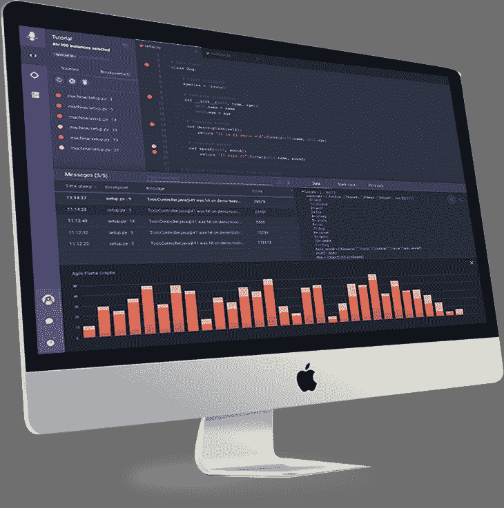
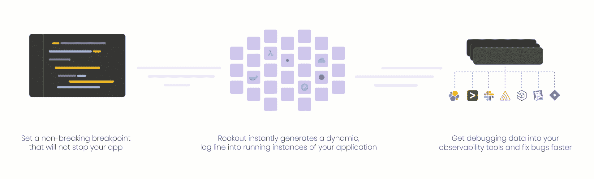
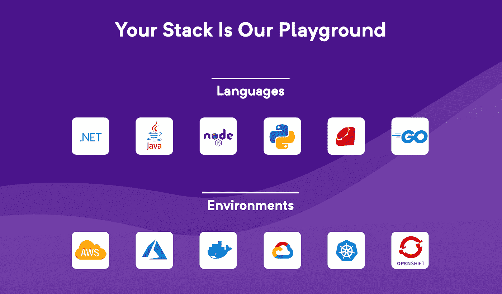
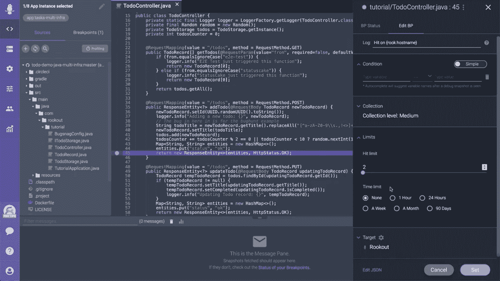
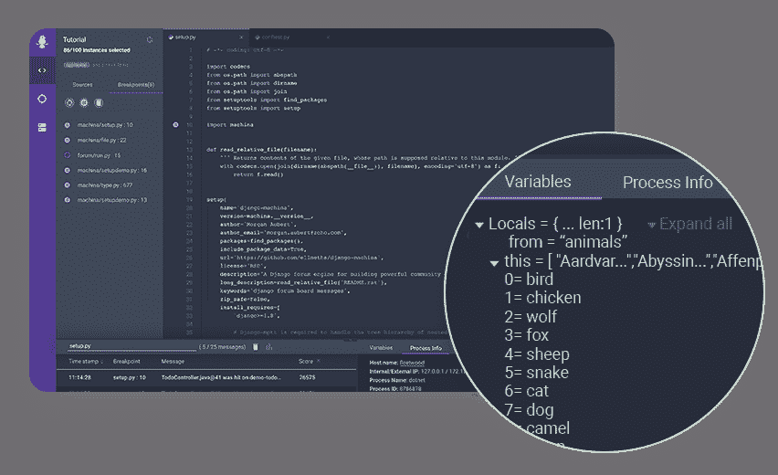
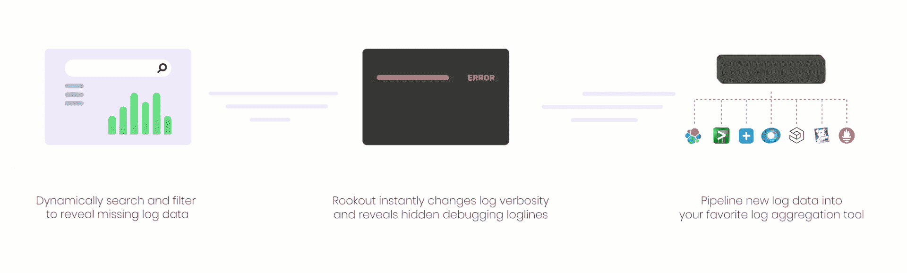

# 我们如何将生产调试引入云原生应用

> 原文：<https://levelup.gitconnected.com/how-we-bring-production-debugging-to-cloud-native-applications-d64661aa8f32>

## 采访 Rookout 的联合创始人兼首席技术官 Liran Haimovitch

本周，我们采访了 Rookout 的首席技术官兼联合创始人 Liran Haimovitch。Liran 分享了 Rookout 将一套强大的调试和日志工具引入生产的方法——快速找到并修复 bug 的最重要的地方。如果你有兴趣了解复杂的技术挑战，这次采访分享了 Rookout 的解决方案如何处理字节码和低级运行时 API，使他们能够获得详细的数据，同时确保你的应用程序保持快速。

> “我们处理字节码操作，研究运行时是如何实现的，并弄清楚 API 是如何工作的。最困难的部分是理解是什么减慢了运行时间。例如，Python 中的错误报告功能会使您的代码慢 20–30 %,这是没有人会使用的。通过字节码，我们可以提取错误和堆栈跟踪。”

> *= >在升一级编码中被面试➡️* [*填写这张表格*](https://forms.gle/zRs7Uhidtd7WTyCy8) *= >寻找一份令人惊叹的工作？➡️* [*访问升一级招聘平台*](https://jobs.levelup.dev/talent/welcome?referral=true)

# 介绍你自己和 Rookout

我叫 Liran Haimovitch，是 Rookout 的 CTO 和联合创始人。顾名思义，我从第一天起就在这家公司工作。

作为 Rookout 的首席技术官，我不仅仅是监督我们的工程、产品和安全组织。我还花了很大一部分时间来领导公司的开发者宣传。

Rookout 让每个开发人员的梦想成真，因为无论他们的代码在哪里运行，他们都能深入其中。无论您是将代码部署到云、Kubernetes、无服务器还是内部部署，Rookout 的平台都允许您确切地看到您的代码在每一行中做了什么。

我们的第一款产品 Live Debugger 为您带来了与远程环境相同的本地调试器体验，包括但不限于生产环境。

让这种神奇的工作是一个巨大的挑战，从深层的运行时级工程，到 UX 和 UI 挑战，以及对安全性、可用性等严格的非功能性需求。

# 深入了解一下——这意味着什么？

它是贯穿软件开发生命周期的实时调试器。当您在自己的机器上运行代码时，您有许多选择——调试、网络嗅探、进程监控等。你有大量的信息可以挖掘，让你看到应用程序是如何运行的。当你跳到云上时，你对你的代码只有非常狭窄的可视性。你有日志，这是低冗长。

我们试图弥合这一差距，把控制权还给你，我们希望给你这种能力，不管代码在哪里运行。我们希望您做一些事情，比如设置非中断断点(正如它们听起来的那样，因为它们是不中断生产代码的断点)，您可以在那里深入研究。我们抽象了一切，你不必担心区域，代码部署在哪里，或者如何部署。

该产品分为三部分:

1.  作为应用程序一部分的代理
2.  我们提供调试器体验的 SaaS 平台
3.  您可以像使用 IDE 插件一样使用数据的 UI

# 您使用什么技术堆栈，为什么选择这种堆栈？

Rookout 的技术堆栈是多层的。

在代理端，我们从头开始构建对每个运行时的支持。我们有用 Java、C#、JavaScript、Python、Ruby、Golang 和 C++开发的代理。它们中的每一个都必须单独测试、打包和部署。

在 SaaS 方面，我们采用了 NodeJS 作为我们的 API，采用了 facade 作为高并发性，以及对这个星球上几乎所有协议的惊人的生态系统支持。对于我们业务逻辑的核心，我们选择了 Golang，因为我们想要一种现代的类型安全语言。

# 对你来说，典型的一天是什么样的？

作为一名新爸爸，我的大多数早晨都是从尿布和打嗝开始的:)

有时候，我会四处走动，在地板上走动或在会议上发言，主持我的播客(生产第一的思维模式)，成为其他人的客人，或者只是会见我们的客户。

在其他日子里，我把时间花在高难度的技术挑战上。我特别喜欢挖掘语言运行时和其他复杂系统的能力和局限性，并理解如何操纵和调整它们来实现不可能的事情。

我写了很多核心技术，并且能够回答问题，但是我现在大部分时间都花在客户和社区上。我确实想念编码，我试着找时间去做。我会在晚上花时间挑选那些优先级较低的项目和事情，这样我就可以在有时间的时候处理它们。例如，大约一年前，我开发了 Ruby 代理，因为它没有得到足够的关注。

# Rookout 是如何起步的，有哪些来自创始团队的真知灼见？

Rookout 的基本目标是将工程师与他们真正重要的代码联系起来——在生产中。

作为软件工程师，我们花了大量的时间编写代码，实现我们的架构，让应用程序变得栩栩如生。然而，我们几乎只限于我们的笔记本电脑和其他开发环境，很少或根本不了解生产中发生的事情。

然而，生产中发生的事情才是最重要的。这是我们的代码对客户产生影响的地方。这是我们的架构接受测试的地方。这是我们的应用程序产生价值的地方。

Rookout 旨在为开发人员提供工具，让他们在生产环境中连接并拥有自己的应用程序。

# 你的商业模式是什么？你是如何成长起来的？

我们有基于层级的许可和免费增值选项。我们也有包含各种功能的商业许可。

我们的核心用户范围从小型创业公司到中型公司和财富 500 强公司。我们在生活的各个方面都会遇到他们。我们积极参加会议和聚会，这是会见客户的绝佳选择。我们遇到了对学习新技术感兴趣的软件工程师，你可能会在那里遇到他们。

# 是什么让 Rookout 独一无二？

使像 Rookout 这样的复杂工具成为可能需要多个学科之间的深度协同。

从低级代理工程，通过现代 SaaS 开发，到复杂的 web 应用程序，所有这些都由高级 DevOps 实践支持。

Rookout 团队具有高度的凝聚力，每个人不仅在自己的工作上表现出色，还能向整个团队的同事学习和传授知识。

# 你正在解决的最有趣的问题是什么？

在一个越来越没有代理的世界里，Rookout 仍然以基于代理的方式做事。让产品易于跨技术堆栈和云提供商部署是一项极具挑战性和令人满意的任务。

我们解决广泛的问题。人们开始处理的事情是生产中的错误，这些错误可能会非常令人讨厌。人们认为 Rookout 是高级用例的高级工具。他们把最好的开发人员和 Rookout 放在一起。但是这些工程师实际上是最不需要 Rookout 的人，因为他们对一切都非常了解。从 Rookout 中受益最大的是新用户。连接这些点是调试的关键，Rookout 提供了这一层来指导任何工程师解决问题。它使他们能够轻松阅读代码，并提供诸如代码运行频率和应用程序配置等洞察。静态阅读代码和查看日志是勇敢者的事。通常只需说“我想看看这一行代码中发生了什么”就可以更容易地获得直接可见性。

我们为不同的语言开发了六个代理。这些代理中的每一个都是为相关的运行时从头开始编写的。我们处理字节码操作，研究运行时是如何实现的，并弄清楚 API 是如何工作的。最困难的部分是理解是什么减慢了运行时间。例如，Python 中的错误报告功能会使您的代码慢 20–30 %,这是没有人会使用的。通过字节码，我们可以提取错误和堆栈跟踪。

# 一旦 Rookout 实现愿景，世界会变成什么样子？

我们希望工程师与他们的代码融为一体。不仅仅是当它平躺在他们的脑海里，像诗歌一样阅读。我们希望工程师与他们的代码融为一体，因为它在云中服务于他们的客户，在规模上为真实的人提供真实的价值。

我们想打破这个障碍。我们相信，一旦工程师可以不受限制地访问他们正在执行的代码，他们就可以真正拥有它。

# 你现在正在尝试的技术或工具中有没有让你感到兴奋的？

构建包是一种以简单易用的方式构建应用程序的超酷方式。应用程序和运行时环境之间的关注点分离非常棒，而且非常有前途。

然而，它的实现方式让人感觉笨拙且过于复杂。为什么我们不能自动执行我们的代码并完成它呢？

# 描述您的计算机硬件设置

我的硬件设置到处都是。我有一台 16 英寸的 MacBook Pro M1 至尊版，我很喜欢，但有点笨重。

在家里，我有一台基于 Windows 的电脑，配有一些很酷的硬件。我使用超宽屏幕(MSI MPG341CQR)，我建议任何工程师或游戏玩家都使用超宽屏幕——相信我，它们太棒了。

我有一台 Arctis Pro 无线音响，非常有趣。

对于播客，我使用 AT202 和 Focusrite Scarlet Solo。出色的音频，超值的价格。

# 描述您的计算机软件设置

作为一个 IntelliJ 的粉丝，我在任何时候都会安装大约 8 个不同的 ide。向 VSCode 中添加 iTerm2 和新的 Windows 终端，以及 Github Git 客户端。

# 你在招人吗？什么职位？

Rookout 一直在招聘，我们的核心工程团队在以色列。

在全球范围内，我们正在招聘解决方案工程师和开发者倡导者。因此，如果您热衷于在软件开发生命周期中让编码人员拥有自己的应用程序，请不要犹豫，立即行动吧！

# 我们可以去哪里了解更多？

作为一家以开发者为中心的公司，我们花了很多时间与社区合作。您可能会发现我们在公司博客和其他地方写的各种文章，以及我们团队在全球会议上的许多讲话。

了解更多信息的最佳途径是查看我们的网站，或者在 Twitter 上联系我 [@Liran_Last](https://twitter.com/Liran_Last)

# 分级编码

[Level Up](https://levelup.gitconnected.com/) 是一个每月 300 万开发者的社区([了解更多并关注](https://levelup.gitconnected.com/)或[阅读更多创业访谈](https://levelup.gitconnected.com/interviews/home))。我们还与最好的初创公司和最具创新性的科技公司合作🔥

*   你是开发者吗？有最优秀的公司要求聘用你
    ➡️[加入升一级的人才集体](https://jobs.levelup.dev/talent/welcome?referral=true)
*   ➡️ [**聘请 FAANG 级工程师**](https://jobs.levelup.dev/talent/welcome)
*   ➡️ [**面试申请表**](https://forms.gle/oWT83qtGdydfi7yL8) 对贵公司进行面试

我们还为开发者提供免费的职业成长工具: [**编码面试课程**](https://skilled.dev/) ， [**自动简历生成器**](https://gitconnected.com/resume-builder) ， [**作品集 API**](https://gitconnected.com/portfolio-api)

关注我们:[Twitter](https://twitter.com/gitconnected)|[LinkedIn](https://www.linkedin.com/company/gitconnected/)|[时事通讯](https://newsletter.levelup.dev/)