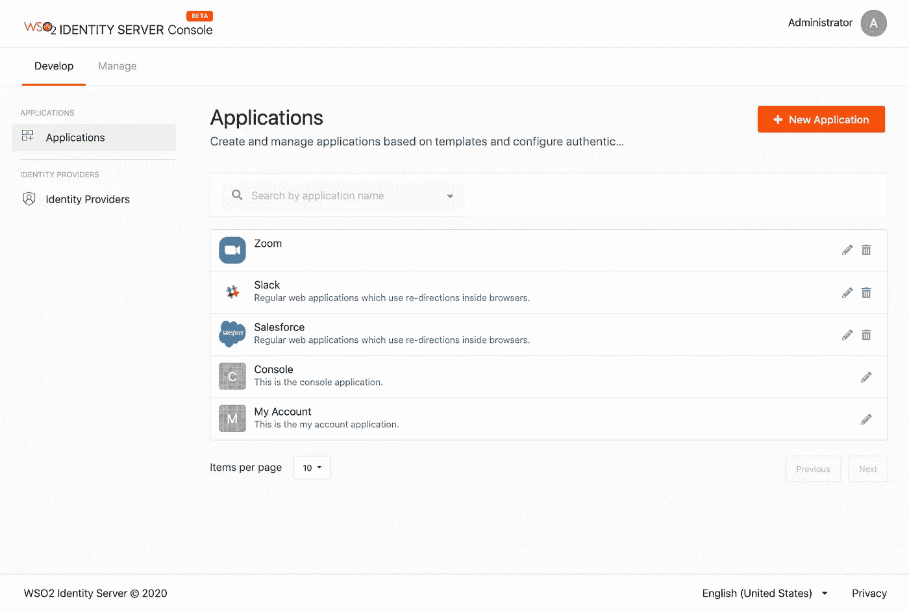

# 我们如何使用 React 为 WSO2 身份服务器构建前端应用程序

> 原文：<https://levelup.gitconnected.com/how-we-built-a-frontend-app-for-wso2-identity-server-with-react-6da996c673c2>

全新的控制台应用程序

WSO2 Identity Server 一直以技术精湛和功能丰富著称。但这还不足以满足我们。为了提供无与伦比的用户体验，我们想在我们的箭筒中增加一样东西。因此，我们推出了全新的控制台应用程序！

WSO2 Identity Server 的 5.11.0 版本提供了我们控制台应用程序的测试版。这个应用程序提供了一个大大改善的用户体验，允许管理员和开发人员通过一个直观和精心制作的用户界面来执行他们的任务。

在整个发布周期中，随着我们的团队集思广益，尝试不同的实现，该应用经历了多次设计和重新设计。这是控制台应用的起源故事。

# 早期

[https://unsplash.com/photos/9U4XBVsevfo](https://unsplash.com/photos/9U4XBVsevfo)

在完成我们的用户门户应用程序(从 5.11.0 开始将被称为“我的帐户”应用程序)的工作后不久，我们就开始着手控制台应用程序的工作。当我们开始的时候，我们确定了一件事——那就是，就像我们的 My Account 应用程序一样，它将使用 React 编写。

React 的虚拟 DOM，使状态更新更快更有效，卓越的开发者体验，当然，JSX 让它成为我们的自动选择。

我们选择语义 UI 来构建我们的 UI，因为它允许我们在 React 应用程序之外使用我们创建的主题。这允许我们在 React 应用程序和认证门户中使用相同的主题，这些应用程序和门户都是使用 JSP 编写的。

# 使用单一回购

由于我们的 My Account 应用程序也使用 React 和语义 UI 框架，我们希望重用控制台应用程序中的一些实用程序和组件。然而，由于我们继续致力于改进我的帐户的代码库，我们需要一种方法来修改可重用的代码，同时继续在控制台应用程序中使用它。

我们可以将可重用的代码转移到一个单独的存储库中，并将其发布到 NPM 注册中心，然后将其作为一个依赖项添加到我们的控制台应用程序中。但是这将严重减慢我们的开发工作流程。想象一下，如果我们要修改可重用的代码，我们将不得不修改代码，测试它，发布它，然后我们将不得不在控制台应用程序中修改依赖关系的版本以获取新的更改。

即便如此，也不能保证这些变化会如应用程序预期的那样发挥作用。确保可重用代码做它应该做的事情的最好方法是在应用程序中测试它。

这就是单一回购概念拯救我们的地方。mono repo 允许您在同一个存储库中拥有多个包，并允许使用一个包作为另一个包的依赖项。这完全符合我们的要求，在网上粗略研究后，我们选择了 Lerna，一个稳定且受欢迎的 mono repo 工具。

现在，我们在同一个存储库中拥有了我的帐户和控制台应用程序代码。可重用的 React 组件已经变成了一个组件库，并存在于同一个 repo 的模块目录中。可重用的类型脚本代码已经被捆绑到核心模块中。

因此，您现在拥有的是两个不同的前端应用程序在同一个 repo 中共享代码。这使得维护变得轻而易举，改进了开发工作流程，并使我们的代码更易于管理。保持祝福，mono repos！

# 还原还是不还原

[https://unsplash.com/photos/pKeF6Tt3c08](https://unsplash.com/photos/pKeF6Tt3c08)

我们一直在问自己，并努力回答的一个问题是，我们是否需要 Redux。当然，一旦我们启动了一个 React 项目，我们的肌肉记忆就会告诉我们安装 Redux。但是，我们真的需要 Redux 吗？

这个问题的答案取决于你是否需要一个全球性的单一真理来源。每个 React 组件都有其状态形式的真实来源，props 可以用来沿着组件树向下传递数据。通过巧妙的设计组件树，或者用 React 思考(React 的人喜欢这么称呼它)，你可以减少拥有一个全球单一的真实来源的需要。

通常情况下，组件调用 API 将它们的数据保存在后端，后端数据将作为您需要的唯一来源。除非迫切需要减少 API 调用的数量，或者您必须在使用之前转换返回的，否则此方法就足够了。

但是，在某些情况下，您可能希望所有组件都能够访问特定的数据。在这种情况下，将数据作为道具传递给所有组件是多余的。这里，有一个使用像 Redux 这样的库的强有力的例子。但是还有更多值得思考的。

React 的新上下文 API 允许任何组件订阅一个数据，从而允许组件在没有 props 的情况下从一个源访问数据。这个和 Redux 提供的差不多。那么，你选哪个？

最初，我们设法避开了对全球单一真相来源的需求。然而，我们很快意识到我们需要在全球范围内访问用户档案信息。由于用例很简单，我们考虑使用上下文 API。然而，我们的需求开始变得越来越复杂。我们还需要存储运行时配置细节(稍后将详细介绍)和本地化信息。

当我们努力在两者中选择一个时，我们也遇到了 React-Redux 在迁移到 Context API 后的性能问题，以及 React 开发人员反对将 Context API 视为 Flux 类架构的替代品的建议。

最后来了决定性的一击。当我们想要访问 React 组件/JSX 文件之外的单一真实来源时。Redux 提供了一个 API 来允许我们访问 React 之外的状态，而使用上下文 API 是不可能的。所以，我们用 Redux 继续前进。

# 函数还是类？

[https://unsplash.com/photos/8xAA0f9yQnE](https://unsplash.com/photos/8xAA0f9yQnE)

有了钩子，React 使功能组件和基于类的组件一样强大，很快我们就必须决定使用哪一个。我个人喜欢所提供的生命周期方法和基于类的组件的分类，并对 hooks 替换基于类的组件功能的能力有所疑虑。

然而，我们想要逃离基于类的组件中的高阶组件包装器地狱，并且反对一些暗示功能组件可能是未来的生命周期方法。因此，我们决定继续使用功能组件。

最初，我们发现不得不使用`useEffect`钩子而不是生命周期方法令人窒息，但是随着时间的推移，无可否认地，功能组件开始在我们身上增长。一旦我们掌握了钩子的窍门，我们发现函数比类简单和直接得多。迁移在开始时是一项令人生畏的任务，但是一旦你开始从功能组件的角度考虑，请放心，你会爱上它的。

这并不意味着功能组件不是没有缺点，因为当我们需要误差边界时，我们很快就知道了。错误边界确保组件中的错误不会破坏整个应用程序。相反，您可以在组件内处理错误并显示回退 UI。但问题是在功能组件中不可能有错误边界。

因此，我们决定用一个基于类的组件来包装给定页面上的功能组件，这样，它最多是一个会断开的页面。

# 惰性装载

[https://unsplash.com/photos/ri0ylwID5ao](https://unsplash.com/photos/ri0ylwID5ao)

随着我们的应用程序接近成熟，我们意识到最终的包有几兆字节大小。如此大的脚本文件将导致应用程序加载的相当大的延迟，对应用程序的用户体验产生负面影响。我们想减小包装的尺寸，以加快装载速度。

当然，我们做了显而易见的事情——我们分析了我们的依赖关系，并尝试用较小的替代方案替换较大的依赖关系。但是这并没有显示包大小有任何显著的改进。我们很快就接受了这样一个事实:我们的应用程序很大，因此我们的捆绑包也会很大。

因此，我们必须将代码分成多个块。动态导入帮助我们创建代码块，并确保它们只在用户需要时才被加载。因此，当用户加载应用程序时，只加载呈现登录页面所需的代码。当用户在应用程序中导航时，可以动态加载所需的块。这解决了应用程序需要很长时间加载的问题。

React 更进一步，帮助我们使用 React Lazy 特性将动态导入呈现为常规组件。我们需要做的只是将一个函数作为参数传递给 React.lazy()方法，该函数将返回一个动态导入。

但这带来了一个新问题。假设您正在延迟加载一个组件。该应用程序必须等到所需的代码块加载后才能呈现组件。在此之前，您不会在组件的位置看到任何东西。这将影响用户体验。理想情况下，我们应该显示一个加载器，直到组件被加载。怎么才能做到呢？

别担心，React(再一次)支持你。惰性加载组件实际上应该在悬念组件中呈现。暂记组件的回退属性接受将被呈现的回退组件，直到延迟加载的组件准备好为止。

使用 React 的延迟加载允许我们的应用程序在加载时间上显示出巨大的改进，这是所有大型应用程序中必须使用的。

# 运行时配置

我们希望我们的应用是可配置的。不，我们不希望我们的用户只是为了改变品牌而钻研代码。我们想要一种无代码的方式来做这件事。并且应该在运行时完成。

因此，我们创建了一个 JSON 文件，其中将存储所有部署配置细节。应用程序在初始化期间调度 GET 请求来加载该文件。一旦收到响应，我们就解析这个 JSON 文件，并将结果对象存储在一个全局变量中。

# 动态重塑应用品牌

应用程序将访问这个全局变量来加载相关的配置。例如，应用程序的名称就是从这个配置中获得的。所以，现在你知道应该做些什么来改变应用程序的名称。更改 JSON 文件中的名称，重新加载应用程序，瞧，标题中的名称也更改了！

# 支持 Internet Explorer

[https://unsplash.com/photos/anaUCgS2fqE](https://unsplash.com/photos/anaUCgS2fqE)

我们的一些客户继续使用 Microsoft Internet Explorer 和 Microsoft Edge Legacy，我们必须确保我们的应用程序在这些浏览器中运行良好。因为在大多数其他浏览器中工作的一些本地 API 在微软的传统浏览器中不工作，所以我们的工作被砍掉了。

我们最初尝试聚合填充不受 Internet Explorer 支持的 API，但我们很快发现手动聚合填充所有缺失的浏览器 API 几乎是不可能的。此外，我们还遇到了一些 CSS 在 Microsoft Internet Explorer 中无法正常显示的问题。所以，我们不得不寻找一个替代方案。

进入巴别塔。从 ts-loader 切换到 babel-loader 允许我们将代码移植到 Internet Explorer 上运行。此外，我们将 babel 配置为使用 core-js 来填充在 Explorer 中不工作的 API。

但是这并不能解决 CSS 问题。因此，我们使用 autoprefixer 包和 postcss-loader for webpack 来传输 css，以便在 Internet Explorer 中正确呈现。

但是，聚合填充最终会增加最终束的大小。你必须在支持不同的浏览器和确保这不会影响应用程序在最常用的浏览器中的性能之间做出权衡。至于你在哪里划定界限，说我们不支持这些浏览器，这取决于开发者。

但是你如何告诉 Babel 和 autoprefixer 这些是你打算支持的浏览器呢？那么，package.json 文件中的 browserslist 属性允许我们以一种非常简单的方式传达这些信息。您可以在一个数组中提到您想要支持的浏览器的名称，或者像我们所做的那样，您可以决定支持浏览器——基于它们的市场份额。我们将其设置为大于 0.2%，这意味着我们的应用程序将在市场份额大于 0.2%的浏览器上运行。

# 包扎

旅程并没有结束。毕竟，我们只发布了该应用的测试版。随着我们不断努力改进所有应用程序并增加新功能，我们确信将会有更多的冒险经历和经验教训。截至目前，我们的控制台应用程序正在准备经历另一个完善和丰富的发布周期。