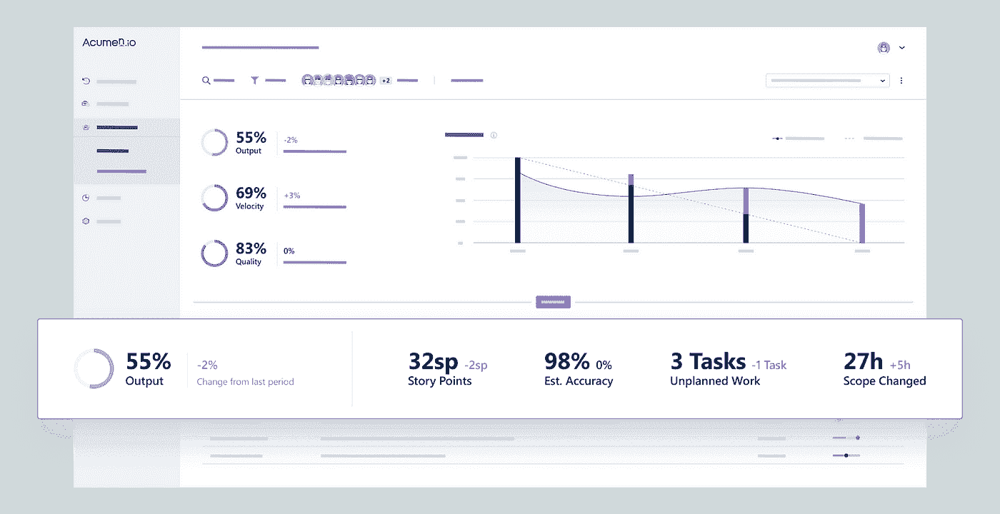
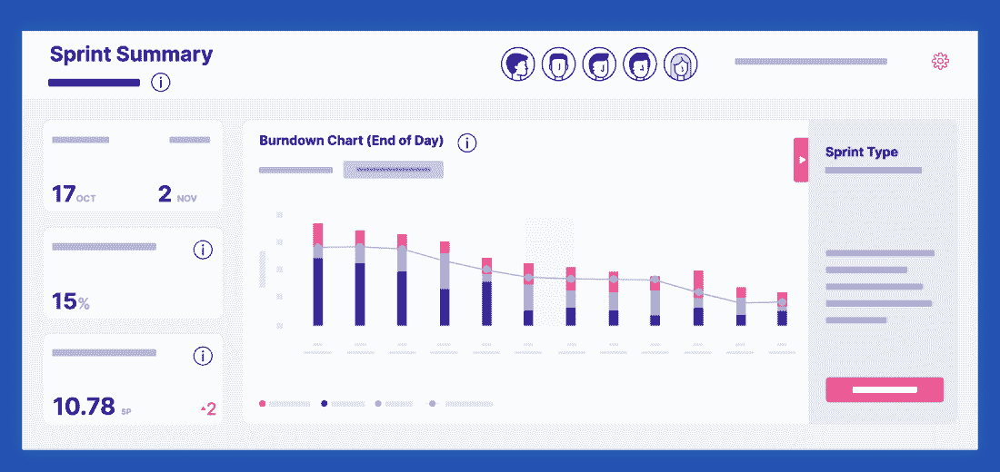
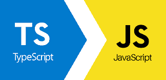
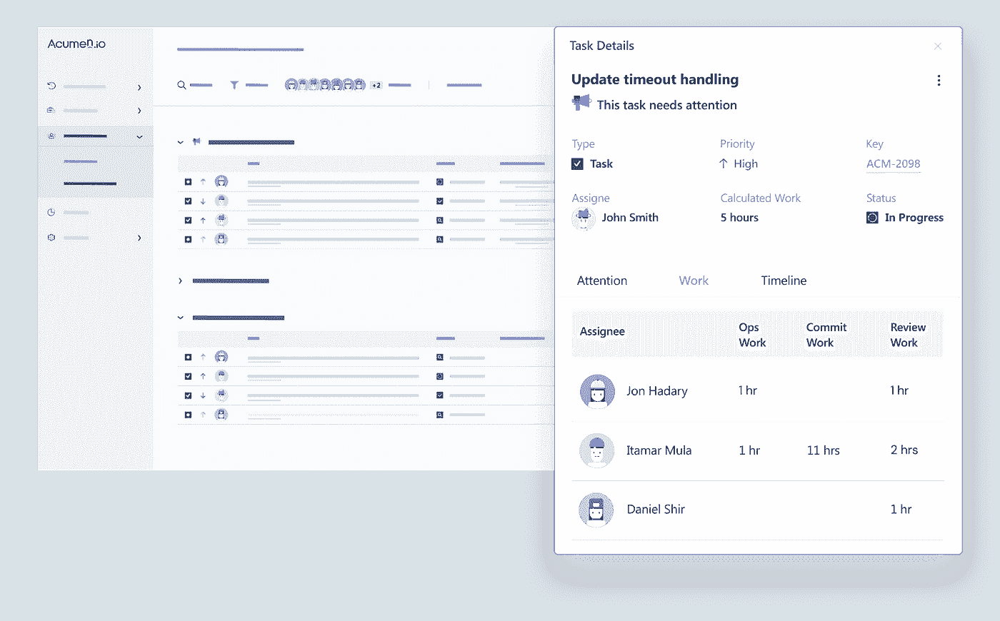
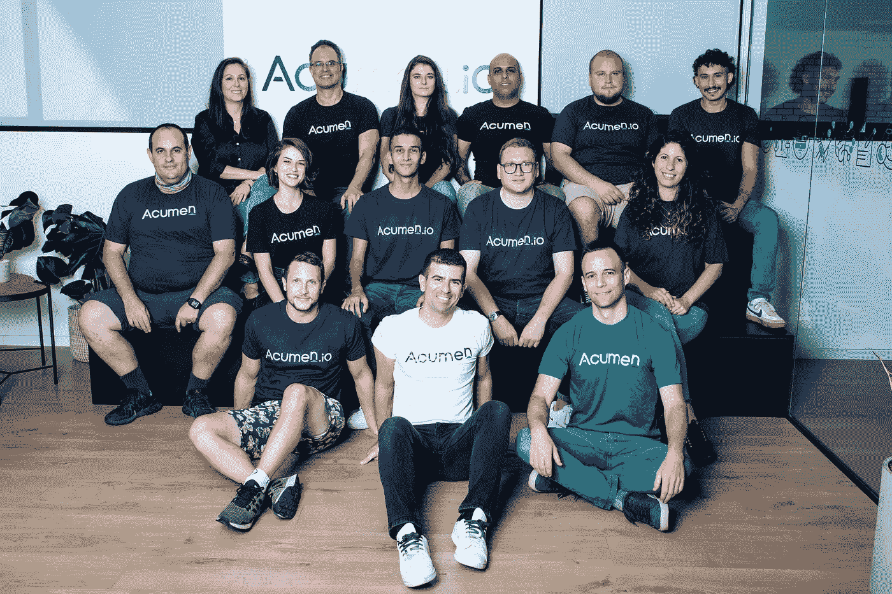
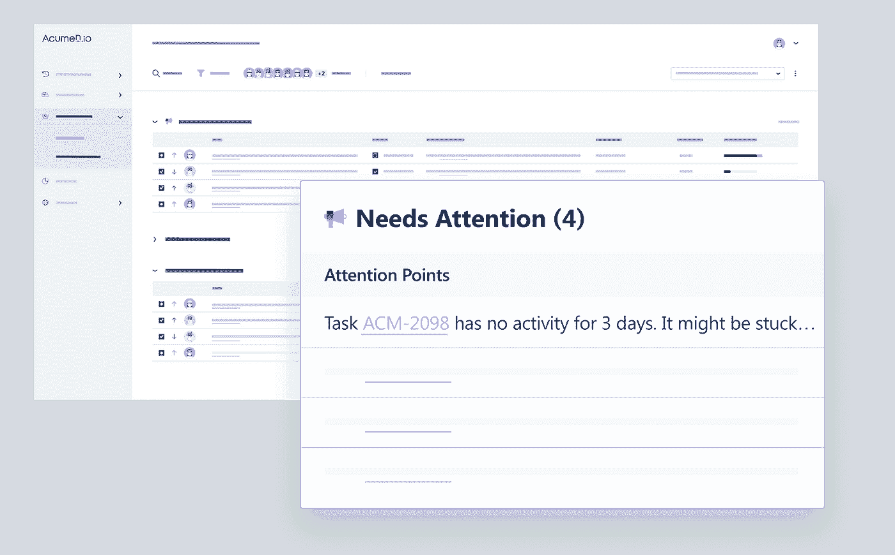

# 我们如何创建一个解锁数据的产品，使其成为公司的秘密武器——用 TypeScript 构建

> 原文：<https://levelup.gitconnected.com/how-we-built-a-product-that-unlocks-data-making-it-a-companys-secret-weapon-built-on-typescript-34a59ad9892c>

## 对 Acumen.io 首席技术官兼联合创始人丹尼尔·希尔的采访

本周我们采访了丹尼尔·希尔，他分享了他作为 [Acumen.io](https://www.acumen.io/) 联合创始人兼首席技术官的经历。我们的世界是由数据统治的，Daniel 分享了 Acumen 如何使用一家公司的所有*数据来释放他们的全部潜力并创造跨团队的可见性。*

> *>参加编码水平提升的面试➡️ [填写这张表格](https://forms.gle/zRs7Uhidtd7WTyCy8)
> >寻找一份令人惊叹的工作？➡️ [访问升级招聘平台](https://jobs.levelup.dev/talent/welcome?referral=true)*

> ***“有一个无人问津的数据宝库，可以改善他们的生活。[……]我们仍然在处理 5 年前的相同错误和问题。现在是时候从我们的错误中吸取教训，并找出如何才能变得更好。”—丹尼尔·希尔***

**

# *你的公司是做什么的？*

*我们公司帮助软件开发团队提高他们的生产力、可靠性和可预测性。多年来，我一直有这样一个想法，我们拥有所有这些宝贵的 R&D 数据，但没有人对此做任何事情。解开这些数据就像一个秘密武器。它帮助高绩效团队诊断他们的问题并改进。*

# *这是一个非常有趣的想法，并且确实有助于创建真正创新的公司——你能解释一下这是如何工作的吗？*

*它连接了组织内部与软件开发相关的大量数据源(源代码控制、项目管理、Slack、CI/CD 等)。)，我们获取数据，进行一系列分析，将它们混合/同步，然后进行排序。然后，我们使用这些关于开发过程的数据来发现瓶颈和问题。比如很多公司会说这样的话，“我知道这个流程坏了，但是我不知道为什么。我需要数据来备份它，这样我就可以有效地分配资源来修复它。”*

*随着产品的发展，高层和高管喜欢它带来的洞察力和数据。然而，我们看到，要推动变革，我们必须赢得开发团队本身的人心。因此，我们必须调整产品，为身处困境的人们提供强有力的解决方案。我们推出了一个副产品 Go-Retro，并提供了与吉拉的连接，以便更好地分析 sprints。它显示了 sprint 的对错。追溯现在是数据驱动的，而不是工作人员的意见驱动的。*

**

*敏锐. io*

**

*复古*

# *您使用什么技术堆栈，为什么选择这种堆栈？*

*我可能是这个星球上最大的 JavaScript 支持者。十多年来，我一直用它做各种事情。TypeScript 现在是我绝对喜欢的语言。类型安全真正弥合了灵活性和拥有庞大代码库之间的差距。*

*在前端方面，我们大多使用反应与一些角洒在这里和那里。*

*最后，对于 DevOps 来说，所有的东西都在 k8s 上，因为这让你可以做你想做的事情。*

# *你如何使用 React 和 Angular？*

*敏锐完全在于反应。我们已经有了一名初级工程师，React 角色也很容易雇佣。当我们创建 Go-Retro 时，我们将它交给一个开发人员作为拥有整个堆栈的实验。我们没有想到它会如此成功，现在它是一个人们喜爱的产品。所以，现在我们有单独的反应和角度产品。*

**

# *TypeScript 也是我最喜欢的语言——我用它做任何事情。你为什么喜欢它？您是否注意到任何可伸缩性问题？*

*TypeScript 是我最喜欢的语言。我的背景是 C 和 C++，我有年复一年的严格类型语言。2010 年，在我之前的创业公司，这是 Node 出现的时候，我开始将它用于小型微服务。它是如此的简单和有趣。然后我们在 Node 中有 20 多个服务。它真的很容易写，但是调试和重构真的很痛苦。我们认为服务必须非常小。它应该是 1200 行或更少，因为在这一点上，它变得太不规则。*

*我的公司在 2015 年被收购，然后在 2017 年 TypeScript 出现了，所以我们决定尝试一下。我们有一个具有 C#背景的开发人员支持它，所以我们用 TypeScript 编写了我们的第一个微服务。然后我们做了一个实验，让另外两个没有 TS 经验的开发人员给项目添加特性，他们很快就学会了 TS，没有任何问题。*

# *对你来说，典型的一天是什么样的？*

*我们的 R&D 分为两个团队，所以我主要负责监督。我真正参与到技术设计和评论中。我的团队和开发人员一起领导几乎所有其他的工作。我有时还是会写代码，这很好。*

**

# *公司是怎么起家的？*

*当我在以前的工作中管理一个相当大的团队时，我注意到我总是缺少数据来支持我的直觉。我开始摆弄电子表格和脚本，试图将数据联系在一起，以断言和验证我的想法。那时我突然意识到这种工具应该存在。更进一步，我们提供见解的方式之一是通过 scrum 回顾会议，这是我们的工具 GoRetro.ai 发挥作用的地方。这是一个非常简单的回顾管理工具，允许您将数据洞察注入到您的回顾会议中。这样，你就能确定你在追溯什么是重要的。*

# *你最初是如何进入软件开发的？*

*我在大约 11 岁的时候学会了 QBASIC。当我看到我可以把我的名字打印到控制台上时，我就着了迷。*

# *自从 QBASIC 以来，软件是如何发展的，你是如何保持最新的？*

*我不认为这很难。在这份工作中，很大一部分是拥抱变化。我已经经历了这么多编程语言，我甚至还在涉足 Perl。您可以有自己的喜好，但是随着行业的发展和变化，软件变得越来越复杂，您需要更好的工具。*

*如果你想到你认识的优秀程序员，他们喜欢钻研新事物。他们接受新的挑战，拥抱成长。*

*你仍然需要在“闪亮的新东西”和实用性之间取得平衡。每个人都有白天的工作和晚上的工作。我最近的生活是我的孩子和阅读。不过以前，我会在晚上尝试新的工具和语言。*

*如果你擅长尝试，你通常会得到好的结果。你需要阅读并跟上时代。你需要建立背景来做出正确的决定。*

*Golang 仍然有一些问题，就像我们以前遇到的线程问题一样(争用和锁)。用 JavaScript 和 TS，你得不到那些东西。你还是可以搬起石头砸自己的脚，只是难度大了一点。*

# *是什么让你的公司与众不同？*

*我们对我们公司的多元化感到非常自豪。我们是一家 20 人的公司，50%的员工是女性。这听起来可能很明显，但在技术上却非常不同。*

*如果我们特别谈论 R&D，我们的口号是每个人都应该“接触”代码库的每个部分。这就是为什么我们的开发人员不工作在一个单一的学科(例如，只是后端)，而是创建完整的功能(后端+前端+数据+开发运维)。*

**

# *你正在解决的最有趣的问题是什么？*

*在业务方面，让人们(尤其是开发人员)提高是非常困难的。想象一下，试图说服某人定期去健身房。*

*对于技术方面，我们有很多很多的数据问题。每个开发人员只是以不同的方式使用工具。数据的多样性令人震惊。*

# *一旦你的公司实现了愿景，世界会变成什么样子？*

*希望我们会有一个软件开发比现在更有效的星球。*

*我真的认为我们帮助开发团队接触并看到是什么阻碍了他们变得更好。假设每个人都接受它，我真的相信软件开发会有很大的改进。有一个没有人看的数据宝库，可以改善他们的生活。当敏捷进入这个领域时，它改变了做事的方式。软件必须处理更复杂的事情——更大的团队和软件。*

*我们认为我们正在到达一个转折点。我们仍然在处理 5 年前的同样的错误和问题。是时候最终从我们的错误中吸取教训，并找出我们如何才能变得更好。对于非开发人员来说，理解正在发生的事情也是有帮助的。我们有大型的跨职能团队，现在可以让他们洞察和了解整个流程，并提供问题的答案。*

*开发人员是公司最昂贵的部分，很难找到好的。每个开发者都有好的和不好的经历。他们工作快的那家公司有哪些地方是对的？每个人都会给出为什么会成功的直觉——我们给你数据来理解为什么好的经历会让你有力量。*

**

# *你现在正在尝试的技术或工具中有没有让你感到兴奋的？*

*现在没有一种神奇的工具能把一切都吹走。我总是说我最喜欢的界面是终端，因为它简单明了，没有惊喜。我仍然爱我的终端。我有一个 app，在 apps 里分析我的时间，50%是终端。*

# *描述您的计算机硬件设置*

*2019 英特尔 Mac，不花哨，但可靠，完成任务*

# *你在招人吗？*

*对于 fullstack 高级开发人员来说，总是如此。我们既做远程又做本地。我们希望人们喜欢打字稿。我们也相信每个人都应该触摸一切。每个人都审查其他人的代码。你知道整个代码库中发生了什么，并开始推动产品前进。*

*https://www.acumen.io/acumen-careers*

# *我们可以去哪里了解更多？*

*Acumen.io & GoRetro.ai*

# *分级编码*

*[Level Up](https://levelup.gitconnected.com/) 是一个每月 300 万开发者的社区([了解更多并关注](https://levelup.gitconnected.com/)或[阅读更多创业访谈](https://levelup.gitconnected.com/interviews/home))。我们还与最好的初创公司和最具创新性的科技公司合作🔥*

*   ***你是开发者吗？**有最优秀的公司要求聘用你
    ➡️[t14】加入到人才集体 t16】](https://jobs.levelup.dev/talent/welcome?referral=true)*
*   *➡️ [**聘请 FAANG 级工程师**](https://jobs.levelup.dev/talent/welcome)*
*   *➡️ [**面试申请表**](https://forms.gle/oWT83qtGdydfi7yL8) 到贵公司面试*

*我们还为开发者提供免费的职业成长工具: [**编码面试课程**](https://skilled.dev/)[**自动简历生成器**](https://gitconnected.com/resume-builder)[**portfolio API**](https://gitconnected.com/portfolio-api)*

*关注我们:[Twitter](https://twitter.com/gitconnected)|[LinkedIn](https://www.linkedin.com/company/gitconnected/)|[时事通讯](https://newsletter.levelup.dev/)*