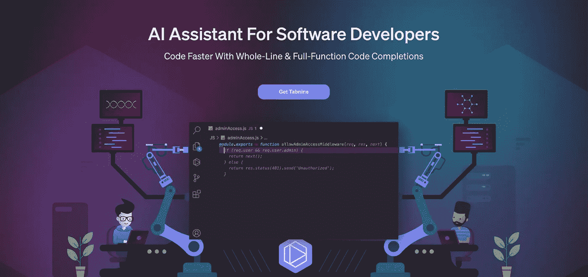
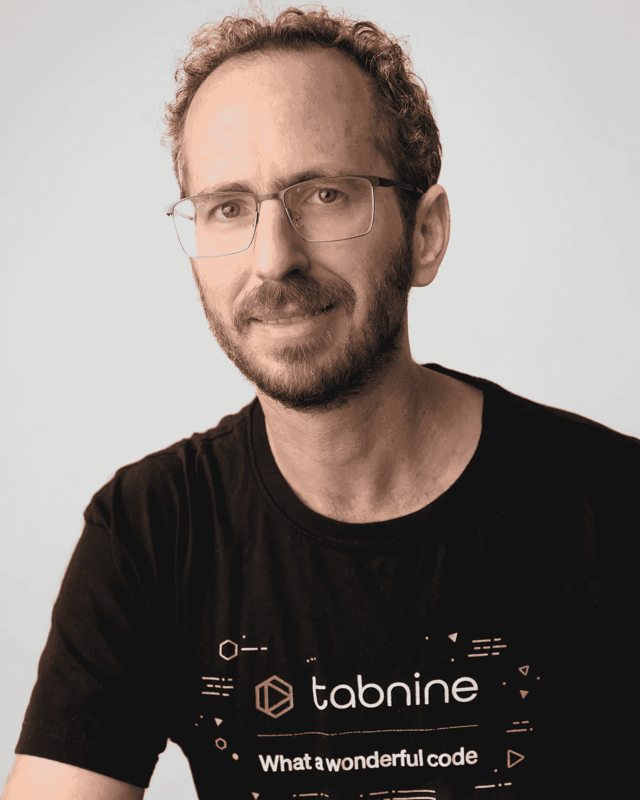
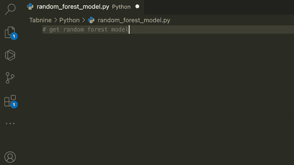
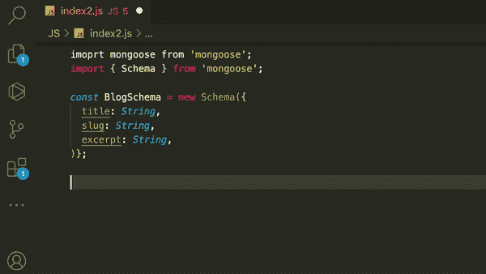
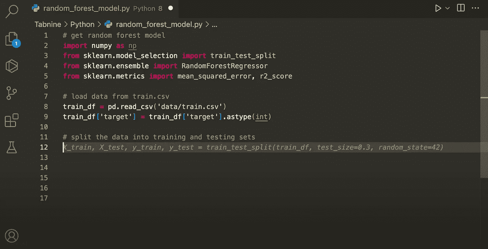

# 我们如何建立一个人工智能代码完成工具，将开发人员的生产力提高一倍以上

> 原文：<https://levelup.gitconnected.com/how-we-built-an-ai-code-completion-tool-that-will-more-than-double-developer-productivity-d1a5aa7bfb25>

## 采访 Tabnine 的首席执行官和联合创始人 Dror Weiss

本周，我们采访了 Dror Weiss，他是 Tabnine 的首席执行官和联合创始人。Tabnine 是一个🔥惊人的🔥面向程序员的 AI 代码完成工具，也是我个人用来大幅提高自己工作效率的工具。系好安全带，享受 Dror 的精彩采访，了解他们如何推出最受开发者欢迎的 AI 工具。

**“开发者的 AI 助手。用 AI 更快地出货更好的软件。”**

> 想让你的公司接受高级编码面试吗？[填写这张表格](https://forms.gle/zRs7Uhidtd7WTyCy8)。
> 
> 如果你是一名正在找工作的开发人员或公司招聘人员，[请访问升级工作平台](https://jobs.levelup.dev/talent/welcome?referral=true)。

# 你的公司是做什么的？

Tabnine 是一个人工智能助手，它利用技术帮助软件开发人员变得更好，工作更智能。我们的开创性产品是一个提供人工智能代码完成的人工智能助手，以便开发人员在键入时获得代码建议，一般开发人员有 30%的代码是由 Tabnine 编写的。

# 公司是怎么起家的？

Tabnine(原 Codota)由我本人[Dror Weiss (CEO)]和 Eran Yahav (CTO)于 2017 年创立。基于我们之前在代码分析和模拟方面的工作，我们意识到，随着代码中大量的通用性和标准模式，人工智能将不可避免地成为开发过程的关键部分。我们开创了人工智能代码助手类别。

# 公司的竞争对手是谁，是什么让 Tabnine 与众不同？

AI 代码辅助市场由两个玩家主导:Tabnine 和微软的 Copilot。这两种产品的技术方法大相径庭。微软依赖于一个单一的巨大的单片人工智能模型，只能由微软托管。我们喜欢较小的代码原生人工智能模型带来的灵活性和敏捷性，每个模型都是在特定语言或领域上从头开始训练的。

我们目前有十几个这样的模型，可用于所有流行的语言，还有由生态系统合作伙伴培训的社区模型。这让客户能够灵活地在我们的云或他们的网络上运行 Tabnine，并能够训练定制的人工智能模型，以捕捉他们存储库中的特定模式。Tabnine 提供每一次击键的建议以及整行或功能建议，而 Copilot 仅限于提供新行的建议，因为推理成本和等待时间要高得多。

Python 完成

# 你正在解决的最有趣的问题是什么？

以前是 Tabnine 给小而频繁的建议，副驾驶大块。Tabnine 现在两者兼而有之，完全是独一无二的。

有很大的建筑差异。Copilot 依赖于法典，他们相信一个模型来统治他们。我们将代码完成/产品与模型分离。你可以用任何兼容的型号运行 Tabnine，我们的要小得多，也更敏捷。我们从零开始建造这一切。这不仅仅是一种模式，而是针对不同情况的多种模式。你可以在私有代码上训练你自己的模型。连自己运行 Codex 都不可能，所以 Copilot 无法本地操作。然而，有了我们新的更轻便的模型，你可以在你的计算机或公司服务器上运行它们。你不只是使用模型，你还在各个方面控制它。

你甚至可以训练你自己的模型，因为它已经解耦了。所以可以有社区建设模式，我们都可以分享它们。

## 创建这种新方法的挑战是什么？

人工智能堆栈的每个组件都需要大量的工作。新的训练管道，在将代码发送到模型之前处理代码的新方法，以及新的推理机制，等等。除此之外，我们需要在人工智能后端上插入产品的过程——这种分离需要相当多的工作。我们不再使用在文本上预先训练好的模型，并在代码上对它们进行调整。我们采用空模型，从代码开始训练它们。**它利用了整个学习能力，并在代码上训练它，而不是只训练一小部分。**比如你拿一些 Python 代码，它理解代码本身的基本原理。

# 一旦你的公司实现了愿景，世界会变成什么样子？

我们相信软件开发的未来将是开发者和人工智能的结合。两者都不会占据主导地位，我们将在人类智能和人工智能之间获得正确的结合。人类给出方向，人工智能填写细节。Tabnine 使开发人员的速度提高了 30-40 %,我们相信随着技术的进步，这一数字还会继续增长。

**我们过去认为我们可以让开发者的生产力翻倍，但现在我们认为上限更高。**

我们相信每个开发者都会使用 AI。我们相信每个组织都将使用人工智能作为其堆栈的一部分。就像组织使用源代码控制和持续集成一样，AI 将成为公司员工如何更好地一起有效编码的不可或缺的一部分。人工智能将填补部落知识的空白。它将确保每个人毫不费力地以完全相同的方式书写。人工智能将知道用于确保一致性和高代码质量的模式和风格。这不仅仅是为了更快，而是为了成为更好的开发人员，并与组织编写代码的方式保持一致。

我们的愿景的最后一部分是成为一个其他方可以训练他们的人工智能的地方。目前，我们交付的大部分是基于我们的人工智能和它认为好的代码。然而，如果我们想抓住一个社区或伟大的个人开发者，我们可以成为一个平台，使其他人能够编写和发布最佳实践，并加强一致性。

公司开发商生态系统/社区

猫鼬代码完成

# 您使用什么技术堆栈，为什么选择这种堆栈？

总的来说 Tabnine 是用 Rust 写的。我担心这会很难，但是团队真的很努力。他们喜欢优雅和性能。除了 Rust，我们用 Python。

**使用低级语言会降低工作效率吗？**总有代价和权衡。相对于 Python 这样的东西有一个学习曲线。还没有人知道铁锈，所以可能要几个月。工具还没有完全到位，构建时间可能会更长一些。没有免费的午餐，但我们喜欢我们得到的好处。

**你为什么选择铁锈？**我们选择 Rust 的主要原因是速度和安全性，但不止于此。我们在开发人员的本地机器上运行的模型，如果不在非常低的级别上运行，几乎没有办法做到。为了在本地开发机器上进行预测，我们必须在裸机上运行它。

# 你的团队是什么样的？

我们目前在美国和以色列有 30 名员工，计划在年底前将团队扩大到 40 人以上。

我想建立人工智能模型需要大量的脑力——你的研究团队有多大？我们的研究团队小得惊人。我们有一个整体扁平的团队，没有人专注于任何单一的角色。我们有身兼数职的优秀人才。对于我们的新代码生成，我们有 7-8 个人在开发我们的新代码生成工具。通过精益，我们能够快速移动。

# 是什么让你的公司与众不同？

我们的团队热爱这项任务以及他们正在解决的问题。有很多权衡。他们是他们在 Tabnine 制造的产品的用户。没有单一的策划者，每个人都有所有权和贡献的能力。对于那些真正相信问题领域的人来说，这是一件非常有趣的事情。

## **还有其他有趣的统计数据或人工智能和机器学习的用途值得强调，但在发布中没有提到，特别是可能在企业中应用的数据或用途吗？请讨论用于训练各种模型的数据集，这些模型中的潜在偏差是如何减轻的，等等。**

*   在构建可信、安全的模型时，数据的重要性怎么强调都不为过。Tabnine 很早就决定只训练完全许可的代码(例如，MIT 和 Apache 2.0 许可证)，以便我们的客户可以信任 AI 的输出。
*   我们已经建立了独特的能力来训练和保护基于客户专有代码的定制模型，仅供其开发人员使用。
*   我们的模型可以运行在 Tabnine Cloud 上，也可以运行在客户的 VPC 上。
*   从技术上来说，我们的代码原生模型(在我们新发布的下一代平台中有所体现)远远优于我们以前基于 GPT 的模型，因为它们专门针对来自编程语言的代码进行训练，所以模型学习的原语是那些适合特定数据集的原语。此外，这些模型的整个学习能力都致力于学习代码中的规则和模式，从而比针对代码进行微调的文本模型产生更好的性能。
*   我们已经重新设计了该平台，因此它可以使用由 Tabnine 和合作伙伴构建的全新模型。我们的下一代模型是代码原生的，比 Tabnine 早期版本中使用的模型更强大。随着像 Meta 和 SFDC 这样的公司的新研究出来，我们也能够在此基础上构建，并在代码时间内将这些模型交付给我们的开发人员。

# 自上一轮融资以来，你希望强调哪些主要的新产品功能/企业新闻？

*   为 Python、JavaScript、TypeScript、Java、Ruby 和其他 7 种语言培训的新模型(如前所述)。
*   Tabnine 私有模型培训—与 GitLab、BitBucket 和 GitHub 集成。
*   Tabnine 社区模型。
*   Tabnine 企业计划。
*   强劲的用户增长
*   企业客户对他们开发团队的私有模型感兴趣

# 从写代码过渡到做 CEO 是什么感觉？

从 90 年代初的高中开始，我就一直是一名软件开发人员。我从开发人员成长为团队领导和管理组织的标准职业道路。在创建 Tabnine 之前，我过渡到了一个产品角色，这给了我更广阔的视野。在塔布宁，我又开始动手了，感觉棒极了。随着我们的成长，我已经转型为首席执行官，这是一个学习的过程。第一天你没有所有的答案，最好找好的导师。你每个月都在努力变得更好。在我所生活的领域中过渡到首席执行官让事情变得更容易，我不会在我所知之外的领域中这样做。我已经了解了这个领域和问题，所以最大的挑战是学会成为一名首席执行官。

# 我们可以去哪里了解更多？

访问[选项卡](https://www.tabnine.com/?utm_source=youtube.com&utm_medium=Ins&utm_campaign=GITCONNECTED)了解更多信息

# 分级编码

[Level Up](https://levelup.gitconnected.com/) 是月活 300 万开发者的社区([了解更多并关注](https://levelup.gitconnected.com/)或[阅读更多访谈](https://levelup.gitconnected.com/interviews/home))。我们还与最好的初创公司和最具创新性的科技公司合作🔥

*   你是开发人员吗？有最好的公司向你伸出援手
    ➡️ [**加入到人才集体**](https://jobs.levelup.dev/talent/welcome?referral=true)
*   ➡️ [**聘请 FAANG 级工程师**](https://jobs.levelup.dev/talent/welcome)
*   ➡️ [**面试申请表**](https://forms.gle/oWT83qtGdydfi7yL8) 到贵公司面试

我们还为开发者提供免费的职业成长工具: [**编码面试课程**](https://skilled.dev/) 、 [**自动简历构建**](https://gitconnected.com/resume-builder) r、 [**portfolio API**](https://gitconnected.com/portfolio-api)

关注我们的 [**Twitter**](https://twitter.com/gitconnected) 和 [**LinkedIn**](https://www.linkedin.com/company/gitconnected/)