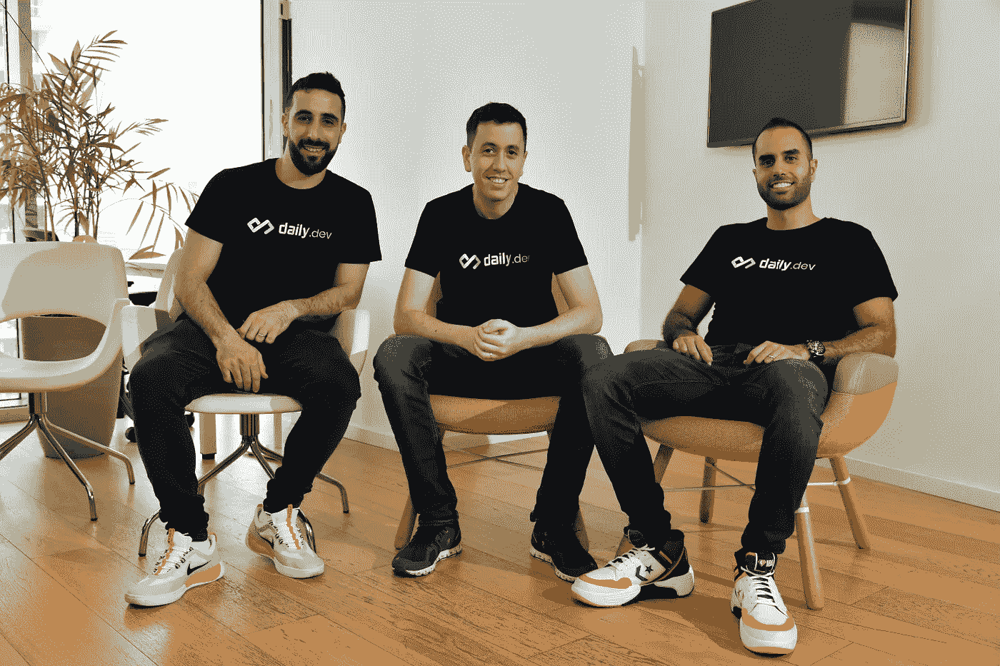
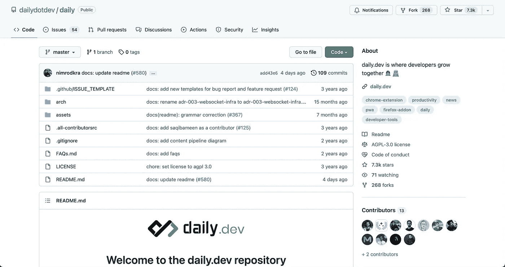
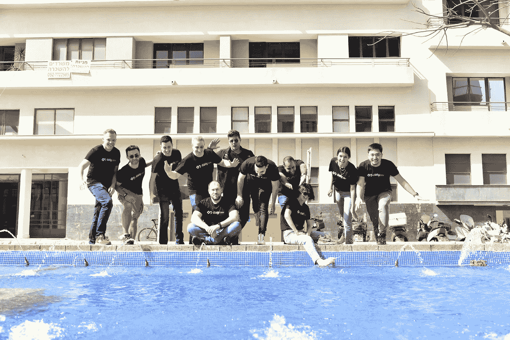

# 我们如何构建 daily.dev，这个超过 15 万人的开发者社区

> 原文：<https://levelup.gitconnected.com/how-we-built-daily-dev-the-150k-developer-community-27877e468bad>

## 对 daily.dev 首席执行官兼联合创始人尼姆罗德·克雷默的采访

本周，我们采访了 Nimrod Kramer，他是 daily.dev 的首席执行官和联合创始人。daily.dev 是程序员的顶级新闻资源，也是拥有 15 万以上活跃开发者的最大社区之一。在这次采访中，Nimrod 分享了他们建立一个开发者共同成长的平台的使命，以及他们在过去几年中如何实现爆炸式增长。

> 想让你的公司接受高级编码面试吗？[填写这张表格](https://forms.gle/zRs7Uhidtd7WTyCy8)。
> 如果你是一名正在找工作的开发人员，[访问升级工作平台](https://jobs.levelup.dev/talent/welcome?referral=true)。

# 你的公司是做什么的？

daily.dev 的使命是建立一个开发者共同成长的平台。我们提供最热门的技术新闻，以帮助开发人员阅读更多高质量的文章并保持更新。

# 你在公司工作多久了，你的职责是什么？

再过几个月，我们全职做这个项目就两年了。作为公司的首席执行官，我认为自己要对三件事负责:

1.  确保我们与杰出的**人才**建立一个**强大的团队**
2.  确保我们在工作场所拥有**人们所期望的最佳文化**
3.  以确保我们的银行账户里总是有足够的钱

除此之外，由于我们是一家早期创业公司，我也专注于公司的建设，如增长和产品营销。

# 是什么吸引了你的想法？

围绕 daily.dev 创建的开发人员社区。当它刚刚开始时，daily.dev 是一个附带项目，它开始获得有机的牵引力。从某种意义上来说，社区的声音变得如此重要，以至于它的重要性让我们意识到我们应该将自己的全部时间投入到这个项目中去，并在这个项目上大展拳脚！

今天，我的主要动力来源于我们平台上的 15 万多名活跃开发者。这些开发人员参与了无数的项目，这些项目(可能)被全球数十亿人使用。能够为他们提供有价值的信息，激发他们的创造力，并伴随他们的专业成长是无价的。这可能是老生常谈，但通过帮助开发者成长，我们觉得我们为让世界变得更美好做出了贡献。

# daily.dev 是怎么开始的，有什么见解？

daily.dev 在 2019 年被称为“Daily Now”，是我们为自己在之前成立的公司的工程部门内部使用而建立的。我们从来没有想过它会成为一个欣欣向荣的行业。

我们专注于减轻保持更新的痛苦，因为这花费了我们的开发人员大量的时间和精力。显然，同样的问题对于世界上许多采用该产品并推荐他们的朋友也这样做的其他开发人员来说是相当普遍的。我们就是这样得到最初的牵引力的。

下一个重要的里程碑是我们决定[开源项目](https://github.com/dailydotdev/daily)。突然之间，开发人员可以直接为代码库做出贡献，帮助我们构建更多的功能，修复错误等等。回头看，这是一个惊人的决定，在开发人员社区中建立了对 daily.dev 的信任。就在我们说话的时候，daily.dev repo 已经有 7000 多颗星了！

# 是什么让你的公司与众不同？

我们引以为豪的一件事是，我们经常雇佣最活跃的用户。我们非常幸运有一个为开发者服务的产品，你的团队中有自己使用该产品的人真是太棒了！在许多其他公司，你可以构建一个被其他人使用的产品，但是在 daily.dev 工作的开发人员可以为他们自己和他们的朋友构建一个产品。

# 是什么让你的文化与众不同？

我们很感激来自世界各地这么多开发者的爱，我们也一直在思考如何回报。我们公司文化的一个独特之处是，每个团队成员都有年度预算来赞助他们选择的开源项目和维护者。开源维护者努力工作，他们不仅在声誉上，而且在经济上值得赞赏。通过这些赞助，我们鼓励我们的团队成员表达感激之情，并激励其他公司也这样做。

# 您使用什么技术堆栈，为什么选择这种堆栈？

前端是 Preact，是 react 的兼容版本，只是更小。我们也在前端使用顺风。我们将它作为 monorepo 来运行，以处理扩展、web 应用程序和一切。在后端方面，我们主要使用 PostgreSQL 为 API 提供 Node.js。

我们用 Python 抓取内容，用 Golang 抓取非常特殊的 ETL，比如高性能分析系统和处理。我们也用 ClickHouse，BigQuery，Google Cloud，CI/CD 用 CircleCI，还有 Pulumi。

# 你正在解决的最有趣的问题是什么？

我们正在我们的浏览器扩展上开发一个新功能，它将在你访问的每个文章页面顶部的侧边栏中增加来自 daily.dev 的数据——投票、评论，甚至是人工智能生成的 TL；文章的博士。这里的挑战是不影响页面的性能。我们认为自己是页面上的客人，所以我们不想劫持和影响行为。每当页面加载时，我们必须减少请求的数量，并确保一切都不碍事。

# 一旦你的公司实现了愿景，世界会变成什么样子？

我们将生活在这样一个世界里，开发商拥有他们应得的房子。到目前为止，已经有如此丰富的内容、工具、社区等等。我们希望 daily.dev 成为全球开发者社区的家园。这样，开发人员将能够比以往任何时候都更好地协作，并在他们的职业成长之旅中相互支持。

# 你在招人吗？什么职位？

我们正在招聘工程和产品部门的各种职位。[访问招聘页面](https://it057218.typeform.com/apply)。

# 在贵公司工作最令人兴奋的部分是什么？

我们是一家完全远程的公司，我们的工作时间表是非线性的；这意味着你可以安排你的一天，并使之与你的个人生活相一致。此外，我们发布的每一个功能都被 15 万以上的开发人员使用。

# 我们可以去哪里了解更多？

*   网址: [https://daily.dev](https://daily.dev/)
*   GitHub 回购:【https://github.com/dailydotdev/daily 
*   推特:[https://twitter.com/dailydotdev](https://twitter.com/dailydotdev)

# 分级编码

[Level Up](https://levelup.gitconnected.com/) 是一个每月 300 万开发者的社区([了解更多并关注](https://levelup.gitconnected.com/)或[阅读更多访谈](https://levelup.gitconnected.com/interviews/home))。我们还与最好的初创公司和最具创新性的科技公司合作🔥

*   **你是开发者吗？**有最优秀的公司要求聘用你
    ➡️[t18】加入到人才集体 t20】](https://jobs.levelup.dev/talent/welcome?referral=true)
*   ➡️ [**聘请 FAANG 级工程师**](https://jobs.levelup.dev/talent/welcome)
*   ➡️ [**面试申请表**](https://forms.gle/oWT83qtGdydfi7yL8) 到贵公司面试

我们还为开发者提供免费的职业成长工具: [**编码面试课程**](https://skilled.dev/) 、 [**自动简历构建**](https://gitconnected.com/resume-builder) r、 [**portfolio API**](https://gitconnected.com/portfolio-api)

在 Twitter[和 LinkedIn](https://twitter.com/gitconnected) 上关注我们