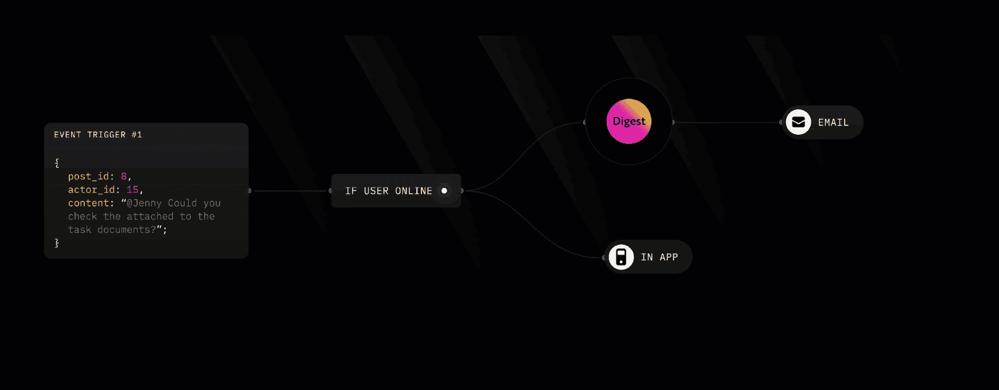
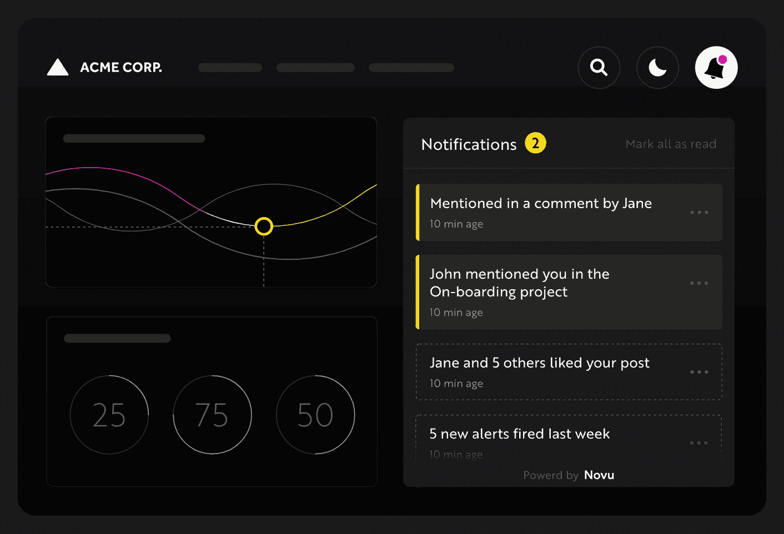
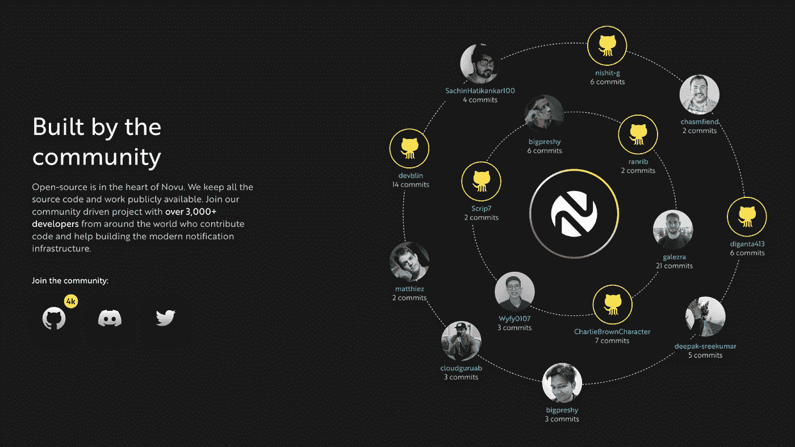
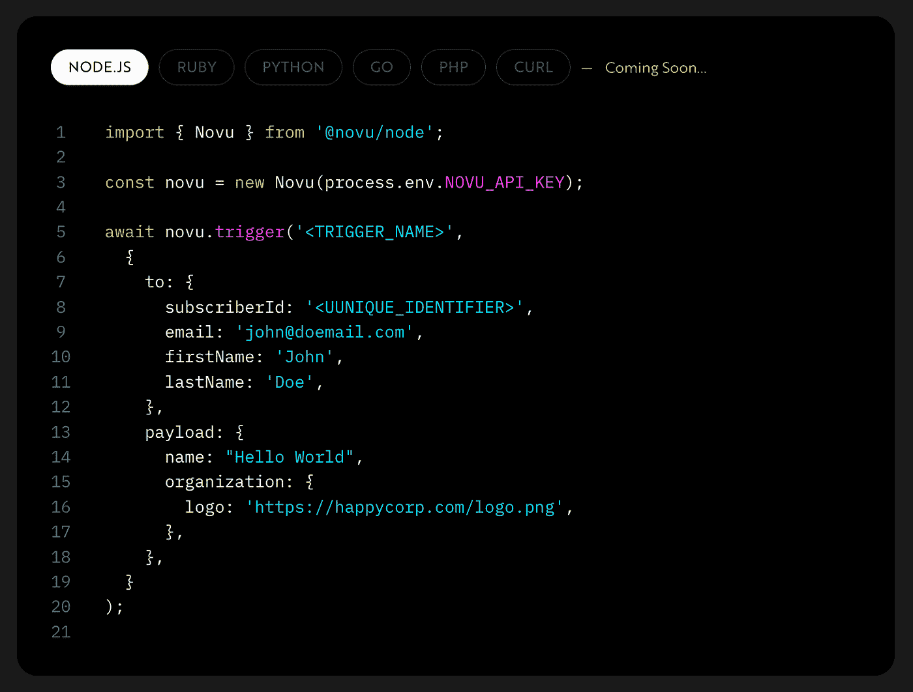
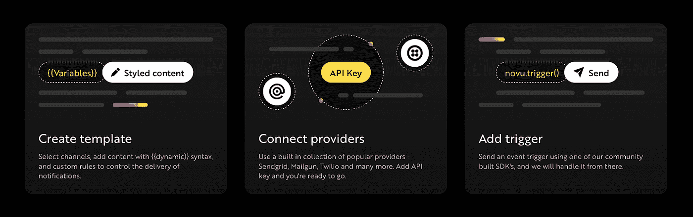
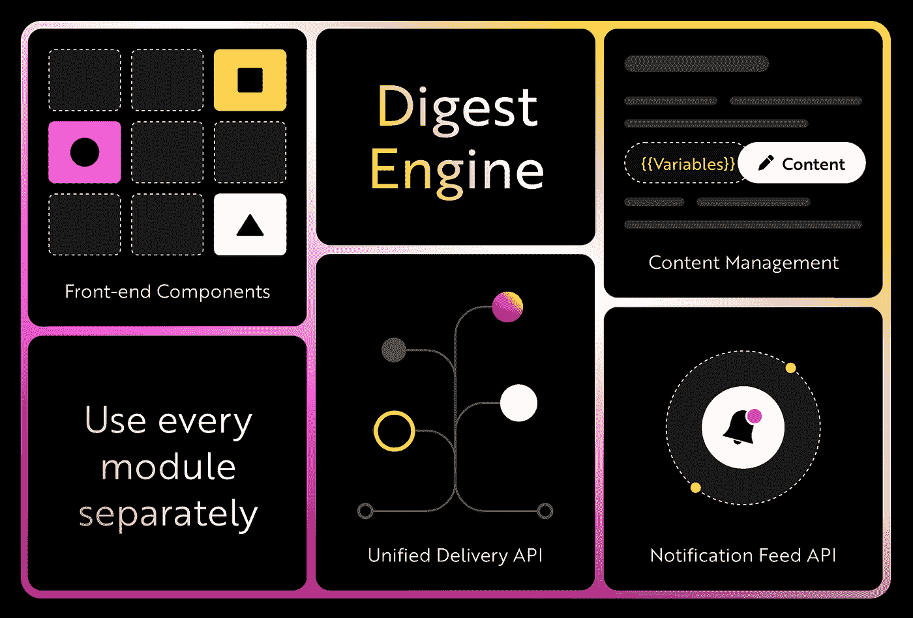

# 我们如何构建通知这一普遍问题的解决方案——作为使用 TypeScript 的开源软件

> 原文：<https://levelup.gitconnected.com/how-we-built-the-solution-to-the-universal-problem-of-notifications-as-open-source-software-688cfc51b1d9>

## **采访 Novu 联合创始人兼首席技术官马頔·格罗斯曼**

本周我们采访了马頔·格罗斯曼，他分享了他创建和建设 Novu 的经历。通知是现代网络和移动应用程序的普遍要求，马頔解释了他们如何创建开源软件，以简单直观的方式解决这个问题。这次采访提供了关于如何构建伟大的软件和以一种对每个人都有益的方式与开源社区联系的极好的见解。

> “我们有来自 AWS、Twilio 和其他知名科技公司的工程师，他们一直在内部解决这个问题，他们主动联系我们。由于这是一个如此深刻和具有挑战性的问题，工程师们变得充满激情和固执己见，这是建立 Novu 的一个伟大基础。”

> = >参加编码水平提升➡️的面试[填写这张表格](https://forms.gle/zRs7Uhidtd7WTyCy8)
> = >寻找一份令人惊叹的工作？➡️ [访问升级招聘平台](https://jobs.levelup.dev/talent/welcome?referral=true)

# 你的公司是做什么的？是什么吸引了你的想法？

在过去的两年里，我和我的共同创始人 Tomer Barnea 一起建立了 Novu，从白板上的想法开始。

Novu 是一个开源的通知基础设施。它旨在帮助开发人员在其应用程序中创建多渠道通知体验，包括通知中心 API、电子邮件、SMS、推送和直接消息传递。都在一个 API 下。

# 作为一个过去在实现通知方面遇到困难的人，你能解释一下它是如何工作的吗？

首先，这一切都始于一个集中式 API，您可以将事件推送到这个 API。然后它到达 web 管理平台，在那里您可以创建通知的蓝图。你可以把它发送给任何接收者——电子邮件、短信、推送、webhook。这些接收者可以是我们无缝集成的任何交付提供商——send grid、Twilio 等。

我们提供 API 和 UI 来发送通知。我们还为客户提供了 UI 组件，您可以在其中创建通知中心。

# 通知的模式是什么，有多复杂/丰富/可行？

每个事件都包含一些强制属性，但是您可以在触发事件时附加自己的自定义通知负载。

*   事件名称—用于标识事件并将其附加到 Novu API 上的特定模板。
*   订户对象—要指定通知的收件人，它可以是标识符，也可以是包含传递凭据的对象。
*   有效负载—一个自定义对象，您可以将其传递给 Novu，稍后在通知模板中访问其属性，或者稍后在通知中心组件中呈现通知项目时对其进行操作。

# 你为什么决定让 Novu 开源？

当我们接近这个问题空间时，我们意识到我们想要与工程社区集成。我们遇到的问题对任何行业都很重要。通过开源，我们可以和其他开发者一起工作和学习，一起构建基础设施。作为一个工程社区，我们集体了解问题并一起解决它。

在我们发布了第一个开源版本后，它非常简单，但是只要发布它并创建初始结构，它就立即创建了对话。我们有来自 AWS、Twilio 和其他知名科技公司的工程师，他们一直在内部进行这项工作，并与外界联系。他们多年来一直致力于解决这个问题，他们希望参与其中。由于这是一个如此深刻和具有挑战性的问题，工程师们变得充满激情和固执己见，这是建立 Novu 的一个伟大的基础。

# 您使用什么技术堆栈，为什么选择这种堆栈？

我们是跨堆栈的 JavaScript(类型脚本)商店:

*   嵌套. js
*   反应
*   MongoDB
*   （同 nonexpendable）非消耗品

过去 9 年来，我一直是一名 JavaScript 开发人员和爱好者，我对世界各地令人惊叹的 JS 社区感到非常兴奋。在为 Novu 选择堆栈时，这是一个非常容易的选择。从那时起，我们已经开源了一些我们以前在 node.js 运行时编写的闭源工作。

# 我认为通知具有很高的吞吐量——您在扩展 JavaScript 基础设施时遇到过挑战吗？

Node.js 已经在高吞吐量应用程序中使用了多年，现在已经被世界上顶尖的工程团队使用。我们构建 Novu 的方式使我们能够在需要时进行水平扩展，以满足全天不断变化的吞吐量需求。我们在内部使用 Nest.js，并在 Monorepo 环境中工作，这为我们提供了一种简单的方法来将特定模块提取到可以独立扩展的独立服务中。

# 对你来说，典型的一天是什么样的？

早起，带着我的狗去散步，然后开始我一天的工作。通常，这是从与我们的一些团队成员喝咖啡开始的，因为我们是一家完全偏远的公司。

在与我的队友开始一天的工作后，我通常会查看我们公共不和谐服务器上的最新讨论，以及来自社区的最近公关和问题。这通常是我完成一些编码的时候。

下午通常是我与同事、社区成员和客户面谈的会议日程的开始。晚上，这通常是我的冷却时间，我可以做一些研究和一些安静的编码时间到晚上。

# 你最初是如何进入软件开发的？

我有音乐背景，我发现编程和写音乐非常相似。对我来说，主要的驱动力是使用编程语言构建和创造事物的能力。对我来说，这更像是一个工具，而不是最终目标。我们想创造一些东西，需要学习编码来实现它。我学习编程主要是通过 youtube 视频和在线课程。

# 是什么让你的公司与众不同？

构建 Novu 最令人兴奋的部分是我们是在开源环境下完成的。这意味着我们所有的代码和大多数讨论都是对社区公开的。人们可以发表自己的意见，这真的让每一天都成为一次独特的想法体验，并结识世界各地的新朋友。

# 你正在解决的最有趣的问题是什么？

在 Novu，我们一直在努力解决来自各个行业的工程团队的痛苦，这些痛苦之前已经在内部建立了多年。创建一个单一的 API 来解决许多不同行业的用例总是一个挑战。具体来说，当您的客户是工程师时，开发人员体验、文档和稳定性是我们产品的关键部分。

我们与许多工程师的一次对话是正确地构建关注点的分离——事件、通知和交付提供者。例如，工程师面临的糟糕架构的一个挑战是，业务逻辑被绑定到特定的交付提供者，反之亦然。

你需要分离通信的不同部分，我们在 Novu 中称之为输出通信层(OCL)。如果您想要更改提供者或模板，您可以在不破坏整个系统的情况下这样做。

构建良好的通知基础设施始于明确的界限和责任。您可以将该问题视为 3 个主要部分:

*   事件或触发器
*   通知模板/工作流
*   交付提供商

每个组件负责自己的功能，并使用严格定义的接口与其他组件通信。

# 一旦你的公司实现了愿景，世界会变成什么样子？

通信，尤其是技术产品和系统与最终用户之间的通信，没有达到应有的水平。通常，工程团队没有工具和框架来建立有意义的产品沟通，这最终导致不太完美的通知体验，可能只有大型科技公司才能负担得起。我们的目标是让良好的通知体验成为合理的默认设置，这样工程团队就不必在每次需要发送通知时重新发明轮子。

# 你现在正在尝试的技术或工具中有没有让你感到兴奋的？

我对 GitPod 和 GitHub 代码空间等短暂的开发环境感到非常兴奋。我认为这将是开发环境的未来，对我们来说，作为一个开源公司，这是贡献者和社区成员参与项目的游戏改变者。

# 描述您的计算机硬件设置

16 英寸 MacBook Pro，配备苹果 M1 Pro 处理器、32GB 内存和 1TB 存储空间。

# 描述您的计算机软件设置

*   WebStorm 和 VSCode 有时:)
*   光线投射
*   哦，我的天啊
*   克里斯普
*   变化
*   织布机

# 你在招人吗？什么职位？

雇用高级全栈 Javascript 开发人员，他们对与我们令人惊叹的社区一起构建开源产品感到兴奋。

[https://novuhq . ideation . site/Full-stack-高级工程师-职位描述-6fb 9681 f 68 bf4a 8492716 e 52 D1 F2 fc C4](https://novuhq.notion.site/Full-stack-senior-engineer-Job-Description-6fb9681f68bf4a8492716e52d1f2fcc4)

我们是一家完全远程的公司，没有集中的办公室。我们在欧洲和亚洲时区以及美国东海岸招聘员工。

我们是一家极其透明的公司。我们的[手册](https://handbook-novu.super.site/)可供任何人阅读。在招聘过程中，我们给员工一个招聘模拟，让他们可以做出正确的薪酬决定。

【https://handbook.novu.co/ 

# 我们可以去哪里了解更多？

最好的地方是访问我们的 GitHub 页面:[https://github.com/novuhq/novu/](https://github.com/novuhq/novu/)

# 分级编码

[Level Up](https://levelup.gitconnected.com/) 是一个每月 300 万开发者的社区([了解更多并关注](https://levelup.gitconnected.com/)或[阅读更多创业访谈](https://levelup.gitconnected.com/interviews/home))。我们还与最好的初创公司和最具创新性的科技公司合作🔥

*   **你是开发者吗？**有最优秀的公司要求聘用你
    ➡️[t18】加入到人才集体 t20】](https://jobs.levelup.dev/talent/welcome?referral=true)
*   ➡️ [**聘请 FAANG 级工程师**](https://jobs.levelup.dev/talent/welcome)
*   ➡️ [**面试申请表**](https://forms.gle/oWT83qtGdydfi7yL8) 到贵公司面试

我们还为开发者提供免费的职业成长工具: [**编码面试课程**](https://skilled.dev/)[**自动简历生成器**](https://gitconnected.com/resume-builder)[**portfolio API**](https://gitconnected.com/portfolio-api)

关注我们:[Twitter](https://twitter.com/gitconnected)|[LinkedIn](https://www.linkedin.com/company/gitconnected/)|[时事通讯](https://newsletter.levelup.dev/)