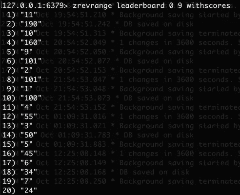
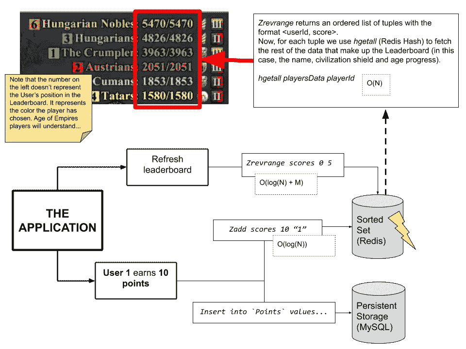

# 我们如何为一百万用户创建实时排行榜

> 原文：<https://levelup.gitconnected.com/how-we-created-a-real-time-leaderboard-for-a-million-users-555aaa3ccf7b>

几年前，在 Rocket Languages 工作时，我被分配了一项任务，要重写我们正在开发的应用程序的排行榜和积分系统，这是我们从遗留代码库向由 Laravel 支持的现代 PHP 应用程序迁移的一部分。这个看似相对简单的任务最终揭示了一系列必须克服的挑战，以满足我们排行榜的功能性和非功能性要求。


排行榜是一个非常简单的系统:用户在应用程序中做*件事情*就可以获得积分，然后这些积分被累加并显示在排行榜中。可以根据需要增加不同的复杂程度。例如，如果需要跟踪用户执行的单个操作，或者如果我们只对他们获得的总积分感兴趣，那么数据的底层表示就会不同。复杂性也随着数据检索方式的不同而增加:我们是只对前 10 名用户感兴趣，还是希望能够告诉应用程序中的每个用户他在排行榜中的位置？我们是在为相对较少的用户群做这件事，还是在考虑将其扩展到数百万人？

# 我们所拥有的

广义地说，[火箭语言](https://www.rocketlanguages.com/)应用程序是一个在线语言学习服务。有几门课程，每门课程包括几十章，每一章都有一系列学生必须完成的练习。这些练习在本质上是不同的，与它们互动会产生分数。此外，解决一个练习会给学生加分，同时标记一些材料为已读，回答论坛中的问题，等等。一般来说，使用该应用程序会产生一连串的积分，这些积分会收集在学生的个人资料中，并显示在不同的区域:在使用该应用程序时，作为他们姓名旁边的徽章，在专用的排行榜区域，以及在学生在论坛上发布的每条消息的页脚。

排行榜区域特别有趣，因为它提供了在不同时间范围(每天、每周、每月)过滤积分的可能性，还提供了查找特定用户的可能性，以及随时在排行榜中显示登录用户的位置。

遗留实现非常简单，通过使用由 cron jobs 每隔一段时间更新一次的中间 MySQL 表来解决问题，这种组合听起来很容易出错，更不用说它还会在数据库和应用程序之间产生紧密耦合。因为需要 cron 作业来更新排行榜，所以应用程序中显示的数据不是实时的，而是有一条消息表明它只是“定期”更新。

# 我们被要求做的

要求非常简单。传统排行榜必须进行调整，以适应新的代码库，这是使用 Laravel 构建的。功能将保持不变，无论我们提出什么样的模式更改，旧数据都必须导入到新数据库中。

为了增加趣味性，并遵循我们在行业中类似应用中看到的情况，我们决定通过增加额外要求来挑战自己，这些要求将为排行榜带来更多价值，并使整个任务对我们来说更具挑战性。因此，我们决定新的排行榜必须**实时显示数据**，在用户使用该应用程序时向他们提供即时反馈。无论有多少人在玩实时数据，无论我们有多少不同的分类，实时数据都是可用的(想想基于时间的排行榜和基于类别的排行榜)。

# 问题是

事实证明，排行榜的核心是非常简单的数据结构。将会有一个**点数**表，看起来是这样的:

```
<Int> user_id, <Int> amount, <Timestamp> created_at
```

每当用户因做某事而获得积分时，我们只需向该表添加一个条目。然后，如果我们想获得某个用户当月的总积分，我们只需执行如下操作:

```
select sum(amount) from Points where user_id = ? and created_at >= "2020-03-01"
```

*(以上只是伪代码 sql 风格，我还没有真正测试过。)*

现在，当您将这个解决方案推广到一个拥有 1 亿行的表，并且每天都有 10 万个新行时，事情就变得有趣了。事实证明，SQL 类型的数据库在保持一致性、以设计良好的模式存储信息、生成报告和查询数据方面非常出色。但是，当它需要处理大量信息时，它的性能并不好。随着越来越多的用户向表中输入信息，不管服务器有多快，也不管模式中添加了什么索引，上面公开的解决方案很快就会变得毫无用处。

因此，开发排行榜系统的真正挑战是:

*   为可扩展的数据集提供**排行榜报告(谈到数百万用户)。**
*   支持用户不断赚取积分，每天产生数千个新的积分(在我们的例子中，大约是 15 万)。也就是说，**对数据结构的写入必须非常高效**。
*   报告必须实时可用。也就是说，从数据结构中读取数据必须非常高效。

在进行这项工作时，我们为自己设置了一些额外的挑战:

*   随时了解任何给定用户在排行榜中的位置和分数的可能性。
*   能够获取排行榜的任何范围，而不仅仅是前 X 名。
*   获取排行榜应该不到...一秒钟？在这里很难设置一个基于时间的指标，但这个想法是加载排行榜应该像从数据库的小表中加载条目一样快。

# 解决方案

下面是我们为特定用例实现的解决方案的演练。然而，我将省略特定于语言的内容，并尽可能使示例通用化。我们使用 Redis 和 MySQL，但是只要它们提供适当的数据结构，任何与持久存储结合的缓存系统都可以工作。

## 持久存储

首先，我们将暂时忘记实时显示数据的要求，而专注于我们的数据存储。一般来说，这是解决问题的推荐方法:首先你写出你能想到的最简单的解决方案，然后你迭代它来改进它。

永久存储器是我们存储用户获得的所有积分的地方。因为这将是我们的数据，而且因为数据是有价值的，所以我们需要确保我们将它存储在一个数据库中，该数据库易于表示它，以一致的方式存储它，并且有一个经过验证的读写机制。SQL 或 NoSQL 数据库系统都可以，但我个人在 SQL 方面更有经验，所以我们选择了 SQL 作为我们的解决方案。

将保存用户获得的所有积分的表的模式如下所示:

```
CREATE TABLE `user_points` (
 `id` int(10) unsigned NOT NULL,
 `user_id` int(11) NOT NULL,
 `amount` int(11) NOT NULL,
 `created_at` timestamp NOT NULL DEFAULT CURRENT_TIMESTAMP
) ENGINE=MyISAM DEFAULT CHARSET=utf8;
```

根据项目的特性，上面的模式也可能包含一些索引(例如在 *user_id* 列上，可能在 *created_at* 列上包含另一个索引)。在我们的例子中，我们有额外的列来表示每个点的来源。

一旦我们有了 Points 表，我们就可以开始在每次用户在应用程序中做一些事情时插入数据来填充它。

# 快速阅读

现在我们有了我们的积分表，我们的用户在给它提供信息，问题是我们如何从它提取信息并呈现给我们的用户？为了解决这个问题，我们需要一个额外的数据结构来支持 Points 表。该数据结构将包含点表中信息的汇总，并且将以不同的方式组织。我们的 Points 表仍然是真实的来源，但是新的数据结构将用于访问数据。

## 关于 Redis 及其排序集和散列

Redis 是一个内存数据库软件，它主要在计算机的 RAM 内存中工作，读写速度非常快。它还提供了一些非常有用的数据结构的实现。其中一些是众所周知的，比如集合、散列和映射。Redis 中最简单的数据结构是键-值存储，其中键和值是 String 类型。

他们的[网站](https://redis.io/)包含非常可靠的文档，并提供了一个在线 CLI 来与基于云的 Redis 服务器进行交互，因此在浏览文档的同时，很容易立即开始使用不同的命令进行练习。

Redis 提供的最不为人知的数据结构之一是[**排序集**](http://Data types – Redis) **。事实上，这是一个非常有用的数据结构，但也是一个不容易自己实现的数据结构。排序集基本上是字符串类型的键和数字类型的分数之间的映射。键总是唯一的，分数可以是任意数字。排序集支持的大多数操作需要 O(log(n))的对数时间，这意味着即使对于巨大的数据集，它的执行时间也将非常低。**

对于我们的排行榜实现，排序集将存储每个用户的总分数。因为 user_id 是一个惟一的字段，所以它很有可能成为有序集合的键。分数就是分数。

如前所述，Redis 也实现了散列。哈希是访问信息的优秀结构。它们使用具有关联值的键来存储数据。如果您知道密钥，访问存储在该密钥中的值需要常数时间 O(1)。检查一个键是否存在也需要 O(1)时间，在散列中插入一个新的键也是如此。与键相关联的值可以是任何值，尽管最好将存储的数据量保持在最小。记住，这些结构都将存在于计算机的 RAM 中，这是一种非常有限的资源。

那么，现在我们已经介绍了这两种数据结构，我们将如何使用它来创建我们的排行榜呢？回想一下前面的段落，从 MySQL 获取信息是不可能的，因为它效率不高，最重要的是不可伸缩。然而，**可以只做一次**。

总的想法将如下:

*   从 MySQL 的积分表中提取构建排行榜所需的所有信息。我们在这里提取的是数据库中每个用户的总积分。结果集将包含用户的 id 以及他们获得的总积分。
*   在 Redis 中创建一个排序集，并将上一步中获得的结果集提供给它。如前所述，用户的 ID 成为排序集合条目的关键字，总点数成为分数。要添加一个条目到一个有序集合中，你需要使用 [*ZADD* 命令](https://redis.io/commands/zadd)。 *ZADD* 采用三个参数:排序集的名称、分数和密钥，执行时间为 O(log(n))。

下面的伪代码显示了所描述的两个步骤:

```
**MYSQL** select user_id, sum(amount) as score from user_points group by user_id order by score desc**CODE** // lets assume $rows contains the resultset from the query above
foreach ($row in $rows)
  storeInLeaderboard($row->user_id, $row->score);
endforeach// the helper function goes like this
function storeInLeaderboard(userId, score) {
  $redisLibrary->zadd("leaderboard", score, userId)
}
```

此时，排行榜被加载到一个排序集合中。在 Redis 中，要查询已排序的集合，我们必须使用 [*zrevrange*](https://redis.io/commands/zrevrange) 或 *zrange* 命令。这两个命令本质上是相同的，除了 *zrevrange* 首先获取最高分，这就是我们需要的排行榜:

```
zrevrange leaderboard 0 9 withscores
```

*zrevrange (* 以及 *zrange)* 取O(log(N)+M)执行，其中 N 是集合中的总条目数，M 是要返回的元素数。对于我们的排行榜，M 可以忽略不计，因为我们通常会对前 10 个条目或某个关键字周围的条目感兴趣，但不会对非常大的 M 感兴趣(非常大的 M 往往会使执行时间更接近线性)。该命令的输出如下所示:



我们在排行榜上排名前 10 的条目，以及它们的分数。你看这个结果的方式是，比如用户 11 有 190 分，用户 10 有 160 分，用户 7 有 24 分，以此类推。**注意，最左边的数字没有意义，只代表结果集中的行号。**

解释上述输出的方式是为每个条目分配两行。例如，第 1 行和第 2 行分别包含 user_id (key)和 total points(score)——这转化为 **user_id: 11 在此排行榜中有 190 分**。

需要注意的是，在示例中，我们使用了 *zrevrange* 来获取使用 0 和 9 作为参数的前 10 个条目，但是我们可以在相同的执行时间内获取排行榜的任何范围。

排序后的集合提供的另一个有用的命令是 *zrevrank* (以及相反的 *zrank* )，它以一个键作为参数，返回相关的分数。这样做要花 O(log(n))时间。因此，zrevrank 构成了我们排行榜的关键部分:我们可以用它来获取任何用户在对数时间内的位置。

现在，我们能够在很短的执行时间内获取每个用户的分数，我们只需要获取在排行榜中显示信息所需的额外数据，如用户的姓名和其他可能需要的特定于应用程序的数据(例如，在我们的例子中，我们需要显示用户注册的课程)。由于用户的 ID 在排序后的集合中是可用的，所以可以使用标准的 MySQL 查询来检索附加信息(Users 表将使用用户 ID 进行索引，因此读取操作将足够快)。

## 缓存用户信息以加快访问速度

尽管在 MySQL 中访问用户信息通常很快，但对于一些需要多个连接来获取必要数据的应用程序来说，使用另一种数据结构来提高查询速度可能更方便。我们之前介绍过**哈希**，它们是缓存用户所需的额外数据的绝佳解决方案。

哈希唯一的缺点是占用大量内存，所以我们不能一次就把所有用户信息都转储掉。根据排行榜的具体要求，可以采用不同的策略。例如，在我们的实现中，默认情况下只显示排行榜的前 20 名条目。这是最常见的用例，因此我们希望这些用户的信息在 Hash 中随时可用。最终，排行榜可能会改变，新用户可能会进入前 20 名。在这种情况下，新用户的信息被添加到哈希中。

## 实时访问我们的排行榜

实时访问排行榜数据的关键是，一旦排序集的初始设置完成，每次用户在应用程序中获得积分时，都要保持更新。在最简单的实现中，每次在 Points 表中创建新条目时，都会调用 z *add* 方法。对于具有大量数据流的应用程序，可能需要利用缓冲区来减少对 Redis 存储的写入(也可能不需要，这是需要测试的东西。我们的应用程序不需要这样做，它管理了相当大量的数据)。

下图概述了如何将所有部分组合在一起，以呈现一个排行榜样本:



这个例子来自一个帝国时代的游戏。在这些游戏中，玩家在很长一段时间内(平均一场游戏 40 分钟)不断获得积分。注意，这个例子中的 N(玩家数量)非常小，所以执行时间会非常好。然而，插入积分表的数据量将是巨大的，从 MySQL 重新计算排行榜将是不可能的。

# 最后的话

非常有趣的是，当有非常简单的解决方案的问题扩展到大量数据时，会变成一个巨大的挑战。当数据流量如此之大时，建议的解决方案的每一步都需要格外小心。我们必须确保数据在合理的执行时间内可用，因此我们的存储必须提供非常快速的读取操作。如果来自应用程序的数据流很大，存储也需要支持快速写入。同时，我们必须注意数据的一致性，因为无论我们检索数据的速度有多快，如果数据不一致，它就变得毫无价值。

在这个快速总结中，我向您展示了如何使用有序集合来实现影子数据结构，以备份您的持久存储，从而为解决游戏行业中一个非常常见的问题提供令人难以置信的执行时间。排序集是使一切成为可能的数据结构，在我们的例子中，我们使用 Redis 作为实现的方法，尽管其他库，甚至一个定制库，也能提供同样的好处。

*股票图片由*[*Cris Ovalle*](https://unsplash.com/@crisovalle?utm_source=unsplash&utm_medium=referral&utm_content=creditCopyText)*[*Unsplash*](https://unsplash.com/s/photos/speed?utm_source=unsplash&utm_medium=referral&utm_content=creditCopyText)*