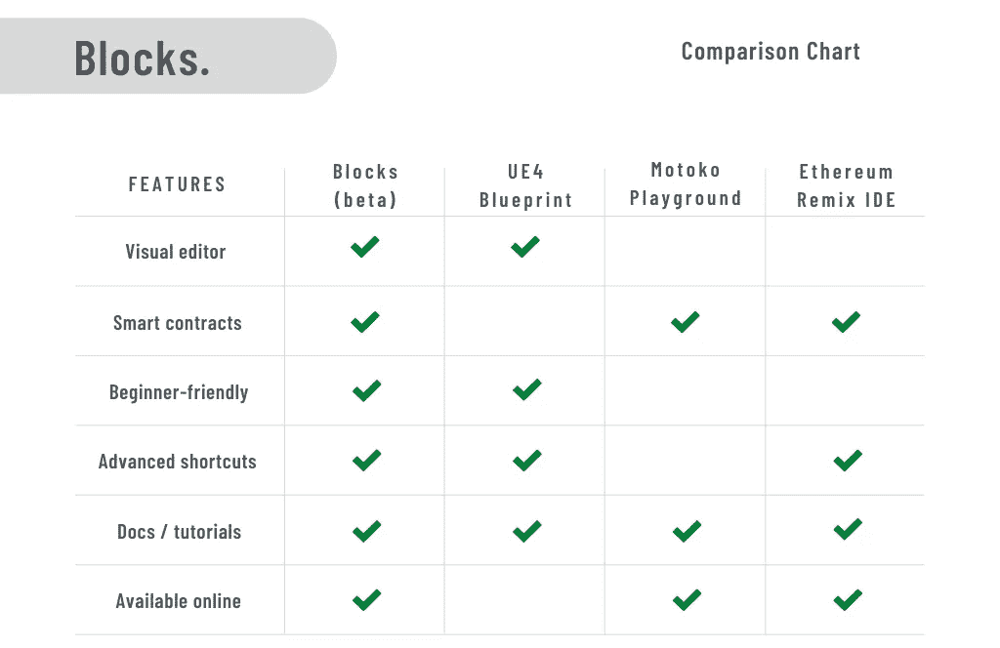

# 我们如何创建块:一个在线拖放智能合同编辑器。

> 原文：<https://levelup.gitconnected.com/how-we-created-blocks-an-online-drag-and-drop-smart-contract-editor-fe23eff4d933>

> 好消息是:设计区块链智能合约不再需要了解 Solidity(或任何编程语言)。

[Blocks](https://blocks-editor.github.io/blocks) 是一个在线可视化节点编辑器，它简化了在[互联网计算机](https://dfinity.org/)上构建分散式应用程序(dapps)的学习曲线。在从 DFINITY 基金会获得 25，000 美元的开发资助后，我和[内特·圣乔治](https://natestgeorge.com/)一起踏上了为去中心化软件创建第一个低代码图形编辑器的旅程。

下面是我们如何建造积木的故事，你可以用它做什么，以及我们计划从这里走向何方。

# 什么是智能合同？

快速复习一下,“智能合约”是一款直接在区块链或类似的点对点(P2P)网络上运行的软件。这经常与[以太坊](https://ethereum.org/en/)区块链及其“Web 3.0”dapp 联系在一起，其中一些在 2018 年初获得了病毒式新闻报道，如 [CryptoKitties](https://www.cryptokitties.co/) 。

[OpenSea](https://opensea.io/) 是一个非常受欢迎的 dapp，每月的 NFT 交易量[超过 15.4 亿美元](https://www.wisdomtree.com/blog/2021-09-22/introduction-to-ethereums-dapps-deep-dive-into-opensea)

Dapps 在现实世界的应用中越来越实用。众所周知，以太坊网络至少需要 5 分钟来确认每一笔交易，但最近一个名为[互联网计算机](https://dfinity.org/) (IC)的竞争对手使得在大约 1-2 秒内处理请求成为可能。这对去中心化软件的未来来说是一个充满希望的信号，在整个区块链生态系统中，数以千计的 dapps 已经在使用 IC 技术栈。

# 为什么是可视化编辑器？

软件工程的基本目标是定义清晰、易于理解的业务逻辑来解决给定的问题。我们通过创建抽象层来做到这一点，相当于说“做一个花生酱三明治”，而不是“拿两片面包，放在桌子上，打开一罐花生酱”，等等。这些高层次的描述使得重用、组合、记录和测试我们的软件变得更加容易。

在[块编辑器](https://blocks-editor.github.io/blocks/)中实现简单加密货币的一部分

可视化编辑器通常用于连接用传统编程语言编写的高级模块。这些环境使非技术用户理解程序的逻辑成为可能，同时也是一个强大的学习工具和底层代码库的参考点。

尤其是在区块链 dapp 开发领域，每一行代码都必须仔细检查，寻找可能的漏洞。一个小小的错误或疏忽都可能给你的项目带来灾难，这使得图形编辑器对于发现安全问题和鼓励更好的代码封装非常实用。

# 竞争

去年在我的用户体验(UX)设计课上尝试可视化编辑器时，我学到了一些意想不到的东西:dapp 或智能合约开发几乎没有对等的编码风格。虽然快速的谷歌搜索显示了一个名为 [EtherScripter](https://etherscripter.com/0-5-1/) 的简单拖放编辑器和废弃的登录页面，如 [SmartChain](https://smartchain.io/) 和 [HyperLedger Composer](https://www.hyperledger.org/use/composer) ，但很明显这些项目目前都不能用于构建和部署现实世界的智能合同。

然而，市场显然对此很感兴趣。2018 年，埃里克·马克斯(Erik Marks)写了一篇名为[图形智能合同编辑器案例](https://medium.com/pennblockchain/the-case-for-graphical-smart-contract-editors-8e721cdcde93)的中型文章，他在文章中倡导开发人员尝试解决与基于视觉流的编辑器相关联的 UX 问题的方法。例如，Erik 强调了一个几乎普遍关注的问题，即“对于技术用户来说，它们不如文本方便，对于非技术用户来说，它们很难理解。”我亲身经历了这个问题的两个方面，并很快意识到一个极短的用户反馈循环对一个新的可视化智能合同编辑器的成功至关重要。

# 生成研究

为了最大限度地创造一些模糊的用户友好的东西，我进行了一项生成研究，由来自学术、专业和非技术背景的六个人组成。在每次采访中，我都要求参与者探索[Motoko Playground](https://m7sm4-2iaaa-aaaab-qabra-cai.raw.ic0.app/)(Motoko 智能合约的在线代码沙盒)和[虚幻引擎蓝图](https://docs.unrealengine.com/4.27/en-US/ProgrammingAndScripting/Blueprints/)(一个流行的可视化节点编辑器)，只在必要时给出最少的指导。

通过 [Motoko 游乐场](https://m7sm4-2iaaa-aaaab-qabra-cai.raw.ic0.app/)部署的智能合同示例

[UE4 蓝图](https://docs.unrealengine.com/4.27/en-US/ProgrammingAndScripting/Blueprints)中模块编辑器的概念验证模拟

虽然每个人理解这些应用的方法略有不同，但我对多个参与者重复的意外、高度具体的反馈案例非常感兴趣。例如，虽然我没有注意到或注意到 Motoko Playground 上的工具栏是不可调整大小的，但一些用户提到这是他们的一个主要问题。最终，我找到了共同点:他们使用的是屏幕空间相对有限的笔记本电脑。

这些见解让我真正体会到 UX 研究作为软件工程过程的一部分的力量。尤其是在开发一个非常规的用户界面时，我惊讶地发现，仅仅向几个人询问 20 分钟的时间，我就学到了很多东西。

## **下面是我们所学内容的总结:**

*   说到可视化编辑器，形式就是功能。键盘快捷键和人体工程学设计决定了工作流的成败，类似于基于文本的 ide。
*   自然语言比代码语法和标识符更容易理解。
*   人们总是想要更多的例子！最常见的用例应该以模板的形式提供。
*   实时反馈/评估循环对于探索性学习至关重要。

# 时间表和优先事项

此时，Blocks 获得了 25，000 美元的无限开发者资助。现在，我与我的老朋友兼同事 Nate St. George 合作，开始为“Blocks”编辑器的全面实现规划一个技术栈。

**下面是我们早期的应用路线图:**

以下是我们的 beta 版功能与 [UE4 Blueprint](https://docs.unrealengine.com/4.27/en-US/ProgrammingAndScripting/Blueprints/) 、 [Motoko Playground](https://m7sm4-2iaaa-aaaab-qabra-cai.raw.ic0.app/) 和 [Remix IDE](https://remix.ethereum.org/) 的对比:

我们还使用了以下“我们如何(HMW)”问题来进一步完善计划功能列表:

> **1。我们如何帮助软件工程社区了解集中式和分散式应用程序之间的权衡？**
> 
> **2。我们如何让非区块链开发者更容易接触到 dapp 开发？**
> 
> **3。**我们如何缩短智能契约语言(如 Solidity 或 Motoko)的学习曲线？

# 技术栈

由于当前的开源可视化流程编辑器库的文档和维护都很少，我花了几天时间摆弄各种备选方案，以找到最适合该项目的方案。

*   [**节点-红色**](https://nodered.org/) —被类似的废弃项目使用；非常固执己见
*   [**React 流程**](https://reactflow.dev/)—React 的精美流程图库；与 Node-RED 类似的使用情形
*   [**LiteGraph**](https://github.com/jagenjo/litegraph.js?files=1) —神奇的内置小工具；专门作为数据流编辑器，而不是 AST 生成器
*   [**Rete**](https://rete.js.org/)**—流行且相对不流行；功能强大，但需要定制挂钩和配置**
*   **[**Flume**](https://flume.dev/)——rete . js 的一个更新、更好、更受欢迎的替代品；缺少自定义样式等重要功能**

**我们最终选定了 **Rete.js** 生态系统，这导致了当前的技术堆栈:**

*   **[**GitHub**](https://github.com/Blocks-Editor/blocks)**—问题跟踪、项目管理、托管、CI****
*   ****[**哈士奇**](https://www.npmjs.com/package/husky) — Git 提交/推送挂钩****
*   ****[**Webpack**](https://webpack.js.org/) —构建系统****
*   ****[**Jest**](https://jestjs.io/) —测试库****
*   ****[**ESLint**](https://eslint.org/) ，[**lint-staged**](https://github.com/okonet/lint-staged)**—代码样式强制******
*   ******[**反应**](https://reactjs.org/)—渲染框架******
*   ****[**自举**](https://getbootstrap.com/) —风格约定****
*   ****[**Sass**](https://sass-lang.com/) **，**[**styled-components**](https://styled-components.com/)—Bootstrap 的补充****
*   ********—干净、简约的图标********
*   ******[**Rete**](https://rete.js.org/#/)—节点和连接渲染逻辑******
*   ****[**摩纳哥**](https://microsoft.github.io/monaco-editor/) —语法突出显示的代码编辑器****
*   ****[**web assembly**](https://webassembly.org/)—静态智能合约验证****

# ****设计过程****

> ****一个用于互联网计算机的可视化低代码环境将减少最初的学习曲线，并使生态系统对新开发者来说更容易接近。****

********

****急于在实现上取得进展，我们开始并行设计和开发。为了让大家了解这个项目在过去的几个月里发展了多少，下面是以前版本编辑器的一些截图:****

********

****一个非常非常早期的块编辑器原型****

********

****由[内特](https://natestgeorge.com/)创建的早期中等保真度模型****

****当我专注于编辑器工作流、编译器功能和块实现时，Nate 贡献了主题、图形和项目的登录页面。由于功能和用户体验对可视化编辑器都至关重要，我们的技术专业化最终对这个项目非常有效。****

********

****一个简单的例子使用了可选的**深色**主题和鲜艳的边框****

********

****一个稍微复杂一点的例子，使用了 UE4 启发的**灰色**主题****

********

****[Motoko](https://sdk.dfinity.org/docs/language-guide/motoko.html) 源代码生成自**待办事项**示例****

****如果你想参加当前的公开测试，这里有一个链接指向 [Blocks web 应用](https://blocks-editor.github.io/blocks/)。****

# ****评估研究****

****我们的第一轮用户测试比我想象的要有用得多。在这一点上，该应用程序紧密基于虚幻引擎蓝图，所以我们预计用户会有类似的期望和反应。相反，我们最终发现了一些问题和解决方案，这些问题和解决方案使我们的用户体验超越了大多数可视化节点编辑器的现状。****

*   ****首先，尽管编辑器包括智能的基于类型的块建议，但是大多数用户没有意识到这是如何工作的，而是在全局放置菜单中痛苦地搜索每个块。与直觉相反，通过移除这个全局菜单并强迫用户使用我们的上下文建议，我们成功地显著提高了用户的学习速度和整体生产力。****

********

******类型**插座的上下文块建议****

*   ****我们的许多 alpha 测试人员对可视化节点编辑器毫无经验。虽然颜色编码的输入/输出插座连接来自 Blender 或 Unreal Engine，但一些用户很难理解哪些插座相互兼容。这种混乱是由基础类型系统造成的，在基础类型系统中，一些颜色在特定的方向上相互兼容。我们发现，通过在拖动连接时添加清晰的视觉指示，用户可以很容易地了解哪些套接字是兼容的，而无需了解颜色或连接规则。这是用户体验的一个范式转变，需要被其他可视化编辑器所采用。****

********

****添加新连接时，兼容的套接字会变得更大。****

*   ****块编辑器还包括工具提示，提供有关按钮、节点和类型插座的信息。虽然这相对于类似的可视化编程环境是一个巨大的进步，但是一些用户建议我们应该增加一个“学习模式”,在应用程序的工具提示中包含更多的细节。随着时间的推移，我们打算扩展这个概念，以便任何人都可以使用块，而无需引用外部文档。****

********

****解释**功能**块的工具提示****

# ****反射****

****考虑到构建用户友好的可视化编辑器所固有的巨大挑战，我为我们在开发 Blocks 时发现的创新 UX 功能感到自豪。编辑器的代数类型系统、透明的代码生成和方便的工作流允许用户在远远超过任何其他流行的可视化编程环境的规模上设计智能合约。****

********

****我们的交互式教程，用于创建简单的**“Hello World”**智能合同****

****该项目的主要技术障碍是基于浏览器的可视化编辑器库生态系统的现状。虽然使用 Rete.js 进行快速原型开发很有帮助，但我们经常会遇到一些缺点，比如缺乏控件定制和缺少撤销/重做历史等功能。根据这一经验，我建议未来基于浏览器的可视化编辑器从 Rete.js 的自定义分支开始，以便保持对应用程序功能的完全控制。****

********

****我个人的总体目标是提高在线可视化编程环境的标准。虽然 Blocks 界面将使学习 [Motoko](https://sdk.dfinity.org/docs/language-guide/motoko.html) 和利用[互联网计算机](https://dfinity.org/howitworks/)进行智能合同开发变得更加容易，但我希望我们在 UX 的一些发现也将最终在未来几年内进入主流节点编辑器。****

# ****前进的道路****

****以下是未来几个月 Blocks 的预期。****

*   ******一键部署。**我们并没有将生成的代码复制/粘贴到运行时环境中，例如 [Motoko Playground](https://m7sm4-2iaaa-aaaab-qabra-cai.raw.ic0.app/) ，而是打算为用户创建一个端到端的工作流，以便直接从编辑器中投资和部署智能合同。****
*   ******实时评估。**在学习一门新的编程语言时，即时计算表达式的能力是游戏规则的改变者。我们旨在尽可能方便地在块编辑器中运行和测试您的项目。****
*   ******更多互动教程。**虽然理解来自其他可视节点编辑器的块相对容易，但我们的目标是让没有软件开发背景的人也能使用智能合约开发。扩展我们当前的教程系统，我们希望编辑器将成为区块链和分散软件开发的通用学习资源。****

****感谢您阅读我们的块编辑器设计过程！****

****确保**启动我们的 GitHub 库**:****

**** [## GitHub - Blocks-Editor/blocks:块。一个面向互联网的在线可视化智能合同编辑器…

### Blocks 是一个用于互联网计算机的在线可视化智能合同编辑器。在您的 React 中嵌入块编辑器…

github.com](https://github.com/Blocks-Editor/blocks) 

您也可以通过 [Discord](https://discord.gg/jDDWtKwWQf) 、 [Twitter](https://twitter.com/BlocksEditor) 、 [Instagram](https://www.instagram.com/blocks_editor) 、[脸书](https://www.facebook.com/BlocksEditor)、 [Reddit](https://www.reddit.com/r/BlocksEditor) 或 [LinkedIn](https://www.linkedin.com/showcase/blocks-editor) 与我们取得联系。

感谢阅读！

干杯，
~瑞恩****