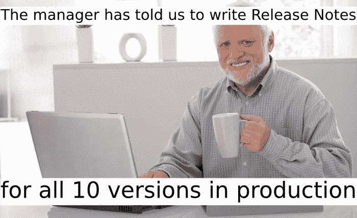
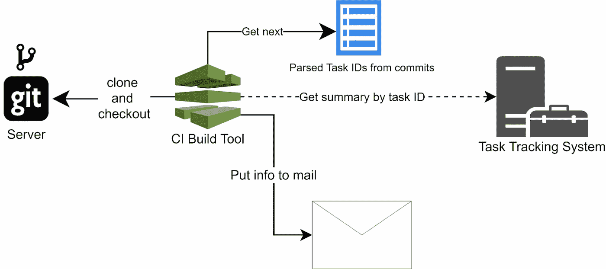
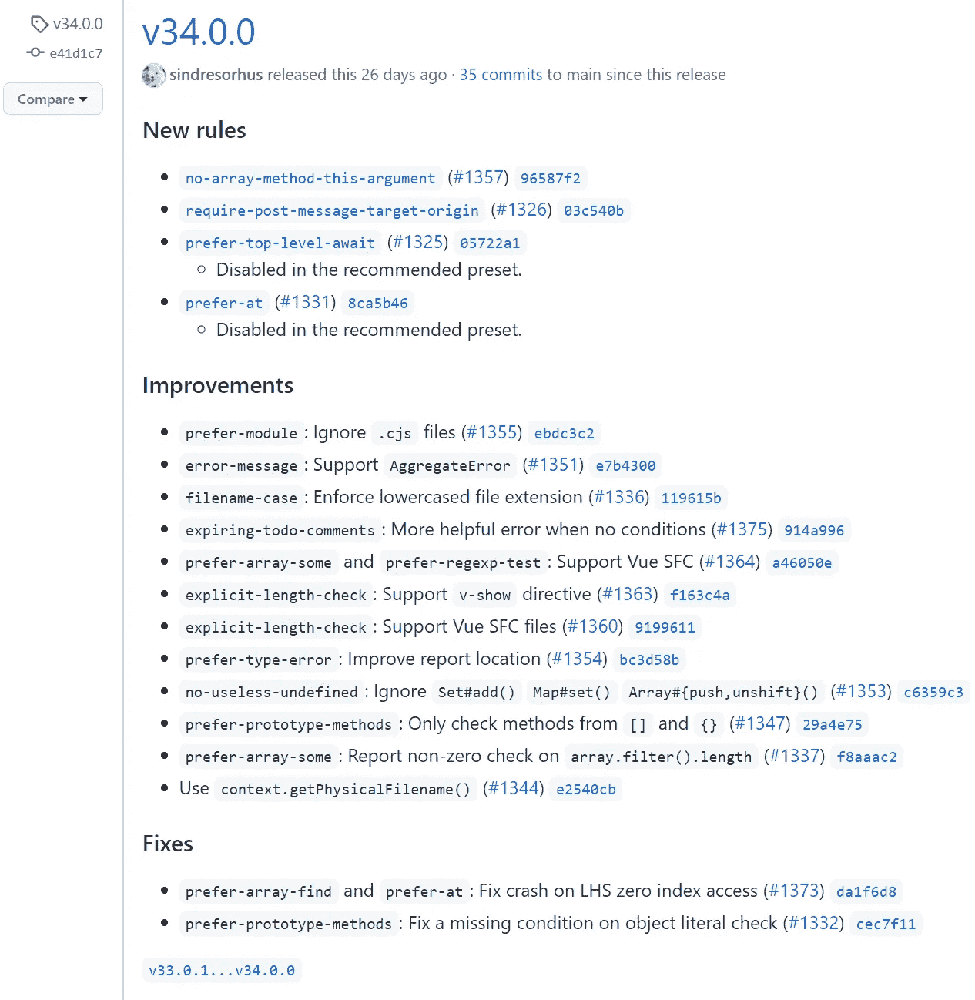
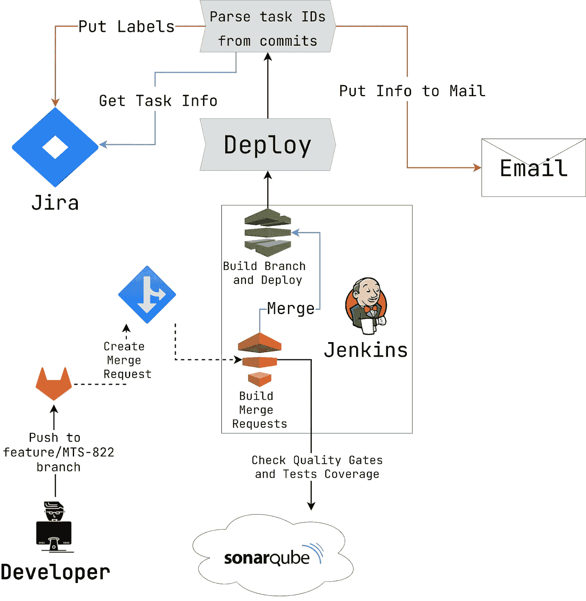

# 我们如何自动生成发行说明

> 原文：<https://levelup.gitconnected.com/how-we-have-automated-release-notes-generation-9365de451327>

这篇文章原本是用俄语写的。你可以通过 [*这个链接*](https://habr.com/ru/company/ru_mts/blog/572774/) *来查看出处。*

你好。我叫谢苗。我是大数据部门 [MTS 数字公司](http://ir.mts.ru/about-mts/mts-at-a-glance/default.aspx)的 Java 开发人员和 Java 团队负责人。在这篇文章中，我想谈谈发行说明。什么是发行说明？为什么不应该手动编写它们？如何自动化发行说明的生成？今天我来回答这些问题。此外，我将展示我们项目中发行说明自动化的真实例子。



# 这是什么？

发行说明描述了最新产品的增量。新的错误修复、功能等。它不仅对软件工程师有价值，对管理者也有价值。因为他们也想知道开发进度。如果你曾经在每周演示中展示过当前的产品状态，那么你就会知道记住最近完成的所有任务是很难的。

那么，如何制作发行说明呢？最明显的方法是手动操作。

# 手操纵进场着陆

这种方式提供了显著的优势。它既不需要额外的技术知识，也不需要实施任何 CI/CD 流程更改。我们只需要雇用一个科技作家，并为他们委派工作。利润！但是有一些警告。

1.  科技作家并不是完全了解产品的人。因此，他们无法自己实现新产品更新。必须有一个开发人员能够提供这些信息。这意味着这项工作做了两次。首先，开发人员向技术作者解释最新的产品更新。然后技术作家向其他人解释。
2.  **过程繁琐。**有很多情况会影响手动发布说明的编写速度。你如何描述管理系统中的任务？引入变化贡献的过程是什么？你有技术文件吗？什么是产品架构？是自圆其说还是含糊其辞？
3.  **出错的概率很大。你可能会忘记一个重要的错误修复。相反，你可以提到一些还没有发布的东西。**

如你所见，手工编写发布说明是不合理的。所以，我们需要自动化这个过程，对吗？确实是。但是也有一些问题需要解决。

1.  如何跟踪变化？
2.  如果我们设置一些有助于指出变化的规则，我们如何保证没有人违反它们？
3.  如果我们支持产品的多个版本会怎样？如何统一自动化流程？

# 什么是“改变”？

您可以用几种方法来度量项目更新。有*小步*和*大步*的方法。小的由存储库中的提交来描述。而大的是由管理系统中的任务决定的。可以是吉拉、特雷罗、GitHub/GitLab 门票等。

我会把这些策略称为面向技术的*和面向商业的*。对了，一个不排斥另一个。您可以同时应用它们。每一个都有优点和缺点。**

## *面向技术的发行说明*

*让我们从一个更简单的选项开始。假设我们使用经典的 [Git 流分支模型](https://medium.com/@muneebsajjad/git-flow-explained-quick-and-simple-7a753313572f)。每夜构建从*开发*分支每天部署。而每次合并到主*分支*都会创建一个新的版本。我们需要发布说明。*

*很容易找到新版本中的所有提交。*

```
***git** rev-list $PREV_HASH..HEAD*
```

*`$PREV_HASH`是前一版本的最后一次提交。当我们获得提交散列时，我们还可以检索相应的提交消息。然后只需将收集到的信息放入电子邮件并发送给订阅者。此外，许多 CI 系统可以自动生成类似的变更日志。*

*这听起来很诱人。但是也有陷阱。*

1.  *开发人员通常不注意编写有意义的提交消息。所以，你可能最终会得到一个*修复*、*添加*、*删除*、*删除*等等的卷轴。*
2.  *如果您确实以这种方式自动化了发行说明，它也可能包含 Git 服务器日志消息(合并分支 x 到 y，合并拉请求 z 到 t)*
3.  *有很多团队被[挤压](https://www.git-tower.com/learn/git/faq/git-squash/)提交的每个拉请求合并。这种方法不适用于所描述的发行说明生成策略。因为您将丢失大部分发布信息。*

*然而，这并不是潜在问题的完整列表。事实是，提交本身对业务没有价值。即使你所有的提交都有一个详细和清晰的信息，在大多数情况下，产品所有者也不需要。因为很难将未分组的提交列表分割成具体的工作单元。*

*在 [CHANGELOG.md](https://keepachangelog.com/en/1.0.0/) 中有一个存储“业务日志”的选项。但是将文件保持在相关状态也是手工操作。没有自动化。反正有个好处。CHANGELOG.md 作为其余代码存储在存储库中。因此，在合并之前，可以在代码审查阶段对其进行检查。*

## *面向业务的发行说明*

> *如果你把任务的总结和描述放到发布说明中，那就更好了。*
> 
> *产品所有者。*

*好吧，我们试试。*

*在创建一个新版本时，我们能得到的唯一信息是提交列表。这意味着我们需要将管理系统中的提交和任务相互连接起来。解决方案相当简单。每个提交消息都应该包含任务 ID。然后很容易解析它们，并通过 REST API 检索所需的任务信息。*

**

*图一。发行说明自动化流程的基础架构*

*这种方法有助于我们将代码变更和特定的业务需求结合起来。此外，提交的元信息(散列、消息)可以作为附加的技术参考放入电子邮件中。*

*这听起来很乐观。但是有一个问题。我们怎么知道开发人员会按照我们声明的方式编写提交消息呢？这个问题问得好。我们可以写一份长长的 [CONTRIBUTING.md](https://mozillascience.github.io/working-open-workshop/contributing/) 规则清单，希望每个人都能遵守。*

**

*如果我们能够自动检查**是否阻止**程序员贡献不适当的东西，那就太好了。谢天谢地，这个工具是存在的。*

> *还有另一个警告。如何才能知道管理体系中对任务的描述是否准确、牢固？其实这是个问题。有时开发人员在信使中或在会议中讨论一项任务。然后一个只是把一个简短的总结没有任何背景。遗憾的是，没有解决这种情况的灵丹妙药。唯一的办法就是融合文化。作为一名经理，你必须强调正确申报任务的重要性。例如，如果你在周五晚上提交了一份模糊的描述，你很可能记不起周一早上你需要做什么。*

# *Git 挂钩*

*当有人提到“Git hooks”时，会有很多人想到 webhooks。它可以是拉请求触发器、注释通知、批准观察者等等。但是 Git 也支持本地钩子来监听机器上存储库中的事件。例如，您可以检查提交执行尝试。这就是 [commit-msg](https://git-scm.com/docs/githooks) 钩子的作用。听起来很有趣。*

**

*默认情况下，所有的钩子都应该放在`.git/hooks`目录中。您需要创建一个具有所需名称的文件(在我们的例子中是`commit-msg`)来使钩子开始工作。例如，下面是一个简单的 Python 钩子，它检查提交消息中是否存在任务 ID。*

*Python 提交消息挂钩*

*第一个命令行参数指向`.git/COMMIT_EDITMSG`文件。它包含消息本身。通过读取文件，我们可以根据[正则表达式](https://developer.mozilla.org/en-US/docs/Web/JavaScript/Guide/Regular_Expressions)轻松验证它。*

*尽管有些细微差别你应该知道。*

***第一个细微差别。** Git 挂钩没有版本化，因为`.git`目录没有索引。这意味着我们不能只是将新添加的钩子推到存储库中，并自动将它们应用到所有贡献者。*

*但是有一个解决方案。例如，挂钩可以存储在由 Git 索引的单独目录中。然后，开发人员需要在自定义目录和`.git/hooks`目录之间创建一个[符号链接](https://linuxize.com/post/how-to-create-symbolic-links-in-linux-using-the-ln-command/)。更好的做法是编写一个脚本，以编程方式完成这些步骤。*

***第二个细微差别。很难让钩子兼容不同的操作系统。如果你在 Linux 上，并且 [Bash](https://en.wikipedia.org/wiki/Bash_(Unix_shell)) hook 在你的机器上运行良好，那么另一个在 Windows 或 MacOS 上的开发者可能会面临问题。这就是为什么钩子通常用高级编程语言编写的原因。相反，它要求所有贡献者在他们的机器上安装特定的语言(甚至版本可能是至关重要的)。不必要的依赖会导致额外的问题。***

*幸运的是，许多包管理器和构建工具提供了插件和库来轻松实现跨平台 Git 挂钩。我个人最喜欢的是[哈士奇 npm 包](https://www.npmjs.com/package/husky)。要创建一个定制的 Git 钩子，你只需要写几个配置文件。然后可以把钩子更新命令放到 [package.json](https://docs.npmjs.com/cli/v7/configuring-npm/package-json) 的“[预安装](https://docs.npmjs.com/cli/v7/using-npm/scripts)”脚本中。现在，每次执行`npm install`命令时，所有的钩子都会更新。*

*此外，[预提交](https://pre-commit.com/)包也是一个很好的独立解决方案。*

# *语义发布*

*当我们遇到发行说明生成的自动化时，软件版本控制的问题就变得很重要。我们可以定义贡献规则列表。例如，您可以根据分支名称或提交消息内容增加版本号。或者你可以看看市场上的解决方案。也许有一个适合你的项目。*

*[语义发布](https://github.com/semantic-release/semantic-release)是 npm 包，它完全自动化了部署和发布版本增量的过程。*

*本库遵循带下划线的概念。*

1.  *存储库中有一个主分支(例如，主分支)。其他的都是短命的。*
2.  *新的拉取请求定义了新的发布。*
3.  *最初的产品版本是 1.0.0。*

*默认情况下，语义发布针对[角度提交消息](https://github.com/angular/angular/blob/master/CONTRIBUTING.md#-commit-message-format)指南进行了调整。虽然它可以被覆盖，这可能有助于克服我前面描述的提交消息传递文化的问题。*

*每当一个新的拉请求被合并到主分支时，语义发布会扫描从最后一个发布标签到当前存储库状态的提交。`fix`增加了[贴片部分](https://en.wikipedia.org/wiki/Software_versioning#:~:text=Semantic%20versioning%20is%20a%20formal,application%20programming%20interface%20(API).)。`feat`增加小的一个。并且`!`符号增加了版本的主要部分(如果需要，您可以覆盖这个行为)。*

```
*The previous version is **1.0.1** 
feat: … 
feat: … 
fix: … 
feat: … 
The new one is **1.1.0** The previous version is **2.0.3** 
build: ... 
refactor: … 
fix: … 
The new one is **2.0.4** The previous version is **12.12.4** 
docs: … 
feat!: … 
fix: … 
The new one is **13.0.0***
```

*库在成功执行发布后创建新的标签。标记描述包含从接收到的提交中解析的格式化文档。*

*这里有一个来自 [eslint-plugin-unicorn](https://github.com/sindresorhus/eslint-plugin-unicorn/releases/tag/v34.0.0) 仓库的发布说明的例子。*

**

*图二。语义发布生成的发布说明示例*

*我想提一下，语义发布在 Javascript/Typescript 环境中是不封闭的。它提供了灵活的配置，帮助我们将这个库与许多其他构建工具和语言集成在一起。此外，还有一些现成的解决方案。比如 [Maven](https://github.com/conveyal/maven-semantic-release) 和 [Gradle](https://github.com/tschulte/gradle-semantic-release-plugin) 插件。*

*正如你所注意到的，语义发布建议了面向技术的发布说明生成策略。在我看来，它非常适合库和框架开发(尤其是开源的)。尽管对于企业项目来说，这是一个有争议的解决方案。*

*首先，语义发布对于同时维护多个版本不是一个好的选择。嗯，这个功能是[支持的](https://semantic-release.gitbook.io/semantic-release/usage/workflow-configuration)。但我认为，由于过于复杂的配置和需要应用棘手的贡献规则，最终的结果不值得。*

*其次，发布通常绑定到[里程碑](https://www.wrike.com/project-management-guide/faq/what-is-a-milestone-in-project-management/)和[故事](https://www.atlassian.com/agile/project-management/epics-stories-themes)。这些工件是根据业务需求提交的，而不是您正在使用的提交消息格式。*

*最后，在某些情况下，对每个拉请求合并启动一个发布过程是一个过度工程。*

# *我们如何自动生成发行说明*

*现在我们已经接近文章的主题了。我们是如何在公司中实现发行说明生成的。技术团队由 GitLab、Jenkins、吉拉和 SonarQube 组成。图 3 描述了该过程的关键点。*

**

*图三。部署阶段后自动生成发行说明的过程*

*开发人员将提交推送到特性分支(文档、重构、错误修复等)。).然后，他们创建一个新的拉取请求。如果所有的检查都通过了(包括[代码审查](https://en.wikipedia.org/wiki/Code_review)，变更被转移到`develop`分支。每天在开发环境中部署一次`develop`分支(每夜构建)。*

*部署结束后，立即解析接收到的提交，以检索在当前版本中关闭的吉拉任务。*

```
*[MTS-2312] - PUT /rest/safe/rule/{ruleId} is accessed only by admin
...
[MTS-2326] - Add sort by 'stage' field*
```

*在本例中，我们得到了 MTS-2312 和 MTS-2326 任务的列表。*

*现在我们可以通过 [JIRA REST API](https://developer.atlassian.com/cloud/jira/platform/rest/v3/intro/) 请求任务摘要和描述。*

```
***GET** /rest/api/2/issue/{issueIdOrKey}?fields=**summary**,description&expand=renderedFields*
```

*你应该注意`expand=renderedFields`参数。默认情况下，任务信息以 JIRA 标记格式返回。这些文本在电子邮件中很难阅读和理解。该参数将相同的字段呈现在 HTML 中，这样更容易漂亮地表示。*

*然后，我们用部署的环境标签标记接触过的 JIRA 任务。`dev`用于开发环境，`staging`用于试运行环境。*

```
*PUT /rest/api/2/issue/{issueIdOrKey}{ "update": { "labels": [ { "add": "staging" } ] } }*
```

*最后，组合信息被放入电子邮件并发送给订户。*

*这种方法的显著优点是易于扩展。例如，如果我们需要在产品中维护多个版本，那么为每个发布分支克隆流程是没有问题的。*

*因此，我们实现了一个自动邮件系统，通知用户上一版本中完成的任务。更重要的是，这个过程不需要在编码过程中进行大的改变。开发人员只需要将任务 ID 放入他们编写的每个提交消息中。无论如何，如果你想让这个工作，你必须在你的团队中整合提交消息文化。你需要向程序员解释编码规则的本质。为什么它如此重要，它如何能极大地提高产品的质量。因为发行说明也是最终结果的一部分。*

*我想这就是我想告诉你的关于发行说明一代的全部内容。请在评论区分享这些故事。如果你能告诉我们你们公司的流程是如何运作的，那就太好了。感谢阅读！*