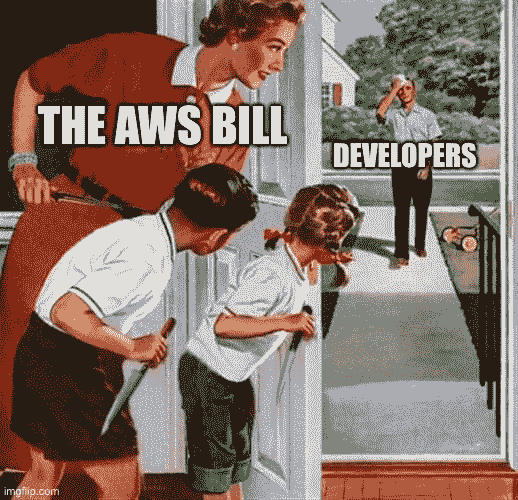
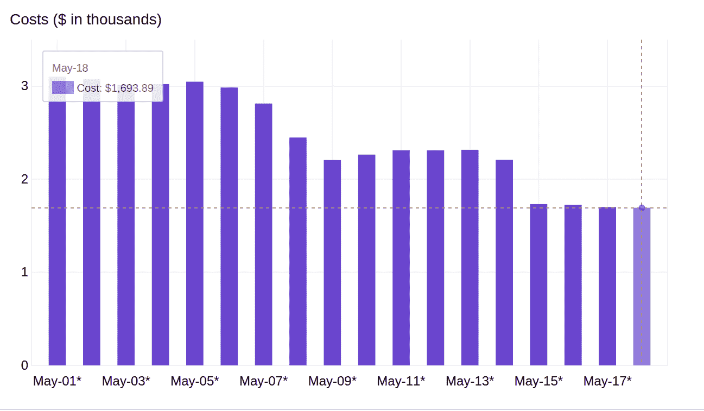
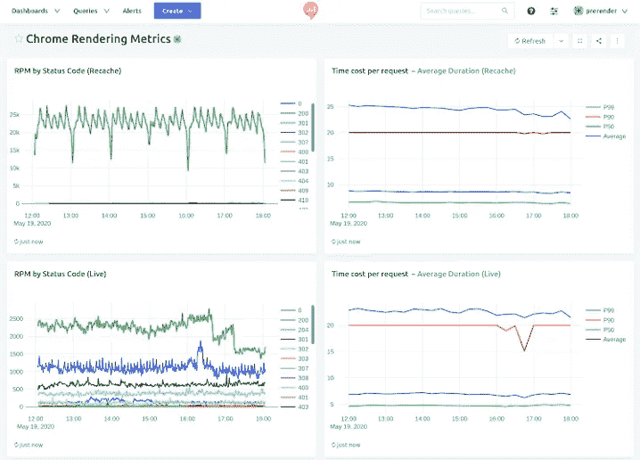
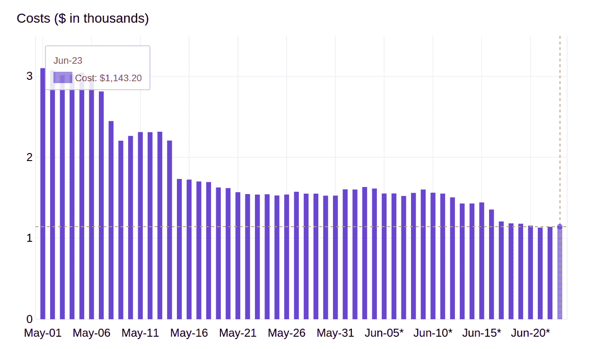

# 我们如何通过放弃 AWS 将年度服务器成本降低了 80%,从 100 万美元降至 20 万美元

> 原文：<https://levelup.gitconnected.com/how-we-reduced-our-annual-server-costs-by-80-from-1m-to-200k-by-moving-away-from-aws-2b98cbd21b46>

## 采访 Prerender 公司的技术主管兼总经理佐尔特·沃尔高

本周，我们采访了 Prerender.io 的首席工程师兼经理 Zsot 沃尔高。他分享了 Prerender 如何通过消除对 AWS 的依赖并构建内部基础设施来处理流量和缓存数据，从而节省了 80 万美元。

> “我们的目标是降低成本，同时保持相同的渲染速度和服务质量。像这样的迁移需要仔细规划和执行，因为不正确的配置或糟糕的执行会导致客户网页和社交媒体点击停机，使他们的搜索排名受到影响，并可能增加我们的流失率。”

> *= >在升一级编码中被面试➡️* [*填写这张表格*](https://forms.gle/zRs7Uhidtd7WTyCy8) *= >寻找一份令人惊叹的工作？➡️**[***访问升一级招聘平台***](https://jobs.levelup.dev/talent/welcome?referral=true)*

## *你能描述一下 Prerender 和你正在解决的最有趣的技术问题吗*

*简单来说，Prerender 缓存并预呈现您的 JavaScript 页面，这样搜索引擎就可以有一个纯 HTML 文件来抓取和索引，它所需要的只是在网站上安装适当的中间件，从而避免用户遭受昂贵而漫长的 JavaScript 工作区之苦。*

*然而，所有这些数据和过程都需要在服务器上进行，当然，我们为此使用了 AWS。几年后，我们每分钟处理超过 70，000 页，存储大约 5.6 亿页，每年支付超过 1，000，000 美元。*

*或者，如果我们继续使用 AWS，至少我们会支付这么多。相反，通过一些创新的思维和清晰的计划，我们在三个多月的时间里削减了 80%的成本。你也可以这样做。*

## *规划迁移:我们的分步指南*

*直到最近，Prerender 使用亚马逊网络服务(AWS)上托管的服务器和服务来存储其缓存的页面并为其客户呈现，亚马逊网络服务是最大的云提供商之一，提供虚拟服务器和托管服务。*

*Prerender 迄今为止一直使用 AWS 来存储其缓存的页面，直到它们准备好被谷歌、脸书或任何其他寻找内容索引的机器人/蜘蛛拾取。这提供了 Prerender 的大部分功能——向 Google 和其他搜索引擎提供静态 HTML，向人类用户提供动态的交互式 JavaScript。*

*问题？以这种方式在第三方服务器上存储多 TB 的预渲染网页内容是非常昂贵的。以这种方式存储缓存页面仅在维护和托管费用上就花费了 Prerender 天文数字的资金。*

*但还有一个问题没有多少初创公司考虑到，也没有太多关于它的讨论:流量成本。*

*将数据导入 AWS 在技术上是免费的，但是静态数据对大多数软件有什么好处呢？当移动数据成为 Prerender 的巨大成本时，我们开始注意到阻碍我们前进的瓶颈。*

*解决办法？将缓存的页面和流量迁移到 Prerender 自己的内部服务器上，尽快减少我们对 AWS 的依赖。*

*当我们进行成本预测时，我们估计我们可以减少 40%的托管费用，并决定服务器迁移将节省 Prerender 和我们的客户的钱。*

*目标是降低成本，同时保持相同的渲染速度和服务质量。像这样的迁移需要仔细规划和执行，因为不正确的配置或糟糕的执行会导致客户网页和社交媒体点击停机，使他们的搜索排名受到影响，并可能增加我们的流失率。*

*为了减轻潜在的后果，我们计划了一个三阶段过程，如果出现任何问题，我们可以很容易地恢复到上一步。如果由于某种原因，新的服务器无法工作，我们可以轻松地回滚我们的更改，而不会出现任何停机或服务质量下降的情况。*

*持续和系统测试的警告是，它需要几周甚至几个月的时间。*

# *将 Prerender 从 AWS 中移出:每周概述*

## *第 1 阶段—测试(4 到 6 周)*

*第 1 阶段主要涉及设置裸机服务器，并在扩展之前在更易于管理的小型环境中测试迁移。这个阶段需要最小的软件适应，我们决定在 Linux 上的 KVM 虚拟化上运行。*

*五月初，第一批服务器开始运行，1%的 Prerender 流量被定向到新服务器。迁移两周后，我们每天已经节省了 800 美元。到月底，我们已经从 AWS 迁移了大部分流量工作负载，将日常 chrome 渲染工作负载成本降低了 45%。*

*在服务器端，我们的成本目前是每月 13，000 美元。加上 AWS，**我们已经削减了 22%的开支**。*

**

*测试阶段对于确保后续流程顺利运行至关重要。我们致力于通过更多的监控和更好的错误处理来提高系统的健壮性。除了我们已经有的服务器监控仪表板，我们还设置了一个新的渲染监控仪表板，以便能够发现任何错误或发生的性能问题。*

**

*由于我们的持续监控和清晰的沟通，测试取得了成功，超出了我们的节约预测，并且一切就绪，可以开始第二阶段的迁移。*

## *第 2 阶段—技术设置(4 周)*

*在迁移的第一阶段作为概念验证之后，6 月和 7 月初之间的迁移阶段主要是技术设置。第二阶段的实施主要涉及将缓存存储移动到裸机服务器。*

*当迁移在六月中旬完成时，我们有 300 台服务器运行非常顺畅，总共有 2 亿个缓存页面。我们在每台与 AWS S3 兼容的服务器上使用 Apache Cassandra 节点。*

*我们将在线迁移分为四步，每一步间隔一到两周。在测试 Prerender 页面是否可以在 S3 和 minio 中缓存后，我们慢慢地将流量从 AWS S3 转移到 minio。当对 S3 的写入完全停止时，Prerender 每天在 S3 API 成本上节省了 200 美元，并表示我们已经准备好开始删除已经缓存在我们的 Cassandra 集群中的数据。*

*然而，大揭露出现在 6 月 24 日左右的这个阶段的末尾。在过去的四周里，我们将大部分缓存工作负载从 AWS S3 转移到了我们自己的 Cassandra 集群。AWS 的日常成本降低到每天 1.1 万美元，预计每月 3.5 万美元，新服务器的每月经常性成本估计约为 1.4 万美元。*

*在这一点上，S3 上仍然有一些每天花费大约 60 美元的剩余产品，它们将在几周内完全自然消失。虽然我们可以将所有数据移出，以立即将其减少到零，但将数据移出 AWS 会给我们留下 5000 美元的一次性“金钱浪费”。*

*移动数据将会遇到巨大的瓶颈。用我们新任首席技术官(佐尔特·沃尔高)的话说:*

*"[AWS 的真正隐藏价格](https://medium.com/guardians-of-cloud/the-hidden-culprit-of-aws-bills-aws-data-transfer-cost-18d18b8c20e4)来自流量成本，他们出售价格合理的存储，甚至可以免费上传。但是当你把它拿出来的时候，你会付出巨大的代价。*

*小型创业公司通常不计算流量成本，尽管流量成本可能占他们账单的 90%*

*例如，如果您在美国西部(俄勒冈州)地区，您必须支付 0.080 美元/GB，而在亚太(首尔)地区，这一价格高达 0.135 美元/GB。*

*在我们的案例中，大约每月 30，000 到 50，000 美元很容易。到第二阶段结束时，我们已经将每月服务器总成本降低了 41.2%。*

**

## *第 3 阶段—实施和扩展(4 到 6 周)*

*在这个阶段，迁移正在顺利进行，并且已经为 Prerender 节省了大量资金。剩下唯一要做的事情就是将所有其他数据迁移到本地服务器上。*

*这一步包括一个接一个地移动所有 Amazon RDS 实例。这是整个过程中最容易出错的部分，但是由于已经迁移了大量的数据，任何小问题或瓶颈都不会导致整个迁移崩溃。*

*这是迁移过程中最后一个阶段的总体视图:*

*   *我们在 Cassandra 中镜像了存储 cached_urls 表的 PostgreSQL 碎片*
*   *我们将 service.prerender.io 切换到 Cloudflare 负载平衡器，以实现动态流量分配*
*   *我们建立了新的欧盟私人缓存服务器*
*   *我们不断进行压力测试来解决任何性能问题*

*迁移最终被证明是一个巨大的成功。到所有缓存页面被重定向时，我们每月的服务器费用从最初估计的 40%下降到了 80%。*

## *我们学到了什么*

*如果事情出错或落后于计划，服务器迁移将面临很大的风险。这就是为什么我们确保在迁移的每个阶段都实施故障保护，以确保在出现问题时我们可以回退。这也是我们在进行其余迁移之前进行小规模测试的原因。*

*我们通过仔细规划迁移的每个阶段，在扩展之前测试实施的每个阶段，并在出现任何问题时轻松纠正任何错误，从而避免了危险。这样，我们可以获得节省服务器费用的好处，同时将任何潜在风险降至最低。*

## *是什么促使你致力于 Prerender 解决的问题？*

*我对在一个有助于推动网络发展的平台上工作的想法感到兴奋。*

*你看，有了 Prerender，我们的客户推出了注重用户体验的网站，而不是专注于 SEO，他们为客户提供最好的。在过去的几年里，每当我们建立一个新的登陆页面，我们总是使用 Wordpress 只是为了获得最好的搜索引擎优化，并保留了 SPA 的权力，只有像管理部分的非索引页面。但是现在，我在一家公司工作，这家公司帮助我解决过去在^.遇到的问题^*

## *您使用什么技术堆栈，为什么选择这种堆栈？*

*我们在任何地方都使用 Javascript，因为我们解决了 Javascript 渲染引起的“问题”,我们希望在这个领域建立尽可能多的专业知识。但是对于其他部分，我们正在利用 CloudFlare 的分布式系统来实现快速响应和全局可扩展性。而我们的正常运行时间保证是由数字海洋的云平台支持的。我们还利用无数其他 SaaS 提供商来最大限度地提高我们的效率。*

## *一旦你的公司实现了愿景，世界会变成什么样子？*

*当问题出现“我们能为我们的新站点使用 React 吗？”答案会是“肯定的！”，因为现在营销部门总是否决任何可以降低 SEO 排名的东西。我会说，理所当然。至于我们的客户，即使他们失去了 1%的有效性，他们也需要投入数十万美元的广告预算。*

## *对你来说，典型的一天是什么样的？*

*哈哈，很多客户电话！由于我们的目标是保持我们敬业的团队小而有效，我经常与他们进行入职电话。但是对我来说很好玩！我总是喜欢与客户交谈，了解他们的情况，并讨论解决方案。这让我的工作轻松了很多，因为我们不需要想出点子，我们的客户会告诉我们所有我们需要知道的事情。我相信这是最好的情况，以客户为导向，我的 KPI 是快乐客户的数量。*

## *描述您的计算机硬件设置*

*天啊，这本身就值一篇文章了。我是一个电脑迷，家里有 8 台专用服务器，为了方便起见，我大部分时间都在我的 macbook 上工作。但是当我有时间编程的时候，我会启动运行 Manjaro 的“工作站”。但很少当我有时间的时候，我会偷偷打开我的 windows 电脑玩游戏。在我写作的时候，我被笔记本电脑、覆盆子和平板电脑包围着。*

*制造机器和运行缩小规模的测试是我的深夜爱好。*

## *描述您的计算机软件设置*

*VSCode 对我来说是一个决定性的解决方案，我并不真正喜欢任何编程语言，它让我可以自由地安装一个扩展并在几秒钟内编写 IDE 支持的代码。此外，我有幸成为 CoPilot 的测试组成员，这是一个决定性的游戏改变者。*

*对于源代码控制来说，GitHub 是很棒的，但是我也不会忽视其他的解决方案。GitLab 近年来已经成为一个非常棒的工具。*

*消息传递，我认为 Slack 仍然是最广泛的专业选择，因为它做了它的工作，没有理由放弃它。但是最近我发现了一个非常有趣的软件叫做 Spike，在过去的 3 个月里，我一直用它作为我事实上的电子邮件客户端，因为它使电子邮件对话变得更加容易。*

*必备工具:Docker，除此之外别无他法，它把行业变得最好。我仍然记得我们不得不安装依赖项和解决包冲突的黑暗日子…*

*但是是的，Kubernetes 慢慢地处于同样的适应水平。*

## *对刚起步的软件工程师有什么建议吗？*

*不要害怕与顾客交谈。在我的职业生涯中，最好的软件工程师是那些与客户一起解决他们问题的人。有时候，仅仅通过学习可以用一行代码解决客户的问题，你就可以浪费半年的开发时间。我认为最好的工程师正在为现实世界的问题创造解决方案。*

## *你在招人吗？什么职位？*

*永远！我们的目标始终是，只有在我们能够确保新同事发挥有意义的作用，并做出明确贡献的情况下，才会聘用他们。但目前我们发展得如此之快，以至于我们需要在每个部门扩大我们的团队。所以，不要列出来，只要查看我们的职业页面 https://saas.group/career :D*

## *我们可以去哪里了解更多？*

*请访问我们的网站 prerender.io，如果您有兴趣就预渲染以及预渲染如何改变网络与我联系，请发送电子邮件至 [varga@prerender.io](mailto:varga@prerender.io) 联系我，我很乐意接听您的电话，了解您的情况和使用案例^.^*

*佐尔特·沃尔高是 [Prerender](https://prerender.io/) 的总经理，这是一款谷歌推荐的软件工具，被超过 12000 家公司使用，允许搜索引擎更好地抓取和索引 Javascript 网站。*

# *分级编码*

*[Level Up](https://levelup.gitconnected.com/) 是一个每月 300 万开发者的社区([了解更多并关注](https://levelup.gitconnected.com/)或[阅读更多创业访谈](https://levelup.gitconnected.com/interviews/home))。我们还与最好的初创公司和最具创新性的科技公司合作🔥*

*   ***你是开发者吗？**有最优秀的公司要求聘用你
    ➡️[t14】加入到人才集体 t16】](https://jobs.levelup.dev/talent/welcome?referral=true)*
*   *➡️ [**聘请 FAANG 级工程师**](https://jobs.levelup.dev/talent/welcome)*
*   *➡️ [**面试申请表**](https://forms.gle/oWT83qtGdydfi7yL8) 到贵公司面试*

*我们还为开发者提供免费的职业成长工具: [**编码面试课程**](https://skilled.dev/)[**自动简历生成器**](https://gitconnected.com/resume-builder)[**作品集 API**](https://gitconnected.com/portfolio-api)*

*关注我们:[Twitter](https://twitter.com/gitconnected)|[LinkedIn](https://www.linkedin.com/company/gitconnected/)|[时事通讯](https://newsletter.levelup.dev/)*