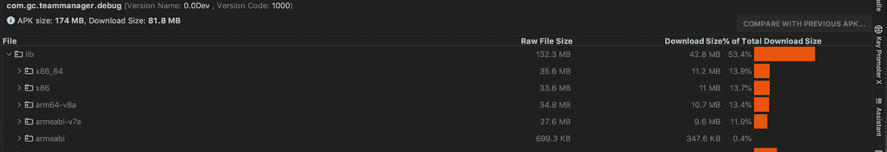
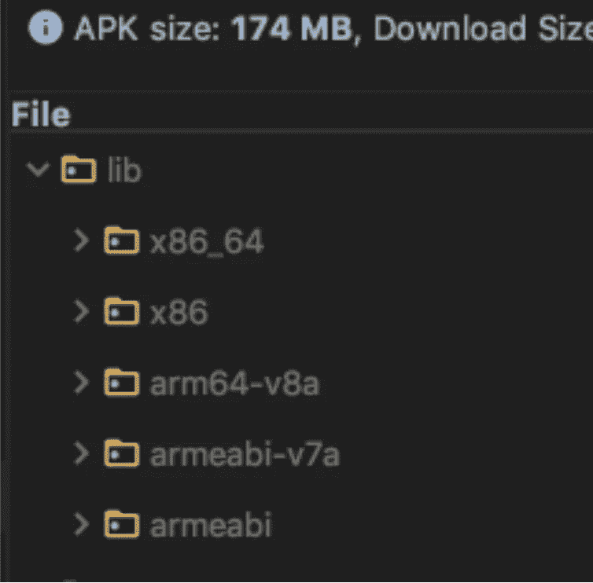
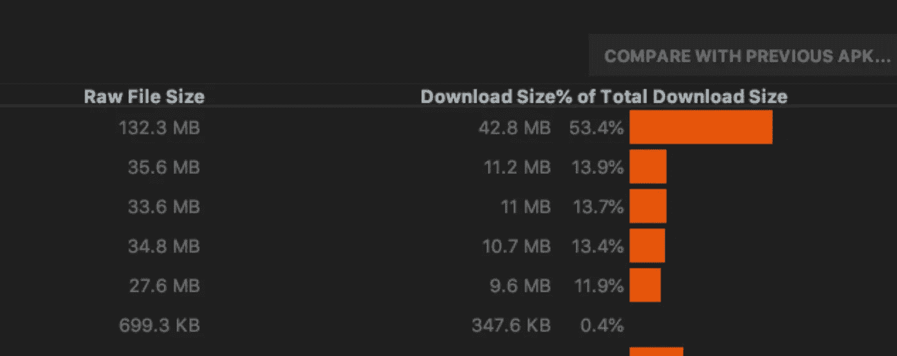
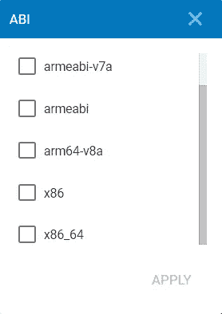
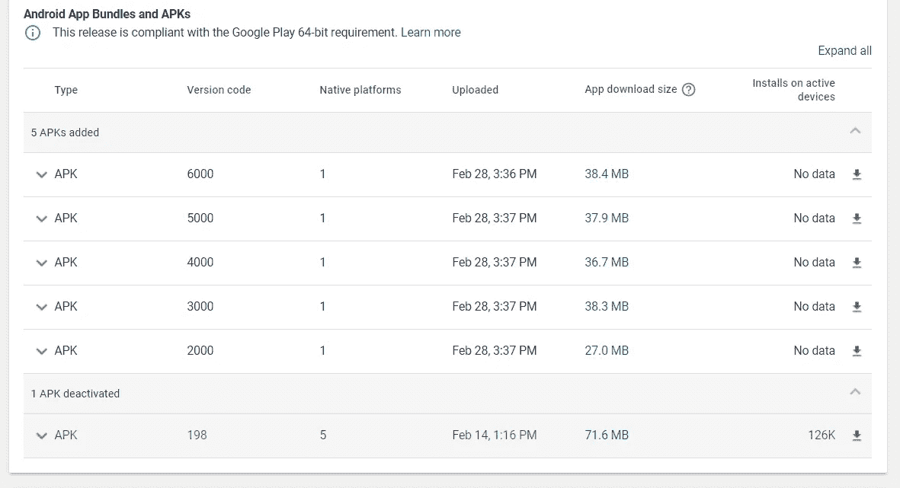
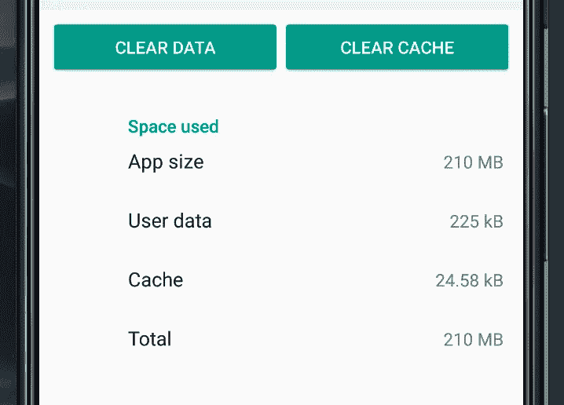
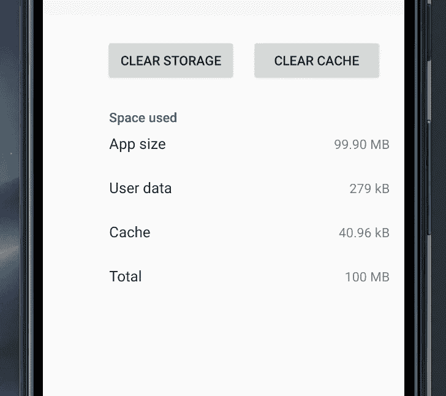
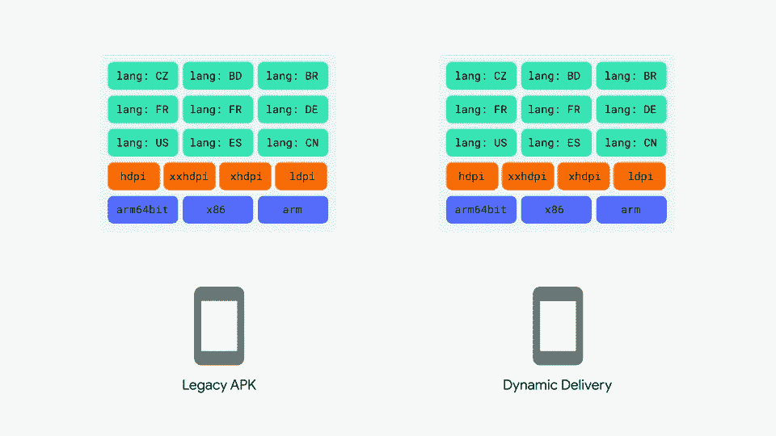

# 我们如何通过拆分 apk 将我们的应用规模减少了 50%

> 原文：<https://levelup.gitconnected.com/how-we-reduced-our-app-size-by-50-with-split-apks-c71196bbdde5>

## 你不需要 Android 应用捆绑包。领域用户听好了！


照片由[宝拉·拉瓦莱](https://unsplash.com/@paulathevalley?utm_source=unsplash&utm_medium=referral&utm_content=creditCopyText)在 [Unsplash](https://unsplash.com/s/photos/person-using-phone?utm_source=unsplash&utm_medium=referral&utm_content=creditCopyText) 上拍摄

我们最近达到了谷歌 Play 商店的应用大小上传限制，即 100 mb。我们没有使用 Android 应用捆绑包，而是想看看我们是否可以在没有它的情况下减少我们的应用大小。

所以我们分析了我们的 APK:



注意`lib`文件夹中的五个文件夹。



它们占了很多空间！原来这些文件夹都是编译好的 [ABIs](https://developer.android.com/ndk/guides/abis) ，基本上只是 Android 机器码。这就是你写的代码在你设备的 CPU 上实际运行的方式。您的设备需要这些文件夹中的一个来实际运行您的代码。

那么，为什么在我们的 APK 中有五个 ABI，而一个设备只需要一个？简而言之，我们使用 Realm 开发我们的应用程序，Realm 使用 NDK 或本地开发工具包。因此，当我们创建我们的 APK 时，我们得到了构建到我们的 APK 中的每个平台的编译代码。真不敢相信

按照[这些步骤](https://developer.android.com/studio/build/apk-analyzer)来分析你的 APK，检查你的应用程序是否被这些库弄得臃肿不堪。如果是这样，请继续…

## 一个 APK 来统治他们所有人…？

因此，我们可以做的是将我们的“通用”APK 拆分成多个 apk，在 ABI 上拆分。这里的代码很简单并且有很好的文档。将此代码添加到您的应用程序 gradle 文件中:

```
android {
    splits {abi {enable *true* reset()

            include 'armeabi-v7a','arm64-v8a', 'x86', 'x86_64', 'armeabi'

            universalApk *false* }
    }
...
}
```

在文件的下面添加这个:

```
ext.abiCodes = ["armeabi":1, "x86":2, "armeabi-v7a":3, "arm64-v8a":4, "x86_64":5] *// this order matters

import* com.android.build.*OutputFile*android.applicationVariants.all { variant **->**variant.outputs.each { output **->** *def* baseAbiVersionCode =project.ext.abiCodes.get(output.getFilter(*OutputFile*.*ABI*))
 *if* (baseAbiVersionCode != *null*) {output.versionCodeOverride =
                    baseAbiVersionCode * 1000 + variant.versionCode
        }
    }
}
```

这是有据可查的，但是这里有一个问题。`abiCodes`的顺序很重要。这个订单对我们有效。基本上，ABI 类型的 32 位版本必须是比 64 位版本更低的版本代码。`x86`必须是比`x86_64`更低的版本代码。`armeabi`必须是比`armeabi-v7a`和`arm64-v8a`更低的版本代码。

说到这些 ABI 代码，这些值是从哪里来的呢？好问题。有 x86 (32 和 64 位)，ARM 和 MIPS ABIs 三个版本。有很多首字母缩略词。我需要包括哪些内容？

我们读过这方面的资料，但并不清楚。有些只包含 64 位 ABI。有人说要摆脱 MIPS ABIs，我们做到了(没有现代的 Android 设备运行 MIPS)。我们使用了 [Android 的官方文档](https://developer.android.com/ndk/guides/abis)和 Google Play 控制台的设备目录。

设备目录允许我按 ABI 过滤支持的设备。我们有使用五个 ABI 的设备:



可过滤 ABIs

我们决定包括所有这五个 ABI。根据 Android 文档，我认为我们可以从上传到 Play Store 的 apk 中删除`armeabi`,而不会失去设备支持。但没有理由不上传它，我宁愿安全而不是遗憾。

所以现在，建立您的签名的 apk 并上传所有五个！它应该是这样的:



你可以看到每个 APK 大约只有一半大。这太棒了！那现在怎么办？我如何确保每个用户获得正确的 APK？实际上，你不必为此做任何事情。该游戏商店完全处理 APK 的交付。它会计算出用户拥有什么设备，需要什么 ABI，并下载正确的 ABI！

但是收益实际上比上面提到的下载量要大得多。



分割 apk 之前



拆分 apk 后

下载您的应用程序时，它会大于 Play Store 中显示的“应用程序下载大小”。

这些是类似的像素设备在拆分 apk 之前和之后的截图。“应用程序大小”的收益约为 50%，但我们在 Pixel 设备上节省了超过 100mb！

谷歌 Play 商店对您的最终用户来说看起来完全一样，他们不需要任何功能上的不同。下次更新时，他们的应用程序将只有原来的一半大小！

因此，我们将应用规模缩减了 50%，您的最终用户什么也不用做。太好了。但是让我们来解决房间里的大象。为什么我们没有安卓应用捆绑？它做着同样的事情，这个 GIF 很好地总结了这一点:



你会注意到，只有一个 ABI 会出现在右边的设备上。这就是我们刚刚做的！它也只将一种语言和一个资源集打包到设备上。实际上，您也可以像我们使用 ABIs 一样自己完成这项工作。在这里阅读更多。我们没有这样做，因为 ABI 是在这个时候真正膨胀我们的应用程序的原因。

我们找出了使用 AABs 所需的工作，而不是自己拆分。两者的成本都很低，但我们不想把签约交给谷歌。这并不仅仅局限于谷歌 Play 商店。我们也已经解决了所有 CI 中的签名问题，因此由我们来处理签名并不是一个大胜利。

我们现在还可以单独测试每个 APK。每个 APK 预成型的方式不应该有任何差异，但如果有一个非常低级的错误，你可以单独安装和调试 APK，而不是依赖整个 AAB 捆绑 APK。

最后，去 AAB 是一个不可逆的过程。一旦你选择加入，你就不能退出。你的应用程序现在由谷歌签名，你不能再自己签名了。Google 拥有您的应用程序签名密钥。

现在我们将承认，这些理由中的大部分是相当“锡箔帽”y。但是自己做的成本是如此之低，以至于它真的不是一个大的权衡。老实说，这很有趣！

额外的举动:现在你已经打开了多个 apk 的闸门，你可以用动态交付做一些非常酷的事情。

假设您有一个测试程序，并且您正在向一部分新用户推出一项新功能。典型的流程是将功能打包到应用程序中，并限制某些用户使用某些功能。但是这使你的应用程序膨胀了一个不是每个用户都能看到的特性。

你能做的就是上传你的基地 APK 和上传一个特色 APK。然后，通过动态交付，您可以将功能 APK 仅分发给需要它的用户。这里有一篇关于这个[写的很棒的文章。](https://medium.com/mindorks/dynamic-feature-modules-the-future-4bee124c0f1)

感谢阅读，如果这篇文章对你有帮助，请鼓掌！