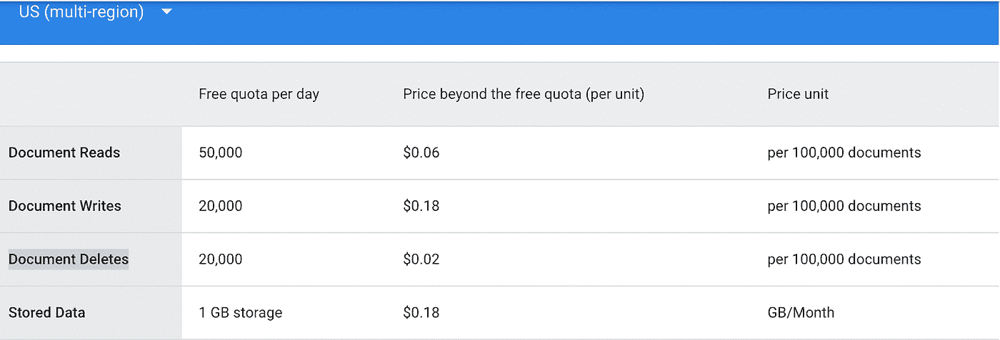
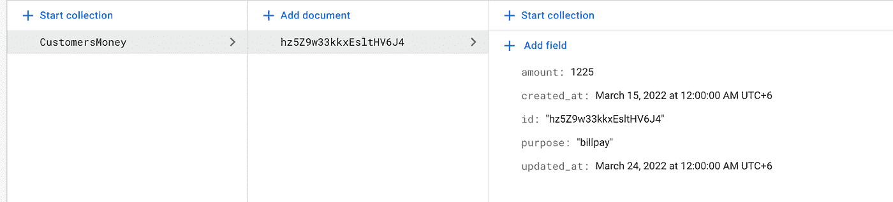
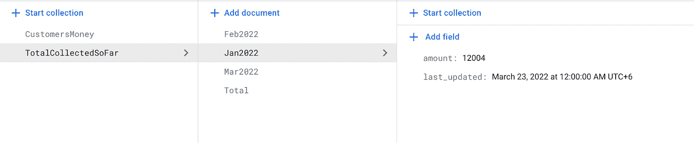

# 我们如何将 Firestore 成本降低 70%以上

> 原文：<https://levelup.gitconnected.com/how-we-reduced-our-firestore-cost-by-more-than-70-193fd3d6f8ca>

## 开发人员应该超越编码来产生影响

作者截图

在创业初期，大多数开发人员或创始人往往不会以 100%的效率设计他们的数据库，因为开发人员和创始人都必须赶着推出产品。

我们一开始用 Firebase Firestore 作为我们的后端，因为成本太低，所以一开始看起来很无辜。但是当我们的用户增长时，成本呈指数增长，我们必须做些什么来削减成本。

我们做了一些重新设计。Firestore 和云功能非常简单。让我们来谈谈这个:

# 写入与读取比率:

这是我们数据库的重大更新，通过它我们可以大大降低成本。我们都知道，Firestore 的计费是根据有多少文档被阅读和有多少文档被写入来计算的(其他一些次要因素，如文档的存储)。

我们从上面的截图来看看 Firestore document 的读写删除定价的图表。

现在，让我们用一个最简单的例子。我已经为这篇文章创建了一个演示项目、一些集合和文档。

假设你正在开发一个会计软件，显然你必须保存每一分钱的记录。

假设，在会计软件中，您将客户支付的所有货币记录保存在一个名为“CustomersMoney”的集合中，其中每个文档包含几个字段，包括“amount ”,即单个客户支付的货币金额。

为了更好地理解，我创建了一个集合和一些文档。

作者截图

现在，最有可能的是，在这个会计软件中，你必须有一个仪表板，在那里你必须显示收集的钱的总数，以及按月和按年收集的总数。比如有人想看看到 2022 年 1 月收了多少钱？

通过查询“CustomersMoney”集合中从 2022 年 1 月 1 日到 1 月 31 日的所有文档，可以很容易地找到金额。

如果文档数量没有那么大，那也没问题。您可能会认为，每 100，000 个文档，阅读一个文档只需要 0.06 美元。看起来很无辜，对吧？

但是假设您有 1000 个客户，他们每天查看仪表板 5 次，一月份有 500，000 个文档。

现在，如果您查询所有文档并计算 2022 年 1 月的总收款，那么仅是为了读取数据，Firestore 就要花费您这么多:

1000*5*(50 万/10 万)* 0.06 $ = 1500 $每天！！

## 现在让我们来看看替代方案！

通过使用 Firebase 云函数，我们可以大大降低成本。我喜欢云 Firestore 触发器！这让你的工作非常顺利，让你的应用程序/网站速度更快。

但这不是今天的话题。我们以后再讨论。

先说省钱吧。让我们创建另一个名为“TotalCollectedSoFar”的集合，其中的文档 id 是月份和年份的组合，比如 Jan2022。每个文档都有几个字段，包括“金额”。这个量是时间线之间的集合量。为了更好地理解，我还添加了另一个截图。

好吧！！你可能知道 Firestore 触发功能。如果你不知道，你可以通过这个[链接](https://firebase.google.com/docs/functions/firestore-events)了解更多信息:

当您创建、更新或删除特定集合中的文档时，触发函数将会触发。

不是说我们写了一个触发函数。当在“CustomersMoney”集合中创建、更新或删除任何文档时，使用触发器函数，我们将更新“TotalCollectedSoFar”集合。

我们来看下面的截图:

作者截图

假设，目前，到 2022 年 1 月收集的总资金是 12000 美元。现在另一个顾客已经支付了 4 美元。然后会调用触发函数，现在 2022 年 1 月的货币总量是 12004 美元。

现在，让我们计算一下你的那 1000 个客户的阅读成本。

现在，您不必查询所有文档来计算 2022 年 1 月的总收集量。您只需阅读“TotalCollectedSoFar”集合中名为 Jan2022 的单个文档。

所以，现在对于同样的任务，成本将是:

1000*5*(1/100，000)* 0.06 $ = 0.003 $(用于读取)

但是在触发器函数中，我们将有一些额外的“写成本”,用于更新 2022 年 1 月的 500，000 个文档的“TotalCollectedSoFar”集合。

大约是:(500，000/100，000)*0.18 美元= 0.9 美元

在触发器函数中读取一些文档会有其他开销。但那也是很次要的。

所以现在，总成本是:0.003+ 0.9= 1 美元！！

比 1500 美元少多了，不是吗？

# 频繁读取和较少更改的数据:

这是我们用来降低成本的另一项技术。这很简单。但是这个技术有一个要求。

如果您的集合被用户频繁地大量阅读，并且不经常更改，那么您可以应用这种技术。

我们来讨论一个案例。假设一个新闻聚合应用程序或视频流应用程序在其主页上显示热门新闻或电影！

通过 Firebase 数据包，您可以将所有这些情况的成本降至最低。有几篇关于它的文章写得很好，所以我认为把它们都重写一遍是浪费时间。

你可以从[这里](https://firebase.blog/posts/2021/04/firestore-supports-data-bundles)了解 Firebase 数据捆绑包，最大限度降低成本。在处理大量数据时，Firebase Data Bundle 非常有用。

## **我们的额外解决方案:**

老实说，我们从来没有使用过 Firebase Data Bundle，因为我们不需要处理那么多数据。

但是我们采用了另一种方法，这种方法也非常有用，不太复杂，而且非常节省成本。我们的解决方案在很大程度上依赖于我们的移动应用。

我们过去做的是智能缓存。当一个用户进入我们的系统，我们必须检查大量的收藏，如果他们目前的住所是否改变。由于解决方案是关于物业维护的，所以检查地址非常重要。但事实是用户的地址不会经常改变。也许一年一次，甚至更少。

现在，每当用户启动我们的移动应用程序时，我们必须阅读至少 10 份文档。一个普通用户每天使用我们的应用 2-3 次，一个月 50 次。这意味着我们只需为进入应用程序承担 500 次阅读/用户。

然后我们做了一件简单的事情。我们将所有 10 个文档缓存在本地内存中，并创建了另一个名为“IsAnythingChanged”的集合。在该集合中，我们使用 userID 作为文档 ID，并且只有一个布尔字段。现在使用布尔字段，我们可以从我们的应用程序检查用户地址是否改变。

所以现在，我们不必阅读 10 份文件，而只需阅读一份。所以我们的成本降低了 90%。

如果用户地址改变了，那么使用 firebase 云函数，我们改变了布尔字段的值。这么简单！这么有效！

*感谢阅读！！这些技术简单、古老，但是有效。你削减成本的解决方案是什么？请在评论区与我们分享。*