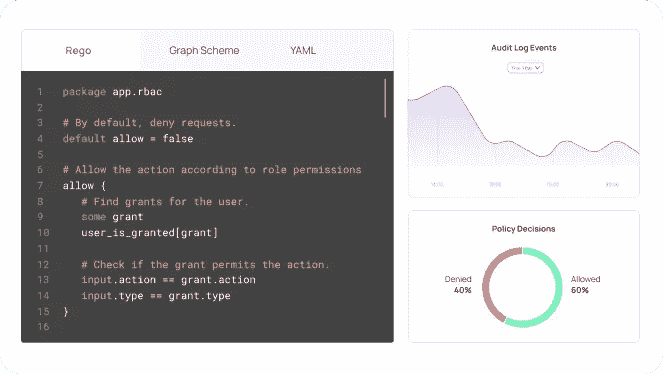

# 我们如何解决软件中最基本的挑战之一:许可和访问控制

> 原文：<https://levelup.gitconnected.com/how-we-solve-one-of-the-most-fundamental-challenges-in-software-permissions-and-access-control-5885066aad6a>

## 对 Permit.io 首席执行官兼联合创始人韦斯的采访

在本周的采访中，我采访了 Or Weis，他是 [Permit.io](https://www.permit.io/) 的首席执行官和联合创始人。他分享了他对创建安全应用程序的未来的愿景，以及他的公司如何通过为权限和访问控制提供低代码接口来为软件中最常见的挑战之一提供简单而强大的解决方案。

当您第一次看到 Permit 时，您会奇怪为什么市场上没有这样的解决方案。它极大地简化了我们构建应用的方式，同时也使它们更加安全。关于许可证最好的部分——它完全基于开源软件。

> >想让您的公司接受高级编码面试吗？ [*填写这张表格*](https://forms.gle/zRs7Uhidtd7WTyCy8)
> >寻找一份令人惊艳的工作？ [*访问升一级招聘平台*](https://jobs.levelup.dev/talent/welcome?referral=true)

> “随着软件吞噬世界，越来越多的应用程序由人工智能代理互联和运行，其速度超过了人类的想象；通过无缝的人类体验，人和系统可以连接在一起，并为彼此设定界限，从而唤起信任，实现更大、更快的连接。”

# 你的公司是做什么的？是什么吸引了你的想法？

全栈权限即服务—我们让开发人员能够在几分钟内将权限和访问控制融入到他们的产品中，并动态扩展和更新策略。这使得他们能够专注于实际构建他们的核心产品。

在我之前的冒险(Rookout)中，我为一个还不到三年的产品重建了五次访问控制。这让我抓狂——所以我和我的联合创始人阿萨夫决定一劳永逸地解决这个问题。

# 权限是如何工作的？需要 SDK 吗？

重点主要在后端。出于明显的安全原因，授权不能在前端完成。我们提供了一个将 OPA、OPAL 和 API 服务捆绑在一起的容器。我们坚信开源软件，并通过创建 OPAL 和利用 OPA 为其做出贡献。​​

*   [https://github.com/permitio/opal](https://github.com/permitio/opal)
*   [https://github.com/open-policy-agent/opa](https://github.com/open-policy-agent/opa)

对于工作的授权，我们只需要三条信息:身份、资源和动作。它说“这个用户正在以这种方式使用这个资源。”

当客户支付某样东西时，是在 Stripe 这样的第三方系统中。您希望所有这些更改快速传播到您的授权微服务。对于一个小的或新的公司，整个流程可以在 15 分钟内建立起来。一个非常大的公司可以在大约一个月内完成迁移。

由于延迟，微决策服务在他们那边运行。这是一个理想的边车，所以它是通过内存和没有延迟。

开始可以在几分钟内完成，您可以定义用户可以采取的操作，然后它会传播到所有微服务。我们有一个免费扩展层，您可以获得多达 1k 的用户。

然后使用它，它非常简单。请参见下面的前后对比。

**之前:**

**之后:**

# 您使用什么技术堆栈，为什么选择这种堆栈？

AWS -> K8s -> Python，Go -> React
我们喜欢坚持最佳实践，喜欢弹性和开发速度。

对于 OPAL，我们希望具有可扩展性。我们希望从不同的来源获取数据，所以我们使用了一个小的 Python 模块。授权查询必须非常快，所以我们选择了 Go。

# 对你来说，典型的一天是什么样的？

混沌，作为联合创始人。它几乎总是包含与工程师同事谈论现代 AuthZ 的挑战，以及帮助客户和 OSS 用户面对这些挑战。

这些天，我的时间都花在与客户和团队的合作上。我联系客户或参与市场——采访、会议、发微博、写博客等。

在推出和成长之后，我不再亲自动手编写代码。一位首席执行官正在一千件不同的事情之间转换。你不能沉下心来解决一个问题。

# 你最初是如何进入软件开发的？

五岁的时候，姐姐教了我一些 DOS 命令。我家很早就买了一台电脑。我想运行不同的游戏，那时候，你必须安装并输入命令才能运行。这也教会了我英语以及在电脑上使用命令。当时，像 Visual Basic 这样的东西似乎很神奇，很流行，但现在我们看到它已经被超越了。我被吸引住了，并从那里开始不断成长。

我的重大飞跃是应征入伍，加入了一支名为 8200 的部队。我们实际上是在生死软件中，你学会编写防弹的好软件(尽可能)。在一个例子中，我们只有 4 次机会成功部署我们的软件，否则人们会死去。这是一个复杂的系统，第一次部署没有成功。压力很大，我们必须想清楚每一步。这与今天我们可以迭代的云原生软件形成对比。它教会了我真正理解我的代码是做什么的，以及它将如何崩溃。

服役期满后，我花了大量时间从事网络安全工作。

# 您已经经历了许多不同的编程语言和技术变革——您是如何跟上时代的？

它大部分是自然发生的。退伍后，我转入了基于云的开发和微服务。这些是我必须做出的飞跃，我喜欢投身于新技术。正如前端开发者所知，网络也在快速发展。我从 Angular 2 开始，注意到了不足之处，所以我开始做出反应。我看到了什么是有效的，什么是缺乏的，并转向感觉正确和最自然的。

# 是什么让你的公司与众不同？

我们关注同理心和人类体验，例如:

1.  我们知道开发人员不仅仅想要很酷的技术——API 和基础设施——他们希望能够专注于他们的核心产品，并希望许可问题(不是任何产品独有的)不再出现，而不仅仅是部分解决。
2.  我们知道，这不仅仅是授权给开发人员，而是通过他们授权给组织的所有其他人。

# 关于你的公司或文化，你有什么有趣的事情想分享吗？

[我们的核心价值观](https://docs.google.com/document/d/1FGkGwb-4VjsFZlW9fOhOq3-sbqr_MftNH_CHysUYfpY/edit#)和理念:一起在战壕里，肩并肩，独立向前冲锋，互相掩护。
灵感来自我在 8200 部队的时光。

# 在贵公司工作最令人兴奋的部分是什么？

1.  作为开发人员，我们通过同理心和真正的理解和联系来解决我们自己(和我们同事)的痛点。
2.  影响现代软件中最关键的领域之一— IAM 和权限

# 你正在解决的最有趣的问题是什么？

*   借助我们的操作系统 OPAL T4，我们解决了一个非常困难的问题，即通过一个独特的实时事件驱动的 websocket 发布/订阅通道，让实时分布式应用程序与它们的分布式数据平面保持同步
*   OPAL 也是连接基于图的策略引擎(如 Google Zanzibar)和基于代码的引擎(如 OPA)的垫脚石和桥头堡
*   我们创建了如此简单的 RBAC 和 ABAC 接口，以至于任何人都可以使用，同时最终仍然可以将策略创建为代码，并允许在 Git 中管理它
*   我们允许用户创建策略模型并在它们之间切换(比如 RBAC 和 ABAC ),甚至不需要完全理解它们的意思，也不需要重构他们的代码。

# 一旦你的公司实现了愿景，世界会变成什么样子？

随着软件蚕食世界，越来越多的应用程序以超乎人类想象的速度相互连接并由人工智能代理运行；通过无缝的人类体验，人和系统可以连接在一起，并为彼此设置边界，从而唤起信任，实现更大、更快的连接。

# 如果你没有实现你的愿景，这个世界会错过什么？

这不是一个真正的选项，而是必须的，要么我们做，要么其他人做。没有它，世界经济将嘎然而止，跟不上其自身不断加速的技术发展速度。

# 你现在正在尝试的技术或工具中有没有让你感到兴奋的？

Github 副驾驶，谷歌桑给巴尔， [Mini-DAL-E](https://huggingface.co/spaces/dalle-mini/dalle-mini)

# 它看起来像一个人工智能和人工智能助手，是什么吸引了你？

AI 的必然方面来了。它会扩散并填满整个空间。大多数职业都将被人工智能戏剧性地改变，同时也创造了全新的人工智能职业道路。工作将被创建，如提示开发人员或提示设计师。

对于我正在处理的权限，这将是我们需要面对的挑战的一部分。“在这个第三方应用程序中，我的 AI 代理可以代表我获取哪些权限？”理解这一点将非常困难，需要大量的简化，以便我们的权限可以与 AI 一起工作，并提供信任和良好的体验。解决这些挑战是我的责任。

# 描述您的计算机硬件设置

Mac book pro 罗技按键和鼠标；2 个戴尔 24 英寸屏幕

# 描述您的计算机软件设置

VSCode，Docker，Slack，Chrome，Gmail

# 你在招人吗？什么职位？

Fullstack 开发、开发倡导者、营销总监

我们默认是混血儿。我们在特拉维夫有一个办公室，但是人们可以选择是在办公室还是在家里工作。我们的团队成员遍布世界各地，我们一直在寻找最优秀的人才。

# 我们可以去哪里了解更多？

*   [Permit.io](https://www.permit.io/)
*   Opal.ac
*   聊天:[bit.ly/permit-slack](http://bit.ly/permit-slack)
*   变焦:[calendly.com/permitio](http://calendly.com/permitio)
*   @OrWeis 在 twitter、Github 和 LinkedIn 上

# 分级编码

[Level Up](https://levelup.gitconnected.com/) 是一个月 300 万开发者的社区([了解更多并关注](https://levelup.gitconnected.com/)或[阅读更多访谈](https://levelup.gitconnected.com/interviews/home))。我们还与最好的初创公司和最具创新性的科技公司合作🔥

*   **你是开发者吗？**有最好的公司向你伸出援手
    ➡️ [**加入到人才集体**](https://jobs.levelup.dev/talent/welcome?referral=true) 中来
*   ➡️ [**聘请顶尖工程师**](https://jobs.levelup.dev/talent/welcome)
*   ➡️ [**面试申请表**](https://forms.gle/oWT83qtGdydfi7yL8) 面试贵公司

我们还为开发者提供免费的职业成长工具: [**编码面试课程**](https://skilled.dev/) ， [**自动简历构建**](https://gitconnected.com/resume-builder) r， [**portfolio API**](https://gitconnected.com/portfolio-api)

关注我们的 [**Twitter**](https://twitter.com/gitconnected) 和 [**LinkedIn**](https://www.linkedin.com/company/gitconnected/)