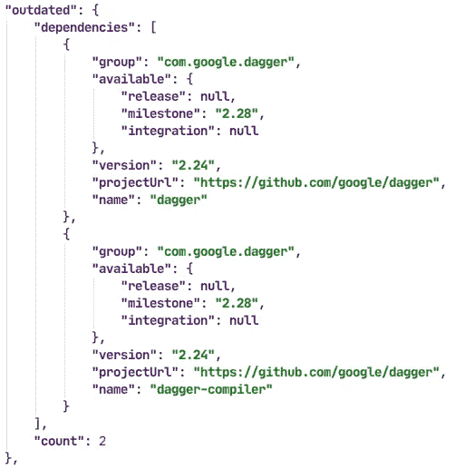

# 我们如何与我们的依赖关系保持同步

> 原文：<https://levelup.gitconnected.com/how-we-stay-up-to-date-with-our-dependencies-7365528a3ec8>


我想我们都知道如何添加对 Gradle 的依赖，对吗？我的意思是，这基本上是一句话:

```
dependencies {
  implementation("x.y.z:abc:1.0-alpha01")
}
```

对我们来说没什么新鲜的，对吧？

但是，如果有一个新版本的依赖项可用，那么这一行代码会怎么样呢？也许作者实现了一个新特性，或者更好，修复了一个 bug！

好吧，如果你像我或我所知道的大多数人一样，会发生以下情况:**没事**。或者至少只要你不需要那个新特性或者一个 bug 破坏了你的东西，什么都不会发生。

这样做没有错。只要你对某个特定版本感到满意，保持这个版本是完全没问题的(而且发现的 bug 与你的业务无关)。但是，如果有东西能提醒你定期更新，那岂不是很酷？不是说你**必须**更新而是说有**能力**更新？

最近我和我的团队写了我们自己的`**DependencyBumper**`。这个工具定期查找我们的依赖项的更新，并在找到一个时创建一个拉请求。

在我详述之前。是的，我们知道[dependent bot](https://dependabot.com/)及其兄弟工具。但他们中的大多数只适用于“标准梯度设置”(不管那是什么意思)。由于我们没有这样的设置(也不会改变)，我们决定自己构建一些东西。

## 我们当前的设置是什么样的？

我们有一个名为`versions.gradle`的文件，在这里我们定义了一个`Map`，以“依赖项的名称”为关键字，以 Gradle 字符串依赖符号为值。我们将整个地图放到`[ExtraPropertiesExtension](https://docs.gradle.org/6.5/dsl/org.gradle.api.plugins.ExtraPropertiesExtension.html)`中，使其在所有其他构建脚本中可用。

```
ext {
  deps = [:]
  deps.kotlinjdk = "org.jetbrains.kotlin:kotlin-stdlib-jdk7:1.3.72"
}
```

我们只需要在构建脚本中应用这个脚本就可以访问依赖项。

```
apply from: 'versions.gradle'dependencies {
  implementation deps.kotlinjdk
}
```

## 如何在该文件中更新依赖关系？

我们利用[升级版本插件](https://github.com/ben-manes/gradle-versions-plugin)来检查更新。所提供的名为`dependencyUpdates`的任务将生成一个`JSON`文件，其中包含有更新的依赖项。



然后我们运行一个定制的`[JavaExec](https://docs.gradle.org/6.5/dsl/org.gradle.api.tasks.JavaExec.html)`任务，它将执行我们的`DependencyBumper`。该代码随后执行以下操作:

*   解析`JSON`文件，为每次更新创建一个`Map`
*   为`Map`中的每个条目创建一个新的`branch`
*   检查`origin`和**处的`branch`名称是否已经存在，如果是，跳过**此条目
*   用*新版本*替换`versions.gradle`中的*当前版本*(用 [Regex](https://en.wikipedia.org/wiki/Regular_expression) 的魔力)。
*   将`branch`推到`origin`
*   创建一个从这个`branch`到我们的基础分支`develop`的拉请求

通过检查**如果**在`origin`已经有一个`branch`，我们可以简单地关闭拉请求—如果我们对这个更新不感兴趣—但是不要删除分支。下次`DependencyBumper`运行时，它将检测到`branch`已经可用，并跳过它创建拉取请求的部分。

我们仍然面临的一个挑战是一起更新属于一起的依赖关系。正如您在上面的`JSON`示例中看到的，`dagger`和`dagger-compiler`依赖项应该一起更新。在单一代码库中为`dagger`提供版本`2.23`而为`dagger-compiler`提供版本`2.24`是没有任何意义的。目前，我们的工具为每个依赖项创建一个拉请求——这毫无意义。

基本就是这样。但是——老实说——当这个话题第一次提出时，我完全反对。我担心，只要我们的配置项是绿色的，它就会迫使我们盲目地合并这些拉请求。而不看变更日志或发行说明。令人惊讶的是，在第一轮更新后(有**很多**)我注意到了完全相反的情况。我们查找了每个依赖项的所有更改，并对 pull 请求中值得一提的更改进行了注释！这使得整个团队都可以看到变更，如果在开发新功能或修复 bug 时更新了依赖项，就不会出现这种情况。