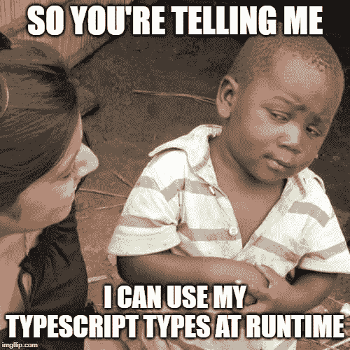

# 我们如何在运行时使用 Typescript 类型信息

> 原文：<https://levelup.gitconnected.com/how-we-use-our-typescript-type-information-at-runtime-6e95b801cfeb>

## 从您的类型生成一个 JSON 模式，世界就是您的了

当我第一次听说 Typescript 的时候——老实说——我是一个普通的新手，我可能会问这样一个问题‘我可以在程序运行的时候使用这些类型吗？’

无论如何，这听起来像是编程新手可能会问的问题。事实是，而且永远是，你不能在运行时使用你的类型。为什么不呢？你们中的大多数人可能已经知道了，但是为了完整起见，你们不能知道，因为 Javascript(Typescript 编译成的运行时语言)不*包含任何关于你的类型的信息。使用不存在的信息有点困难。*

## 输入，JSON 模式

在这里，我趁机无耻地插入了一个**极其**方便的库，名为 [ts-json-schema-generator](https://github.com/vega/ts-json-schema-generator) (无耻是因为它不是我写的)。如果你点击这个链接，你会发现它是由 [mrix](https://github.com/mrix) 发起的，大部分内容是由 [domoritz](https://github.com/domoritz) 贡献的。他们值得一提，因为他们写了这么棒的工具(也因为 domoritz 接受了我的几个拉请求，谢谢伙计！).

那么[ts-JSON-schema-generator](https://github.com/vega/ts-json-schema-generator)到底是什么，我们为什么需要它？嗯，从这个库的名字就可以看出，它接受您的 Typescript 类型信息，并转换成一个 [JSON 模式](https://json-schema.org/)。什么是 JSON 模式？很高兴你问了。下面是一个 JSON 模式:

它是一个普通的老式 JSON 对象，根据 JSON 模式规范(见上面的链接)具有特定的结构。对于那些在家玩的人来说，JSON 对象*可以在运行时使用。*

您最终得到的 JSON 模式是您的 Typescript 类、接口、属性、类型别名等的准确表示。不仅如此，您还可以向上面的任何内容添加 [JSDoc](https://jsdoc.app/about-getting-started.html) 注释，它们也将被带到您的模式中。下面是一个 Typescript 输入和生成的 JSON 模式的快速示例:

ts-json-schema-generator 的 Typescript 输入

上述类型和注释产生的 JSON 模式输出

## 纯粹的魔法

是不是很不可思议？看着这个模式，你可能已经对一些可能的用例垂涎三尺了，但是我将介绍一些我和我的团队在 [Nightlife Music](https://www.nightlife.com.au/) (好吧，那是一个无耻的插件)已经实现或计划实现的功能，JSON 模式是功能的核心:

1.  **验证**——使用另一个同样棒的工具，另一个 JSON 模式验证器或 [ajv](https://github.com/epoberezkin/ajv) ，我们可以在运行时简单地通过传入对象和我们的模式来验证任何对象。我们甚至可以得到某种格式的错误输出，这种格式可以通过编程来实现，比如在表单上显示针对无效字段的错误，自动修复无效属性，等等。
2.  **授权** —如上，但是我们传入的模式包含一个对象可以包含的所有可能的有效值。例如，如果我们的用户只允许在一个 api 调用中发送 1、2 或 3(如模式中所指定的),但是他们发送了 4，那么请求将被拒绝。
3.  **动态**表单生成——因为模式只是简单的 JSON 对象，所以您可以使用它们作为生成动态表单的输入，比如 Angular 的[反应式表单](https://angular.io/guide/reactive-forms)。使用上面描述的验证方法，您已经有了一个在前端**和后端**进行全面验证的机制。****
4.  **API 文档** —以 JSON 模式为例，它不仅包含关于属性类型的信息，还包含描述、最小/最大值、正则表达式模式等。并在网站或本地手机应用程序中进行像样的标记。
5.  **API 测试工具** —将您的动态表单与您的 API 文档模式相结合，您就拥有了一个成熟的 API 测试工具，您可以在其中尝试各种输入并验证响应。您甚至可以将它与一个模式相结合，该模式已经填充了基于用户授权的有效值，并且只显示他们有权访问的 API 请求的表单。
6.  **带[类型谓词](https://www.typescriptlang.org/docs/handbook/advanced-types.html#using-type-predicates)的 type guards**——在将变量转换为特定类型时，您不再需要硬编码属性名或属性值，您可以根据一个全面的模式来验证它！示例:

使用 JSON 模式验证的泛型类型保护示例

7. **NoSQL 数据库模式**——像 [MongoDB](https://docs.mongodb.com/manual/core/schema-validation/) 这样的文档数据库可以采用 JSON 模式进行数据库级验证。当多个代码库写入同一个文档存储时，这可以使您不必在多个代码库中编写验证逻辑。

8.**您的类型的组织范围的真实来源** —您现在有了您的类型脚本类型的相对语言不可知的表示，因此该模式可以在不同语言的不同代码库中用于这里列出的所有功能。潜在地，你的整个组织类型的真实来源可以用 Typescript 编写，并在不同的项目之间共享——web 应用(后端和前端)、本地移动应用、本地 PC 应用，你能想到的。我认为这非常强大。

9.可能性实际上是无穷无尽的。

上面的每一个用例可能都值得单独发表一篇文章，所以如果你想了解关于上面任何一个的更多信息，请留下评论，我会写一篇更详细的文章。

如果您或您的团队对您所看到的感兴趣，请帮自己一个忙，查看一下 [ts-json-schema-generator](https://github.com/vega/ts-json-schema-generator) 和 [ajv](https://github.com/epoberezkin/ajv) 。你的世界将永远改变！

感谢阅读。

## 资源

1.  [ts-JSON-schema-generator](https://github.com/vega/ts-json-schema-generator)
2.  [另一个 JSON 模式验证器](https://github.com/epoberezkin/ajv)
3.  [JSON 模式](https://json-schema.org/)
4.  角度的[反应形式](https://angular.io/guide/reactive-forms)
5.  [类型谓词](https://www.typescriptlang.org/docs/handbook/advanced-types.html#using-type-predicates)
6.  MongoDB [模式验证](https://docs.mongodb.com/manual/core/schema-validation/)