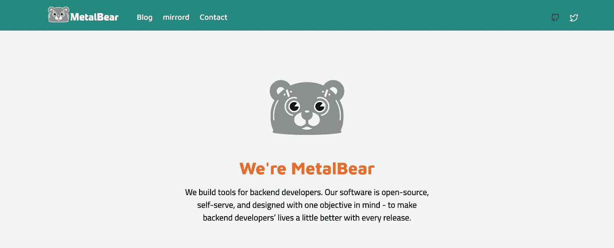
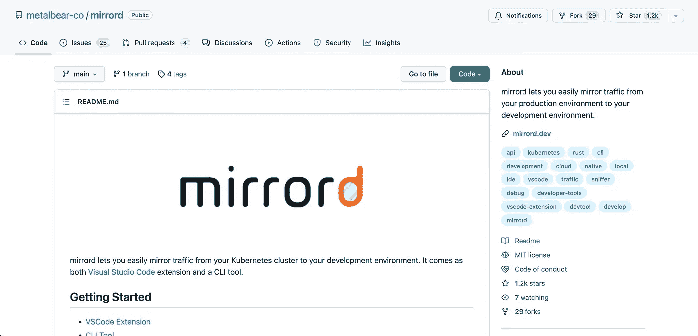

# 我们如何使用 Rust 和低级编程来构建 MetalBear

> 原文：<https://levelup.gitconnected.com/how-we-use-rust-and-low-level-programming-to-build-metalbear-df567c399bcc>

## 采访 MetalBear 的首席执行官和联合创始人 Aviram Hassan

Avriam 是 [MetalBear](https://metalbear.co/) 的首席执行官和联合创始人，他的使命是让后端开发者的生活变得更好。他分享了他如何使用 Rust 建立自己的创业公司，并编写尽可能接近金属运行的代码，让他们完全控制令人难以置信的开发人员体验。

> >想让你的公司接受高级编码面试吗？[填写这张表格](https://forms.gle/zRs7Uhidtd7WTyCy8)
> >你是一个正在寻找一份令人惊叹的工作的开发者吗？[访问升级招聘平台](https://jobs.levelup.dev/talent/welcome?referral=true)

# 你的名字和角色是什么？

首席执行官兼联合创始人 Aviram Hassan。我对所有的事都负责，但不是马上。每天醒来，我都试图找到我能为公司做的最有价值的事情，无论是筹款、与用户交谈、开发功能、审查代码等等。

# 你的公司是做什么的？是什么吸引了你的想法？

我们为后端工程师构建开发工具。我一直想制造能帮助人们并为他们提供价值的产品。来自 B2B cyber & fintech 空间的我，通常不会做出人们“喜爱”的产品，但他们需要。制造人们喜欢的产品是最好的感觉，鉴于我的经验和背景，我相信为开发人员构建工具会非常适合。

我们的第一个产品叫做 mirrord，它让开发者可以在远程环境中本地运行他们的服务。

# 这解决了什么问题，工程师有什么反馈？

两个问题 1。当环境发生变化(开发、试运行、生产等)时，一切都会中断 2。设置环境需要很多时间。管理服务是不能在本地完成的。但如果你尝试，它仍然不像舞台或生产。

# 您使用什么技术堆栈，为什么选择这种堆栈？

[我们用铁锈](https://metalbear.co/blog/carcinisation-of-mirrord-or-why-we-use-rust/)。我们之所以选择它，是因为我们必须使用一种低级语言来创建我们的解决方案(我们做一些像钩子这样的低级东西)，而且我们还想要性能和安全性。另外，Rust 社区也很神奇。

# 对你来说，典型的一天是什么样的？

早上 5:30-6:30——取决于亚当(我的 9mo 宝贝)起床，做早餐和喂他。
早上 6:30-7:30——玩耍时间和日托准备时间
早上 7:30-9:00——我试着一周锻炼 2-3 次(普拉提/功能锻炼),所以这是通常发生的时间。
上午 9 点——煮浓缩咖啡，开始工作，阅读邮件，清理收件箱。决定我一天的日程(我想做什么)
上午 9 点— 11 点—工作，然后做午饭和吃饭。
晚上 11 点至 6 点——工作，然后和亚当一起玩耍，洗澡，等等。
晚上 7 点到 11 点——有一些干扰的工作(亚当，食物，和我的妻子爱丽丝一起看点东西)

# 公司是如何起步的，你有哪些见解？

我和我的联合创始人 Eyal 都亲身经历了如今开发微服务有多烦人。作为我们自己的目标受众，我们相信我们可以做出一个解决方案，让后端工程师的生活更轻松、更顺畅。

# 你最初是如何进入软件开发的？

我很小就开始了。我从 2 岁开始就和妈妈一起玩电脑。她过去常常回去工作，然后我们会玩一整天(主要是雷曼，太空入侵者)。从那时起，我就和电脑结下了不解之缘。

当我 8 岁的时候，我开始玩一个在线口袋妖怪游戏，叫做口袋妖怪网战[https://pokemonnetbattle.fandom.com/wiki/Battle](https://pokemonnetbattle.fandom.com/wiki/Battle)。这是一种类似于口袋妖怪 GBA 游戏的基于聊天的口袋妖怪战斗游戏。我是通过装巴比伦(字典)和逐字翻译开始学英语的。这款游戏支持服务器端脚本，我在 RPG 服务器上玩得很开心。

有一天我发现“来源”被泄露了，我其实不确定来源是什么意思，但我从其他人那里了解到，这意味着任何人都可以运行 RPG 服务器。我决定下载并运行我自己的，然后检查内容，我意识到这是“代码”,我开始摆弄它，决定我将把整个游戏(基于聊天)翻译成希伯来语！我开始逐字翻译，因为我并不真正理解语法，但随着我的继续，我开始理解语法，后来添加功能，修复错误，添加功能等。

在这次经历之后，我青春的每一个时期都伴随着一个电子游戏+一些对它做的黑客攻击(口袋妖怪，MapleStory，CS1.6，TeamFortress 2，WoW)

# 是什么让你的公司与众不同？

我们是开放核心的，这意味着我们的大部分软件都是开源的。我们也是远程优先和分布式的，目前没有真正的办公室。

# 你正在解决的最有趣的问题是什么？

通过修补非常低级的东西来创造惊人的开发者体验。我们本可以像其他解决方案一样，使用更高级别的 API 和更“符合”的方式来解决这个问题，但我们知道这并不像我们希望的那样顺利和美好，所以我们深入挖掘，按照我们的愿景来改造这个世界。

# 深入到底层对于一些程序员来说可能是陌生的——构建如此接近操作系统和硬件的软件是什么感觉？有没有遇到什么意想不到的挑战？

第一个问题是底层非常缺乏，文档很少或不正确。它从来不像它说的那样工作。你真的需要挖掘才能理解问题以及解决问题的方法。

不过，我真的很喜欢它。有很多调试。这可能很有趣，但也可能很烦人。你真的没有可以帮你解决问题的地方或支持。

我们以一种对开发者友好的方式来处理整个堆栈。当所有的东西都通过同一个通道(类似于 VPN 的工作方式)流动时，会有很多冲突，这是我们想要解决的问题。我们希望使用一种低级技术来创建一个逻辑流程，让我们能够提供令人难以置信的体验。这种方法让我们能够制造出独一无二的产品。

# Rust 是如何帮助你解决这些问题的？

有一段时间我很感兴趣，在过去的公司里有节制地使用。它有很多美丽的地方。这是我第一次在一个完整实现的真实产品中使用它。和往常一样，决定使用什么取决于业务需求。对于 Rust 来说，它很容易掌握，这在以前的低级语言中是很少见的。铁锈最大限度地提高了安全性，因此它提供了足够的保护，让您在不碍事的情况下保持高效率。

# 一旦你的公司实现了愿景，世界会变成什么样子？

开发人员不会等到代码(或环境)中断，整个漫长的循环重新开始时才部署到阶段环境。他们不必花费时间来设置和维护他们自己的专用云环境。

# 你现在正在尝试的技术或工具中有没有让你感到兴奋的？

我们每晚都使用 Rust，所以我们处于 Rust 发展的前沿。我们在那里使用的所有东西都是全新的，一旦有新的功能，我们就会马上试用。

# 描述您的计算机硬件设置

MacBook Pro M1 2021，27 英寸戴尔屏幕，罗技键盘+鼠标，5L Steelseries pad(我用了 10 多年了！)，索尼 WH1000MX3

# 描述您的计算机软件设置

VS 代码，火狐，不和谐，懈怠，观念，Docker，崇高

# 我们可以去哪里了解更多？

请到 [mirrord.dev](https://mirrord.dev/) 和【metalbear.co】T2 查看我们的网站。

# 分级编码

[Level Up](https://levelup.gitconnected.com/) 是月活 300 万开发者的社区([了解更多并关注](https://levelup.gitconnected.com/)或[阅读更多访谈](https://levelup.gitconnected.com/interviews/home))。我们还与最好的初创公司和最具创新性的科技公司合作🔥

*   你是开发人员吗？有最好的公司向你伸出援手
    ➡️ [**加入到人才集体**](https://jobs.levelup.dev/talent/welcome?referral=true)
*   ➡️ [**聘请 FAANG 级工程师**](https://jobs.levelup.dev/talent/welcome)
*   ➡️ [**面试申请表**](https://forms.gle/oWT83qtGdydfi7yL8) 到贵公司面试

我们还为开发者提供免费的职业成长工具: [**编码面试课程**](https://skilled.dev/) 、 [**自动简历构建**](https://gitconnected.com/resume-builder) r、 [**portfolio API**](https://gitconnected.com/portfolio-api)

在 [Twitter](https://twitter.com/gitconnected) 和 [LinkedIn](https://www.linkedin.com/company/gitconnected/) 上关注我们