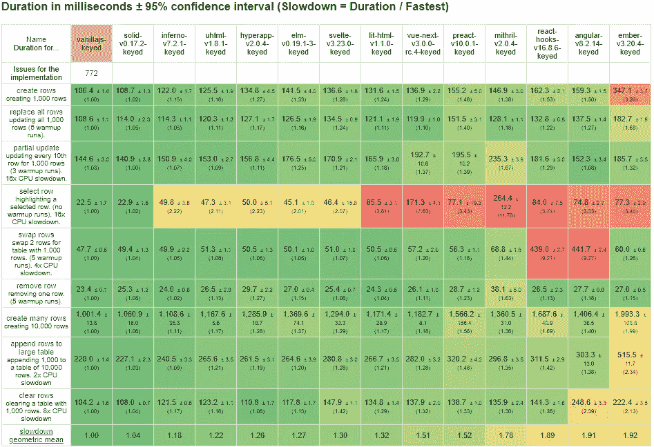
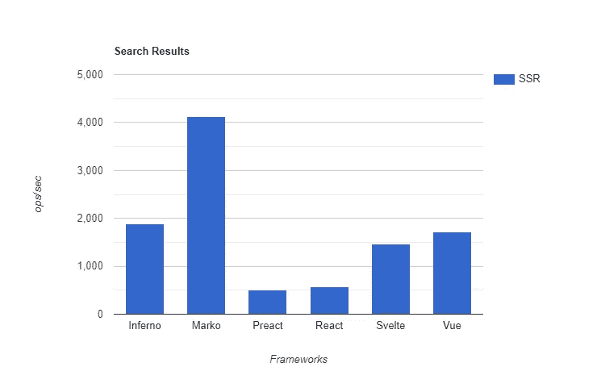
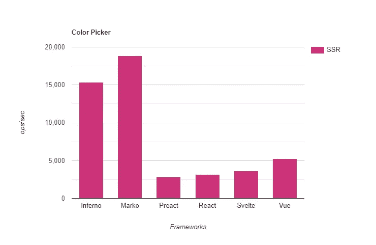
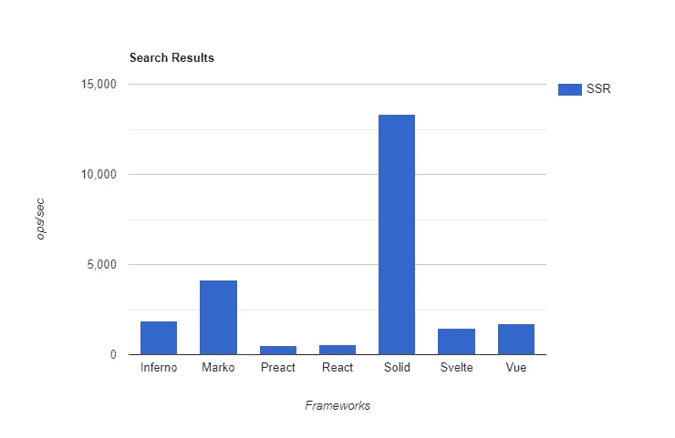
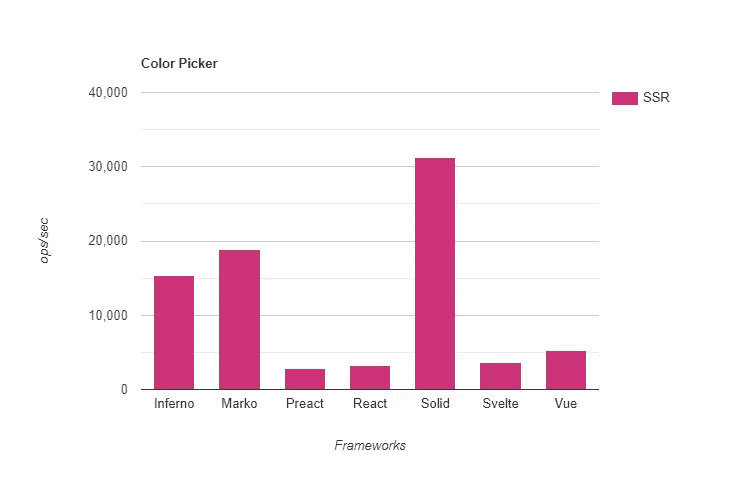

# 再说一遍，我们是如何编写最快的 JavaScript UI 框架的！

> 原文：<https://levelup.gitconnected.com/how-we-wrote-the-fastest-javascript-ui-framework-again-db097ddd99b6>

## 这次我们征服了服务器。

pexels.com 希勒米·巴纳骑自行车的男子

我有一个过程。我把它应用到我面临的几乎所有问题上。

> 第一步。定义问题

对我来说，这通常需要最长的时间。理解你试图解决什么，谁是利益相关者，什么是真正重要的，这绝对是至关重要的。

> 第二步。不管成本如何，提出一个理想化的解决方案

不..但是，如果一切都如你所愿，这应该是多么简单明了的事情。

> 第三步。抛开一切，重新架构原来的问题

我发现这对于穷尽规定的思路是绝对必要的，这样我就可以打破所有我最初的假设。只有现在，真正的工作才能开始。

# 服务器上的固体

SolidJS 是一个 JavaScript 库，类似 React、Vue 或 Angular，旨在高效地呈现 Web UIs。它支持所有现代功能集，包括一流的类型脚本支持、粒度反应、异步并发和 JSX/标记文字模板。它也是浏览器中性能最好的渲染库，在过去的 3 年中一直保持领先。

官方 [JS 框架基准](https://github.com/krausest/js-framework-benchmark) Chrome 85

那么，Solid 的下一个前景是什么？服务器渲染是一个显而易见的话题，也是当时最受欢迎的特性。这是一项更加艰难的任务。首先，我需要找出最快的服务器端渲染器是什么，我遇到了[马科斯](https://markojs.com/)。被易贝用于生产，他们在服务器上为 JS 提供了一个解决方案，这是任何其他库都无法比拟的。

他们有我所见过的仅有的 SSR 基准套件之一，有各种各样的实现。所以我有了一个开始学习的地方…

# **服务器上的基准测试**

于是我克隆了回购(来源发现[此处](https://github.com/ryansolid/isomorphic-ui-benchmarks/tree/article))。2 个简单的测试。颜色选择器和电子商务风格的搜索结果页面。你可能在 MarkoJS 网站上见过这些。

搜索结果 SSR 性能

颜色选择器 SSR 性能

我实现了样本，构建了，..而且……结果令人沮丧。像穷得要死一样。我在服务器上使用 DOM 环境(JSDOM，BasicHTML ),它们甚至不能接近最慢的库。好像慢了 10 倍。

我研究了一些方法，比如 Andrea Giammarchi 的异端 SSR，并意识到虽然这对于自顶向下的模板库很有效，但对于反应式的模板库没有意义。这不仅仅是假 DOM 是一个问题。我还有反应图要处理。

因此，我查看了基准测试中唯一的另一个反应库 Svelte，发现每个人最终都只是在渲染字符串。事后看来显而易见。Svelte 和 Marko 都去掉了任何中间层。这就是答案，编译到不同的非反应式运行时。不过，我对此并不太高兴。

如果没有反应系统，我们如何在服务器上更新？我们如何处理异步数据加载？提前加载然后同步渲染？这不是一种同构的体验。客户机和服务器之间有不同的心智模型会带来太多的感知复杂性。

最终我意识到我应该依靠 Solid 的优势。作为最快的客户端渲染器，它已经缩小了与服务器渲染的性能差距。我意识到，我可以使用我在客户机上用于暂停的相同资源来从服务器传输值，并让客户机在第一个 shell 之后呈现所有内容。

通过这种方式，我们解决了双重数据问题，并消除了对嵌套水合的需要，同时利用了更快的初始绘制和异步请求启动。我将在关于[深度开发](https://indepth.dev/)的文章中更详细地介绍这是如何工作的:

 [## 同构渲染性能之旅

### 我是 SolidJS UI 库的作者，该库是浏览器中性能最好的库之一。我知道…

深度开发](https://indepth.dev/the-journey-to-isomorphic-rendering-performance) 

更重要的是，它让我摆脱了这种约束，我可以专注于高性能的同步渲染。

# **和……**

我写了一个新的编译器和新的运行时。我调了又调。并给了它一个很好的旧运行……唉，我是第三。就在地狱下面。可敬。我在这里和那里剃掉了数百毫秒，但最终我知道我有一个极限。

看 Marko 或者 Svelte 都是语言。他们可以分析语法，不需要执行额外的函数包装，他们的模板不是可以接受每个值的 JSX。他们确切地知道什么该逃避，什么不该逃避。

我需要任意包装任何插入，因为它可能是谁知道是什么。即使我拥有这样一个动态系统，也只能达到理论上的最高性能。我查看了 VDOM 图书馆为提高性能而使用的类似蓝图方法，但在这里没有什么真正有效。

事实证明，SSR 的表现与技巧无关。这里没什么聪明的。在浏览器中，我们这样做是为了避免 DOM 操作。在服务器上，关键是你能以多快的速度将字符串混合在一起。

# 不是故事的结尾…

当一个贡献者提出一个 pull 请求，上面写着:"[将 escapeHTML 性能提高 10 倍！](https://github.com/ryansolid/dom-expressions/pull/27)”。我不敢相信。我结合了我认为的苗条身材和马尔科的方法，制作了我的逃生功能，我认为我的处境相当不错。

事实证明它可以更快。我更新了我的库，果然，随着逃逸瓶颈的消除，Solid 正在飞行。

搜索结果 SSR 性能

颜色选择器 SSR 性能

所以你可以说我们幸运地第二次成为最快的，再次感谢社区。我的过程有什么好处？不确定。开始之前我没有放弃。

# 接下来是什么？

看到我做了什么吗？不，我个人没有为 Solid 开发 Next.js 库的计划，但是我很想看到一个这样的库。今天，我只想回顾一下在开源社区的帮助下我们所取得的成就。

我对此不抱任何幻想。Solid 的方法不会让它在服务器上保持绝对最快的速度。我从作为 MarkoJS 核心团队成员的个人经历中了解到这一点(他们的工作给我留下了深刻的印象，我加入了他们)。像这样的基准也不能恰当地反映水合作用的复杂性。但我喜欢尽可能提高标准。

一年前在“我们如何编写最快的 JavaScript UI 框架”的末尾。我列了一张我们即将完成的待办事项清单。Solid 现在有带数据加载和代码分割的流式悬念感知 SSR，并发渲染和过渡(测试版)，以及[现实世界演示](/a-solid-realworld-demo-comparison-8c3363448fd8)。i18n 的 CLI 工具、副本、第三方库。事情进展顺利。

作为一个社区，我们还有很长的路要走。我们本周在 Github 上达到了 4k 星级，在 NPM 上达到了 75000 次下载。性能和基准并不代表一切。但除非被告知，否则我会继续挑战极限。

本文中基准测试的源代码目前位于同构 UI 基准测试的一个分支上，该分支位于:

 [## ryansolid/同构用户界面基准

### 这个 repo 包括各种 UI 库的多个基准。每个性能指标评测都旨在测量渲染…

github.com](https://github.com/ryansolid/isomorphic-ui-benchmarks/tree/article)  [## 瑞安固体/固体

### 一个用于构建用户界面的声明式、高效且灵活的 JavaScript 库。-瑞安固体/固体

github.com](https://github.com/ryansolid/solid)  [## 我们如何编写最快的 JavaScript UI 框架

### 我相信你曾经有过这样的经历。你有个好主意。一些新奇的东西。新的东西。然而，一些有影响力的东西…

medium.com](https://medium.com/javascript-in-plain-english/how-we-wrote-the-fastest-javascript-ui-frameworks-a96f2636431e)  [## JavaScript 框架性能的真实演示比较

### SolidJS 作为现实世界演示中的最新挑战者进入拳击场。让我们看看它是如何堆积起来的。

levelup.gitconnected.com](/a-solid-realworld-demo-comparison-8c3363448fd8) 

# 分级编码

感谢成为我们社区的一员！ [**订阅我们的 YouTube 频道**](https://www.youtube.com/channel/UC3v9kBR_ab4UHXXdknz8Fbg?sub_confirmation=1) 或参加 [**熟练编程面试课程**](https://skilled.dev/) 。

 [## 编写面试问题|熟练。开发

### 掌握编码面试的课程

technical . dev](https://skilled.dev)